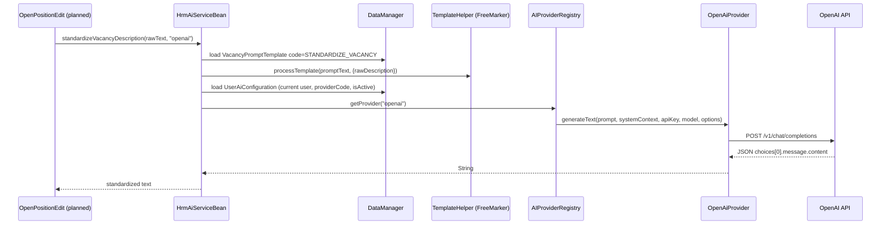

# AI Integration — Architecture Passport

> **HRM HuntTech** · CUBA Platform 7.3  
> Паспорт подсистемы интеграции с внешними LLM-провайдерами для стандартизации и генерации артефактов вакансий.

**Связанная документация:** [docs/entities/UserAiConfiguration.md](docs/entities/UserAiConfiguration.md) · [docs/entities/VacancyPromptTemplate.md](docs/entities/VacancyPromptTemplate.md) · UI Spec: [ExtUserEdit](docs/ui/itpearls_ExtUserEdit_Spec.md), [UserAiConfiguration](docs/ui/itpearls_UserAiConfiguration.browse_Spec.md), [VacancyPromptTemplate](docs/ui/itpearls_VacancyPromptTemplate.browse_Spec.md)

**Статус интеграции (факт из кода, 2026-06-27):**

| Слой | Реализовано | Не реализовано |
|------|-------------|----------------|
| Core (`HrmAiService`, провайдеры) | Да | Провайдеры кроме `openai` |
| Админ-экраны, вкладка AI в профиле пользователя | Да | — |
| Поля AI на `OpenPosition` (entity + view) | Да (БД + Java) | Привязка в `OpenPositionEdit` UI |
| Вызов `HrmAiService` из web-слоя | **Нет** | `OpenPositionEdit`, `BackgroundWorker` |

---

## 1. Architecture Overview

### 1.1 Принципы

Подсистема построена на **слабой связности (loose coupling)**:

- **UI** хранит и редактирует конфигурацию (`UserAiConfiguration`, `VacancyPromptTemplate`), но **не** вызывает HTTP к LLM напрямую.
- **Сервисный фасад** `HrmAiService` инкапсулирует оркестрацию: шаблон → FreeMarker → провайдер → ответ.
- **Провайдеры** подключаются через интерфейс `AIProvider` и регистрируются в `AIProviderRegistry` (паттерн **Strategy** + Spring DI).

Добавление нового LLM-vendor'а не требует изменений в `HrmAiServiceBean` — достаточно нового `@Component`, реализующего `AIProvider`.

### 1.2 Компоненты и расположение в репозитории

| Компонент | Путь | Роль |
|-----------|------|------|
| `HrmAiService` | `modules/global/.../service/HrmAiService.java` | Middleware-контракт (2 метода) |
| `HrmAiServiceBean` | `modules/core/.../service/HrmAiServiceBean.java` | Оркестратор: шаблоны, сессия, провайдер |
| `AIProvider` | `modules/core/.../core/ai/AIProvider.java` | Strategy-интерфейс |
| `AIProviderRegistry` | `modules/core/.../core/ai/AIProviderRegistry.java` | Реестр по `providerCode` |
| `OpenAiProvider` | `modules/core/.../core/ai/OpenAiProvider.java` | Единственная реализация (`openai`) |
| `UserAiConfiguration` | `modules/global/.../entity/UserAiConfiguration.java` | Персональные ключи пользователя |
| `VacancyPromptTemplate` | `modules/global/.../entity/VacancyPromptTemplate.java` | Промпт-шаблоны (FreeMarker) |
| `OpenPosition` (AI-поля) | `modules/global/.../entity/OpenPosition.java` | Хранилище AI-артефактов вакансии |

Spring component-scan: `modules/core/src/com/company/itpearls/spring.xml` (`base-package="com.company.itpearls"`).

### 1.3 Поток данных (целевой)



**Текущее состояние:** стрелка `UI → Svc` **отсутствует** — `HrmAiService` не инжектируется ни в один web-контроллер. Сервис готов к вызову из middleware или будущего UI.

### 1.4 Диаграмма слоёв (текст)

```
┌─────────────────────────────────────────────────────────────┐
│  WEB (modules/web)                                          │
│  ExtUserEdit [aiSettingsTab] ──► UserAiConfigurationEdit    │
│  menu aiAdministration ──► VacancyPromptTemplateBrowse     │
│                         └──► UserAiConfigurationBrowse      │
│  OpenPositionEdit — AI-поля entity/view есть, UI вызова нет │
└──────────────────────────┬──────────────────────────────────┘
                           │ @Inject HrmAiService (planned)
┌──────────────────────────▼──────────────────────────────────┐
│  CORE (modules/core)                                        │
│  HrmAiServiceBean                                           │
│    ├─ TemplateHelper.processTemplate (FreeMarker)           │
│    ├─ DataManager → UserAiConfiguration, VacancyPromptTemplate│
│    └─ AIProviderRegistry → AIProvider implementation        │
└──────────────────────────┬──────────────────────────────────┘
                           │ HTTPS
┌──────────────────────────▼──────────────────────────────────┐
│  External: OpenAI Chat Completions API                      │
└─────────────────────────────────────────────────────────────┘
```

---

## 2. Data Layer

### 2.1 `UserAiConfiguration`

Персональные настройки AI для пользователя `sec$User`.

| Java-поле | Колонка БД | Тип | Примечание |
|-----------|------------|-----|------------|
| `user` | `USER_ID` | FK → `SEC_USER` | `@ManyToOne`, обязательный |
| `providerCode` | `PROVIDER_CODE` | `varchar(64)` | Код провайдера, напр. `openai` |
| `apiKey` | `API_KEY` | `varchar(512)` | Секрет; в browse-view **не** загружается |
| `defaultModelName` | `DEFAULT_MODEL_NAME` | `varchar(128)` | Переопределяет модель провайдера |
| `isActive` | `IS_ACTIVE` | `boolean` | Default `true`; неактивные игнорируются сервисом |

```java
@Entity(name = "itpearls_UserAiConfiguration")
@Table(name = "ITPEARLS_USER_AI_CONFIGURATION")
public class UserAiConfiguration extends StandardEntity {
    @ManyToOne(fetch = FetchType.LAZY, optional = false)
    @JoinColumn(name = "USER_ID")
    private User user;

    @Column(name = "PROVIDER_CODE", length = 64)
    private String providerCode;

    @Column(name = "API_KEY", length = 512)
    private String apiKey;
    // ...
}
```

**Миграция:** `modules/core/db/changelog/260627-1-addAiEntities.xml` (changeSet `260627-2-createUserAiConfiguration`).

**Views** (`views.xml`):

- `userAiConfiguration-browse-view` — без `apiKey` (мониторинг админом).
- `userAiConfiguration-edit-view` — полный `_local` + `user`.

### 2.2 `VacancyPromptTemplate`

Справочник промптов, редактируемый администратором.

| Java-поле | Колонка БД | Тип | Примечание |
|-----------|------------|-----|------------|
| `code` | `CODE` | `varchar(64)`, unique | Ключ для `HrmAiServiceBean` |
| `name` | `NAME` | `varchar(255)` | Отображаемое имя |
| `promptText` | `PROMPT_TEXT` | **CLOB** | `@Lob` — тело промпта (FreeMarker) |
| `systemContext` | `SYSTEM_CONTEXT` | `varchar(1000)` | System-role для chat API |
| `temperature` | `TEMPERATURE` | `double` | Default `0.7` |

```java
@Lob
@Column(name = "PROMPT_TEXT")
private String promptText;
```

**Зарезервированный код в сервисе:** `STANDARDIZE_VACANCY` — используется методом `standardizeVacancyDescription`. Запись в БД должна быть создана администратором вручную (seed в миграциях **отсутствует**).

**Миграция:** changeSet `260627-3-createVacancyPromptTemplate`.

### 2.3 `OpenPosition` — AI-поля

Добавлены миграцией `260627-1-addOpenPositionAiColumns` для хранения результата AI-обработки вакансии:

| Java-поле | Колонка БД | Тип | Назначение (по именованию) |
|-----------|------------|-----|----------------------------|
| `rawDescription` | `RAW_DESCRIPTION` | **CLOB** (`@Lob`) | Исходное «сырое» описание JD |
| `interviewChecklist` | `INTERVIEW_CHECKLIST` | **CLOB** | Чеклист для интервью |
| `searchMap` | `SEARCH_MAP` | **CLOB** | Карта поиска кандидатов |
| `interviewPlan` | `INTERVIEW_PLAN` | **CLOB** | План интервью |

```java
@Lob
@Column(name = "RAW_DESCRIPTION")
private String rawDescription;

@Lob
@Column(name = "INTERVIEW_CHECKLIST")
private String interviewChecklist;
// searchMap, interviewPlan — аналогично
```

**CLOB / `@Lob`:** в PostgreSQL Liquibase создаёт колонки типа `clob`; в JPA — `@Lob` на `String` (EclipseLink маппит в TEXT/CLOB). Поля включены в `openPosition-edit-view` и `openPosition-browse-view`, но **не привязаны** к компонентам в `open-position-edit.xml` — данные можно сохранять программно, UI для редактирования/генерации пока нет.

### 2.4 Persistence

Обе AI-сущности зарегистрированы в `modules/global/src/com/company/itpearls/persistence.xml`.

---

## 3. Core Service

### 3.1 Контракт `HrmAiService`

```java
public interface HrmAiService {
    String NAME = "itpearls_HrmAiService";

    String standardizeVacancyDescription(String rawText, String providerCode);

    String generateVacancyArtifact(String standardizedDescription,
                                   String templateCode,
                                   String providerCode);
}
```

Регистрация: `@Service(HrmAiService.NAME)` на `HrmAiServiceBean`. Вызов из web — через `@Inject` + интерфейс (middleware bean CUBA).

### 3.2 `HrmAiServiceBean` — алгоритм

**`standardizeVacancyDescription`**

1. Загрузить `VacancyPromptTemplate` с `code = "STANDARDIZE_VACANCY"`.
2. Построить контекст FreeMarker: `{ "rawDescription": rawText }`.
3. `TemplateHelper.processTemplate(template.getPromptText(), context)` → финальный user-prompt.
4. `callAiProvider(...)` → строка от LLM.

**`generateVacancyArtifact`**

1. Загрузить шаблон по произвольному `templateCode`.
2. Контекст: `{ "description": standardizedDescription }`.
3. Тот же pipeline через `callAiProvider`.

**`callAiProvider` (private)**

1. `getUserConfig(providerCode)` — JPQL по **текущему пользователю сессии** (`UserSessionSource`), `isActive = true`.
2. Если конфигурация или `apiKey` пусты → `DevelopmentException` с сообщением на русском.
3. `aiProviderRegistry.getProvider(providerCode)` → `AIProvider`.
4. `provider.generateText(prompt, systemContext, apiKey, defaultModelName, options)`.
5. `options` = `Map.of("temperature", template.getTemperature() ?? 0.7)`.

### 3.3 FreeMarker / `TemplateHelper`

CUBA `com.haulmont.cuba.core.global.TemplateHelper` обрабатывает `promptText` как **FreeMarker-шаблон**.

Пример тела шаблона в БД (`VacancyPromptTemplate.promptText`):

```ftl
Стандартизируй следующее описание вакансии. Сохрани структуру: обязанности, требования, условия.

Исходный текст:
${rawDescription}
```

Для `generateVacancyArtifact` доступна переменная `${description}`.

### 3.4 `OpenAiProvider`

| Параметр | Значение |
|----------|----------|
| `getProviderCode()` | `"openai"` |
| Endpoint | `https://api.openai.com/v1/chat/completions` |
| Default model | `gpt-4o` (если `defaultModelName` пуст) |
| Auth | `Authorization: Bearer {apiKey}` |
| Messages | optional `system` + `user` (prompt) |
| Ответ | `choices[0].message.content` |

Пример тела запроса:

```json
{
  "model": "gpt-4o",
  "temperature": 0.7,
  "messages": [
    { "role": "system", "content": "Ты HR-эксперт..." },
    { "role": "user", "content": "Стандартизируй..." }
  ]
}
```

Ошибки HTTP / пустой content → `RuntimeException` с префиксом «Ошибка запроса к OpenAI API».

### 3.5 `AIProviderRegistry`

```java
@Component
public class AIProviderRegistry {
    public AIProviderRegistry(List<AIProvider> providerList) {
        // все @Component AIProvider → Map<providerCode, instance>
    }
    public AIProvider getProvider(String code) {
        // IllegalArgumentException если код неизвестен
    }
}
```

---

## 4. How-To Extend — новый `AIProvider`

### Шаг 1. Реализовать интерфейс

```java
package com.company.itpearls.core.ai;

import org.springframework.stereotype.Component;
import java.util.Map;

@Component
public class YandexGptProvider implements AIProvider {

    @Override
    public String getProviderCode() {
        return "yandex";  // должен совпадать с UserAiConfiguration.providerCode
    }

    @Override
    public String generateText(String prompt, String systemContext,
                               String apiKey, String modelName,
                               Map<String, Object> options) {
        double temperature = options != null && options.get("temperature") instanceof Number
                ? ((Number) options.get("temperature")).doubleValue()
                : 0.7;
        // HTTP-вызов Yandex GPT API, вернуть текст ответа
        throw new UnsupportedOperationException("Implement Yandex GPT HTTP client");
    }
}
```

### Шаг 2. Spring auto-registration

Класс в пакете `com.company.itpearls` с `@Component` автоматически попадает в `AIProviderRegistry` при старте middleware. **Изменения в `HrmAiServiceBean` не нужны.**

### Шаг 3. UI lookup (уже подготовлен)

`UserAiConfigurationEdit` содержит options map:

```java
providers.put("OpenAI", "openai");
providers.put("YandexGPT", "yandex");
providers.put("GigaChat", "gigachat");
```

Коды `yandex` и `gigachat` **уже в UI**, но **без Java-реализаций** вызов сервиса завершится `IllegalArgumentException: Unknown AI provider code`.

### Шаг 4. Шаблоны и конфигурация

1. Админ создаёт `VacancyPromptTemplate` с нужным `code` (или использует `STANDARDIZE_VACANCY`).
2. Пользователь добавляет `UserAiConfiguration` с тем же `providerCode` и валидным `apiKey`.

### Шаг 5. (Опционально) Вызов из UI

```java
@Inject
private HrmAiService hrmAiService;

// в обработчике кнопки (рекомендуется — через BackgroundWorker, см. §5)
String result = hrmAiService.standardizeVacancyDescription(rawText, "openai");
getEditedEntity().setRawDescription(rawText);
getEditedEntity().setComment(result); // или другое целевое поле
```

---

## 5. Security & UX

### 5.1 Маскирование API-ключа (`PasswordField`)

В `user-ai-configuration-edit.xml`:

```xml
<passwordField id="apiKeyField"
               property="apiKey"
               secret="true"
               width="100%"/>
```

- `secret="true"` — символы скрыты при вводе (CUBA PasswordField).
- Browse-экраны (`userAiConfiguration-browse-view`, вкладка AI в `ExtUserEdit`) **не включают** `apiKey` в view — ключ не отображается в таблицах мониторинга.
- Админский `UserAiConfigurationBrowse` — read-only список всех конфигураций (логин, provider, isActive, model).

**Ограничение:** ключ хранится в БД как plain `varchar(512)`; шифрование at-rest в коде **не** реализовано.

### 5.2 Персональность конфигурации

`HrmAiServiceBean` всегда читает конфигурацию **текущего пользователя сессии**:

```java
User user = userSessionSource.getUserSession().getUser();
// WHERE e.user = :user AND e.providerCode = :providerCode AND e.isActive = true
```

Пользователь A не может использовать ключ пользователя B через сервис (при условии корректной сессии CUBA).

### 5.3 UI: настройка AI

| Точка входа | Controller | Поведение |
|-------------|------------|-----------|
| Профиль пользователя → вкладка «Персональный ИИ» | `itpearls_ExtUserEdit` | CRUD через `UserAiConfigurationEdit` (create/edit/remove) |
| Меню **Управление AI** | `itpearls_VacancyPromptTemplate.browse` | CRUD шаблонов промптов |
| Меню **Управление AI** | `itpearls_UserAiConfiguration.browse` | Read-only мониторинг всех ключей |

Меню (`web-menu.xml`):

```xml
<menu id="aiAdministration" caption="mainMsg://menu_config.aiAdministration" icon="MAGIC"
      insertAfter="administration">
    <item screen="itpearls_VacancyPromptTemplate.browse" .../>
    <item screen="itpearls_UserAiConfiguration.browse" .../>
</menu>
```

### 5.4 `OpenPositionEdit` и `BackgroundWorker` — фактическое состояние

| Аспект | Статус |
|--------|--------|
| `HrmAiService` в `OpenPositionEdit.java` | **Не подключён** |
| `BackgroundWorker` в `OpenPositionEdit` | **Не реализован** |
| AI-поля `rawDescription`, `interviewChecklist`, `searchMap`, `interviewPlan` в UI | **Не привязаны** |
| Вкладка «Описание вакансии» | `comment` / `commentEn` (rich text); read-only области из `Position.standartDescription` / `whoIsThisGuy` — **не** AI |

**Вывод:** длительные AI-запросы из карточки вакансии **запланированы архитектурно** (поля entity + сервис), но **не реализованы** в web-слое.

#### Рекомендуемый паттерн (эталон в проекте)

В `JobCandidateEdit` уже используется CUBA `BackgroundWorker` для фоновых задач без блокировки UI:

```java
import com.haulmont.cuba.gui.executors.BackgroundWorker;
import com.haulmont.cuba.gui.executors.BackgroundTask;
import com.haulmont.cuba.gui.executors.TaskLifeCycle;

@Inject
protected BackgroundWorker backgroundWorker;

private void runAiGeneration() {
    String raw = getEditedEntity().getRawDescription();
    BackgroundTask<String, Void> task = new BackgroundTask<String, Void>(10) {
        @Override
        public String run(TaskLifeCycle lifeCycle) {
            return hrmAiService.standardizeVacancyDescription(raw, "openai");
        }

        @Override
        public void done(String result) {
            getEditedEntity().setComment(result);
            notifications.create().withCaption("AI: готово").show();
        }

        @Override
        public boolean handleException(Exception ex) {
            notifications.create(Notifications.NotificationType.ERROR)
                    .withCaption(ex.getMessage()).show();
            return true;
        }
    };
    backgroundWorker.handle(task).execute();
}
```

**Рекомендации для внедрения в `OpenPositionEdit`:**

1. Кнопка «Сгенерировать / Стандартизировать» на вкладке описания.
2. `BackgroundWorker` + `@Inject HrmAiService` — HTTP вне UI-потока.
3. Progress / disable кнопки на время задачи (`TaskLifeCycle`).
4. Результат писать в `comment` и/или AI-поля (`interviewChecklist` и т.д.) по `templateCode` из `generateVacancyArtifact`.
5. Обработка `DevelopmentException` (нет ключа / шаблона) — понятное уведомление со ссылкой на вкладку AI в профиле.

---

## Appendix: Checklist развёртывания

1. Применить Liquibase `260627-1-addAiEntities.xml` (`updateDb`).
2. Создать в БД шаблон `VacancyPromptTemplate` с `code = STANDARDIZE_VACANCY` (и прочие коды артефактов).
3. Пользователям — `UserAiConfiguration` с `providerCode = openai` и API-ключом.
4. Пересобрать `app-core`, `app-global`, `app-web`.
5. Для end-to-end сценария в UI — реализовать вызов `HrmAiService` в `OpenPositionEdit` (§5.4).

---

## История изменений

| Дата | Изменение |
|------|-----------|
| 2026-06-27 | Первоначальный паспорт подсистемы AI по коду репозитория |
