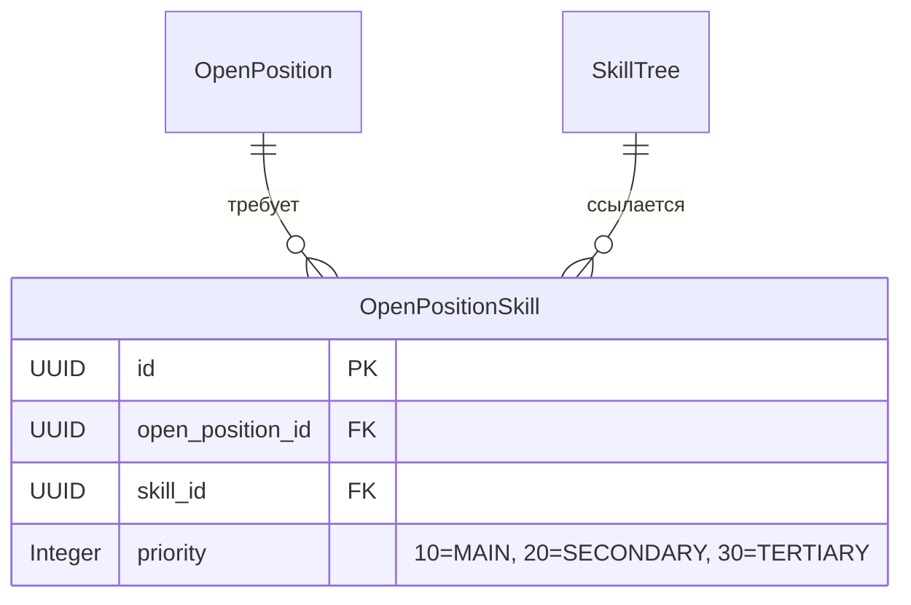

# Спецификация: Извлечение и отображение требуемых навыков вакансии (OpenPositionSkill)

## 1. Концепция и бизнес-логика (Аналитик)

### 1.1. Назначение
Сервис `SkillAnalysisService` расширяется для анализа описаний вакансий (`OpenPosition`).
Выявленные требования и компетенции сохраняются в сущности `OpenPositionSkill`, связывающей позицию со справочником `SkillTree`, с распределением по трем уровням критичности (`CandidateSkillPriority`):
* **Обязательные (`MAIN`)** — ключевые / обязательные требования вакансии (помечаются символом `★`).
* **Желательные (`SECONDARY`)** — желательные / дополнительные навыки («будет плюсом»).
* **Прочее (`TERTIARY`)** — прочие упомянутые технологии, инструменты и стеки.

### 1.2. Модель данных

---

## 2. Дизайн и UX спецификация (UI/UX Дизайнер)

### 2.1. Сайдбар «ТРЕБУЕМЫЕ НАВЫКИ»
* **Заголовок раздела**: `ТРЕБУЕМЫЕ НАВЫКИ` (`stylename="label-nav-title open-position-editor-section-title"`).
* **Группировка**:
  * Если навыки извлечены, они отображаются тремя аккуратными смысловыми блоками с подзаголовками:
    * `Обязательные:` (бейджи с акцентной рамкой и маркером `★`)
    * `Желательные:` (бейджи с цветной палитрой)
    * `Прочее:` (бейджи нейтральной палитры)
  * Если навыки не определены, отображается текст `«Навыки не определены. Нажмите кнопку AI-анализа во вкладке Описание позиции.»`
* **Стилизация бейджей**:
  * Полностью совпадает с единым дизайн-стандартом `CandidateCVEdit` (`candidate-skills-chips`): скругление `12px`, полупрозрачный фон `color + 18`, тонкая граница `color + 44`, четкий шрифт `11px font-weight: 600`.

### 2.2. Размещение кнопки запуска анализа требований
* В блоке «Опыт работы» (`workExperienceGroupBox`) рядом с радиокнопками «Общий опыт работы по специальности» размещена кнопка, прижатая к правому краю:
  * Кнопка **«AI-анализ требований»** (`id="scanOpenPositionSkillsBtn"`, `icon="MAGIC"`, `stylename="primary"`).

---

## 3. Контракт нотификации пользователя (AI Control Plane)
* **Старт**: `AiOperationNotifier.showStarted(notifications, "Запущен AI-анализ требований вакансии…", null)` (исчезающая TRAY-нотификация).
* **Финиш**: `AiOperationNotifier.show(notifications, result.getAiExecution(), "Анализ требований вакансии выполнен", statsDetail)` с указанием модели и источника API (`USER` / `ADMIN`).
