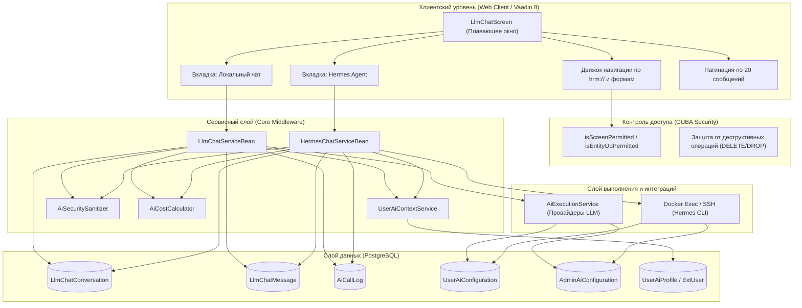

# Подсистема «LLM-чат HRM HuntTech»: Архитектурная спецификация и Техническое задание

> **Статус документа**: Утвержденная архитектурная спецификация и ТЗ  
> **Автор / Роль**: Аналитик  
> **Платформа**: CUBA Platform 7.3 / Vaadin 8 / Docker / AI Control Plane  
> **Ветка**: `agent/antigravity-dev`  
> **Дата актуализации**: Сентябрь 2026  

---

## 1. Назначение и концепция подсистемы

Плавающий интеллектуальный ассистент **«LLM-чат HRM HuntTech»** — это встроенный диалоговый интерфейс в веб-клиенте HRM-системы, предназначенный для автоматизации и интеллектуальной поддержки работы специалистов по подбору персонала (рекрутеров, сорсеров, тимлидов и руководителей подбора).

Подсистема реализует **двухвкладочную концепцию взаимодействия**:
1. **Вкладка «Локальный чат» (AI Execution Layer)**: Прямой диалог с ведущими внешними и локальными языковыми моделями (DeepSeek, OpenAI, Anthropic, GigaChat, YandexGPT) через унифицированный шлюз `AiExecutionService` с поддержкой потокового вывода (Streaming SSE), персонального и корпоративного квотирования, шифрования API-ключей и приоритетной маршрутизации.
2. **Вкладка «Hermes Agent» (hrm-viewer)**: Интеграция со специализированным автономным агентом Hermes, развернутым в изолированном Docker-контейнере. Агент обладает контекстным доступом к внутренним инструментам HRM, хранит непрерывную сессионную память диалога и выполняет комплексные сценарии анализа.

---

## 2. Архитектура компонентов и схема взаимодействия



---

## 3. Спецификация компонентов

### 3.1. Модуль сущностей данных (modules/global)

| Сущность | Таблица БД | Назначение |
| :--- | :--- | :--- |
| `LlmChatConversation` | `HUNTTECH_LLM_CHAT_CONVERSATION` | Диалог чата, привязанный к пользователю (`User`), содержит заголовок (`title`), статус (`ACTIVE`/`ARCHIVED`) и таймстемп последней активности. |
| `LlmChatMessage` | `HUNTTECH_LLM_CHAT_MESSAGE` | Сообщение диалога: роль (`USER`/`ASSISTANT`/`SYSTEM`), текст (`content`), порядковый номер (`sequenceNo`), провайдер, модель, `providerRequestId` (ID сессии Hermes). |
| `AiCallLog` | `HUNTTECH_AI_CALL_LOG` | Журнал технического аудита AI: время, пользователь, длительность, функция, модель, провайдер, токены (вход/выход/всего), стоимость, статус (`SUCCESS`/`ERROR`), санированная ошибка. |
| `UserAiConfiguration` | `HUNTTECH_USER_AI_CONFIGURATION` | Персональные настройки AI рекрутера: провайдер, модель, зашифрованный API-ключ (`apiKeyEncrypted`), приоритет, флаг активности. |
| `AdminAiConfiguration` | `HUNTTECH_ADMIN_AI_CONFIGURATION` | Корпоративные пулы подключений (Admin credentials), управляемые системным администратором. |
| `UserAiProfile` / `ExtUser` | `SEC_USER` / `HUNTTECH_USER_AI_PROFILE` | Персональный профиль рекрутера: должность, опыт, цели, специализации, стиль общения, язык, инструкции. |

### 3.2. Спецификация DTO

1. **`HermesChatResponse`** (`com.company.hunttech.service.dto.HermesChatResponse`):
   - `UUID conversationId` — идентификатор диалога;
   - `String assistantText` — ответ ассистента;
   - `boolean success` — признак успешности вызова;
   - `String errorMessage` — сообщение об ошибке (при наличии);
   - `String hermesSessionId` — идентификатор сессии Hermes для поддержания контекста;
   - `long executionTimeMs` — время ответа в миллисекундах;
   - `String modelName` — модель, использованная Hermes;
   - `String providerCode` — код провайдера модели;
   - `Integer promptTokens` — количество входных токенов;
   - `Integer completionTokens` — количество сгенерированных токенов;
   - `Integer totalTokens` — суммарное количество токенов;
   - `BigDecimal estimatedCost` — расчетная стоимость запроса;
   - `String currency` — валюта стоимости (`USD`/`RUB`).

2. **`HermesChatMessage`** (`com.company.hunttech.service.dto.HermesChatMessage`):
   - Идентификатор, роль (`user`/`assistant`), текст, дата создания, номер очереди, идентификатор сессии.

---

## 4. Вкладка 1: Локальный LLM-чат

### 4.1. Механика взаимодействия
- Пользователь вводит текстовый запрос во вкладке «Локальный чат».
- Запрос направляется в `LlmChatServiceBean.sendMessage(...)`.
- Проверяются лимиты месячной квоты пользователя (`AiFunctionConfiguration.defaultMonthlyTokenQuota` и персональные `LlmUserQuotaOverride`).
- Сервис формирует персонализированный контекст через `UserAiContextService`.
- Выполняется вызов к `AiExecutionService` с приоритетом пользовательского ключа (`UserAiConfiguration`). При отсутствии пользовательского ключа или сбое используется корпоративный ключ (`AdminAiConfiguration`) только при наличии явного согласия пользователя (`adminFallbackConsent`).
- Поддерживается двухканальный транспорт live-ответов: основной — **Vaadin Push**, аварийный — **интервальный polling (3 секунды)**.
- Факт вызова и списание квоты фиксируются в журнале аудита.

---

## 5. Вкладка 2: Интеграция с Hermes Agent

### 5.1. Архитектура запуска и CLI-протокол
Взаимодействие с Hermes реализовано в `HermesChatServiceBean` через вызов CLI-утилиты Hermes внутри Docker-контейнера `hermes-hrm-viewer`.

Параметры конфигурации (`HunttechHermesConfig`):
- `cuba.hermes.containerName` — имя контейнера (по умолчанию `hermes-hrm-viewer`);
- `cuba.hermes.profile` — профиль агента (по умолчанию `hrm-viewer`);
- `cuba.hermes.timeoutSeconds` — таймаут ожидания (по умолчанию 180 с);
- `cuba.hermes.sshEnabled`, `sshHost`, `sshPort`, `sshUser` — поддержка удаленного контейнера через SSH.

Формирование команды CLI:
```bash
docker exec -i -e <API_KEYS> hermes-hrm-viewer hermes -p hrm-viewer chat \
  --provider <provider> \
  -m <model> \
  [--resume <session_id>] \
  --query-file - \
  --oneshot \
  -Q
```

### 5.2. Безопасность передачи данных и изоляция процесса
1. **Защита от Shell-инъекций**: Промпт пользователя передается исключительно через стандартный поток ввода процесса (`process.getOutputStream()`), что полностью исключает возможность экранирования или выполнения произвольных команд в shell.
2. **Асинхронное чтение потоков**: Потоки `stdout` и `stderr` вычитываются асинхронно через `CompletableFuture.supplyAsync` во избежание взаимных блокировок (deadlock) при переполнении буфера pipe операционной системы.
3. **Восстановление сессий**: При возврате от Hermes ошибки `Session not found` запрос автоматически повторяется без флага `--resume`, гарантируя непрерывность работы.

### 5.3. Цепочка перебора моделей (Model Fallback Chain)
Алгоритм `resolveExecutionCandidates(currentUser)` строит список кандидатов выполнения:
1. **Пользовательские подключения** (`UserAiConfiguration` текущего рекрутера): сортируются по `isPrimary DESC, priority DESC`. Используется расшифрованный ключ рекрутера.
2. **Административные корпоративные подключения** (`AdminAiConfiguration`): сортируются по `priority DESC`.
3. **Резервная конфигурация контейнера** (`CONTAINER_DEFAULT`): дефолтная модель, зашитая в образе Hermes.

Перебор выполняется последовательно. При сетевых ошибках, лимитах или кодах 401/403/429/500 сервис плавно переключается на следующую модель в цепочке.

### 5.4. Точный учет токенов и расчет стоимости
- **Парсинг токенов**: сервис распознает строки статистики токенов из CLI-вывода (`prompt_tokens`, `completion_tokens`, `total_tokens`, `Tokens: X prompt, Y completion, Z total`) и удаляет их из финального текста ответа, чтобы не засорять сообщения диалога.
- **Эвристический расчет**: если CLI не выдал технических строк, применяется функция `estimateTokens(text)` (1 токен ≈ 4 символа).
- **Расчет стоимости**: вызывается калькулятор `AiCostCalculator.calculateCost(provider, model, promptTokens, completionTokens)`.
- **Изолированное логирование**: запись в `AiCallLog` создается в отдельном `CommitContext`, поэтому возможные ошибки аудита никогда не ломают сохранение диалога пользователя.
- **Санитизация ошибок**: при сбое вызова текст ошибки санируется через `AiSecuritySanitizer.sanitizeError(...)` для исключения утечек API-ключей в базу данных.

---

## 6. Персонализация контекста рекрутера

Для обеих вкладок чата работает единый сервис контекстной персонализации `UserAiContextService`:
1. **Профиль рекрутера**: имя, должность, опыт в подборе, целевые роли, география найма, отрасли, уровень кандидатов.
2. **Индивидуальные инструкции**: стиль ответов (деловой, лаконичный), язык, специфика форматирования.
3. **Правовая защита**: данные профиля передаются только при наличии явного согласия пользователя на обработку персональных данных в AI-функциях.
4. **Приоритет промпта**: системный регламент HRM всегда имеет высший приоритет над инструкциями пользователя (исключение prompt injection и обхода политик безопасности).

---

## 7. Интеллектуальная навигация по HRM и ролевая безопасность

### 7.1. Автоматическое распознавание запросов навигации
Чат автоматически распознает намерения пользователя открыть карточки системы:
- «Открой вакансию № 13254» / «покажи позицию 13254» → открывает экран редактирования `OpenPositionEdit` с выбранной сущностью;
- «Открой кандидата / резюме № ...» → открывает `CandidateCVEdit`;
- «Открой взаимодействие № ...» → открывает `IteractionListEdit`;
- «Открой реестр вакансий» → открывает реестр `OpenPositionReestrBrowse`.

### 7.2. Ссылочный протокол `hrm://`
LLM-ассистент обучен формировать стандартные гиперссылки:
- `[Вакансия: Java Lead](hrm://vacancy/8f1e2d3c-...)`
- `[Кандидат: Иванов](hrm://candidate/a1b2c3d4-...)`
- `[Резюме](hrm://cv/e5f6a7b8-...)`
- `[Взаимодействие](hrm://interaction/c9d0e1f2-...)`

Клик по ссылке в интерфейсе чата перехватывается контроллером и открывает экран соответствующей сущности.

### 7.3. Контроль доступа CUBA Platform Security
Перед любым открытием экрана или выборкой сущностей чат проверяет права текущего пользователя через стандартный сервис `Security`:
1. `security.isScreenPermitted(screenId)` — проверка права на запуск экрана. Если доступа нет (например, закрытый административный экран `ExUserSettingEdit` или чужие настройки), операция блокируется, а пользователю выводится информативное предупреждение.
2. `security.isEntityOpPermitted(metaClass, EntityOp.READ)` — проверка прав на чтение сущности.

### 7.4. Защита от деструктивных операций
На уровне системного промпта и логики контроллера установлен **абсолютный запрет на любые операции удаления** (DELETE, DROP, TRUNCATE, soft-delete записей). Запросы пользователей на удаление данных отклоняются со ссылкой на политику безопасности.

---

## 8. UX и интерфейсные механизмы

1. **Автоскролл диалога (`scrollChatToEnd`)**:
   - При каждом открытии окна чата история сообщений автоматически прокручивается до последнего сообщения.
   - При отправке пользователем сообщения и получении ответа ассистента чат плавно удерживает фокус на нижней границе.
2. **Пагинация и динамическая подгрузка истории**:
   - При входе в чат отображаются **последние 20 сообщений**.
   - Если в диалоге больше 20 сообщений, вверху списка отображается кнопка:  
     `«Загрузить предыдущие 20 сообщений (показано X из Y)»`.
   - Подгрузка выполняется порциями по 20 сообщений с сохранением точной позиции скролла (без скачков экрана).
3. **Markdown-рендеринг**:
   - Полная поддержка форматирования Markdown: жирный/курсивный текст, списки, таблицы, блоки кода с подсветкой, цитаты и ссылки `hrm://`.

---

## 9. Аналитические дашборды и аудит AI

### 9.1. «Дашборд аналитики AI» (`hunttech_AdminAiDashboard`)
- **Сетка KPI 4×25%**: карточки «Общие расходы ($)», «Активных рекрутеров», «Вызовов и токенов», «Надежность и скорость» распределены по 25% ширины каждая с адаптивным поведением.
- **Фильтрация**: временной период, сотрудник, тип ключа (`ADMIN`/`USER`) и провайдер (включая **Hermes**).
- **Сводный реестр пользователей**: высота 480px, форматирование разрядов токенов (`12 450`), сумм (`$ 0.0412`), количества ошибок и времени последней активности.
- **Графики**: динамика затрат по дням, ТОП пользователей по расходам, распределение затрат по функциям AI, задержка по моделям.

### 9.2. «Моя статистика AI» (`hunttech_UserAiDashboard`)
- **Персональные KPI 4×25%**: «Всего вызовов», «Потрачено токенов», «Оценочная стоимость ($)», «Ср. скорость и успешность».
- **Таблица последних вызовов**: время, функция, провайдер с цветными бейджами (`Hermes`, `DeepSeek`, `OpenAI`, `Anthropic`), модель, токены (`150 (100/50)`), стоимость, длительность, статус. Значения защищены от XSS.

---

## 10. Техническое задание (ТЗ) на эксплуатацию и развитие

### 10.1. Требования к надежности и производительности (SLO)
1. **Доступность подсистемы**: не менее 99.8% рабочего времени.
2. **Время отклика**:
   - Локальный чат: первый чанк потокового ответа (Time-to-First-Token) — не более 2.5 с;
   - Hermes Agent: формирование ответа при стандартном запросе — не более 15 с (таймаут процесса — 180 с).
3. **Отказоустойчивость**: сбой внешнего провайдера или процесса Docker не должен приводить к падению сервера приложений Tomcat или потере сообщений в диалоге.

### 10.2. Требования к безопасности (ИБ)
1. **Шифрование ключей**: все персональные и административные API-ключи должны храниться в базе данных исключительно в зашифрованном виде (`API_KEY_ENCRYPTED`).
2. **Санитизация логов**: в журналы технического аудита (`AiCallLog`) и системные логи (`app.log`) категорически запрещено логировать открытые API-ключи, персональные пароли или токены авторизации. Обязательно использование `AiSecuritySanitizer`.
3. **Разграничение прав**: прямой доступ к истории чужих диалогов закрыт. Просмотр возможен только администратором при наличии специфического разрешения `hunttech.ai.viewChatHistoryAdmin`.

### 10.3. Дорожная карта развития (Roadmap)
- **Фаза 1 (Текущая, выполнена)**: Базовый двухвкладочный чат, Docker/CLI интеграция с Hermes, цепочка перебора моделей, персонализация контекста рекрутера, навигация по сущностям с контролем доступа, автоскролл, пагинация по 20 сообщений, полный аудит Hermes в `AiCallLog`, дашборды 4×25%.
- **Фаза 2**: Интеграция RAG (Retrieval-Augmented Generation) по корпоративной базе знаний и внутренним регламентам подбора компании.
- **Фаза 3**: Поддержка прикрепления файлов (резюме PDF/DOCX, описания вакансий) непосредственно в диалоговое окно чата для мгновенного экспресс-анализа.
- **Фаза 4**: Голосовой ввод сообщений через специализированный сервис транскрибации речи.
