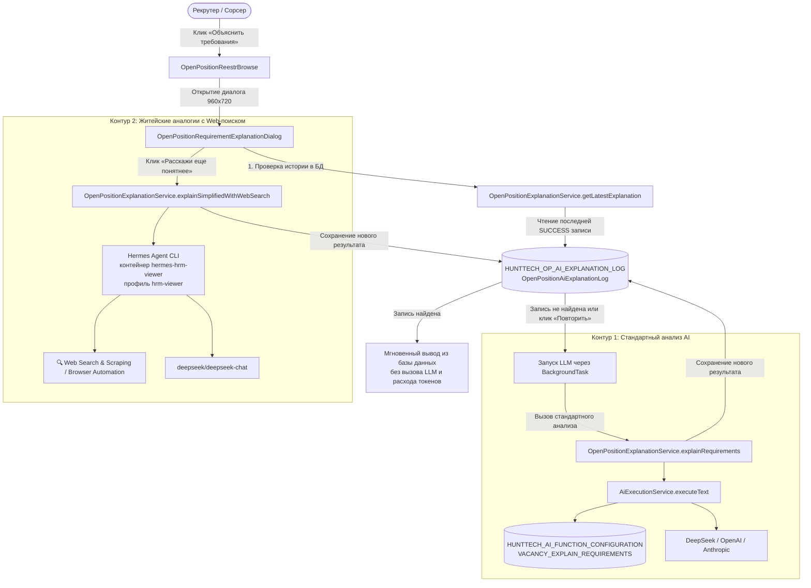

# HRM HuntTech — Интеллектуальное объяснение требований вакансий (AI & Hermes Web)

## 1. Назначение и контекст
Функционал «Объяснить требования вакансии» предназначен для IT-рекрутеров и сорсеров в HRM HuntTech. Он позволяет в один клик получить доступный, структурированный рассказ о сути вакансии, технологическом стеке, must-have критериях и тактике скрининга, а также при необходимости перевести сложнейшие технические требования на простые житейские аналогии и бытовые метафоры с использованием свежей информации из интернета.

---

## 2. Архитектура, кэширование и контуры выполнения

### Алгоритм работы (Экономия токенов и защита от повторных вызовов):
1. **Проверка в базе данных:** при открытии окна вызывается метод `getLatestExplanation(openPositionId, null)`.
2. **Если результат уже существует:** он немедленно отображается в рабочей области диалога с отметкой `💾 Сохранено в базе (ДД.ММ.ГГГГ ЧЧ:ММ)`, исключая лишние затраты бюджета токенов и сетевые задержки.
3. **Если результат отсутствует:** автоматически инициируется стандартный вызов нейросети с индикатором загрузки, а результат персистится в `OpenPositionAiExplanationLog`.
4. **Принудительное обновление:** рекрутер в любой момент может принудительно перезапустить анализ по кнопкам «Повторить анализ» или «Расскажи еще понятнее».

### Контур 1: Стандартный вызов через `AiExecutionService`
- **Код AI-функции в БД:** `VACANCY_EXPLAIN_REQUIREMENTS`
- **Сервис:** Стандартный Java-сервис системы `com.company.hunttech.service.AiExecutionService`
- **Контекст запроса:** название вакансии, грейд, проект, навыки (из `OpenPositionSkill` / `skillsList`), стандартизированное описание (`comment`), чек-лист проверки (`interviewChecklist`), карта поиска (`searchMap`).
- **Назначение:** раскладывает стек, объясняет профессиональный сленг, выделяет ключевые критерии отбора и формулирует вопросы для первого скрининга.

### Контур 2: Сверхпонятные житейские аналогии через Hermes `hrm-viewer`
- **Код AI-функции в БД:** `VACANCY_EXPLAIN_SIMPLIFIED_WEB`
- **Исполнитель:** Агент Hermes, развернутый в изолированном docker-контейнере `hermes-hrm-viewer` на `hr.hunttech.ru` (профиль `hrm-viewer`).
- **Особенности:** Контейнер обладает прямым доступом в интернет с активированными встроенными инструментами `web` (Search & Scraping) и `browser` (Automation).
- **Назначение:** объясняет сложные абстрактные технологии через бытовые аналогии (архитектор как проектировщик здания, DevOps как логистическая служба и т.д.), ищет в интернете актуальные примеры применения технологий в 2026 году и формирует контрольные житейские вопросы для сорсера.

---

## 3. Модель данных и аудит (JPA Сущность)

### Сущность `OpenPositionAiExplanationLog` (`hunttech_OpenPositionAiExplanationLog`)
Таблица в БД: `HUNTTECH_OP_AI_EXPLANATION_LOG`

| Поле | Тип | Описание |
|---|---|---|
| `openPosition` | `ManyToOne(OpenPosition)` | Ссылка на вакансию (индексировано) |
| `user` | `ManyToOne(User)` | Инициатор запроса (пользователь HRM) |
| `userLogin` | `VARCHAR(128)` | Логин пользователя на момент вызова |
| `userName` | `VARCHAR(255)` | ФИО пользователя |
| `callTime` | `TIMESTAMP` | Дата и точное время запроса (индексировано) |
| `explanationType` | `VARCHAR(32)` | `STANDARD` или `SIMPLIFIED_ANALOGY` (индексировано) |
| `serviceType` | `VARCHAR(32)` | `AI_EXECUTION_SERVICE` или `HERMES_HRM_VIEWER` |
| `modelName` | `VARCHAR(128)` | Наименование модели (`deepseek/deepseek-chat` и др.) |
| `providerCode` | `VARCHAR(64)` | Провайдер нейросети (`deepseek`, `openai`, `hermes`) |
| `durationMs` | `BIGINT` | Длительность генерации в миллисекундах |
| `promptTokens` | `INTEGER` | Количество токенов запроса |
| `completionTokens` | `INTEGER` | Количество токенов ответа |
| `totalTokens` | `INTEGER` | Общий объем токенов |
| `requestContext` | `TEXT (CLOB)` | Полный переданный контекст/промпт запроса |
| `responseContent` | `TEXT (CLOB)` | Полный сгенерированный текст ответа нейросети |
| `technicalInfo` | `TEXT (CLOB)` | Служебные данные (JSON с exitCode, providerRequestId и т.д.) |
| `status` | `VARCHAR(32)` | `SUCCESS` или `ERROR` |
| `errorMessage` | `VARCHAR(1000)` | Текст ошибки (если статус ERROR) |

---

## 4. Пользовательский интерфейс

1. **Реестр открытых позиций (`open-position-reestr-browse.xml` / `OpenPositionReestrBrowse.java`):**
   - В сайдбар действий `sidebarActionsCard` добавлена кнопка `explainRequirementsBtn` («Объяснить требования», иконка `LIGHTBULB_O`, стиль `friendly`).
   - Кнопка активируется при выборе вакансии в таблице и открывает диалоговое окно.

2. **Диалоговое окно объяснения требований (`open-position-requirement-explanation-dialog.xml` / `OpenPositionRequirementExplanationDialog.java`):**
   - Размер: 960×720px, модальное, resizable.
   - **Интеллектуальная предзагрузка:** при открытии проверяет ранее сохраненные результаты в БД через `getLatestExplanation`. При обнаружении сохраненного ответа мгновенно отображает текст с бейджем `💾 Сохранено в базе (ДД.ММ.ГГГГ ЧЧ:ММ)` без расхода токенов и задержек сети.
   - Сверху расположена акцентная кнопка **«Расскажи еще понятнее»** (`explainSimplifiedBtn`, иконка `MAGIC`), а также кнопки «Повторить анализ», «Копировать» в буфер обмена и «Закрыть».
   - Индикатор фонового прогресса (`BackgroundTask`) отображается только при активной генерации новой версии.
   - Текст ответа автоматически преобразуется из Markdown в аккуратный HTML со структурированными заголовками, списками и подсветкой кода.
   - В нижней плашке отображаются статус кэширования, модель, провайдер, токены, время выполнения и режим генерации.

---

## 5. Защита целостности данных (Data View Integrity)
- Загрузка данных вакансии выполняется через именованное представление `openPosition-view`, а требуемых навыков — через `openPositionSkill-view`.
- Все вызываемые в Java-коде геттеры (`vacansyName`, `comment`, `searchMap`, `interviewChecklist`, `grade`, `projectName`, `skillsList`) гарантированно загружаются в одном сеансе DataManager, полностью исключая ошибки `IllegalStateException: Cannot get unfetched attribute` и `LazyInitializationException`.
