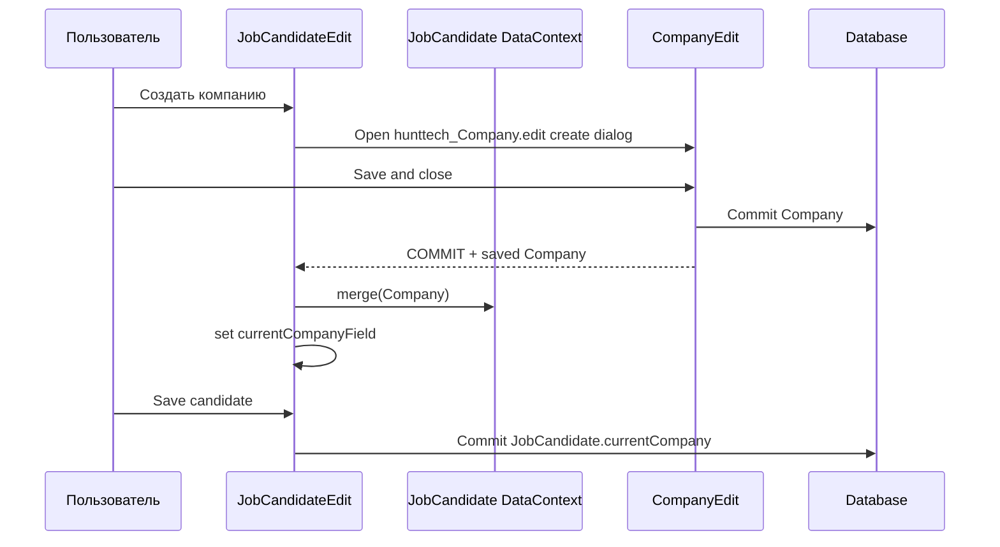

# BR-JC-COMPANY-001: выбор и создание компании кандидата

Кандидат может быть связан с существующей компанией через `JobCandidate.currentCompany`.

Если нужной компании нет в справочнике, пользователь может создать её из поля «Компания» в `JobCandidateEdit`. Для создания открывается стандартный `CompanyEdit`.

После успешного commit `CompanyEdit` созданная `Company` автоматически устанавливается в поле кандидата. Сохранение компании не сохраняет кандидата автоматически; связь фиксируется в базе только при последующем сохранении `JobCandidate`.

При cancel/discard/close `CompanyEdit` новая компания не сохраняется, значение `JobCandidate.currentCompany` не меняется, несохранённые изменения кандидата не теряются.

