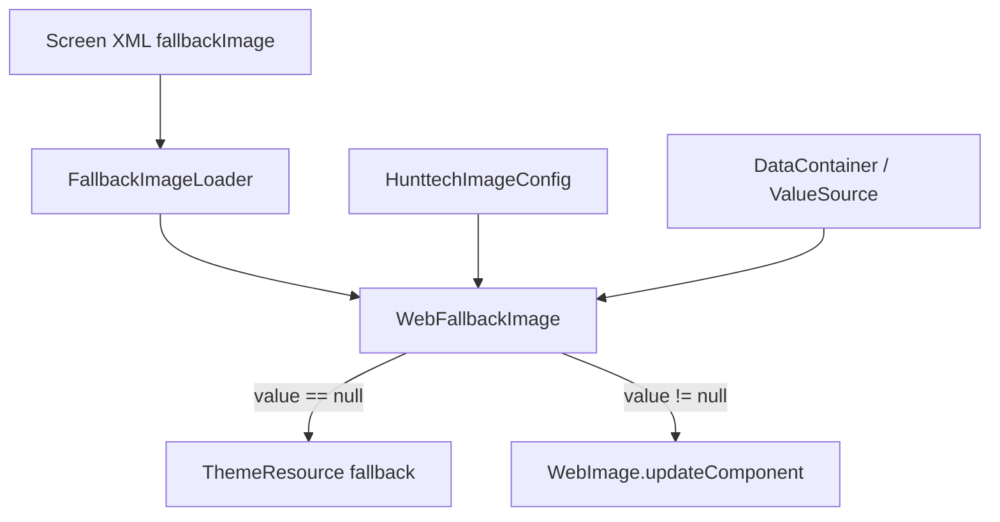

# FallbackImage — кастомный UI-компонент HRM HuntTech

> Краткая UI-заметка: [FallbackImage_Component.md](../ui/FallbackImage_Component.md)  
> См. также: [OvalImage](../ui-components/OvalImage.md) — круглый аватар (`extends Image`)

---

## Назначение и бизнес-смысл

**FallbackImage** (`fallbackImage` в screen XML) расширяет стандартный CUBA-компонент `image`. При привязке к полю сущности (обычно `FileDescriptor` — фото профиля, аватар кандидата) и **пустом значении** в datasource автоматически показывает запасное изображение из темы вместо пустого блока.

Типичные сценарии в HRM HuntTech:

- карточка пользователя (`ExtUser.officialPhoto`) — placeholder, пока фото не загружено;
- фото кандидата на edit/browse-экранах;
- любые `FileDescriptor`-поля, где нужен единообразный визуальный fallback без дублирования логики в Java-контроллерах.

---

## Архитектура

| Слой | Класс | Роль |
|------|-------|------|
| **gui** (контракт) | `com.hunttech.hrm.gui.components.FallbackImage` | Интерфейс, расширяет `Image`; константа `NAME = "fallbackImage"`; API fallback-ресурса |
| **web** (реализация) | `com.hunttech.hrm.web.components.WebFallbackImage` | Vaadin/CUBA web-комponent; подстановка placeholder при `valueSource.getValue() == null` |
| **web** (XML-loader) | `com.hunttech.hrm.web.loaders.FallbackImageLoader` | Создаёт `fallbackImage`, читает атрибут `fallbackThemePath` из screen XML |
| **global** (конфиг) | `com.company.hunttech.config.HunttechImageConfig` | Глобальный путь theme-ресурса по умолчанию |
| **регистрация** | `modules/web/src/com/hunttech/hrm/web/cuba-ui-component.xml` | Связка имени, класса и loader'а |
| **подключение** | `modules/web/src/com/company/itpearls/web-app.properties` | `cuba.web.componentsConfig = +...,+com/hunttech/hrm/web/cuba-ui-component.xml` |

### Поток данных



### Поведение WebFallbackImage

1. **`afterPropertiesSet`** — после инициализации родителя вызывается `initDefaultFallbackFromConfig()`: если локальный fallback ещё не задан и доступен `beanLocator`, читается `HunttechImageConfig.getDefaultFallbackImagePath()`.
2. **`FallbackImageLoader.loadComponent`** — атрибут XML `fallbackThemePath` вызывает `setFallbackThemePath()` и переопределяет глобальный дефолт.
3. **`updateComponent`** — если `valueSource.getValue() == null` и задан `fallbackResource`, на компонент ставится theme-ресурс; иначе выполняется стандартная логика `WebImage` (отображение `FileDescriptor` и т.д.).

---

## Приоритет источника fallback

| Приоритет | Источник | Как задаётся |
|-----------|----------|--------------|
| 1 (высший) | Java | `setFallbackThemePath(String)` / `setFallbackResource(Resource)` в контроллере |
| 2 | Screen XML | Атрибут `fallbackThemePath="..."` на `<fallbackImage>` |
| 3 (низший) | Глобальная конфигурация | `hunttech.defaultFallbackImagePath` в `HunttechImageConfig` |

Пустая строка в `setFallbackThemePath` сбрасывает локальный fallback (`fallbackResource = null`).

---

## Глобальная конфигурация

Интерфейс `HunttechImageConfig` (`@Source(type = SourceType.DATABASE)`):

| Ключ | Дефолт | Назначение |
|------|--------|------------|
| `hunttech.defaultFallbackImagePath` | `images/hunttech-placeholder.svg` | Theme-ресурс для всех `fallbackImage` без локального `fallbackThemePath` |

Файл placeholder: `modules/web/themes/hover/images/hunttech-placeholder.svg`, `modules/web/themes/halo/images/hunttech-placeholder.svg`.

Переопределение: **Administration → Application Properties**. Комментарий с ключом — в `modules/core/src/com/company/itpearls/app.properties`:

```properties
# hunttech.defaultFallbackImagePath=images/hunttech-placeholder.svg
```

---

## Использование

### Screen XML

```xml
<fallbackImage id="userPic"
               width="180px"
               height="180px"
               align="MIDDLE_CENTER"
               scaleMode="SCALE_DOWN"
               dataContainer="userDs"
               property="officialPhoto"/>
```

С локальным fallback (переопределяет глобальный дефолт):

```xml
<fallbackImage id="candidateFace"
               width="80px"
               height="80px"
               dataContainer="jobCandidateDc"
               property="fileImageFace"
               fallbackThemePath="icons/no-programmer.jpeg"/>
```

Остальные атрибуты наследуются от стандартного `image` (`ImageLoader`).

**Пример в проекте:** `modules/web/src/com/company/itpearls/web/screens/extuser/ext-user-edit.xml` — `userPic` без `fallbackThemePath` (используется глобальный SVG).

### Java (контроллер экрана)

```java
@Inject
private FallbackImage candidateFace;

@Subscribe
public void onBeforeShow(BeforeShowEvent event) {
    candidateFace.setFallbackThemePath("icons/custom-placeholder.png");
}
```

Вызов `setFallbackThemePath` в Java имеет приоритет над XML и глобальной конфигурацией.

---

## История изменений

| Дата | Изменение |
|------|-----------|
| 2026-06-29 | Каноническая документация компонента в `docs/components/FallbackImage.md`; unit-тесты `WebFallbackImageTest` |
| 2026-06-29 | Дефолтный путь заглушки: `images/hunttech-placeholder.svg` (фирменный SVG в темах hover/halo); `@DefaultString` в `HunttechImageConfig` |
| 2026-06-29 | Первоначальная реализация `FallbackImage` в пакетах `com.hunttech.hrm.*`; свойство `hunttech.defaultFallbackImagePath` |
