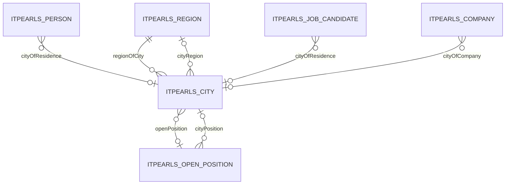

# City — город

> Справочник городов: название, телефонный код, регион.
> Триггер оптимизации: «оптимизируй сущность City».

---

## 1. Обзор

| Параметр | Значение |
|----------|----------|
| **Java-класс** | `com.company.itpearls.entity.City` |
| **Имя в CUBA** | `itpearls_City` |
| **Таблица БД** | `ITPEARLS_CITY` |
| **Тип данных** | справочник |
| **Ожидаемый объём** | сотни записей, часто читается |
| **Критичность** | высокая — FK в Person, JobCandidate, Company, OpenPosition |
| **Ответственный модуль** | `global` (entity, views), `web` (экраны) |

### Назначение

`City` хранит **справочник городов** с русским названием, телефонным кодом и ссылкой на регион (`cityRegion` → `Region`). Используется в формах кандидатов, персон, компаний, вакансий и фильтрах HR-мастеров.

### Отображаемое имя

- **NamePattern:** `%s|cityRuName`
- **Lookup:** `cityRuName`

---

## 2. Архитектура и связи

### 2.1 Диаграмма связей



### 2.2 Исходящие связи

| Поле Java | Тип | Связанная сущность | Fetch |
|-----------|-----|-------------------|-------|
| `cityRegion` | ManyToOne | `Region` | LAZY |
| `openPosition` | ManyToOne | `OpenPosition` | LAZY |

### 2.3 Входящие связи (FK)

| Сущность | Поле | Колонка БД |
|----------|------|------------|
| `Person` | `cityOfResidence` | `CITY_OF_RESIDENCE_ID` |
| `JobCandidate` | `cityOfResidence` | `CITY_OF_RESIDENCE_ID` |
| `Company` | `cityOfCompany` | `CITY_OF_COMPANY_ID` |
| `OpenPosition` | `cityPosition` | `CITY_POSITION_ID` |
| `SkillsFilterLastSelection` | `city` | `CITY_ID` |

### 2.4 LOB

**LOB-полей нет.** Все поля — varchar/FK.

---

## 3. Поля сущности

| Поле Java | Колонка БД | Тип | Ограничения |
|-----------|------------|-----|-------------|
| `cityRuName` | `CITY_RU_NAME` | varchar(50) | NOT NULL, unique, индекс |
| `cityPhoneCode` | `CITY_PHONE_CODE` | varchar(5) | unique |
| `cityRegion` | `CITY_REGION_ID` | uuid FK | → `ITPEARLS_REGION` |
| `openPosition` | `OPEN_POSITION_ID` | uuid FK | legacy-связь |

---

## 4. Представления (views.xml)

| View | Extends | Назначение | Где используется |
|------|---------|------------|------------------|
| `city-browse-view` | `_minimal` | колонки таблицы, **без** `openPosition` | `city-browse.xml` |
| `city-edit-view` | `_minimal` | поля формы | `city-edit.xml`, CRUD-тесты |
| `city-picker-view` | `_minimal` | lookup / FK | Person, Company, JobCandidate, OpenPosition |
| `city-location-view` | `_minimal` | город + регион + страна (фильтр) | `select-cities-location.xml` |
| `city-region-child-view` | `_minimal` | дочерние города в Region Edit | `region-edit-view` |
| `city-view` | `_local` | legacy | совместимость |

### FK cross-form

- `cityOfResidence` → `city-picker-view`
- `cityOfCompany` → `city-picker-view`
- `cityRegion` в City → `region-picker-view`

---

## 5. Экраны

Каталог: `modules/web/src/com/company/itpearls/web/screens/city/`

| Экран | Controller ID | Дескриптор | View |
|-------|---------------|------------|------|
| Browse | `itpearls_City.browse` | `city-browse.xml` | `city-browse-view` |
| Edit | `itpearls_City.edit` | `city-edit.xml` | `city-edit-view` |

### 5.1 CityBrowse

- **JPQL:** `order by e.cityRuName`
- **readOnly:** да
- **cacheable loader:** да
- **Колонки:** cityRuName, cityPhoneCode, cityRegion
- **Фильтр excludeProperties:** `openPosition` + system fields

### 5.2 CityEdit

- **View:** `city-edit-view`
- **Loader регионов:** `region-picker-view` + `cacheable="true"`
- **Вкладок нет** — lazy LOB/collection не требуется

### 5.3 Cross-form потребители

| Экран | Поле / loader | View |
|-------|---------------|------|
| `person-edit.xml` | `positionCityDc` | `city-picker-view` + cacheable |
| `person-browse.xml` | `cityOfResidence` | `city-picker-view` (через `person-browse-view`) |
| `company-edit.xml` | `cityOfCompaniesDc`, `cityOfCompany` | `city-picker-view` + cacheable |
| `job-candidate-edit.xml` | `citiesDc` | `city-picker-view` + cacheable |
| `open-position-edit.xml` | `citiesDc` | `city-picker-view` + cacheable |
| `skills-filter-job-candidate-browse.xml` | `citiesDc` | `city-picker-view` + cacheable |
| `select-cities-location.xml` | `cityOptionDc` | `city-location-view` + cacheable |
| `SelectCitiesLocation.java` | DataManager load | `city-picker-view` / `city-location-view` |
| `ParseCVServiceBean` | parseCity / parseCityStr | `city-picker-view` |

---

## 6. База данных

### 6.1 Таблица `ITPEARLS_CITY`

Схема: `modules/core/db/init/postgres/10.create-db.sql`

### 6.2 Индексы на `ITPEARLS_CITY`

| Индекс | Колонки | Назначение |
|--------|---------|------------|
| `IDX_ITPEARLS_CITY_RU_NAME` | `CITY_RU_NAME` | ORDER BY в browse, фильтр |
| `IDX_ITPEARLS_CITY_ON_CITY_REGION` | `CITY_REGION_ID` | JOIN по региону |
| `IDX_ITPEARLS_CITY_ON_OPEN_POSITION` | `OPEN_POSITION_ID` | legacy FK |
| UK на `CITY_RU_NAME`, `CITY_PHONE_CODE` | | уникальность |

### 6.3 Индексы FK в дочерних таблицах

| Таблица | Колонка | Индекс |
|---------|---------|--------|
| `ITPEARLS_PERSON` | `CITY_OF_RESIDENCE_ID` | `IDX_ITPEARLS_PERSON_ON_CITY_OF_RESIDENCE` ✅ |
| `ITPEARLS_JOB_CANDIDATE` | `CITY_OF_RESIDENCE_ID` | `IDX_ITPEARLS_JOB_CANDIDATE_ON_CITY_OF_RESIDENCE` ✅ |
| `ITPEARLS_COMPANY` | `CITY_OF_COMPANY_ID` | `IDX_ITPEARLS_COMPANY_ON_CITY_OF_COMPANY` ✅ |
| `ITPEARLS_OPEN_POSITION` | `CITY_POSITION_ID` | `IDX_ITPEARLS_OPEN_POSITION_ON_CITY_POSITION` ✅ |
| `ITPEARLS_SKILLS_FILTER_LAST_SELECTION` | `CITY_ID` | `IDX_ITPEARLS_SKILLS_FILTER_LAST_SELECTION_ON_CITY` ✅ |

**Миграция не требуется** — все FK проиндексированы.

---

## 7. Производительность

### 7.1 Baseline (до оптимизации, `335adccfbacc165d9f7f93e34be8bdd2d3231265`)

| Экран | View | Полей в view | LOB | Проблема |
|-------|------|--------------|-----|----------|
| CityBrowse | `city-view` (_local) | ~8+ | нет | `cityRegion` → `_minimal` + `regionOfCity`; лишний `openPosition` |
| CityEdit | `city-view` | ~8+ | нет | глубокий expand Region; loader регионов `_minimal` без display |
| Pickers | `city-view` / `_minimal` | 8+ / 1 | нет | избыточная глубина или недостаточно display-полей |
| ParseCVServiceBean | без view | все поля | нет | полная загрузка справочника без cacheable |

**Точка отсчёта:** `335adccfbacc165d9f7f93e34be8bdd2d3231265`

### 7.2 Таблица сравнения до/после

| Экран | Метрика | До | После | Δ | Комментарий |
|-------|---------|-----|-------|---|-------------|
| CityBrowse | view | `city-view` | `city-browse-view` | — | убран `openPosition`, узкий `cityRegion` |
| CityBrowse | полей в view | ~8+ | 4 | −4+ | scalar + region-picker |
| CityBrowse | SQL при открытии (оценка) | 1 + N (region expand) | 1–2 | −N | без `regionOfCity` |
| CityBrowse | cacheable loader | нет | да | + | справочник |
| CityEdit | view | `city-view` | `city-edit-view` | — | без deep expand |
| CityEdit | loader Region | `_minimal` | `region-picker-view` + cacheable | — | display + кэш |
| Cross-form pickers | view | `city-view` / `_minimal` | `city-picker-view` | — | cityRuName + cityPhoneCode |
| ParseCVServiceBean | view | нет | `city-picker-view` | — | только нужные поля |
| select-cities-location | view | inline `city-view` + deep | `city-location-view` | — | region-view для фильтра по стране |

*Оценка SQL основана на анализе view: фактический замер EclipseLink FINE / pg_stat — по желанию на локальной БД.*

### 7.3 Текущее состояние (после оптимизации 2026-06-23)

| Область | Статус | Комментарий |
|---------|--------|-------------|
| Специализированные views | ✅ | browse / edit / picker / location |
| LOB lazy load | — | LOB нет |
| cacheable loaders | ✅ | browse + pickers + Region в Edit |
| readOnly browse | ✅ | уже был |
| N+1 в providers | ✅ | providers нет |
| FK indexes | ✅ | все дочерние FK проиндексированы |
| Legacy `city-view` | ⚠️ | оставлен для совместимости |

### 7.4 Выполненные оптимизации

- [x] `city-browse-view` — только колонки таблицы
- [x] `city-edit-view` — scalar + `cityRegion` → `region-picker-view`
- [x] `city-picker-view` — lookup-списки
- [x] `city-location-view` — фильтр по стране в SelectCitiesLocation
- [x] `city-region-child-view` — дочерние города в Region Edit
- [x] `cacheable="true"` на browse и picker loaders
- [x] Узкий `excludeProperties` (исключён `openPosition`)
- [x] Замена `city-view`/`_minimal`/`_local` → `city-picker-view` в Person, Company, JobCandidate, OpenPosition, SkillsFilter
- [x] `ParseCVServiceBean` — view + cacheable
- [x] `CityServiceTest` — CRUD integration tests

### 7.5 Остаточные узкие места (backlog)

| Проблема | Приоритет | Решение |
|----------|-----------|---------|
| FTS на `City` в `fts.xml` | низкий | убрать, если полнотекст не используется |
| Legacy `city-view` (_local) | низкий | постепенная замена |
| `openPosition` FK на City | низкий | оценить необходимость legacy-связи |
| JPQL path navigation `cityRegion.regionCountry.countryRuName` | низкий | UUID-кэш или id in (:ids) |
| `job-candidate-edit.xml` instance view `cityOfResidence _local` | средний | заменить на `city-picker-view` |
| Entity cache (EclipseLink) для City | низкий | оценить `cuba.entityCache.*` |

---

## 8. Развёртывание

| Параметр | Файл | Значение |
|----------|------|----------|
| DBMS | `app.properties` | postgres |
| FTS | `fts.xml` | `City` включён |
| Entity cache | `app.properties` | не настроен |

---

## 9. Тесты

| Класс | Путь | Сценарии |
|-------|------|----------|
| `CityServiceTest` | `modules/core/test/com/company/itpearls/core/` | create, edit/save, browse load, soft delete |

```bash
./gradlew :app-core:test --tests "com.company.itpearls.core.CityServiceTest"
```

---

## 10. История изменений

| Дата | Изменение |
|------|-----------|
| 2026-06-23 | Полная оптимизация по методологии entity-performance-optimization |
