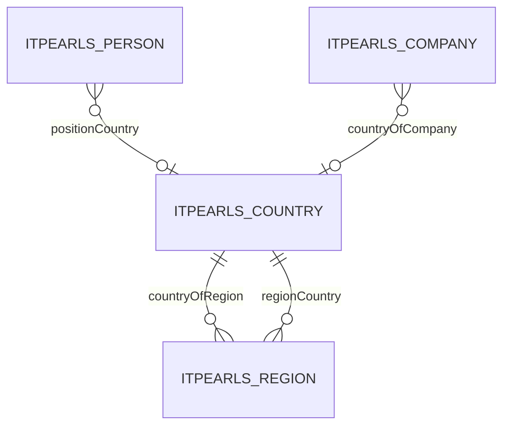

# Country — страна

> Справочник стран: название, ISO-код, телефонный код, связанные регионы.
> Триггер оптимизации: «оптимизируй сущность Country».

---

## 1. Обзор

| Параметр | Значение |
|----------|----------|
| **Java-класс** | `com.company.itpearls.entity.Country` |
| **Имя в CUBA** | `itpearls_Country` |
| **Таблица БД** | `ITPEARLS_COUNTRY` |
| **Тип данных** | справочник |
| **Ожидаемый объём** | ~200 записей, часто читается |
| **Критичность** | средняя — FK в Region, Person, Company |
| **Ответственный модуль** | `global` (entity, views), `web` (экраны) |

### Назначение

`Country` хранит **справочник стран** с русским названием, двухбуквенным кодом и телефонным кодом. Владеет коллекцией регионов (`countryOfRegion` → `Region.regionCountry`). Используется в формах Person, Region, Company и фильтрах OpenPosition.

### Отображаемое имя

- **NamePattern:** `%s|countryRuName`
- **Lookup:** `countryRuName`

---

## 2. Архитектура и связи

### 2.1 Диаграмма связей



### 2.2 Исходящие связи

| Поле Java | Тип | Связанная сущность | Fetch |
|-----------|-----|-------------------|-------|
| `countryOfRegion` | OneToMany (Composition) | `Region` | LAZY |

### 2.3 Входящие связи (FK)

| Сущность | Поле | Колонка БД |
|----------|------|------------|
| `Region` | `regionCountry` | `REGION_COUNTRY_ID` |
| `Person` | `positionCountry` | `POSITION_COUNTRY_ID` |
| `Company` | `countryOfCompany` | `COUNTRY_OF_COMPANY_ID` |

### 2.4 LOB

**LOB-полей нет.** Все поля — varchar/integer.

---

## 3. Поля сущности

| Поле Java | Колонка БД | Тип | Ограничения |
|-----------|------------|-----|-------------|
| `countryRuName` | `COUNTRY_RU_NAME` | varchar(50) | NOT NULL, unique, индекс |
| `countryShortName` | `COUNTRY_SHORT_NAME` | varchar(2) | |
| `phoneCode` | `PHONE_CODE` | integer | |

---

## 4. Представления (views.xml)

| View | Extends | Назначение | Где используется |
|------|---------|------------|------------------|
| `country-browse-view` | `_minimal` | колонки таблицы, **без** `countryOfRegion` | `country-browse.xml` |
| `country-edit-view` | `_minimal` | поля формы + регионы (узкий view) | `country-edit.xml`, CRUD-тесты |
| `country-picker-view` | `_minimal` | lookup / FK | Person, Region, Company Edit, cross-form |
| `country-view` | `_local` | legacy | совместимость |

### Связанный view для дочерних регионов

| View | Назначение |
|------|------------|
| `region-country-child-view` | `regionRuName`, `regionCode` в таблице регионов на Edit Country |

### FK cross-form

- `positionCountry` → `country-picker-view`
- `countryOfCompany` → `country-picker-view`
- `regionCountry` → `country-picker-view`

---

## 5. Экраны

Каталог: `modules/web/src/com/company/itpearls/web/screens/country/`

| Экран | Controller ID | Дескриптор | View |
|-------|---------------|------------|------|
| Browse | `itpearls_Country.browse` | `country-browse.xml` | `country-browse-view` |
| Edit | `itpearls_Country.edit` | `country-edit.xml` | `country-edit-view` |

### 5.1 CountryBrowse

- **JPQL:** `order by e.countryRuName`
- **readOnly:** да
- **cacheable loader:** да
- **Колонки:** countryRuName, countryShortName, phoneCode
- **Фильтр excludeProperties:** `countryOfRegion` + system fields

### 5.2 CountryEdit

- **View:** `country-edit-view`
- **Вкладок нет** — lazy LOB/collection по вкладкам не требуется
- **Таблица регионов:** `countryOfRegion` через `region-country-child-view` (без городов)

### 5.3 Cross-form потребители

| Экран | Поле / loader | View |
|-------|---------------|------|
| `person-edit.xml` | `positionCountriesDc` | `country-picker-view` + cacheable |
| `region-edit.xml` | `regionCountriesDc` | `country-picker-view` + cacheable |
| `company-edit.xml` | `countryOfCompaniesDc`, `countryOfCompany` | `country-picker-view` + cacheable |
| `company-browse.xml` | `countryOfCompany` | `country-picker-view` (через `company-view`) |
| `person-browse.xml` | `positionCountry` | `country-picker-view` (через `person-browse-view`) |
| `select-cities-location.xml` | `regionCountry` | `country-picker-view` |

---

## 6. База данных

### 6.1 Таблица `ITPEARLS_COUNTRY`

Схема: `modules/core/db/init/postgres/10.create-db.sql`

### 6.2 Индексы

| Индекс | Колонки | Назначение |
|--------|---------|------------|
| `IDX_COUNTRY_COUNTRY_RU_NAME` | `COUNTRY_RU_NAME` | ORDER BY в browse, фильтр |
| UK на `COUNTRY_RU_NAME` | | уникальность |

### 6.3 Индексы FK в дочерних таблицах

| Таблица | Колонка | Индекс |
|---------|---------|--------|
| `ITPEARLS_REGION` | `REGION_COUNTRY_ID` | `IDX_ITPEARLS_REGION_ON_REGION_COUNTRY` ✅ |
| `ITPEARLS_PERSON` | `POSITION_COUNTRY_ID` | `IDX_ITPEARLS_PERSON_ON_POSITION_COUNTRY` ✅ |
| `ITPEARLS_COMPANY` | `COUNTRY_OF_COMPANY_ID` | `IDX_ITPEARLS_COMPANY_ON_COUNTRY_OF_COMPANY` ✅ |

**Миграция не требуется** — все FK проиндексированы в `20.create-db.sql`.

---

## 7. Производительность

### 7.1 Baseline (до оптимизации, `git HEAD`)

| Экран | View | Полей в view | LOB | Коллекции в view | Проблема |
|-------|------|--------------|-----|------------------|----------|
| CountryBrowse | `country-view` (_local) | ~10+ | нет | `countryOfRegion` (_local) | загрузка всех регионов (+ города) при открытии browse |
| CountryEdit | `country-view` | ~10+ | нет | `countryOfRegion` (_local) | избыточная глубина Region |
| Pickers | `_minimal` | 1 (id) | нет | нет | недостаточно display-полей для lookup |
| region-view | циклический expand | — | — | countryOfRegion внутри regionCountry | лишние JOIN/запросы |

**Точка отсчёта:** `335adccfbacc165d9f7f93e34be8bdd2d3231265` (git HEAD на момент начала работ).

### 7.2 Таблица сравнения до/после

| Экран | Метрика | До | После | Δ | Комментарий |
|-------|---------|-----|-------|---|-------------|
| CountryBrowse | view | `country-view` | `country-browse-view` | — | убрана коллекция регионов |
| CountryBrowse | полей в view | ~10 + N регионов | 4 | −6+ | только scalar + id |
| CountryBrowse | SQL при открытии (оценка) | 1 + N (регионы) | 1 | −N | один SELECT по `ITPEARLS_COUNTRY` |
| CountryBrowse | cacheable loader | нет | да | + | справочник |
| CountryEdit | view | `country-view` | `country-edit-view` | — | регионы через `region-country-child-view` |
| CountryEdit | глубина Region | `_local` (+ cities) | 2 поля | − | без `regionOfCity` |
| Cross-form pickers | view | `_minimal` / `_local` | `country-picker-view` | — | countryRuName + countryShortName |
| region-view | expand regionCountry | циклический _minimal | `country-picker-view` | — | убрана рекурсия |

*Оценка SQL основана на анализе view (git diff): фактический замер EclipseLink FINE / pg_stat — по желанию на локальной БД.*

### 7.3 Текущее состояние (после оптимизации 2026-06-23)

| Область | Статус | Комментарий |
|---------|--------|-------------|
| Специализированные views | ✅ | browse / edit / picker |
| LOB lazy load | — | LOB нет |
| cacheable loaders | ✅ | browse + pickers |
| readOnly browse | ✅ | уже был |
| N+1 в providers | ✅ | providers нет |
| FK indexes | ✅ | все дочерние FK проиндексированы |
| Legacy `country-view` | ⚠️ | оставлен для совместимости |

### 7.4 Выполненные оптимизации

- [x] `country-browse-view` — только колонки таблицы
- [x] `country-edit-view` — scalar + `countryOfRegion` → `region-country-child-view`
- [x] `country-picker-view` — lookup-списки
- [x] Исправлен `region-view` — убрана циклическая вложенность
- [x] `cacheable="true"` на browse и picker loaders
- [x] Узкий `excludeProperties` (исключён `countryOfRegion`)
- [x] Замена `_minimal`/`_local` → `country-picker-view` в Person, Region, Company, select-cities-location
- [x] `CountryServiceTest` — CRUD integration tests

### 7.5 Остаточные узкие места (backlog)

| Проблема | Приоритет | Решение |
|----------|-----------|---------|
| FTS на `Country` в `fts.xml` | низкий | убрать, если полнотекст не используется |
| Legacy `country-view` (_local) | низкий | постепенная замена |
| `region-view` / `city-view` — полная оптимизация Region/City | средний | отдельная задача |
| JPQL path navigation `regionCountry.countryRuName` в SelectCitiesLocation | низкий | UUID-кэш или id in (:ids) |
| Entity cache (EclipseLink) для Country | низкий | оценить `cuba.entityCache.*` |

---

## 8. Развёртывание

| Параметр | Файл | Значение |
|----------|------|----------|
| DBMS | `app.properties` | postgres |
| FTS | `fts.xml` | `Country` включён |
| Entity cache | `app.properties` | не настроен |

---

## 9. Тесты

| Класс | Путь | Сценарии |
|-------|------|----------|
| `CountryServiceTest` | `modules/core/test/com/company/itpearls/core/` | create, edit/save, browse load, soft delete |

```bash
./gradlew :app-core:test --tests "com.company.itpearls.core.CountryServiceTest"
```

---

## 10. История изменений

| Дата | Изменение |
|------|-----------|
| 2026-06-22 | Аудит Edit unfetched FK: `CountryEdit` без обработчиков вложенных FK; `country-edit-view` покрывает поля формы — OK |
| 2026-06-23 | Исправление `country-edit.xml`: явный `view="region-country-child-view"` на collection `countryOfRegion` |
| 2026-06-23 | Оптимизация: country-browse/edit/picker views, cacheable loaders, `CountryServiceTest`, документация |
