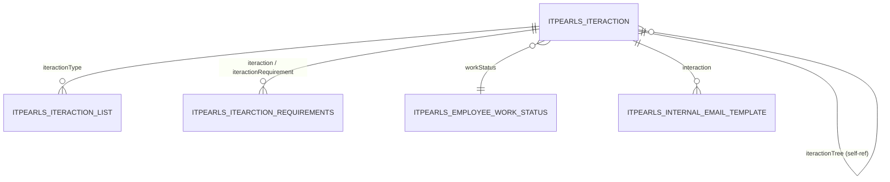

# Iteraction — тип взаимодействия с кандидатом

> Справочник типов взаимодействий в процессе рекрутинга. Определяет поведение кнопок, уведомлений, признаков процесса и настройки UI при работе с `IteractionList`.
> Триггер оптимизации: «давай оптимизировать работу сущности Iteraction».

---

## 1. Обзор

| Параметр | Значение |
|----------|----------|
| **Java-класс** | `com.company.itpearls.entity.Iteraction` |
| **Имя в CUBA** | `itpearls_Iteraction` |
| **Таблица БД** | `ITPEARLS_ITERACTION` |
| **Тип данных** | справочник (иерархический) |
| **Ожидаемый объём** | десятки–сотни записей |
| **Критичность** | высокая — используется во всех экранах взаимодействий с кандидатами |
| **Ответственный модуль** | `global` (entity, views), `web` (экраны), `core` (сервисы) |

### Назначение

`Iteraction` — каталог **типов взаимодействия** (звонок, интервью, отправка резюме и т.д.). Каждая запись задаёт:

- отображение в UI (номер, название, пиктограмма, текст кнопки);
- поведение при создании записи в `IteractionList` (доп. поля, дата/время, форма вызова);
- флаги бизнес-процесса (интервью, кадровый резерв, закрытие вакансии);
- настройки уведомлений и email-шаблонов;
- участие в календаре и виджетах.

Записи организованы в **дерево**: корневые элементы (`iteractionTree = null`) — группы, дочерние — конкретные типы.

### Отображаемое имя

- **NamePattern:** `%s. %s|number,iterationName` → «1. Звонок»
- **Lookup:** `iterationName` (уникальное)

---

## 2. Архитектура и связи

### 2.1 Диаграмма связей



### 2.2 Исходящие связи

| Поле Java | Колонка БД | Связанная сущность | Fetch | Обязательность |
|-----------|------------|-------------------|-------|----------------|
| `iteractionTree` | `ITERACTION_TREE_ID` | `Iteraction` (self) | LAZY | нет |
| `workStatus` | `WORK_STATUS_ID` | `EmployeeWorkStatus` | LAZY | нет |

### 2.3 Входящие связи

| Сущность | Поле | Колонка БД | Назначение |
|----------|------|------------|------------|
| `IteractionList` | `iteractionType` | `ITERACTION_TYPE_ID` | тип каждой записи взаимодействия с кандидатом |
| `ItearctionRequirements` | `iteraction` | `ITERACTION_ID` | исходный тип в цепочке требований |
| `ItearctionRequirements` | `iteractionRequirement` | `ITERACTION_REQUIREMEN_ID` | обязательный предшествующий тип |
| `Iteraction` | `iteractionTree` | `ITERACTION_TREE_ID` | родитель в иерархии |
| `InternalEmailTemplate` | `interaction` | `INTERACTION_ID` | шаблоны писем для типа |

### 2.4 Сервисы

| Сервис | Метод | Описание |
|--------|-------|----------|
| `InteractionServiceBean` | `getMostPolularIteraction` | топ типов по количеству `IteractionList` за период |
| `InteractionServiceBean` | `getLastIteraction` | последнее взаимодействие кандидата (по `numberIteraction`) |
| `EmailGenerationService` | `generateKeys` | ключи подстановки в шаблон email (используется в Edit) |

---

## 3. Поля сущности

### 3.1 Ключевые бизнес-поля

| Поле Java | Колонка БД | Тип | Ограничения | Описание |
|-----------|------------|-----|-------------|----------|
| `number` | `NUMBER_` | varchar(255) | индекс | порядковый номер в дереве |
| `iterationName` | `ITERATION_NAME` | varchar(80) | NOT NULL, UNIQUE | название типа |
| `mandatoryIteraction` | `MANDATORY_ITERACTION` | boolean | | неизменяемая системная запись |
| `staffInteractionStatus` | `STAFF_INTERACTION_STATUS` | integer | | enum: DISPOSAL(-1), NOTHING(0), ADVENT(1) |
| `outstaffingSign` | `OUTSTAFFING_SIGN` | boolean | NOT NULL, default false | признак аутстаффинга |

### 3.2 UI и кнопка действия

| Поле | Колонка | Описание |
|------|---------|----------|
| `pic` | `PIC` | путь к пиктограмме (ThemeResource) |
| `callButtonText` | `CALL_BUTTON_TEXT` | текст кнопки создания |
| `callClass` | `CALL_CLASS` | класс формы вызова |
| `callForm` | `CALL_FORM` | показывать кнопку действия |
| `addFlag` | `ADD_FLAG` | использовать дополнительное поле |
| `addType` | `ADD_TYPE` | 1=Date, 2=String, 3=Integer |
| `addField` | `ADD_FIELD` | имя доп. поля |
| `addCaption` | `ADD_CAPTION` | подпись доп. поля |
| `setDateTime` | `SET_DATE_TIME` | установка даты/времени по умолчанию |
| `checkTrace` | `CHECK_TRACE` | тип отслеживания цепочки (default 1) |

### 3.3 Календарь и справочники

| Поле | Колонка | Описание |
|------|---------|----------|
| `calendarItem` | `CALENDAR_ITEM` | показывать в календаре |
| `calendarItemStyle` | `CALENDAR_ITEM_STYLE` | CSS-стиль в календаре |
| `calendarItemDescription` | `CALENDAR_ITEM_DESCRIPTION` | подсказка в календаре |
| `findToDic` | `FIND_TO_DIC` | поиск в справочниках |
| `widgetChackJobCandidates` | `WIDGET_CHACK_JOB_CANDIDATES` | виджет контроля кандидатов |

### 3.4 Email и уведомления

| Поле | Колонка | Тип | Описание |
|------|---------|-----|----------|
| `needSendLetter` | `NEED_SEND_LETTER` | boolean | отправлять email кандидату |
| `textEmailToSend` | `TEXT_EMAIL_TO_SEND` | **text (LOB)** | шаблон письма |
| `needSendMemo` | `NEED_SEND_MEMO` | boolean | отправлять памятку |
| `notificationNeedSend` | `NOTIFICATION_NEED_SEND` | boolean | посылать оповещение |
| `notificationType` | `NOTIFICATION_TYPE` | integer | 1–6: нет / менеджер / подписчик вакансии / кандидата / список / всем |
| `notificationPeriodType` | `NOTIFICATION_PERIOD_TYPE` | integer | период оповещения (0–5) |
| `notificationBeforeAfterDay` | `NOTIFICATION_BEFORE_AFTER_DAY` | integer | дней до/после (при periodType=5) |
| `notificationWhenSend` | `NOTIFICATION_WHEN_SEND` | integer | 1=при создании, 2=в указанное время |

### 3.5 Признаки процесса (sign-поля)

Используются в JPQL-фильтрах и бизнес-логике `IteractionList` / виджетах:

| Группа | Поля |
|--------|------|
| Интервью | `signOurInterviewAssigned`, `signOurInterview`, `signClientInterview`, `signSendToClient` |
| Кадровый резерв | `signPersonalReserve`, `signPersonalReserveDelete`, `signPersonalReservePut` (unique), `signPersonalReserveRemove` (unique) |
| Процесс / кейс | `signStartCase`, `signEndCase`, `signStartProject`, `signEndProject`, `signEndProcessVacancyClosed` |
| Прочее | `signPriorityNews`, `signViewOnlyManager`, `signComment`, `signFeedback`, `signEmailSend`, `statistics` |

### 3.6 Перечисления

**StaffInteractionStatus** (`staffInteractionStatus`):

| Значение | ID | Смысл |
|----------|-----|-------|
| DISPOSAL | -1 | утилизация |
| NOTHING | 0 | без изменения статуса |
| ADVENT | 1 | приход сотрудника |

---

## 4. Представления (views.xml)

Файл: `modules/global/src/com/company/itpearls/views.xml`

| View | Extends | Назначение | Где используется |
|------|---------|------------|------------------|
| `iteraction-browse-view` | `_minimal` | плоский browse | `iteraction-browse.xml` |
| `iteraction-tree-browse-view` | `_minimal` | tree browse + иконки | `iteraction-tree-browse.xml`, `iteraction-requirement-browse.xml` |
| `iteraction-picker-view` | `_minimal` | lookup / FK | Edit (tree, twin column), picker |
| `iteraction-edit-view` | `_minimal` | форма редактирования **без LOB** | `iteraction-edit.xml` |
| `iteraction-view` | `_base` | legacy, runtime | сервисы, виджеты, cross-form |
| `iteraction-view-button` | `_base` | кнопки действий | runtime при создании IteractionList |

### Детализация оптимизированных views

**`iteraction-browse-view`:** `number`, `iterationName`, `iteractionTree` (_minimal + number, iterationName), `mandatoryIteraction`, `callButtonText`, `callClass`

**`iteraction-tree-browse-view`:** `number`, `iterationName`, `mandatoryIteraction`, `notificationType`, `needSendLetter`, `needSendMemo`, `iteractionTree` (_minimal)

**`iteraction-picker-view`:** `number`, `iterationName`

**`iteraction-edit-view`:** все поля формы **кроме** `textEmailToSend`; FK `iteractionTree` → `iteraction-picker-view`; `workStatus` → `employeeWorkStatus-view`

**Cross-form (`IteractionList.iteractionType`):** в `iteractionList-browse-view` — `_minimal` + `iterationName`, `pic`, `outstaffingSign`

---

## 5. Экраны

Каталог: `modules/web/src/com/company/itpearls/web/screens/iteraction/`

| Экран | Controller ID | Дескриптор | View | Меню (RU) |
|-------|---------------|------------|------|-----------|
| Browse | `itpearls_Iteraction.browse` | `iteraction-browse.xml` | `iteraction-browse-view` | — |
| Tree Browse | `itpearls_Iteraction._tree.browse` | `iteraction-tree-browse.xml` | `iteraction-tree-browse-view` | Тип взаимодействия с кандидатом |
| Edit | `itpearls_Iteraction.edit` | `iteraction-edit.xml` | `iteraction-edit-view` | — |
| Tree Edit | `itpearls_Iteraction_tree.edit` | `iteraction-tree-edit.xml` | (default) | — |
| Requirements | `itpearls_IteractionRequirement.browse` | `iteraction-requirement-browse.xml` | `iteraction-tree-browse-view` | Требования к взаимодействию |

### 5.1 IteractionBrowse

- **JPQL:** `select e from itpearls_Iteraction e order by e.number, e.iterationName`
- **readOnly:** да
- **cacheable loader:** да
- **Таблица:** groupTable с группировкой по `iteractionTree`
- **Колонки:** iteractionTree, number, mandatoryIteraction, iterationName, callButtonText, callClass
- **Фильтр excludeProperties:** LOB (`textEmailToSend`), system fields, тяжёлые поля уведомлений

### 5.2 IteractionTreeBrowse

- **JPQL:** `select e from itpearls_Iteraction e order by e.number`
- **readOnly:** да, **cacheable:** да
- **Компонент:** treeDataGrid, `hierarchyProperty="iteractionTree"`
- **Колонки с иконками:** notification, needSendEmail, needSendMemo (columnGenerator + styleProvider в Java)
- **Фильтр:** расширенный exclude (id, addDate, pic, iteractionTree, …)

### 5.3 IteractionEdit

- **View:** `iteraction-edit-view`
- **Вкладки:** тип взаимодействия, кнопка, доп. поле, календарь, email, уведомления, виджеты, проверка цепочки, аутстаффинг
- **Lazy loaders (по первому открытию вкладки):**

| Вкладка (id) | Что загружается |
|--------------|-----------------|
| `checkTrace` | `iteractionElementDl` — дочерние типы для twin column |
| `tabSetup` | `textEmailToSend` через `dataManager.reload` + ViewBuilder |
| `outstaffingTab` | `workStatusDl` — справочник EmployeeWorkStatus |

- **Справочные loaders (cacheable):** корни дерева (`iteractionTree is null`), дочерние элементы, workStatus
- **UI-логика:** блокировка полей при `mandatoryIteraction`, взаимоисключение `addFlag` / `callForm`, preview пиктограммы

### 5.4 IteractionRequirementBrowse

- Двухпанельный экран: дерево типов (источник) + таблица `ItearctionRequirements` (зависимости)
- При выборе типа — фильтрация требований `f.iteraction = :iteraction`
- View дерева: `iteraction-tree-browse-view` (без cacheable на loader требований)

### 5.5 Cross-form потребители

| Экран / компонент | Поле FK | View / запрос |
|-------------------|---------|---------------|
| `IteractionListBrowse` | `iteractionType` | `iteractionList-browse-view` → iteractionType minimal |
| `IteractionListEdit` | `iteractionType` | picker query по `itpearls_Iteraction` |
| `job-candidate-simple-browse` | subselect по `itpearls_Iteraction` | фильтрация по sign-полям |
| `my-candidate-table-fragment` | `iteractionType` | виджет отчётов |
| Виджеты / отчёты | sign-поля через path navigation | `e.iteractionType.signX` — кандидат на рефакторинг |

---

## 6. База данных

### 6.1 Таблица `ITPEARLS_ITERACTION`

Полная схема: `modules/core/db/init/postgres/10.create-db.sql` (строки 189–252).

Системные колонки CUBA: `ID`, `VERSION`, `CREATE_TS`, `CREATED_BY`, `UPDATE_TS`, `UPDATED_BY`, `DELETE_TS`, `DELETED_BY`.

### 6.2 Индексы

| Индекс | Колонки | Тип | Назначение |
|--------|---------|-----|------------|
| `IDX_ITPEARLS_ITERACTION_UK_ITERATION_NAME` | `ITERATION_NAME` | unique partial (`DELETE_TS is null`) | уникальность названия |
| `IDX_ITPEARLS_ITERACTION_NUMBER` | `NUMBER_` | btree | сортировка browse/tree |
| `IDX_ITPEARLS_ITERACTION_ON_ITERACTION_TREE` | `ITERACTION_TREE_ID` | btree | иерархия |
| `IDX_ITPEARLS_ITERACTION_ON_WORK_STATUS` | `WORK_STATUS_ID` | btree | FK аутстаффинг |
| `IDX_ITPEARLS_ITERACTION_UK_SIGN_PUT_RESONAL` | `SIGN_PUT_RESONAL` | unique partial | единственный тип «постановка в резерв» |
| `IDX_ITPEARLS_ITERACTION_UK_SIGN_PERSONAL_RESERVE_REMOVE` | `SIGN_PERSONAL_RESERVE_REMOVE` | unique partial | единственный тип «снятие из резерва» |

### 6.3 Индексы в дочерней таблице (важно для JOIN)

`ITPEARLS_ITERACTION_LIST.ITERACTION_TYPE_ID` → `IDX_ITPEARLS_ITERACTION_LIST_ON_ITERACTION_TYPE`

### 6.4 LOB / TOAST

| Колонка | Тип | Стратегия |
|---------|-----|-----------|
| `TEXT_EMAIL_TO_SEND` | text | **не** включать в browse/tree/edit view; lazy reload на вкладке «Email» |

---

## 7. Производительность

### 7.1 Текущее состояние

| Область | Статус | Комментарий |
|---------|--------|-------------|
| Специализированные views | ✅ | browse, tree-browse, edit, picker |
| LOB lazy load | ✅ | `textEmailToSend` на вкладке `tabSetup` |
| cacheable loaders | ✅ | browse, tree, корни дерева, workStatus |
| readOnly browse | ✅ | browse + tree-browse |
| N+1 в providers | ✅ | tree-browse: данные из view, без доп. запросов |
| Entity cache | ✅ | `eclipselink.cache.shared.itpearls_Iteraction=true`, size=100 |

### 7.2 Выполненные оптимизации

- [x] `iteraction-browse-view` — 6 полей + FK minimal, без LOB
- [x] `iteraction-tree-browse-view` — поля для tree + иконок уведомлений
- [x] `iteraction-edit-view` — все поля кроме `textEmailToSend`
- [x] `iteraction-picker-view` — number + iterationName для FK
- [x] Lazy load `textEmailToSend` при открытии вкладки email (`IteractionEdit.loadTextEmailToSend`)
- [x] Lazy load `iteractionElementDl` на вкладке `checkTrace`
- [x] Lazy load `workStatusDl` на вкладке `outstaffingTab`
- [x] `cacheable="true"` на справочных loaders
- [x] `readOnly="true"` на browse data
- [x] Узкий `excludeProperties` в фильтрах (LOB, system fields)
- [x] FK `iteractionTree` в edit → `iteraction-picker-view` (не `_local`)

### 7.3 Backlog (среднесрочно)

| Проблема | Приоритет | Решение |
|----------|-----------|---------|
| Legacy views `iteraction-view`, `iteraction-view-button` с `_base` | средний | заменить на specialized views в потребителях |
| JPQL `e.iteractionType.signX = true` в виджетах | средний | предзагрузка Set UUID типов с нужным флагом |
| `InteractionServiceBean.getLastIteraction` — итерация в Java | низкий | `maxResults(1)` + `order by numberIteraction desc` |
| LOB в одной таблице | низкий | вынести `textEmailToSend` в `IteractionEmailTemplate` (1:1) |

### 7.4 Ключевые потребители (для rg)

```bash
rg "itpearls_Iteraction|Iteraction\." modules/ --glob '*.{java,xml}'
rg "view=\".*iteraction" modules/ --glob '*.xml'
```

Основные: `iteraction/*` screens, `iteractionlist/*`, `InteractionServiceBean`, `job-candidate-simple-browse`, `my-candidate-table-fragment`, `views.xml` (IteractionList cross-views).

---

## 8. Развёртывание и конфигурация

| Параметр | Файл | Значение |
|----------|------|----------|
| DBMS | `app.properties` | `cuba.dbmsType=postgres` |
| Entity cache | `app.properties` | `eclipselink.cache.shared.itpearls_Iteraction=true`, size=100 |
| IteractionList cache | `app.properties` | shared=true, size=1000 |

Локальная БД: [LOCAL_DATABASE.md](../LOCAL_DATABASE.md).

Сборка после изменений views/screens:

```bash
./gradlew compileJava deploy -x test
./gradlew start
```

---

## 9. История изменений

| Дата | Изменение |
|------|-----------|
| 2026-06-22 | Создание документа; зафиксированы оптимизации views, lazy tabs, cacheable loaders |

---

## 10. Связанные документы

- [Индекс документации](../README.md)
- [Шаблон сущности](../templates/entity-template.md)
- [IteractionList](IteractionList.md) — *(планируется)*
- [LOCAL_DATABASE.md](../LOCAL_DATABASE.md)
- [Оптимизация сущностей](../../.cursor/rules/entity-performance-optimization.mdc)
