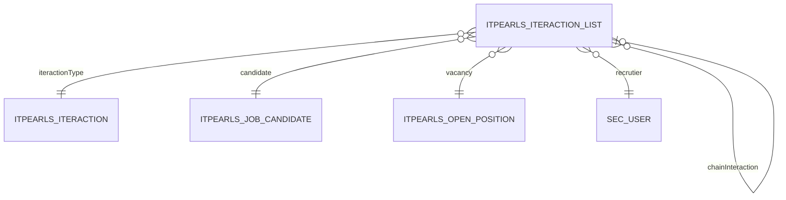

# IteractionList — взаимодействие с кандидатом

> Транзакционная запись о конкретном взаимодействии рекрутёра с кандидатом по вакансии.
> Триггер оптимизации: «давай оптимизировать работу сущности IteractionList».

---

## Business & Context Intro

### Назначение и Бизнес-смысл (What & Why)

`IteractionList` — транзакционная запись взаимодействия рекрутёра с кандидатом по конкретной вакансии: дата, тип, рейтинг, комментарий, рекрутёр. Ядро воронки HRM HuntTech между `JobCandidate` и `OpenPosition`.

### Связи в интерфейсе и Навигация (UI Context & Navigation)

Экраны: `itpearls_IteractionList.browse`, `itpearls_IteractionList.edit`, `itpearls_IteractionListSimple.browse`, `itpearls_IteractionListBrowse`; вкладки в JobCandidateEdit. UI Spec: [browse](../ui/itpearls_IteractionList.browse_Spec.md), [edit](../ui/itpearls_IteractionList.edit_Spec.md).

### Краткий обзор бизнес-логики поведения (Behavior Summary)

Связка candidate + vacancy + recrutier; рейтинг агрегируется в JobCandidateBrowse; batch-создание при закрытии вакансии; nested `vacancy` обязателен в browse-view кандидата.

---

## 1. Обзор

| Параметр | Значение |
|----------|----------|
| **Java-класс** | `com.company.itpearls.entity.IteractionList` |
| **Имя в CUBA** | `itpearls_IteractionList` |
| **Таблица БД** | `ITPEARLS_ITERACTION_LIST` |
| **Тип данных** | транзакционная |
| **Ожидаемый объём** | десятки тысяч — сотни тысяч записей |
| **Критичность** | высокая — центральная сущность рекрутингового процесса |
| **Ответственный модуль** | `global` (entity, views), `web` (экраны), `core` (сервисы) |

### Назначение

`IteractionList` фиксирует **факт взаимодействия** с кандидатом: тип (`Iteraction`), вакансию, рекрутёра, дату, рейтинг, комментарий и дополнительные поля (дата/строка/число в зависимости от типа). Используется в browse-экранах, карточке кандидата, календаре интервью, виджетах отчётности и email-рассылках.

### Отображаемое имя

- **NamePattern:** `%s|candidate`
- **Lookup:** кандидат (`candidate`)

---

## 2. Архитектура и связи

### 2.1 Диаграмма связей

### 2.2 Исходящие связи (FK)

| Поле Java | Колонка БД | Связанная сущность | Fetch | Обязательность |
|-----------|------------|-------------------|-------|----------------|
| `iteractionType` | `ITERACTION_TYPE_ID` | `Iteraction` | LAZY | нет |
| `candidate` | `CANDIDATE_ID` | `JobCandidate` | LAZY | да |
| `vacancy` | `VACANCY_ID` | `OpenPosition` | LAZY | нет |
| `recrutier` | `RECRUTIER_ID` | `ExtUser` | LAZY | да |
| `chainInteraction` | `CHAIN_INTERACTION_ID` | `IteractionList` (self) | LAZY | нет |

### 2.3 Входящие связи

| Сущность | Поле | Назначение |
|----------|------|------------|
| `IteractionList` | `chainInteraction` | цепочка взаимодействий по паре кандидат+вакансия |
| `JobCandidate` | `iteractionList` | коллекция взаимодействий кандидата |

### 2.4 Сервисы

| Сервис | Метод | Описание |
|--------|-------|----------|
| `InteractionServiceBean` | `getCountInteraction` | max(`numberIteraction`) для нумерации |
| `InteractionServiceBean` | `getLastIteraction` | последнее взаимодействие кандидата (JPQL + `maxResults(1)`) |
| `InteractionServiceBean` | `getMostPolularIteraction` | топ типов `Iteraction` за месяц по рекрутёру |
| `EmailGenerationService` | `preparingMessage` | подстановка в шаблон письма |

---

## 3. Поля сущности

### 3.1 Ключевые бизнес-поля

| Поле Java | Колонка БД | Тип | Описание |
|-----------|------------|-----|----------|
| `numberIteraction` | `NUMBER_ITERACTION` | decimal | сквозной номер записи |
| `dateIteraction` | `DATE_ITERACTION` | timestamp | дата взаимодействия |
| `rating` | `RATING` | integer | оценка 0–4 (звёзды в UI) |
| `communicationMethod` | `COMMUNICATION_METHOD` | varchar(80) | способ связи |
| `recrutierName` | `RECRUTIER_NAME` | varchar(80) | имя рекрутёра (денормализация) |
| `addType` / `addDate` / `addString` / `addInteger` | `ADD_*` | mixed | доп. поля по настройке типа |
| `currentPriority` | `CURRENT_PRIORITY` | integer | приоритет вакансии на момент создания |
| `currentOpenClose` | `CURRENT_OPEN_CLOSE` | boolean | статус вакансии на момент создания |

### 3.2 LOB

| Поле | Колонка | Тип | Где используется | Стратегия загрузки |
|------|---------|-----|------------------|-------------------|
| `comment` | `COMMENT_` | text (@Lob) | Edit (textArea), SimpleBrowse (иконка/tooltip) | **lazy reload** в Edit через `ViewBuilder`; в главном Browse **исключён** |

---

## 4. Представления (views.xml)

| View | Extends | Назначение | Где используется |
|------|---------|------------|------------------|
| `iteractionList-browse-view` | `_minimal` | главный Browse, **без LOB** | `iteraction-list-browse.xml` |
| `iteractionList-edit-view` | `_minimal` | Edit-форма **без comment** | `iteraction-list-edit.xml` |
| `iteractionList-simple-browse-view` | `_minimal` | диалог по кандидату (малый объём) | `iteraction-list-simple-browse.xml` |
| `iteractionList-picker-view` | `_minimal` | lookup / сервисы | `InteractionServiceBean.getLastIteraction` |
| `iteraction-list-type-view` | `_minimal` | FK `iteractionType` (без LOB email) | Edit, `iteractionList-view`, `iteractionList-job-candidate` |
| `openPosition-iteraction-list-picker-view` | `_minimal` | FK `vacancy` в Edit | `iteraction-list-edit.xml` (loader вакансий) |
| `iteractionList-view` | `_local` | legacy, виджеты, календарь | ~25 потребителей (см. backlog) |
| `iteractionList-job-candidate` | `_local` | карточка кандидата | `JobCandidateBrowse` |

### FK cross-form

- `iteractionType` → `iteraction-list-type-view` (или `_minimal` + `iterationName`, `pic`, `outstaffingSign` в browse)
- `vacancy` в browse → `_minimal` + поля для `OpenPositionRowStyleHelper`
- `vacancy` в edit → `openPosition-iteraction-list-picker-view`

---

## 5. Экраны

Каталог: `modules/web/src/com/company/itpearls/web/screens/iteractionlist/`

| Экран | Controller ID | Дескриптор | View |
|-------|---------------|------------|------|
| Browse | `itpearls_IteractionList.browse` | `iteraction-list-browse.xml` | `iteractionList-browse-view` |
| Edit | `itpearls_IteractionList.edit` | `iteraction-list-edit.xml` | `iteractionList-edit-view` |
| Simple Browse | `itpearls_IteractionListSimple.browse` | `iteraction-list-simple-browse.xml` | `iteractionList-simple-browse-view` |

### 5.1 IteractionListBrowse

- **JPQL:** `order by e.numberIteraction desc` + фильтры (мои записи, internalProject, outstaffing)
- **readOnly:** да
- **cacheable loader:** **нет** (транзакционные данные)
- **N+1:** batch-загрузка счётчиков `RecrutiesTasks` в `PostLoadEvent` → `OpenPositionRowStyleHelper`
- **Фильтр excludeProperties:** `comment`, system fields, служебные поля

### 5.2 IteractionListEdit

- **Lazy LOB:** `comment` загружается в `AfterShow` через `dataManager.reload` + `ViewBuilder`
- **Lazy LOB типа:** `textEmailToSend` у `Iteraction` — reload при отправке письма кандидату
- **Loaders (cacheable):** `iteractionTypesLc`, `openPositionsDl`, `usersDl` — справочники
- **FK views:** `iteraction-list-type-view`, `openPosition-iteraction-list-picker-view`

### 5.3 Cross-form потребители (legacy `iteractionList-view`)

Календарь интервью, виджеты отчётов, `JobCandidateBrowse`, `InternalEmailerBrowse`, `OpenPositionBrowse` и др. — см. раздел backlog.

---

## 6. База данных

### 6.1 Индексы (PostgreSQL)

| Индекс | Колонки | Назначение |
|--------|---------|------------|
| `IDX_ITPEARLS_ITERACTION_LIST_ON_ITERACTION_TYPE` | `ITERACTION_TYPE_ID` | FK, фильтр outstaffing |
| `IDX_ITPEARLS_ITERACTION_LIST_ON_CANDIDATE` | `CANDIDATE_ID` | фильтр по кандидату |
| `IDX_ITPEARLS_ITERACTION_LIST_ON_VACANCY` | `VACANCY_ID` | фильтр по вакансии |
| `IDX_ITPEARLS_ITERACTION_LIST_NUMBER_ITERACTION` | `NUMBER_ITERACTION` | ORDER BY desc |
| `IDX_ITPEARLS_ITERACTION_LIST_DATE_ITERACTION` | `DATE_ITERACTION` | виджеты по дате |

**Миграция не требуется** — индекс на `ITERACTION_TYPE_ID` уже есть в `20.create-db.sql`.

### 6.2 TOAST / LOB

| Колонка | Влияние | Рекомендация |
|---------|---------|--------------|
| `COMMENT_` | TOAST при SELECT | исключить из `iteractionList-browse-view` |

---

## 7. Производительность

### 7.1 Текущее состояние (после оптимизации 2026-06-22)

| Область | Статус | Комментарий |
|---------|--------|-------------|
| Специализированные views | ✅ | browse / edit / simple-browse / picker |
| LOB lazy load | ✅ | comment в Edit, textEmailToSend при отправке |
| cacheable loaders | ✅ | справочники; убран cacheable с browse |
| readOnly browse | ✅ | главный Browse |
| N+1 в providers | ✅ | batch RecrutiesTasks в Browse |
| Entity cache (EclipseLink) | ⚠️ | не настроен |
| Legacy `iteractionList-view` | ⚠️ | ~25 потребителей с `_local` FK |

### 7.2 Выполненные оптимизации

- [x] `iteractionList-browse-view` — `_minimal`, без `comment`, узкие FK
- [x] `iteractionList-edit-view` — без LOB, узкие FK
- [x] `iteractionList-simple-browse-view` — для диалога по кандидату
- [x] `iteractionList-picker-view` — для lookup/сервисов
- [x] `iteraction-list-type-view` — FK Iteraction без `textEmailToSend`
- [x] `openPosition-iteraction-list-picker-view` — loader вакансий в Edit
- [x] Lazy load `comment` в Edit
- [x] `cacheable="true"` на справочных loaders Edit
- [x] Убран `cacheable` с transactional browse loaders
- [x] Узкий `excludeProperties` (+ `comment`)
- [x] `InteractionServiceBean.getLastIteraction` — JPQL вместо итерации в Java
- [x] `OpenPositionRowStyleHelper` + batch в `IteractionListBrowse`

### 7.3 Backlog

| Проблема | Приоритет | Решение |
|----------|-----------|---------|
| `iteractionList-view` с `vacancy _local` в виджетах/календаре | средний | ввести `iteractionList-widget-view` с узкими FK |
| FTS на `IteractionList` в `fts.xml` | низкий | оценить необходимость, убрать если не используется |
| `comment` в simple-browse (малый объём) | низкий | batch-флаг «есть комментарий» без LOB |
| JPQL `e.iteractionType.outstaffingSign` в browse | низкий | предзагрузка UUID типов с флагом |
| LOB `comment` → отдельная 1:1 сущность | низкий | архитектурное решение |

### 7.4 Потребители

Основные: `IteractionListBrowse`, `IteractionListEdit`, `IteractionListSimpleBrowse`, `JobCandidateBrowse`, `InterviewCalendar`, виджеты (`MonthlyInterviewCountWidget`, `FunnelHuntingWidget`, …), `InteractionServiceBean`, `InternalEmailerBrowse`.

---

## 8. Развёртывание

| Параметр | Файл | Значение |
|----------|------|----------|
| DBMS | `app.properties` | postgres |
| FTS | `fts.xml` | `IteractionList` включён |
| Entity cache | `app.properties` | не настроен для сущности |

---

## 9. История изменений

| Дата | Изменение |
|------|-----------|
| 2026-06-26 | Business & Context Intro (Living Documentation standard) |
| 2026-06-22 | Исправление unfetched FK на Edit: `openPosition-iteraction-list-picker-view` — `cityPosition`/`cities` → `city-picker-view` для сравнения локаций в `IteractionListEdit` |
| 2026-06-23 | Исправление unfetched `recrutier` в JobCandidate: `iteractionList-picker-view` + `iteractionList-job-candidate` → `extUser-picker-view`; FK в `job-candidate-edit.xml` |
| 2026-06-23 | Исправление `iteractionList-browse-view`: поля @NamePattern для FK-колонок (`iteractionType.number`, `vacancy.vacansyID`, `recrutier.login/firstName/lastName`) |
| 2026-06-23 | Оптимизация: specialized views, lazy LOB `comment`, batch N+1 RecrutiesTasks, `InteractionServiceBean.getLastIteraction`, документация |

---

## 10. Связанные документы

- [Индекс документации](../README.md)
- [Iteraction — тип взаимодействия](Iteraction.md)
- [Оптимизация сущностей](../../.cursor/rules/entity-performance-optimization.mdc)
