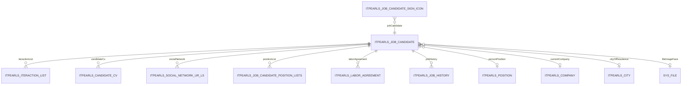

# JobCandidate — подсистема кандидатов

> Центральная транзакционная сущность рекрутинговой системы HRM HuntTech: карточка кандидата, список, взаимодействия, резюме, соцсети, значки.
> Документ описывает **полную подсистему** (entity + views + экраны) для воссоздания без чтения исходного кода.

| Параметр | Значение |
|----------|----------|
| **Java-класс** | `com.company.itpearls.entity.JobCandidate` |
| **Имя в CUBA** | `itpearls_JobCandidate` |
| **Таблица БД** | `ITPEARLS_JOB_CANDIDATE` |
| **Тип данных** | транзакционная |
| **Критичность** | высокая — ядро рекрутингового процесса |
| **Модули** | `global` (entity, views), `web` (экраны), `core` (миграции, сервисы) |

### Отображаемое имя

- **NamePattern:** `%s %s %s %s|secondName,firstName,middleName,personPosition`
- **Меню:** `menu-config.itpearls_JobCandidate.browse` → «Кандидаты» (`web-menu.xml`, экран `itpearls_JobCandidate.browse`)

### Связанная документация

- [IteractionList.md](IteractionList.md) — записи взаимодействий
- [Position.md](Position.md), [Company.md](Company.md), [City.md](City.md) — справочники FK
- [LOCAL_DATABASE.md](../LOCAL_DATABASE.md) — развёртывание БД

---

## 1. Архитектура Сущности (Data Model Layer)

### 1.1 Таблица `ITPEARLS_JOB_CANDIDATE`

Наследует поля `StandardEntity` CUBA: `ID`, `VERSION`, `CREATE_TS`, `CREATED_BY`, `UPDATE_TS`, `UPDATED_BY`, `DELETE_TS`, `DELETED_BY` (soft delete).

| Поле Java | Колонка БД | Тип Java / SQL | Ограничения | Описание |
|-----------|------------|----------------|-------------|----------|
| `firstName` | `FIRST_NAME` | String / varchar(80) | `@NotNull`, индекс | Имя |
| `middleName` | `MIDDLE_NAME` | String / varchar(80) | индекс | Отчество |
| `secondName` | `SECOND_NAME` | String / varchar(80) | `@NotNull`, индекс | Фамилия |
| `fullName` | `FULL_NAME` | String / varchar(160) | индекс | Вычисляемое ФИО (`secondName + firstName`) при сохранении |
| `birdhDate` | `BIRDH_DATE` | Date / date | — | Дата рождения (опечатка в имени поля сохранена в коде) |
| `blockCandidate` | `BLOCK_CANDIDATE` | Boolean | — | Запрет взаимодействий с кандидатом |
| `personPosition` | `PERSON_POSITION_ID` | FK → `Position` | LAZY, lookup | Основная должность |
| `currentCompany` | `CURRENT_COMPANY_ID` | FK → `Company` | LAZY, lookup | Текущее место работы |
| `cityOfResidence` | `CITY_OF_RESIDENCE_ID` | FK → `City` | LAZY, lookup | Город проживания |
| `email` | `EMAIL` | String / varchar(50) | `@Email` | Email |
| `phone` | `PHONE` | String / varchar(18) | — | Телефон |
| `mobilePhone` | `MOBILE_PHONE` | String / varchar(18) | — | Мобильный |
| `skypeName` | `SKYPE_NAME` | String / varchar(30) | — | Skype |
| `telegramName` | `TELEGRAM_NAME` | String / varchar(30) | — | Telegram |
| `telegramGroup` | `TELEGRAM_GROUP` | String / varchar(50) | — | Группа Telegram |
| `wiberName` | `WIBER_NAME` | String / varchar(30) | — | Viber (опечатка в имени) |
| `whatsupName` | `WHATSUP_NAME` | String / varchar(30) | — | WhatsApp |
| `specialisation` | `SPECIALISATION_ID` | FK → `Specialisation` | LAZY | Специализация |
| `skillTree` | `SKILL_TREE_ID` | FK → `SkillTree` | LAZY | Дерево навыков |
| `fileImageFace` | `FILE_IMAGE_FACE` | FK → `SYS_FILE` (`FileDescriptor`) | LAZY | Фото лица |
| `status` | `STATUS` | Integer | — | Статус кандидата (используется в фильтрах browse; семантика значений — **требует ручной верификации в данных**) |
| `workStatus` | `WORK_STATUS` | Integer | — | Статус работника (**требует верификации enum/значений**) |
| `priorityContact` | `PRIORITY_CONTACT` | Integer | NOT NULL (миграция 210629) | Приоритетный способ связи (см. карту в Edit) |

### 1.2 Индексы (объявлены в `@Table` entity)

| Имя индекса | Колонки |
|-------------|---------|
| `IDX_ITPEARLS_JOB_CANDIDATE_FULL_NAME` | `FULL_NAME` |
| `IDX_ITPEARLS_JOB_CANDIDATE_FIRST_NAME` | `FIRST_NAME` |
| `IDX_ITPEARLS_JOB_CANDIDATE_SECOND_NAME` | `SECOND_NAME` |
| `IDX_ITPEARLS_JOB_CANDIDATE_CITY_OF_RESIDENCE` | `CITY_OF_RESIDENCE_ID` |
| `IDX_ITPEARLS_JOB_CANDIDATE_PERSON_POSITION` | `PERSON_POSITION_ID` |
| `IDX_ITPEARLS_JOB_CANDIDATE_CURRENT_COMPANY` | `CURRENT_COMPANY_ID` |
| `IDX_ITPEARLS_JOB_CANDIDATE_FILE_IMAGE_FACE` | `FILE_IMAGE_FACE` |

### 1.3 Композиции и ассоциации



| Коллекция Java | Сущность-элемент | mappedBy | OnDelete (родитель) | OnDeleteInverse | Composition |
|----------------|------------------|----------|---------------------|-----------------|-------------|
| `iteractionList` | `IteractionList` | `candidate` | CASCADE | — | да |
| `candidateCv` | `CandidateCV` | `candidate` | CASCADE | — | да |
| `socialNetwork` | `SocialNetworkURLs` | `jobCandidate` | CASCADE | — | да |
| `positionList` | `JobCandidatePositionLists` | `jobCandidate` | CASCADE | UNLINK | да |
| `laborAgreement` | `LaborAgreement` | `jobCandidate` | CASCADE | — | да |
| `jobHistory` | `JobHistory` | `candidate` | CASCADE | — | да |

**Промежуточная сущность `JobCandidatePositionLists`** (`ITPEARLS_JOB_CANDIDATE_POSITION_LISTS`):

| Поле | FK | Описание |
|------|-----|----------|
| `positionList` | `POSITION_LIST_ID` → `Position` | Дополнительная должность (OneToOne, CASCADE) |
| `jobCandidate` | `JOB_CANDIDATE_ID` → `JobCandidate` | Владелец |

**`SocialNetworkURLs`** (`ITPEARLS_SOCIAL_NETWORK_UR_LS`):

| Поле | Тип | Описание |
|------|-----|----------|
| `networkName` | varchar(80) | Имя сети (legacy) |
| `networkURLS` | varchar(80) | URL профиля |
| `socialNetworkURL` | FK → `SocialNetworkType` | Тип из справочника (логотип, комментарий) |
| `jobCandidate` | FK → `JobCandidate` | Владелец |

**`CandidateCV`** — см. `CandidateCV.java`; LOB-поля `TEXT_CV`, `LETTER`, `COMMENT_LETTER` не должны попадать в browse-view.

**`JobCandidateSignIcon`** — связь кандидата со значком `SignIcons` для пользователя (`USER_ID`).

### 1.4 Аннотации entity

- `@PublishEntityChangedEvents` — публикация событий изменения
- Все `@ManyToOne` — `FetchType.LAZY`
- Валидация: `@NotNull` на `firstName`, `secondName`; `@Email` на `email`

---

## 2. Слой Данных Интерфейса (Fetch Plans / Views Layer)

### 2.1 Глобальные views в `modules/global/src/com/company/itpearls/views.xml`

| View | extends | Назначение |
|------|---------|------------|
| `JobCandidate-person-position` | `_local` | Подбор должности; `cityOfResidence` → `city-picker-view` |
| `jobCandidate-view` | `_local` + `systemProperties` | **Полный** view (legacy): все коллекции `_local`, глубокие vacancy/project |
| `jobCandidate-view-search` | `_minimal` | Поиск кандидатов |
| `jobCandidate-view-iteraction-list` | `_minimal` | Список взаимодействий |
| `socialNetworkURLs-view` | `_local` | Соцсети с `socialNetworkURL` |
| `iteractionList-job-candidate` | `_local` | Взаимодействие в контексте кандидата (использовался в browse до оптимизации) |
| `jobCandidateSignIcon-view` | `_minimal` | Значки кандидата |

Структура `jobCandidate-view` (фрагмент):

```xml
<view entity="itpearls_JobCandidate" name="jobCandidate-view" extends="_local" systemProperties="true">
    <property name="laborAgreement" view="_local"/>
    <property name="socialNetwork" view="_local"/>
    <property name="candidateCv" view="_local">...</property>
    <property name="iteractionList" view="_local">
        <property name="vacancy" view="_local">...</property>
        ...
    </property>
    ...
</view>
```

### 2.2 Inline view: `jobCandidatesDc` (Browse)

**Файл:** `job-candidate-browse.xml`  
**Режим данных:** `readOnly="true"`  
**Базовый JPQL:** `select e from itpearls_JobCandidate e order by e.secondName, e.firstName`  
**Пагинация:** `jobCandidatesDl.setMaxResults(50)` в `onBeforeShow` (коммит `53e9720e`).

| Свойство | fetch | View / вложенность | Назначение в UI |
|----------|-------|-------------------|-----------------|
| *(локальные поля)* | default | `_local` + `systemProperties` | ФИО, контакты, status, blockCandidate |
| `personPosition` | LAZY | `_minimal` | Колонка должности |
| `currentCompany` | LAZY | `_minimal` | Колонка компании |
| `cityOfResidence` | LAZY | `_minimal` | Колонка города |
| `fileImageFace` | LAZY | `_minimal` | Аватар 20px |
| `candidateCv` | LAZY | `_minimal` | Иконка резюме (размер коллекции) |
| `iteractionList` | **BATCH** | inline: `rating`, `dateIteraction`, `comment`, `recrutier` `_minimal`; `vacancy` → `_minimal` (`vacansyName`, `openClose`) | Рейтинг, lastIteraction; FK vacancy для handoff в Edit |
| `socialNetwork` | **BATCH** | `networkURLS`, `socialNetworkURL` → `logo` `_minimal` | Иконки соцсетей в колонке status |
| `positionList` | LAZY | `_minimal` → `positionList` `_minimal` + `positionRuName` | Tooltip должностей |

**Оптимизация (коммит `53e9720e`, 2026-06-26):**

- Замена `extends="jobCandidate-view"` на узкий inline `_local` + точечные свойства
- `fetch="BATCH"` для `iteractionList` и `socialNetwork` — устранение N+1 при отрисовке строк
- Убрана глубокая загрузка vacancy/project в browse
- Аватары: `FileDescriptorResource` вместо Base64 + `fileStorageService.loadFile` в `descriptionProvider`

### 2.3 Inline view: `jobCandidateDc` (Edit)

**Файл:** `job-candidate-edit.xml`  
**Loader:** `softDeletion="true"`, `dynamicAttributes="false"`

| Свойство | fetch | View | Назначение |
|----------|-------|------|------------|
| `candidateCv` | **BATCH** | `_local` + вложенные vacancy/project/files | Вкладка «Резюме» |
| `iteractionList` | **BATCH** | `_local`; vacancy → `openPosition-iteraction-list-picker-view`; type → `iteraction-list-type-view`; recrutier → `extUser-picker-view` | Вкладка взаимодействий |
| `socialNetwork` | **BATCH** | `_local` + logo | Вкладка контактов |
| `positionList` | **BATCH** | `_local` → `positionList` `_local` | Доп. должности |
| `laborAgreement` | LAZY | `_local` | (закомментировано в UI) |
| `cityOfResidence`, `currentCompany`, `personPosition`, `fileImageFace` | LAZY | `_local` | Карточка и вкладка «Кандидат» |

**Локальные оптимизации Edit (незакоммиченные изменения):**

- `fetch="BATCH"` на всех коллекциях `jobCandidateDc`
- `openPositionDc` переведён на `openPosition-picker-view` (вместо тяжёлого inline `_local`)
- **Отложенная загрузка справочников:** `preventAutoLoadUntilReady` + флаги `referenceLoadersInitialized`, `openPositionLoaderInitialized`
- Справочники `currentCompaniesLc`, `citiesDl`, `personPositionsLc` грузятся при первом открытии вкладки `tabCandidate`
- `openPositionDl` грузится при первом открытии вкладки `commentsTab`

### 2.4 Вспомогательные data containers (Edit)

| ID | Тип | View | cacheable | Назначение |
|----|-----|------|-----------|------------|
| `openPositionDc` | Collection `OpenPosition` | `openPosition-picker-view` | да | Комментарии, picker вакансий |
| `suggestOpenPositionDc` | Collection `OpenPosition` | `_local` | да | Предложенные вакансии (фильтр по `positionType`) |
| `personPositionsDc` | Collection `Position` | `position-view` | да | Lookup должности |
| `currentCompaniesDc` | Collection `Company` | `company-picker-view` | да | Lookup компании |
| `citiesDc` | Collection `City` | `city-picker-view` | да | Lookup города |
| `interactionCommentDc` | Collection `IteractionList` | `_minimal` + comment fields; `vacancy` → `_minimal` (`vacansyName`) | Вкладка комментариев |
| `lastProjectDc` | KeyValueCollection | — | нет | Агрегат max(date) по vacancy |

### 2.5 Рекомендации по fetch-стратегии

| Контекст | Стратегия | Обоснование |
|----------|-----------|-------------|
| Browse, коллекции на каждую строку | `BATCH` | Одна пачка SQL на страницу вместо N+1 |
| Справочники в Edit | LAZY + отложенный `load()` | Не грузить Company/City/Position при открытии карточки |
| LOB (`CandidateCV.textCV`) | Не включать в browse/edit DC view | Только на вкладке резюме при необходимости |
| SignIcons в status column | Отдельный `DataManager.load` с `cacheable(true)` | **Потенциальный N+1** — известный backlog |
| Фото | `FileDescriptorResource` / `_minimal` на `fileImageFace` | Без загрузки байтов в tooltip |

---

## 3. Списочный экран (JobCandidateBrowse)

### 3.1 Регистрация

| Параметр | Значение |
|----------|----------|
| Контроллер | `itpearls_JobCandidate.browse` |
| Класс | `JobCandidateBrowse` extends `StandardLookup<JobCandidate>` |
| XML | `modules/web/.../jobcandidate/job-candidate-browse.xml` |
| Messages | `com.company.itpearls.web.screens.jobcandidate` |
| Меню | `web-menu.xml` → `itpearls_JobCandidate.browse` |

### 3.2 Структура UI

```
window (focus: jobCandidatesTable)
├── filter → jobCandidatesDl (excludeProperties: version, createTs, ..., fileImageFace, priorityContact)
├── dataGrid jobCandidatesTable
│   ├── columns: status | fileImageFace | fullName | rating | personPosition | currentCompany |
│   │            cityOfResidence | resume | lastIteraction | actionsWithCandidate
│   ├── actions: create, edit, remove, excel
│   └── buttonsPanel: create, edit, remove, subscribe, quickLoadCV (popup), actionsWithCandidate, signFilter
└── bottom filters (HBox): checkBoxShowOnlyMy | showOnlyWithMyParticipation | checkBoxOnWork | withCVCheckBox
```

### 3.3 Условия JPQL loader (`jobCandidatesDl`)

| Параметр | Условие | Когда активно |
|----------|---------|---------------|
| `userName` | `e.createdBy like :userName` | Чекбокс «Только мои» / группа «Стажер» |
| `param1` | `not e.status = :param1` | `checkBoxOnWork` = true (`param1` = null) |
| `param3` | `not e.status = :param3` | `checkBoxOnWork` = true (`param3` = 10) |
| `rating` | subquery `IteractionList` с `rating >= :rating` | **требует верификации** — параметр в XML, UI скрыт |
| `recrutier` | кандидаты с участием рекрутёра | `showOnlyWithMyParticipation` |
| `candidateCV` | кандидаты с CV | `withCVCheckBox` |
| `signIcon` | `JobCandidateSignIcon` | Фильтр по значку |

### 3.4 Колонки и генераторы

#### `status` (componentRenderer)

HBox с набором Label/Image:

- Чёрный список, статус сотрудника, **SignIcon** (`JobCandidateSignIcon` + `injectColorCss`)
- Контакты (есть/нет), телефон, email, telegram, skype
- CV (есть/нет), комментарии
- Иконки соцсетей (`getSNLabels` → `FileDescriptorResource`)

#### `fileImageFace` (columnGenerator)

```java
@Install(to = "jobCandidatesTable.fileImageFace", subject = "columnGenerator")
private Component jobCandidatesTableFileImageFaceColumnGenerator(...) {
    // Image 20px, circle-20px
    // fileImageFace != null → FileDescriptorResource
    // иначе → ThemeResource "icons/no-programmer.jpeg"
    // click → JobCandidateImageFace dialog
}
```

`descriptionProvider`: имя файла (`fd.getName()`), не Base64 HTML.

#### `rating` (htmlRenderer)

- `avgRating`: среднее `iteractionList.rating` → HTML звёзды (`starsAndOtherService.setStars`)
- `styleProvider`: CSS-класс `rating_red_1` … `rating_blue_5` по первой цифре

#### `lastIteraction` (htmlRenderer)

- Данные: `interactionService.getLastIteraction(candidate)`
- Дата `dd-MM-yyyy`, цветовая индикация (`button_table_red/yellow/green/white`)
- Учитывает `blockCandidate` и «свободен ли» кандидат (календарная логика +1 месяц)
- `descriptionProvider`: HTML с деталями последнего взаимодействия

#### `resume` (iconRenderer)

- Зелёный/красный стиль по наличию `CandidateCV` (отдельный JPQL `QUERY_RESUME`)

#### `personPosition` (descriptionProvider)

Список `positionList[].positionList.positionRuName` через запятую.

#### `actionsWithCandidate` (componentRenderer)

`PopupButton` с действиями: кадровый резерв, email, копирование взаимодействия и др. (`initActionButton`).

### 3.5 Details row (`detailsGenerator`)

При раскрытии строки создаётся `JobCanidateDetailScreenFragment` + панель кнопок (редактировать, новое взаимодействие, резюме, FindSuitable и т.д.).

### 3.6 SignIcons

| Компонент | Поведение |
|-----------|-----------|
| `signIconsDc` / `signIconsDl` | Значки текущего пользователя (`e.user = :user`), `cacheable="true"` |
| `signFilterButton` | Popup: фильтр по каждому значку + сброс + `SignIconsBrowse` |
| Колонка `status` | `getSignIconLabel` — load `JobCandidateSignIcon` по кандидату |
| Popup «Действия» | `setSignIcons` — create/update `JobCandidateSignIcon` |

### 3.7 События и действия

| Элемент | Handler |
|---------|---------|
| `onBeforeShow` | maxResults=50, стажёр → только свои, `initSignIcons`, `initSignFilterPopupButton` |
| `checkBoxShowOnlyMy` | параметр `userName` = `%login%` |
| `checkBoxOnWork` | status filter param1/param3 |
| `onButtonSubscribeClick` | редактор `SubscribeCandidateAction` |
| `quickLoadCV` | PDF / clipboard загрузка CV |
| `ratingFieldNotLower` | динамический JPQL (скрыт, `visible="false"`) |

### 3.8 Группы пользователей (не StandartRoles)

- Группа **«Стажер»** (`userSession.getUser().getGroup().getName()`) — принудительно «только мои», чекбокс disabled.

---

## 4. Экран редактирования (JobCandidateEdit)

### 4.1 Регистрация

| Параметр | Значение |
|----------|----------|
| Контроллер | `itpearls_JobCandidate.edit` |
| Класс | `JobCandidateEdit` extends `StandardEditor<JobCandidate>` |
| XML | `job-candidate-edit.xml` |
| Dialog | 1200×750 |

### 4.2 TabSheet `tabSheetSocialNetworks`

| Tab ID | caption (msg) | icon | Содержимое |
|--------|---------------|------|------------|
| `jobCandidateCard` | `msgJobCard` | ID_CARD | Карточка: контакты, фото, upload, HR-Master, проекты, suggest vacancies |
| `tabCandidate` | `candidate` | BOMB | ФИО (suggestion), компания, должность, город, дата рождения |
| `tabContactInfo` | `msgTabContactInfo` | USER | Контакты, priorityContact, таблица соцсетей |
| `tabIteraction` | `candidateIteration` | LIST | DataGrid `IteractionList`, фильтр вакансии |
| `tabResume` | `msgResume` | FILE_TEXT | DataGrid `CandidateCV` |
| `commentsTab` | `msgComments` | COMMENT | Лента комментариев + отправка |

**Ленивая инициализация вкладок** (`onInit` → `SelectedTabChangeListener`):

- `initTabResume`, `initTabInteractions`, `initTabCandidate`, `initTabContactInfo`, `initTabComments`
- Колонки-генераторы на тяжёлых вкладках создаются только при первом выборе вкладки

### 4.3 Верхняя панель `msgOptions`

- Скрытые: `fullNameTextField`, `blockCandidateCheckBox`
- Рейтинг, должность, город, CV, quality % — labels, заполняются в `onAfterShow`

### 4.4 Reference loaders

| Loader ID | Container | JPQL / условие | Когда грузится |
|-----------|-----------|----------------|----------------|
| `personPositionsLc` | `personPositionsDc` | Position, без «(не использовать)» | Вкладка `tabCandidate` |
| `currentCompaniesLc` | `currentCompaniesDc` | все Company | Вкладка `tabCandidate` |
| `citiesDl` | `citiesDc` | все City | Вкладка `tabCandidate` |
| `openPositionDl` | `openPositionDc` | открытые вакансии | Вкладка `commentsTab` |
| `suggestOpenPositionDl` | `suggestOpenPositionDc` | по `positionType` кандидата | `onAfterShow` |
| `interactionCommentDl` | `interactionCommentDc` | комментарии кандидата | `onAfterShow` |
| `lastProjectDl` | `lastProjectDc` | max(date) group by vacancy | `onAfterShow` |

Паттерн отложенной загрузки:

```java
private <E extends Entity> void preventAutoLoadUntilReady(CollectionLoader<E> loader,
                                                           BooleanSupplier ready) {
    loader.addPreLoadListener(e -> {
        if (!ready.getAsBoolean()) e.preventLoad();
    });
}
```

### 4.5 Валидация и commit

| Этап | Логика |
|------|--------|
| XML required | `firstName`, `secondName`, `currentCompany`, `personPosition`, `cityOfResidence`, контакты на вкладке ContactInfo |
| `onBeforeCommitChanges1` | Проверка дубликата (`checkDublicateCandidate`) → диалог подтверждения |
| `onBeforeCommitChanges` | `replaceE_yo`, `setFullNameCandidate`, нормализация telegram, `addIteractionOfNewCandidate` (тип «Новый контакт», rating=4) |
| `checkNotUsePosition` | Сброс должности с «не использовать» в названии |

**Карта `priorityContact` (radio):**

```java
priorityMap.put("Phone", 1);
priorityMap.put("Mobile Phone", 2);
priorityMap.put("Email", 3);
priorityMap.put("Telegram", 4);
priorityMap.put("Skype", 5);
priorityMap.put("WhatsApp", 6);
priorityMap.put("Social Network", 7);
priorityMap.put("Other", 9);
```

### 4.6 Социальные сети

| Кнопка | Метод | Действие |
|--------|-------|----------|
| `addMissingSocialNetworkListsButton` | `addMissingSocialNetworksListsInvoke` | Добавить типы из справочника |
| `removeEmptySocialNetworkListsButton` | `removeEmptySocialNetworkListsButton` | Удалить пустые URL |
| `addSocialNetworkListsButton` | скрыт/disabled | Legacy |

**columnGenerator `socialNetworkLogoColumn`:** `FileDescriptorResource` для logo, HTML description с именем и comment (null-safe после оптимизации).

**columnGenerator `linkToWeb`:** LinkButton → `webBrowserTools.showWebPage`.

### 4.7 `blockCandidateButton`

- Видим только для ролей `StandartRoles.MANAGER` или `StandartRoles.ADMINISTRATOR`
- Переключает `blockCandidateCheckBox`, caption/icon кнопки, стиль заголовка, `jobCandidateIteractionListTable.setEnabled(false)` при блокировке
- Диалоги: «Запретить/Разрешить взаимодействия с кандидатом?»

### 4.8 `subscribe` (`onButtonSubscribeClick`)

Открывает `SubscribeCandidateAction` editor:

- Для нового кандидата — сначала диалог «Записать изменения?» + `commitChanges`
- `candidate`, `subscriber` = текущий user, `startDate` = now

### 4.9 Column generators (выборка)

| Таблица/Grid | Generator | Назначение |
|--------------|-----------|------------|
| `lastProjectTable` | `lastIteractionCount`, `lastInteractionGeneratorColumn`, `whoIsResearcherGeneratorColumn`, `whoIsRecruterGeneratorColumn`, `addInteractionsViewButton` | История проектов |
| `jobCandidateIteractionListTable` | icon, `projectLogoColumn`, rating html, comment icon, open/close icon | Взаимодействия |
| `jobCandidateCandidateCvTable` | project logo, file icons, original/ITPearls CV columns | Резюме |
| `jobCandidateCommentsDataGrid` | `commentDialog` component | Комментарии в чат-стиле |
| `socialNetworkTable` | logo, linkToWeb | Соцсети |

### 4.10 `addPositionList`

Открывает `SelectPersonPositions` → twin column → создаёт `JobCandidatePositionLists` без дубликатов → `setPositionsLabel()`.

---

## 5. Подчиненные экраны и Фрагменты

### 5.1 JobCanidateDetailScreenFragment

> **Внимание:** в коде сохранена опечатка `Canidate` (не `Candidate`).

| Параметр | Значение |
|----------|----------|
| Контроллер | `itpearls_JobCanidateDetailScreenFragment` |
| XML | `job-canidate-detail-screen-fragment.xml` |
| Data | `jobCandidatesDc` — `provided="true"`, view: `_local` + `iteractionList.recrutier.group` |

**Секции layout:**

- Фото 150px (`candidateFaceImage` / default theme)
- VBox «Кандидат»: fullName, personPosition, currentCompany, city
- VBox «Контакты»: email/phone/skype/telegram link buttons, viber/whatsapp, `socialNetworkFlowBox`
- VBox «Взаимодействия»: company, vacancy, department, project, last interaction, salary expectation
- VBox «Статистика»: recruiter, researcher, counts
- `statisticsHLabelBox` — динамические Label (активность, даты, дни на проекте, CV у заказчика и т.д.)

**Публичные методы:** `setJobCandidate`, `setStatistics`, `setStatisticsLabel`, `setVisibleLogo`, `setVisibleContactsLabels`, `setLastSalaryLabel`, link button setters.

**Доп. запросы DataManager:** `QUERY_ALL_CV`, `QUERY_ALL_ITERACIONS`, `QUERY_LAST_SALARY` (view `iteractionList-view`, `candidateCV-view`).

### 5.2 JobCandidateImageFace

| Параметр | Значение |
|----------|----------|
| Контроллер | `itpearls_JobCandidateImageFace` |
| XML | `job-candidate-image-face.xml` |
| Data | `jobCandidateDc`, view `_minimal`, property `fileImageFace` |
| Открытие | Из browse по клику на аватар; `jobCandidateDc.setItem(jobCandidate)` из вызывающего кода |

Контроллер пустой — только отображение `Image` на весь layout.

### 5.3 SelectPersonPositions

| Параметр | Значение |
|----------|----------|
| Контроллер | `itpearls_SelectPersonPositions` |
| XML | `select-person-positions.xml` |
| UI | `TwinColumn` на `positionsDc.positionList` |
| Options | `positionsOptionDc` — все `Position` (в Java фильтр «не использовать») |

**API:**

- `setJobCandidate(JobCandidate)`
- `setPositionsList(List<Position>)` / `getPositionsList()`
- `onBeforeShow` — загрузка options в twin column
- `closeBtn` — `closeWithDefaultAction()`

**Примечание:** twin column в XML привязан к `property="positionList"` типа `List<JobCandidatePositionLists>`; фактическая работа с `List<Position>` идёт через `setValue`/`getValue` twin column в Java — **требует верификации при рефакторинге**.

---

## 6. Руководство по развертыванию с нуля

### 6.1 Порядок создания зависимостей

1. **Справочники:** `Country` → `Region` → `City`; `Position`; `Company`; `SocialNetworkType`; `Iteraction` (в т.ч. «Новый контакт»); `SignIcons`
2. **Пользователи и роли:** группы CUBA + роли из `StandartRoles`
3. **Сущность `JobCandidate`** + миграции `modules/core/db/update/postgres/`
4. **Дочерние таблицы:** `ITPEARLS_JOB_CANDIDATE_POSITION_LISTS`, `ITPEARLS_SOCIAL_NETWORK_UR_LS`, `ITPEARLS_CANDIDATE_CV`, `ITPEARLS_ITERACTION_LIST`, `ITPEARLS_JOB_CANDIDATE_SIGN_ICON`
5. **Views** в `views.xml` + inline views в XML экранов
6. **Экраны** web-модуля + пункт меню `web-menu.xml`
7. **Messages** `messages.properties` / `messages_ru.properties`
8. **Тема:** стили `circle-20px`, `rating_*`, `button_table_*`, `pic-center-large-*` в `hover-ext.scss`

### 6.2 Критические миграции (примеры)

| Скрипт | Содержание |
|--------|------------|
| `190924-1-createJobCandidate.sql` | Базовая таблица |
| `200331-*` | FK Company, City |
| `200822-*` | FK fileImageFace |
| `210824-*` | `JobCandidatePositionLists` |
| `210629-*` | `PRIORITY_CONTACT` NOT NULL |
| `231031-*` | `JobCandidateSignIcon` |

Полный список: `rg "ITPEARLS_JOB_CANDIDATE" modules/core/db/update/postgres/`

### 6.3 Роли (`StandartRoles.java`)

| Константа | Строка роли CUBA | Использование в JobCandidate |
|-----------|------------------|------------------------------|
| `MANAGER` | `Manager` | `blockCandidateButton` visible |
| `ADMINISTRATOR` | `Administrators` | `blockCandidateButton` visible |
| `RECRUITER` | `Recruiter` | — (другие экраны) |
| `RESEARCHER` | `Researcher` | — |
| `STAGER` | `Стажер` | Browse: только свои кандидаты |
| `OUSTAFF_NAMAGER` | `Outstaff Manager` | legacy Edit |

**Требует верификации:** права entity/screen в Security Roles CUBA Studio (не найдены в коде как XML).

### 6.4 Критические ключи сообщений

| Ключ | RU (messages_ru) | Где используется |
|------|------------------|------------------|
| `browseCaption` | Список кандидата | Browse window |
| `editorCaption` | Кандидат | Edit window |
| `msgBlockCandidate` | Запретить взаимодействия | Кнопка блокировки |
| `msgInteractionProhibited` | ЗАПРЕЩЕНО ВЗАИМОДЕЙСТВИЕ… | UI при block |
| `msgSubscribe` | Подписка | Browse + Edit |
| `msgSignFilter` | Фильтр по признакам | Browse |
| `msgEditSignIconsAction` | Редактирование значков | SignIcons popup |
| `msgDateLastIteraction` | Последнее взаимодействие | Колонка |
| `msgRating` | Рейтинг | Колонка / карточка |
| `msgQuickLoadCV` | Быстрая загрузка CV | Popup |
| `msgNotFindDefaultOpenPosition` | Не найдена вакансия Default | Создание кандидата |
| `msgJobCard` | Карточка кандидата | Вкладка |
| `msgTabContactInfo` | Контактная информация | Вкладка |
| `jobCandidateImageFace.caption` | Фото кандидата | Диалог фото |
| `selectPersonPositions.caption` | Select Person Positions | Диалог должностей (EN в properties) |
| `mainMsg://msgFullName` | *(main messages)* | Колонка ФИО browse |
| `menu-config.itpearls_JobCandidate.browse` | Кандидаты | Меню (`web/messages_ru.properties`) |

Pack: `com.company.itpearls.web.screens.jobcandidate` — 200+ ключей, полные файлы:

- `modules/web/src/com/company/itpearls/web/screens/jobcandidate/messages.properties`
- `modules/web/src/com/company/itpearls/web/screens/jobcandidate/messages_ru.properties`

### 6.5 Сборка и проверка

```bash
./gradlew compileJava deploy -x test
./gradlew start
# Меню → Кандидаты → itpearls_JobCandidate.browse
```

### 6.6 Чеклист воссоздания подсистемы

- [ ] Entity `JobCandidate` + индексы
- [ ] Дочерние entity и FK CASCADE
- [ ] Views в `views.xml` + inline BATCH views
- [ ] `JobCandidateBrowse` + оптимизация пагинации/аватаров
- [ ] `JobCandidateEdit` + отложенные loaders
- [ ] Fragment, ImageFace, SelectPersonPositions
- [ ] `InteractionService.getLastIteraction`
- [ ] Справочник `Iteraction` «Новый контакт»
- [ ] `SignIcons` + `JobCandidateSignIcon`
- [ ] Messages RU/EN
- [ ] Пункт меню и роли Manager/Administrator

---

## История изменений

| Дата | Изменение |
|------|-----------|
| 2026-06-26 | Исправление unfetched `IteractionList.vacancy` при открытии Edit из Browse: минимальный FK `vacancy` в browse `iteractionList` (handoff через persistence context + BATCH); `vacancy` в `interactionCommentDc` для генератора комментариев |
| 2026-06-26 | Создание документа подсистемы JobCandidate |
| 2026-06-26 | Зафиксирована оптимизация Browse (коммит `53e9720e`): узкий view, BATCH, FileDescriptorResource, maxResults=50 |
| 2026-06-26 | Зафиксированы локальные оптимизации Edit: BATCH collections, deferred reference loaders, openPosition-picker-view |

---

## Требует ручной верификации

| # | Тема | Причина |
|---|------|---------|
| 1 | Семантика `status` / `workStatus` (значения 10, null) | Integer без enum в entity |
| 2 | Security roles entity/screen в CUBA Admin | Не найдены в репозитории как экспорт |
| 3 | TwinColumn `SelectPersonPositions` vs тип `positionList` | Несоответствие XML и Java API |
| 4 | N+1 в `getSignIconLabel` на browse | Отдельный load на строку |
| 5 | Опечатка `birdhDate`, `wiberName`, `Canidate` в именах | Legacy — менять только осознанно |
| 6 | XML-ошибка в fragment line 213 (`align="MIDDLE_LEFT"/>`) | Файл `job-canidate-detail-screen-fragment.xml` — проверить парсинг Studio |
