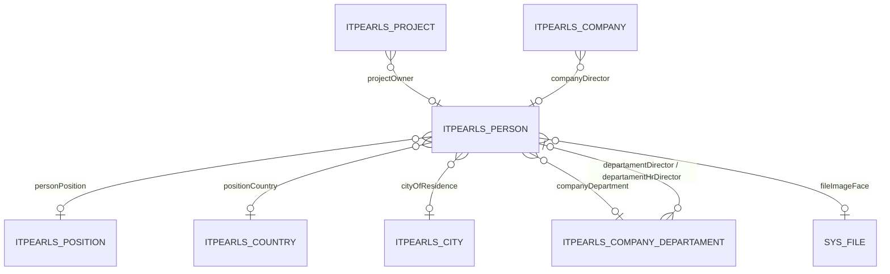

# Person — сотрудник / контактное лицо

> Справочник физических лиц: сотрудники компании, руководители проектов и департаментов, контактные лица.
> Триггер оптимизации: «давай оптимизировать работу сущности Person».

---

## 1. Обзор

| Параметр | Значение |
|----------|----------|
| **Java-класс** | `com.company.itpearls.entity.Person` |
| **Имя в CUBA** | `itpearls_Person` |
| **Таблица БД** | `ITPEARLS_PERSON` |
| **Тип данных** | справочник |
| **Ожидаемый объём** | сотни — несколько тысяч записей |
| **Критичность** | средняя — FK в Project, Company, CompanyDepartament; отдельный browse-экран |
| **Ответственный модуль** | `global` (entity, views), `web` (экраны) |

### Назначение

`Person` хранит **персональные данные** сотрудников и контактных лиц: ФИО, контакты (email, телефоны, мессенджеры), должность, город/страна проживания, фото. Используется как владелец проекта (`Project.projectOwner`), директор компании/департамента, а также в отдельном справочнике «Персоны».

### Отображаемое имя

- **NamePattern:** `%s %s|firstName,secondName`
- **Lookup:** ФИО (firstName + secondName)

---

## 2. Архитектура и связи

### 2.1 Диаграмма связей

### 2.2 Исходящие связи (FK)

| Поле Java | Колонка БД | Связанная сущность | Fetch | Обязательность |
|-----------|------------|-------------------|-------|----------------|
| `positionCountry` | `POSITION_COUNTRY_ID` | `Country` | LAZY | нет |
| `cityOfResidence` | `CITY_OF_RESIDENCE_ID` | `City` | LAZY | нет |
| `personPosition` | `PERSON_POSITION_ID` | `Position` | LAZY | нет |
| `companyDepartment` | `COMPANY_DEPARTMENT_ID` | `CompanyDepartament` | LAZY | нет |
| `fileImageFace` | `FILE_IMAGE_FACE` | `FileDescriptor` | LAZY | нет |

### 2.3 Входящие связи

| Сущность | Поле | Назначение |
|----------|------|------------|
| `Project` | `projectOwner` | владелец проекта |
| `Company` | `companyDirector` | генеральный директор |
| `CompanyDepartament` | `departamentDirector`, `departamentHrDirector` | руководители департамента |
| `MainList` | `contactName` | контактное лицо (legacy) |

### 2.4 Сервисы

Прямых сервисов для `Person` нет. Косвенное использование: `telegrambot.Utils.getOpenPosition()` — inline `View(Person.class)` с `firstName`, `secondName`.

---

## 3. Поля сущности

### 3.1 Ключевые бизнес-поля

| Поле Java | Колонка БД | Тип | Ограничения | Описание |
|-----------|------------|-----|-------------|----------|
| `firstName` | `FIRST_NAME` | varchar(80) | индекс | имя |
| `middleName` | `MIDDLE_NAME` | varchar(80) | индекс | отчество |
| `secondName` | `SECOND_NAME` | varchar(80) | индекс | фамилия |
| `birdhDate` | `BIRDH_DATE` | date | | дата рождения |
| `email` | `EMAIL` | varchar(40) | @Email | email |
| `phone` | `PHONE` | varchar(20) | | телефон |
| `mobPhone` | `MOB_PHONE` | varchar(20) | unique | мобильный |
| `skypeName` | `SKYPE_NAME` | varchar(40) | unique, lower | Skype |
| `telegramName` | `TELEGRAM_NAME` | varchar(40) | unique | Telegram |
| `wiberName` | `WIBER_NAME` | varchar(40) | unique | Viber |
| `watsupName` | `WATSUP_NAME` | varchar(40) | unique, lower | WhatsApp |
| `sendResumeToEmail` | `SEND_RESUME_TO_EMAIL` | boolean | | флаг отправки резюме |

### 3.2 LOB

**LOB-полей нет.** `fileImageFace` — FK на `SYS_FILE` (метаданные файла, не TOAST-колонка в `ITPEARLS_PERSON`).

---

## 4. Представления (views.xml)

| View | Extends | Назначение | Где используется |
|------|---------|------------|------------------|
| `person-browse-view` | `_minimal` | колонки таблицы + фото | `person-browse.xml` |
| `person-edit-view` | `_minimal` | все поля формы Edit | `person-edit.xml` |
| `person-picker-view` | `_minimal` | lookup / выпадающие списки | Project Edit, Company Edit, CompanyDepartament Edit |
| `person-owner-view` | `_minimal` | FK `projectOwner` (ФИО, должность, департамент, город, фото) | `project-view`, OpenPosition, виджеты |
| `person-view` | `_local` | legacy | совместимость |

### FK cross-form

- `projectOwner` → `person-owner-view`
- `companyDirector`, `departamentDirector`, `departamentHrDirector` → `person-picker-view`

---

## 5. Экраны

Каталог: `modules/web/src/com/company/itpearls/web/screens/person/`

| Экран | Controller ID | Дескриптор | View |
|-------|---------------|------------|------|
| Browse | `itpearls_Person.browse` | `person-browse.xml` | `person-browse-view` |
| Edit | `itpearls_Person.edit` | `person-edit.xml` | `person-edit-view` |

### 5.1 PersonBrowse

- **JPQL:** `order by e.secondName, e.firstName`
- **readOnly:** да
- **columnGenerator:** `personPicColumn` — аватар из `fileImageFace` (поле в view, N+1 нет)
- **Фильтр excludeProperties:** system fields + контакты, не отображаемые в таблице

### 5.2 PersonEdit

- **Вкладок нет** — lazy LOB не требуется
- **Loaders (cacheable):** `positionCityLc`, `positionCountriesLc`, `personPositionsLc` — справочники City/Country/Position
- **Удалён** неиспользуемый loader `companyDepartamentsDl` (поле закомментировано в форме)

### 5.3 Cross-form потребители

| Экран / view | Поле Person | View |
|--------------|-------------|------|
| `project-edit.xml` | loader владельцев | `person-picker-view` + cacheable |
| `project-browse.xml` | `projectOwner` | `person-owner-view` |
| `open-position-browse/edit.xml` | `projectOwner` | `person-owner-view` |
| `company-edit.xml` | `companyDirector`, loaders | `person-picker-view` |
| `company-departament-edit.xml` | директора | `person-picker-view` |
| `my-active-candidates-dashboard.xml` | `projectOwner` | `person-owner-view` |

---

## 6. База данных

### 6.1 Индексы (PostgreSQL)

| Индекс | Колонки | Назначение |
|--------|---------|------------|
| `IDX_ITPEARLS_PERSON_FIRST_NAME` | `FIRST_NAME` | фильтр/сортировка |
| `IDX_ITPEARLS_PERSON_MIDDLE_NAME` | `MIDDLE_NAME` | фильтр |
| `IDX_ITPEARLS_PERSON_SECOND_NAME` | `SECOND_NAME` | ORDER BY в browse |
| `IDX_ITPEARLS_PERSON_ON_POSITION_COUNTRY` | `POSITION_COUNTRY_ID` | FK |
| `IDX_ITPEARLS_PERSON_ON_CITY_OF_RESIDENCE` | `CITY_OF_RESIDENCE_ID` | FK |
| `IDX_ITPEARLS_PERSON_ON_PERSON_POSITION` | `PERSON_POSITION_ID` | FK |
| `IDX_ITPEARLS_PERSON_ON_COMPANY_DEPARTMENT` | `COMPANY_DEPARTMENT_ID` | FK |
| `IDX_ITPEARLS_PERSON_ON_FILE_IMAGE_FACE` | `FILE_IMAGE_FACE` | FK |
| UK на `MOB_PHONE`, `SKYPE_NAME`, … | | unique contact |

**Миграция не требуется** — все FK проиндексированы в `20.create-db.sql`.

### 6.2 Входящие FK (дочерние таблицы)

| Таблица | Колонка | Индекс |
|---------|---------|--------|
| `ITPEARLS_PROJECT` | `PROJECT_OWNER_ID` | есть в init |
| `ITPEARLS_COMPANY` | `COMPANY_DIRECTOR_ID` | есть в init |
| `ITPEARLS_COMPANY_DEPARTAMENT` | `DEPARTAMENT_DIRECTOR_ID`, `DEPARTAMENT_HR_DIRECTOR_ID` | есть в init |

---

## 7. Производительность

### 7.1 Текущее состояние (после оптимизации 2026-06-23)

| Область | Статус | Комментарий |
|---------|--------|-------------|
| Специализированные views | ✅ | browse / edit / picker / owner |
| LOB lazy load | — | LOB нет |
| cacheable loaders | ✅ | справочники в Edit и picker-экранах |
| readOnly browse | ✅ | уже был |
| N+1 в providers | ✅ | `fileImageFace` в browse-view |
| Legacy `person-view` | ⚠️ | оставлен для совместимости |
| FTS | ⚠️ | сущность в `fts.xml` — оценить необходимость |

### 7.2 Выполненные оптимизации

- [x] `person-browse-view` — `_minimal`, только колонки таблицы
- [x] `person-edit-view` — все поля формы, узкие FK
- [x] `person-picker-view` — lookup-списки
- [x] `person-owner-view` — cross-form `projectOwner`
- [x] Применены views в browse/edit и основных потребителях
- [x] `cacheable="true"` на справочных loaders (City, Country, Position, Person pickers)
- [x] Узкий `excludeProperties` в фильтре Browse
- [x] Удалён неиспользуемый loader `companyDepartamentsDl` в Edit
- [x] Замена `_local` → specialized views в Project, OpenPosition, Company, CompanyDepartament

### 7.3 Backlog

| Проблема | Приоритет | Решение |
|----------|-----------|---------|
| FTS на `Person` в `fts.xml` | низкий | убрать, если полнотекст не используется |
| `person-view` (_local) в legacy consumers | низкий | постепенная замена на picker/owner |
| `telegrambot.Utils` inline View | низкий | заменить на `person-owner-view` |
| `departmentOfCompany.departamentDirector` в company-edit inline view | низкий | `person-picker-view` |
| Entity cache (EclipseLink) | низкий | оценить для справочника |

### 7.4 Потребители

Основные: `PersonBrowse`, `PersonEdit`, `ProjectEdit/Browse`, `OpenPositionBrowse/Edit`, `CompanyEdit`, `CompanyDepartamentEdit`, виджет `MyActiveCandidatesDashboard`, `OpenPositionBrowse.setProjectOwnerImage`, `ProjectBrowse.setProjectOwnerImage`.

---

## 8. Развёртывание

| Параметр | Файл | Значение |
|----------|------|----------|
| DBMS | `app.properties` | postgres |
| FTS | `fts.xml` | `Person` включён |
| Entity cache | `app.properties` | не настроен |

---

## 9. История изменений

| Дата | Изменение |
|------|-----------|
| 2026-06-22 | Аудит Edit unfetched FK: `PersonEdit` без каскадных обработчиков; `person-edit-view` покрывает поля формы — OK |
| 2026-06-23 | Исправление `person-browse-view`: `position-picker-view`, `fileImageFace.name` для ImageRenderer |
| 2026-06-23 | Оптимизация: person-browse/edit/picker/owner views, cacheable loaders, cross-form в Project/Company/OpenPosition, документация |

---

## 10. Связанные документы

- [Индекс документации](../README.md)
- [Project](Project.md) — планируется
- [Оптимизация сущностей](../../.cursor/rules/entity-performance-optimization.mdc)
