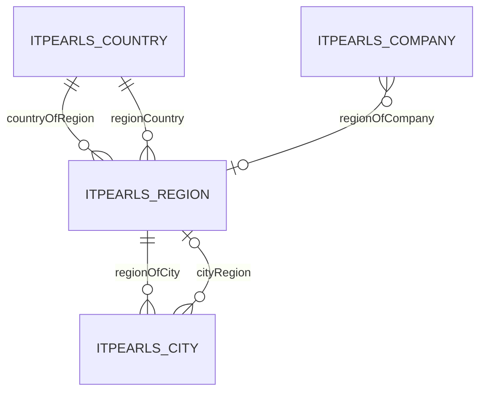

# Region — регион / область / штат

> Справочник регионов: название, код, страна, связанные города.
> Триггер оптимизации: «оптимизируй сущность Region».

---

## 1. Обзор

| Параметр | Значение |
|----------|----------|
| **Java-класс** | `com.company.itpearls.entity.Region` |
| **Имя в CUBA** | `itpearls_Region` |
| **Таблица БД** | `ITPEARLS_REGION` |
| **Тип данных** | справочник |
| **Ожидаемый объём** | ~100–500 записей, часто читается |
| **Критичность** | средняя — FK в City, Company |
| **Ответственный модуль** | `global` (entity, views), `web` (экраны) |

### Назначение

`Region` хранит **справочник регионов** (область, штат) с русским названием, числовым кодом и привязкой к стране (`regionCountry`). Владеет коллекцией городов (`regionOfCity` → `City.cityRegion`). Используется в формах City, Company, Country и фильтрах OpenPosition.

### Отображаемое имя

- **NamePattern:** `%s|regionRuName`
- **Lookup:** `regionRuName`

---

## 2. Архитектура и связи

### 2.1 Диаграмма связей



### 2.2 Исходящие связи

| Поле Java | Тип | Связанная сущность | Fetch |
|-----------|-----|-------------------|-------|
| `regionCountry` | ManyToOne | `Country` | LAZY |
| `regionOfCity` | OneToMany (Composition) | `City` | LAZY |

### 2.3 Входящие связи (FK)

| Сущность | Поле | Колонка БД |
|----------|------|------------|
| `City` | `cityRegion` | `CITY_REGION_ID` |
| `Company` | `regionOfCompany` | `REGION_OF_COMPANY_ID` |

### 2.4 LOB

**LOB-полей нет.** Все поля — varchar/integer.

---

## 3. Поля сущности

| Поле Java | Колонка БД | Тип | Ограничения |
|-----------|------------|-----|-------------|
| `regionRuName` | `REGION_RU_NAME` | varchar(50) | NOT NULL, unique |
| `regionCode` | `REGION_CODE` | integer | unique |
| `regionCountry` | `REGION_COUNTRY_ID` | uuid FK | → `ITPEARLS_COUNTRY` |

---

## 4. Представления (views.xml)

| View | Extends | Назначение | Где используется |
|------|---------|------------|------------------|
| `region-browse-view` | `_minimal` | колонки таблицы, **без** `regionOfCity` | `region-browse.xml` |
| `region-edit-view` | `_minimal` | поля формы + города (узкий view) | `region-edit.xml`, CRUD-тесты |
| `region-picker-view` | `_minimal` | lookup / FK | City Edit, Company Edit |
| `region-country-child-view` | `_minimal` | `regionRuName`, `regionCode` | таблица регионов на Edit Country |
| `region-view` | `_minimal` | legacy (совместимость) | — |
| `city-region-child-view` | `_minimal` | `cityRuName`, `cityPhoneCode` | таблица городов на Edit Region |

### FK cross-form

- `cityRegion` → `region-picker-view` (City Edit, `city-view`)
- `regionOfCompany` → `region-picker-view` (Company Edit)
- `cityRegion` с страной → `region-browse-view` (select-cities-location)
- `regionCountry` → `country-picker-view`

---

## 5. Экраны

Каталог: `modules/web/src/com/company/itpearls/web/screens/region/`

| Экран | Controller ID | Дескриптор | View |
|-------|---------------|------------|------|
| Browse | `itpearls_Region.browse` | `region-browse.xml` | `region-browse-view` |
| Edit | `itpearls_Region.edit` | `region-edit.xml` | `region-edit-view` |

### 5.1 RegionBrowse

- **JPQL:** `order by e.regionRuName`
- **readOnly:** да
- **cacheable loader:** да
- **Колонки:** regionRuName, regionCountry, regionCode
- **Фильтр excludeProperties:** `regionOfCity` + system fields

### 5.2 RegionEdit

- **View:** `region-edit-view`
- **Таблица городов:** `regionOfCity` через `city-region-child-view` (без обратной ссылки на Region)
- **Picker страны:** `country-picker-view` + cacheable loader

### 5.3 Cross-form потребители

| Экран | Поле / loader | View |
|-------|---------------|------|
| `city-edit.xml` | `cityRegionsDc` | `region-picker-view` + cacheable |
| `company-edit.xml` | `regionOfCompaniesDc`, `regionOfCompany` | `region-picker-view` + cacheable |
| `country-edit.xml` | `countryOfRegion` | `region-country-child-view` (через `country-edit-view`) |
| `select-cities-location.xml` | `cityRegion` | `region-browse-view` |
| `city-view` | `cityRegion` | `region-picker-view` |

---

## 6. База данных

### 6.1 Таблица `ITPEARLS_REGION`

Схема: `modules/core/db/init/postgres/10.create-db.sql`

### 6.2 Индексы

| Индекс | Колонки | Назначение |
|--------|---------|------------|
| `IDX_ITPEARLS_REGION_UK_REGION_RU_NAME` | `REGION_RU_NAME` (partial) | уникальность, ORDER BY browse |
| `IDX_ITPEARLS_REGION_UK_REGION_CODE` | `REGION_CODE` (partial) | уникальность |
| `IDX_ITPEARLS_REGION_ON_REGION_COUNTRY` | `REGION_COUNTRY_ID` | FK → Country |

### 6.3 Индексы FK в дочерних таблицах

| Таблица | Колонка | Индекс |
|---------|---------|--------|
| `ITPEARLS_CITY` | `CITY_REGION_ID` | `IDX_ITPEARLS_CITY_ON_CITY_REGION` ✅ |
| `ITPEARLS_COMPANY` | `REGION_OF_COMPANY_ID` | `IDX_ITPEARLS_COMPANY_ON_REGION_OF_COMPANY` ✅ |

**Миграция не требуется** — все FK проиндексированы в `20.create-db.sql`.

---

## 7. Производительность

### 7.1 Baseline (до оптимизации, `335adcc`)

| Экран | View | Полей в view | LOB | Коллекции в view | Проблема |
|-------|------|--------------|-----|------------------|----------|
| RegionBrowse | `region-view` | 4 | нет | нет (но без cacheable) | единый view без разделения browse/edit |
| RegionEdit | `region-view` | 4 | нет | `regionOfCity` без узкого view | города грузятся с дефолтным City view |
| Pickers (City, Company) | `region-view` / `_minimal` | 1–4 | нет | нет | избыточный `regionCountry` в picker Company |
| city-view | `cityRegion` → `_minimal` + вложенность | 6+ | нет | `regionOfCity` в Region | циклическая подгрузка городов региона |

**Точка отсчёта:** `335adccfbacc165d9f7f93e34be8bdd2d3231265`

### 7.2 Таблица сравнения до/после

| Экран | Метрика | До | После | Δ | Комментарий |
|-------|---------|-----|-------|---|-------------|
| RegionBrowse | view | `region-view` | `region-browse-view` | — | специализированный browse view |
| RegionBrowse | cacheable loader | нет | да | + | справочник |
| RegionBrowse | excludeProperties | system only | + `regionOfCity` | — | узкий фильтр |
| RegionBrowse | SQL при открытии (оценка) | 1 | 1 | 0 | без коллекций и LOB — тот же SELECT |
| RegionEdit | view | `region-view` | `region-edit-view` | — | города через `city-region-child-view` |
| RegionEdit | глубина City в таблице | `_local` (default) | 2 поля | − | без `cityRegion` обратно |
| City Edit picker | view | `_minimal` | `region-picker-view` | — | display-поля для lookup |
| City Edit picker | cacheable | нет | да | + | |
| Company Edit picker | view | `region-view` (+ country) | `region-picker-view` | −2 поля FK | без лишнего JOIN Country |
| Company Edit picker | cacheable | нет | да | + | |
| city-view | cityRegion expand | `_minimal` + regionOfCity | `region-picker-view` | −N городов | убрана циклическая вложенность |
| select-cities-location | cityRegion | `region-view` + inline country | `region-browse-view` | — | страна через `country-picker-view` |

*Оценка SQL основана на анализе view: фактический замер EclipseLink FINE / pg_stat — по желанию на локальной БД.*

### 7.3 Текущее состояние (после оптимизации 2026-06-23)

| Область | Статус | Комментарий |
|---------|--------|-------------|
| Специализированные views | ✅ | browse / edit / picker |
| LOB lazy load | — | LOB нет |
| cacheable loaders | ✅ | browse + pickers |
| readOnly browse | ✅ | уже был |
| N+1 в providers | ✅ | providers нет |
| FK indexes | ✅ | City, Company проиндексированы |
| Legacy `region-view` | ⚠️ | оставлен для совместимости |

### 7.4 Выполненные оптимизации

- [x] `region-browse-view` — только колонки таблицы
- [x] `region-edit-view` — scalar + `regionOfCity` → `city-region-child-view`
- [x] `region-picker-view` — lookup-списки
- [x] `city-region-child-view` — узкий view для таблицы городов
- [x] `cacheable="true"` на browse и picker loaders
- [x] Узкий `excludeProperties` (исключён `regionOfCity`)
- [x] Замена `region-view`/`_minimal`/`_local` → specialized views в City, Company, select-cities-location
- [x] Упрощён `city-view.cityRegion` — убрана циклическая вложенность `regionOfCity`
- [x] `RegionServiceTest` — CRUD integration tests

### 7.5 Остаточные узкие места (backlog)

| Проблема | Приоритет | Решение |
|----------|-----------|---------|
| FTS на `Region` в `fts.xml` | низкий | убрать, если полнотекст не используется |
| Legacy `region-view` | низкий | постепенная замена |
| `city-view` / City browse-edit — полная оптимизация City | средний | отдельная задача |
| JPQL path navigation `cityRegion.regionCountry.countryRuName` в SelectCitiesLocation | низкий | UUID-кэш или id in (:ids) |
| `company-view.regionOfCompany` → `_minimal` | низкий | заменить на `region-picker-view` |

---

## 8. Развёртывание

| Параметр | Файл | Значение |
|----------|------|----------|
| DBMS | `app.properties` | postgres |
| FTS | `fts.xml` | `Region` включён |
| Entity cache | `app.properties` | не настроен |

---

## 9. Тесты

| Класс | Путь | Сценарии |
|-------|------|----------|
| `RegionServiceTest` | `modules/core/test/com/company/itpearls/core/` | create, edit/save, browse load, soft delete |

```bash
./gradlew :app-core:test --tests "com.company.itpearls.core.RegionServiceTest"
```

---

## 10. История изменений

| Дата | Изменение |
|------|-----------|
| 2026-06-22 | Аудит Edit unfetched FK: `region-edit-view` покрывает `regionCountry`; каскад в `CompanyEdit` reload через `region-browse-view` |
| 2026-06-23 | Исправление `region-browse-view`: `regionCountry` → `country-browse-view` для колонки и фильтра |
| 2026-06-23 | Оптимизация: region-browse/edit/picker views, cacheable loaders, `RegionServiceTest`, документация |
