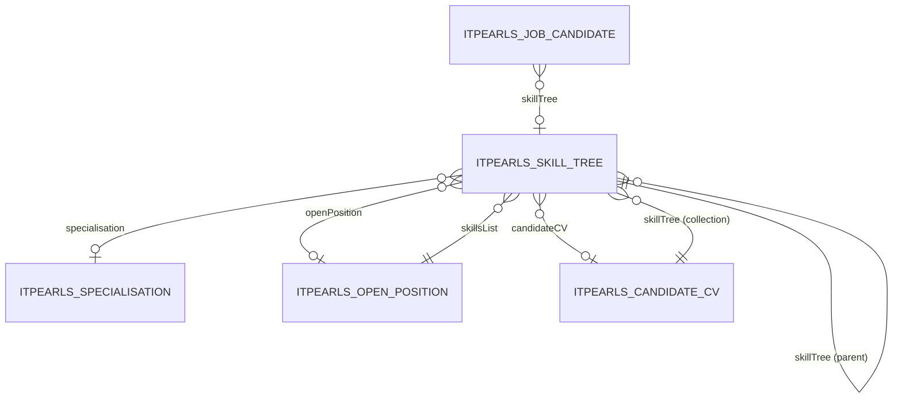

# Дерево компетенций (`SkillTree`)

> Справочник иерархических навыков/компетенций для парсинга резюме, вакансий и фильтрации кандидатов.

---

## Business & Context Intro

### Назначение и Бизнес-смысл (What & Why)

`SkillTree` — иерархический справочник навыков/технологий HRM HuntTech. Элементы привязываются к вакансии (`OpenPosition.skillsList`) и к кандидату (`JobCandidate.skillTree`); используется в фильтре `SkillsFilterJobCandidate` и фрагменте `Skillsbar`.

### Связи в интерфейсе и Навигация (UI Context & Navigation)

`itpearls_SkillTree.browse` (дерево), `itpearls_SkillTree.edit`; вкладка Skills в OpenPositionEdit; фрагменты browse кандидатов/вакансий. UI Spec: [browse](../ui/itpearls_SkillTree.browse_Spec.md), [edit](../ui/itpearls_SkillTree.edit_Spec.md).

### Краткий обзор бизнес-логики поведения (Behavior Summary)

Древовидный browse; standalone loader навыков вакансии; rescан из LOB описания должности при edit OpenPosition.

---

## 1. Обзор

| Параметр | Значение |
|----------|----------|
| **Java-класс** | `com.company.itpearls.entity.SkillTree` |
| **Имя в CUBA** | `itpearls_SkillTree` |
| **Таблица БД** | `ITPEARLS_SKILL_TREE` |
| **Тип данных** | справочник (дерево) |
| **Ожидаемый объём** | сотни–тысячи записей |
| **Критичность** | высокая (парсинг CV/JD, HR-фильтры) |
| **Ответственный модуль** | `global` / `core` / `web` |

### Назначение

`SkillTree` хранит **иерархическое дерево компетенций** (навыки, технологии, предметные области). Используется для автоматического распознавания навыков в тексте резюме и вакансий (`PdfParserService`), отображения на вкладках CV/OpenPosition, сравнения навыков кандидата и JD (`SkillTreeBrowseCheck`), фильтрации кандидатов по навыкам.

### Отображаемое имя

- **NamePattern:** `%s|skillName`
- **Меню (RU):** «Дерево компетенций»

---

## 2. Архитектура и связи

### 2.1 Диаграмма связей

### 2.2 Исходящие связи (FK)

| Поле Java | Колонка БД | Связанная сущность | Fetch | Обязательность |
|-----------|------------|-------------------|-------|----------------|
| `skillTree` | `SKILL_TREE_ID` | `SkillTree` (родитель) | LAZY | нет (корень) |
| `specialisation` | `SPECIALISATION_ID` | `Specialisation` | default | нет |
| `openPosition` | `OPEN_POSITION_ID` | `OpenPosition` | LAZY | нет |
| `candidateCV` | `CANDIDATE_CV_ID` | `CandidateCV` | LAZY | нет |
| `fileImageLogo` | `FILE_IMAGE_LOGO` | `FileDescriptor` | LAZY | нет |

### 2.3 Входящие связи

| Сущность | Поле | Назначение |
|----------|------|------------|
| `SkillTree` | `skillTree` | иерархия (self-FK) |
| `CandidateCV` | `skillTree` | навыки из резюме |
| `OpenPosition` | `skillsList` | навыки из JD |
| `JobCandidate` | `skillTree` | фильтр по навыку |

### 2.4 Сервисы и бизнес-логика

| Сервис | Метод | Описание |
|--------|-------|----------|
| `PdfParserServiceBean` | `parseSkillTree` | поиск навыков в тексте; view `skillTree-parser-view`, cacheable |
| `SkillsFilterJobCandidateBrowse` | `getSkillTreeGroup`, `addSkillPairLabels` | UI-фильтр кандидатов по группам навыков |

---

## 3. Поля сущности

### 3.1 Бизнес-поля

| Поле Java | Колонка БД | Тип | Ограничения | Описание |
|-----------|------------|-----|-------------|----------|
| `skillName` | `SKILL_NAME` | String(80) | unique, not null | название компетенции |
| `skillTree` | `SKILL_TREE_ID` | UUID FK | | родитель в дереве |
| `comment` | `COMMENT` | text (@Lob) | | описание (rich text, TOAST) |
| `wikiPage` | `WIKI_PAGE` | String(250) | | ссылка на Wikipedia |
| `styleHighlighting` | `STYLE_HIGHLIGHTING` | String(128) | max 64 | CSS-класс подсветки |
| `notParsing` | `NOT_PARSING` | Boolean | | исключить из парсинга |
| `prioritySkill` | `PRIORITY_SKILL` | Integer | | приоритет/категория навыка |
| `specialisation` | `SPECIALISATION_ID` | UUID FK | | предметная область |
| `fileImageLogo` | `FILE_IMAGE_LOGO` | UUID FK | | логотип/иконка |

---

## 4. Представления (views.xml)

| View | Назначение | Ключевые поля |
|------|------------|---------------|
| `skillTree-browse-view` | Browse «Дерево компетенций» | skillName, skillTree→picker, specialisation→picker, wikiPage, prioritySkill; **без LOB** |
| `skillTree-edit-view` | Edit форма | все поля формы включая comment (LOB на главном экране) |
| `skillTree-picker-view` | lookup/picker, корни дерева | skillName, prioritySkill |
| `skillTree-parser-view` | `PdfParserService.parseSkillTree` | skillName, notParsing, skillTree (parent) |
| `skillTree-browse-check-view` | сравнение CV vs JD | skillName, comment, skillTree→picker |
| `skillTree-filter-view` | SkillsFilterJobCandidate | поля для копирования в фильтр |
| `skillTree-cv-tab-view` | вкладка навыков CandidateCV | skillName, wikiPage, comment, specialisation, skillTree |
| `skillTree-openPosition-tab-view` | вкладка «Требуемые навыки» OpenPositionEdit | cv-tab + `fileImageLogo` |
| `skillTree-view` | **legacy** | глубокий `_local` + candidates — не использовать в новом коде |
| `specialisation-picker-view` | FK specialisation | specRuName |

### FK expand в Edit

- `skillTree` → `skillTree-picker-view` (без вложенных атрибутов родителя)
- `specialisation` → `specialisation-picker-view`
- **Аудит unfetched FK:** `SkillTreeEdit` не обращается к `getSkillTree().get*()` — picker-view безопасен

---

## 5. Экраны

| Экран | Файл | View | Оптимизации |
|-------|------|------|-------------|
| Browse | `skill-tree-browse.xml` | `skillTree-browse-view` | readOnly, cacheable loader, узкий filter exclude |
| Edit | `skill-tree-edit.xml` | `skillTree-edit-view` | picker loaders cacheable; исправлен dataContainer image/upload → `skillTreeDc` |
| BrowseCheck | `skill-tree-browse-check.xml` | `skillTree-browse-check-view` | tree grid, comment только для description |
| SkillsFilter | `skills-filter-job-candidate-browse.xml` | picker/filter views | cross-form |
| CandidateCV (вкладка) | `candidate-cv-edit.xml` | `skillTree-cv-tab-view` | collection view |
| OpenPosition (вкладка) | `open-position-edit.xml` | `skillTree-openPosition-tab-view` | collection view + lazy load |

---

## 6. База данных

### 6.1 Индексы

| Индекс | Колонка | Статус |
|--------|---------|--------|
| `IDX_ITPEARLS_SKILL_TREE_UK_SKILL_NAME` | `SKILL_NAME` | ✅ unique (soft delete) |
| `IDX_ITPEARLS_SKILL_TREE_ON_SKILL_TREE` | `SKILL_TREE_ID` | ✅ self-FK |
| `IDX_ITPEARLS_SKILL_TREE_ON_SPECIALISATION` | `SPECIALISATION_ID` | ✅ |
| `IDX_ITPEARLS_SKILL_TREE_ON_OPEN_POSITION` | `OPEN_POSITION_ID` | ✅ |
| `IDX_ITPEARLS_SKILL_TREE_ON_CANDIDATE_CV` | `CANDIDATE_CV_ID` | ✅ |
| `IDX_ITPEARLS_SKILL_TREE_ON_FILE_IMAGE_LOGO` | `FILE_IMAGE_LOGO` | ✅ |

**Миграция не требуется.**

### 6.2 TOAST / LOB

Колонка `COMMENT` (text) — TOAST; исключена из `skillTree-browse-view`.

---

## 7. Производительность

### 7.1 Baseline (до оптимизации, `ca6d3bb70c0c919308778b5e8e5201d746e06bae`)

| Экран | View | Полей в view | LOB | Проблема |
|-------|------|--------------|-----|----------|
| SkillTreeBrowse | inline `_local` parent + comment | ~10+ | **да** | LOB в browse, deep parent expand |
| SkillTreeEdit | `skillTree-view` (_local) | 30+ | да | candidates JobCandidate deep tree, openPosition _local |
| SkillTreeBrowseCheck | `skillTree-view` | 30+ | да | избыточная глубина для tree grid |
| PdfParserService | `skillTree-view` | 30+ | да | полный справочник с candidates при каждом парсинге |
| SkillsFilter | `skillTree-view` / `_local` | 30+ / 8+ | да | тяжёлая загрузка групп и элементов |

### 7.2 Таблица сравнения до/после

| Экран | Метрика | До | После | Δ | Комментарий |
|-------|---------|-----|-------|---|-------------|
| SkillTreeBrowse | view | inline deep | `skillTree-browse-view` | — | убран LOB comment |
| SkillTreeBrowse | полей в view | ~10+ | 6 | −4+ | без openPosition, candidates |
| SkillTreeBrowse | LOB в view | да | нет | − | TOAST не тянется |
| SkillTreeBrowse | SQL при открытии (оценка) | 1 + N (parent _local) | 1–2 | −N | picker parent |
| SkillTreeBrowse | cacheable loader | нет | да | + | справочник |
| SkillTreeEdit | view | `skillTree-view` | `skillTree-edit-view` | — | без candidates/openPosition |
| SkillTreeEdit | полей в view | 30+ | 10 | −20+ | только поля формы |
| SkillTreeEdit | unfetched FK риск | средний | низкий | — | picker-view + нет Java getNested |
| SkillTreeBrowseCheck | view | `skillTree-view` | `skillTree-browse-check-view` | — | comment только здесь |
| SkillTreeBrowseCheck | полей в view | 30+ | 4 | −26+ | |
| PdfParserService | view | `skillTree-view` | `skillTree-parser-view` | — | 4 поля + parent |
| SkillsFilter groups | view | `skillTree-view` | `skillTree-picker-view` | — | skillName + priority |
| SkillsFilter items | view | `skillTree-view` | `skillTree-filter-view` | — | поля фильтра без candidates |
| CandidateCV skills tab | collection view | `_minimal` (N+1) | `skillTree-cv-tab-view` | — | колонки ⊆ view |
| OpenPosition skills tab | `skillTree-edit-view` / parser | без `fileImageLogo` | `skillTree-openPosition-tab-view` | — | колонка logo + reload после parse |
| FTS | включён | да | убран | — | справочник, не нужен FTS |

*Оценка SQL — анализ view; фактический замер EclipseLink FINE — опционально.*

### 7.3 Текущее состояние (после оптимизации 2026-06-23)

| Область | Статус | Комментарий |
|---------|--------|-------------|
| Специализированные views | ✅ | browse / edit / picker / parser / check / filter / cv-tab |
| LOB в browse | ✅ | убран |
| LOB в edit | ✅ | в edit-view (richTextArea на главном экране) |
| cacheable loaders | ✅ | browse, edit pickers, parser, groups |
| readOnly browse | ✅ | |
| N+1 в providers | ✅ | Browse — scalar fields; Check — in-memory sets |
| FK indexes | ✅ | все FK проиндексированы |
| Legacy `skillTree-view` | ⚠️ | оставлен для совместимости |
| CompanyEdit cityRegion | ✅ | `city-location-view` в workspace (6e33f668) |

### 7.4 Выполненные оптимизации

- [x] `skillTree-browse-view`, `skillTree-edit-view`, `skillTree-picker-view`
- [x] `skillTree-parser-view`, `skillTree-browse-check-view`, `skillTree-filter-view`, `skillTree-cv-tab-view`
- [x] `specialisation-picker-view`
- [x] cacheable loaders на browse и edit pickers
- [x] Узкий `excludeProperties` в browse filter
- [x] Исправлен bug: image/upload на Edit привязаны к `skillTreeDc` (было `skillTreesDc`)
- [x] PdfParserService → `skillTree-parser-view`
- [x] SkillsFilter → picker/filter views
- [x] CandidateCV skills tab → `skillTree-cv-tab-view`
- [x] OpenPosition skills tab → `skillTree-openPosition-tab-view` (unfetched `fileImageLogo`)
- [x] `openPosition-view.skillsList` → `skillTree-openPosition-tab-view`
- [x] Убран FTS для SkillTree
- [x] `SkillTreeServiceTest` — CRUD integration tests

### 7.5 Остаточный backlog

| Проблема | Приоритет | Решение |
|----------|-----------|---------|
| `openPosition-rtasks-view.skillsList` → `_local` | средний | `skillTree-openPosition-tab-view` |
| `jobCandidate-view.skillTree` → `_local` | средний | `skillTree-picker-view` |
| Legacy `skillTree-view` | низкий | постепенная замена |
| LOB comment в browse-check tree | низкий | batch-load comment по id при hover |
| Entity cache eclipselink (1000) | низкий | уже настроен в app.properties |

---

## 8. Развёртывание

| Параметр | Значение |
|----------|----------|
| Entity cache | `eclipselink.cache.shared.itpearls_SkillTree=true`, size=1000 |
| FTS | убран из `fts.xml` (2026-06-23) |

---

## 9. История изменений

| Дата | Изменение |
|------|-----------|
| 2026-06-26 | Business & Context Intro (Living Documentation standard) |
| 2026-06-23 | `skillTree-openPosition-tab-view`: вкладка «Требуемые навыки» OpenPositionEdit — `fileImageLogo` + reload после parse; `openPosition-view.skillsList` сужен |
| 2026-06-23 | Оптимизация: специализированные views (browse/edit/picker/parser/check/filter/cv-tab), cacheable loaders, cross-form consumers, FTS cleanup, `SkillTreeServiceTest`, исправление image/upload dataContainer на Edit |
| 2026-06-23 | Создание документа |
