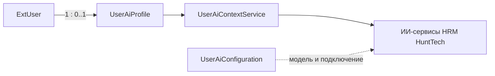

# UserAiProfile — профессиональный профиль пользователя для ИИ

> Сущность HRM HuntTech для управляемой персонализации ответов ИИ-сервисов.  
> Таблица: `HUNTTECH_USER_AI_PROFILE`.  
> Связанные документы: [ExtSettingsWindow](../ui/ExtSettingsWindow_Spec.md), [UserAiContextService](../services/UserAiContextService.md), [техническое задание](../architecture/SettingWindow_AboutMe_UserAiProfile_Technical_Specification.md).

## Business & Context Intro

### Назначение и Бизнес-смысл (What & Why)

`UserAiProfile` хранит профессиональный контекст, который пользователь добровольно сообщает HRM HuntTech: должность, опыт, специализацию, образование, цели и предпочтения ответа. Профиль адаптирует язык, глубину и структуру рекомендаций, но не изменяет факты, права доступа, требования вакансии и данные кандидатов.

### Связи в интерфейсе и Навигация (UI Context & Navigation)

Профиль редактируется в `ExtSettingsWindow` на вкладке «Обо мне». Аватар и имя берутся из существующей сущности `ExtUser`; провайдер, модель и конфигурация подключения остаются в `UserAiConfiguration`. Предпросмотр формируется через `UserAiContextService` без внешнего HTTP-вызова.

### Краткий обзор бизнес-логики поведения (Behavior Summary)

- открытие настроек → профиль найден → данные показываются в форме;
- профиль не найден → создаётся несохранённый экземпляр с безопасными значениями;
- персонализация включена без согласия → сохранение блокируется;
- согласие подтверждено → фиксируются версия и дата согласия;
- профиль выключен → данные сохраняются, но не включаются в ИИ-контекст;
- очистка → удаляются только поля профиля, аватар и учётная запись не меняются.

## 1. Обзор сущности

| Параметр | Значение |
|---|---|
| Entity name | `hunttech_UserAiProfile` |
| Java-класс | `com.company.hunttech.entity.UserAiProfile` |
| Базовый класс | `StandardEntity` |
| Таблица | `HUNTTECH_USER_AI_PROFILE` |
| Владелец | `ExtUser` |
| Кардинальность | один профиль на одного пользователя |
| Критичность | средняя: персонализация не должна блокировать базовые функции HRM HuntTech |

## 2. Связи



`USER_ID` — обязательный FK на `SEC_USER.ID` и уникален. Конфигурация провайдера и почтовые реквизиты в сущности отсутствуют.

## 3. Поля

### Управление и согласие

| Поле | Колонка | Тип | Назначение |
|---|---|---|---|
| `user` | `USER_ID` | `ExtUser` | владелец профиля |
| `profileEnabled` | `PROFILE_ENABLED` | Boolean | разрешает использовать профиль |
| `externalProcessingAllowed` | `EXTERNAL_PROCESSING_ALLOWED` | Boolean | согласие на передачу выбранных данных провайдеру |
| `consentVersion` | `CONSENT_VERSION` | String(32) | версия текста согласия |
| `consentAcceptedAt` | `CONSENT_ACCEPTED_AT` | DateTime | дата принятия согласия |
| `profileConfirmedAt` | `PROFILE_CONFIRMED_AT` | DateTime | дата подтверждения актуальности |

### Профессиональный и рекрутинговый контекст

Поля `aboutMe`, `currentResponsibilities`, `education`, `certifications`, `domainExpertise`, `industries`, `recruitingSpecializations`, `targetRoles`, `hiringGeographies`, `decisionPriorities`, `clientAndProjectContext`, `professionalGoals`, `professionalInterests`, `developmentAreas`, `currentPriorities`, `customAiInstructions`, `communicationConstraints` хранятся как LOB/TEXT.

Короткие поля: `currentPosition`, `candidateLevels`. Опыт хранится в `professionalExperienceYears` и `recruitingExperienceYears`, допустимый диапазон — 0–70.

### Enum

- `AiFunctionalRole`;
- `AiSeniorityLevel`;
- `AiPreferredLanguage`;
- `AiResponseDetailLevel`;
- `AiCommunicationStyle`;
- `AiTerminologyLevel`;
- `AiAnswerStructure`.

Enum размещены в `com.company.hunttech.entity` и реализованы через `EnumClass<Integer>` со стабильными числовыми идентификаторами.

## 4. Представления и загрузка

Экран использует `userAiProfile-view`: он расширяет `_local` и добавляет только связь `user` через узкий `extUser-picker-view`. Сервис формирования контекста использует `_local`, потому что ему нужны только скалярные бизнес-поля профиля. Фильтрация по владельцу выполняется JPQL:

```jpql
select e from hunttech_UserAiProfile e where e.user = :currentUser
```

Запрещено расширять view профиля до `extUser-view`: это может загрузить роли, замещения и другие несвязанные данные пользователя.

## 5. База данных и миграции

- CUBA update script: `modules/core/db/update/postgres/26/260722-1-createUserAiProfile.sql`;
- Liquibase mirror: `modules/core/db/changelog/260722-1-addUserAiProfile.xml`;
- Liquibase master: `modules/core/db/changelog/db.changelog-master.xml`.

Скрипты создают `HUNTTECH_USER_AI_PROFILE`, FK на `SEC_USER`, уникальный индекс `IDX_HUNTTECH_USER_AI_PROFILE_UNQ_USER` и ограничения диапазона опыта. Миграция предназначена только для локальной базы `hunttech`; production в рамках этапа не используется.

## 6. Безопасность

`customAiInstructions` — единственное поле с семантикой пользовательской инструкции; остальные поля являются данными. Профиль не может переопределять системные правила, права доступа, факты HRM HuntTech или кадровые решения.

## 7. Производительность

Ожидается одна небольшая строка на пользователя. Поиск выполняется по уникальному индексу `USER_ID`. Внешние сервисы при открытии вкладки не вызываются.

## 8. История изменений

| Дата | Изменение |
|---|---|
| 2026-07-22 | Сущность, entity name, Java namespace и таблица перенесены в контур `hunttech`; enum ID и бизнес-контракт сохранены |
| 2026-07-22 | Созданы сущность, enum, PostgreSQL/CUBA update-скрипт, Liquibase changelog и безопасный контекстный сервис |
