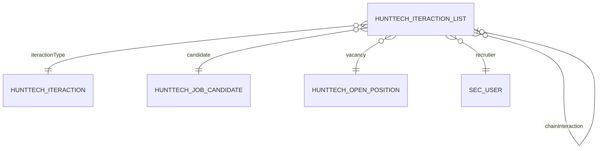

# IteractionList — взаимодействие с кандидатом

> Транзакционная запись о конкретном взаимодействии рекрутёра с кандидатом по вакансии.
> UI: [IteractionListEdit_Spec.md](../../ui/IteractionListEdit_Spec.md)

## Назначение и бизнес-смысл (What & Why)

`IteractionList` — центральная транзакционная запись рекрутинговой воронки HRM HuntTech. Она связывает кандидата, вакансию, рекрутёра и тип взаимодействия, фиксирует дату, рейтинг, комментарий и дополнительное значение. Запись используется для истории кандидата, статусов процессов, подписок, email, календарей и отчётности.

## UI Context & Navigation

Основные экраны: `hunttech_IteractionList.browse`, `hunttech_IteractionList.edit`, `hunttech_IteractionListSimple.browse`, `hunttech_IteractionListBrowse`; взаимодействия также отображаются в `JobCandidateEdit`. Legacy-spec edit: [hunttech_IteractionList.edit_Spec.md](../../screens/iteraction-list/hunttech_IteractionList.edit_Spec.md).

Редизайн `IteractionListEdit` от 2026-07-25 изменяет только XML-reflow и локальный SCSS. Entity, поля, DB schema, views, JPQL и lifecycle не затронуты.

## Behavior Summary

- создание записи → выбираются кандидат, вакансия и тип → контроллер заполняет служебные поля и проверяет процесс;
- сохранение → формируется chainInteraction и snapshot вакансии → запись становится частью истории кандидата;
- тип с дополнительным значением → контроллер показывает date/string/integer → значение дополняет комментарий;
- тип найма или увольнения → BeforeCommit проверяет Employee → обновляется состояние занятости;
- закрытие после commit → выполняются прежние уведомления и email;
- открытие edit → LOB `comment` не входит в initial view → загружается узким reload после показа.

## 1. Обзор

| Параметр | Значение |
|---|---|
| Java-класс | `com.company.hunttech.entity.IteractionList` |
| CUBA name | `hunttech_IteractionList` |
| Таблица | `HUNTTECH_ITERACTION_LIST` |
| Тип | транзакционная |
| Критичность | высокая |
| Модули | global, core, web |
| NamePattern | `%s|candidate` |

## 2. Архитектура и связи

### Исходящие связи

| Поле | Связанная сущность | Fetch | Обязательность |
|---|---|---|---|
| `iteractionType` | `Iteraction` | LAZY | нет |
| `candidate` | `JobCandidate` | LAZY | да |
| `vacancy` | `OpenPosition` | LAZY | нет |
| `recrutier` | `ExtUser` | LAZY | да |
| `chainInteraction` | `IteractionList` | LAZY | нет |

### Сервисы

| Сервис | Метод | Назначение |
|---|---|---|
| `InteractionServiceBean` | `getCountInteraction` | получение max number для нумерации |
| `InteractionServiceBean` | `getLastIteraction` | последнее взаимодействие кандидата |
| `InteractionServiceBean` | `getMostPolularIteraction` | top типов за месяц по рекрутёру |
| `EmailGenerationService` | `preparingMessage` | подготовка письма по шаблону |

## 3. Поля сущности

| Поле | Тип / колонка | Назначение |
|---|---|---|
| `numberIteraction` | decimal / `NUMBER_ITERACTION` | сквозной номер |
| `dateIteraction` | timestamp / `DATE_ITERACTION` | дата взаимодействия |
| `rating` | integer / `RATING` | оценка 0–4 |
| `candidate` | FK / `CANDIDATE_ID` | кандидат |
| `vacancy` | FK / `VACANCY_ID` | вакансия |
| `iteractionType` | FK / `ITERACTION_TYPE_ID` | тип взаимодействия |
| `recrutier` | FK / `RECRUTIER_ID` | рекрутёр |
| `communicationMethod` | varchar / `COMMUNICATION_METHOD` | способ связи |
| `addDate`, `addString`, `addInteger` | mixed / `ADD_*` | динамическое значение |
| `currentPriority` | integer / `CURRENT_PRIORITY` | snapshot приоритета вакансии |
| `currentOpenClose` | boolean / `CURRENT_OPEN_CLOSE` | snapshot open/close |
| `chainInteraction` | self FK | предыдущее взаимодействие |
| `comment` | LOB / `COMMENT_` | комментарий взаимодействия |

`comment` не входит в initial edit view и загружается отдельно; визуальная карточка комментария не меняет эту стратегию.

## 4. Views

| View | Назначение |
|---|---|
| `iteractionList-browse-view` | главный browse без LOB |
| `iteractionList-edit-view` | edit без `comment` |
| `iteractionList-simple-browse-view` | диалог по кандидату |
| `iteractionList-picker-view` | lookup и сервисы |
| `iteraction-list-type-view` | тип взаимодействия без тяжёлого email LOB |
| `openPosition-iteraction-list-picker-view` | vacancy picker edit |
| `iteractionList-view` | legacy consumers |
| `iteractionList-job-candidate` | карточка кандидата |

Редизайн 2026-07-25 не изменяет ни один view и не расширяет fetch graph.

## 5. Экраны

| Экран | Controller | Descriptor | View |
|---|---|---|---|
| Browse | `hunttech_IteractionList.browse` | `iteraction-list-browse.xml` | `iteractionList-browse-view` |
| Edit | `hunttech_IteractionList.edit` | `iteraction-list-edit.xml` | `iteractionList-edit-view` |
| Simple Browse | `hunttech_IteractionListSimple.browse` | `iteraction-list-simple-browse.xml` | `iteractionList-simple-browse-view` |

### IteractionListEdit

- lazy LOB `comment`: reload в `AfterShow`;
- lazy `Iteraction.textEmailToSend`: reload только перед письмом;
- справочные loaders `iteractionTypesLc`, `openPositionsDl`, `usersDl`;
- `openPositionsDl` защищён от ранней загрузки;
- root style: `.iteraction-list-editor`;
- тёмная context sidebar + светлая workspace;
- `candidateImage` и `projectLogoImage` остаются двумя базовыми `Image`;
- dynamic `buttonCallAction`/`addDate`/`addString`/`addInteger` сохраняют runtime contract;
- все семь тем используют одинаковый локальный SCSS;
- Java-контроллер не изменён.

## 6. База данных и индексы

| Индекс | Колонки | Назначение |
|---|---|---|
| `IDX_HUNTTECH_ITERACTION_LIST_ON_ITERACTION_TYPE` | `ITERACTION_TYPE_ID` | FK и фильтры |
| `IDX_HUNTTECH_ITERACTION_LIST_ON_CANDIDATE` | `CANDIDATE_ID` | кандидат |
| `IDX_HUNTTECH_ITERACTION_LIST_ON_VACANCY` | `VACANCY_ID` | вакансия |
| `IDX_HUNTTECH_ITERACTION_LIST_NUMBER_ITERACTION` | `NUMBER_ITERACTION` | сортировка |
| `IDX_HUNTTECH_ITERACTION_LIST_DATE_ITERACTION` | `DATE_ITERACTION` | диапазоны дат |
| `IDX_HUNTTECH_ITERACTION_LIST_CANDIDATE_NUMBER` | candidate, number desc, id | последнее взаимодействие |
| `IDX_HUNTTECH_ITERACTION_LIST_CANDIDATE_VACANCY_DATE` | candidate, vacancy, date desc, id | chain и проверки |
| `IDX_HUNTTECH_ITERACTION_LIST_RECRUTIER_DATE_TYPE` | recruiter, date desc, type | popular/statistics |
| `IDX_HUNTTECH_ITERACTION_LIST_TYPE_DATE_NUMBER` | type, date desc, number desc | фильтры типов |
| `IDX_HUNTTECH_ITERACTION_LIST_ACTIVE_NUMBER` | number desc, id | главный browse |

Liquibase и DB schema в UI-задаче 2026-07-25 не менялись.

## 7. Производительность

| Область | Состояние |
|---|---|
| специализированные views | выполнено |
| LOB lazy load | выполнено |
| cacheable reference loaders | выполнено |
| read-only browse | выполнено |
| N+1 providers | batch-оптимизация выполнена |
| vacancy early load guard | выполнено |
| composite indexes `260704-5` | выполнено |
| entity cache | не настроен |
| legacy `iteractionList-view` | backlog |

XML-reflow и локальный SCSS не добавляют loader, query, service call, background task, fetch property или тяжёлое изображение.

## 8. Ограничения и backlog

- оценить специализированный `iteractionList-widget-view` для legacy consumers;
- оценить необходимость FTS сущности;
- продолжать исключать LOB из массовых списков;
- не менять lazy/comment contract ради presentation;
- visual smoke редизайна должен подтвердить отсутствие горизонтальной прокрутки и пустых dynamic областей.

## 9. Развёртывание

| Параметр | Значение |
|---|---|
| DBMS | PostgreSQL |
| Web context | `/hrm/` |
| FTS | entity включена |
| Production | не изменён UI-задачей |
| Проверка | Hermes по точному HEAD SHA |

## История изменений

| Дата | Изменение |
|---|---|
| 2026-07-25 | Документация синхронизирована со строго визуальным редизайном `IteractionListEdit`; зафиксированы `.iteraction-list-editor`, сохранение entity/views/loaders/JPQL и отсутствие влияния XML/SCSS на data-контракт |
| 2026-07-04 | Performance pack: LOB-free simple browse, guarded vacancy loader, guarded tab loaders и composite indexes `260704-5` |
| 2026-06-26 | Добавлен Business & Context Intro |
| 2026-06-23 | Исправлены специализированные views и unfetched FK |
| 2026-06-22 | Введены specialized views, lazy LOB и batch-оптимизации |

## Связанные документы

- [IteractionListEdit — каноническая UI-spec](../../ui/IteractionListEdit_Spec.md)
- [IteractionList edit — legacy-spec](../../screens/iteraction-list/hunttech_IteractionList.edit_Spec.md)
- [Iteraction — тип взаимодействия](../iteraction/Iteraction.md)
- [Общая UI/UX-концепция](../../architecture/HRM_HuntTech_UI_UX_Design_Concept.md)
