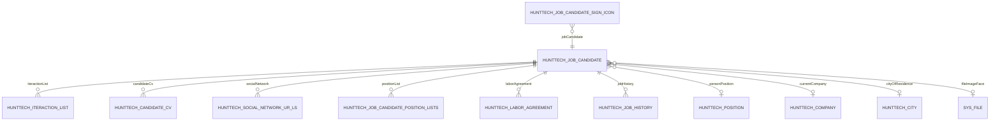

# JobCandidate — подсистема кандидатов

> Центральная транзакционная сущность рекрутинговой системы HRM HuntTech: карточка кандидата, список, взаимодействия, резюме, соцсети, значки.
> Документ описывает **полную подсистему** (entity + views + экраны) для воссоздания без чтения исходного кода.

| Параметр | Значение |
|----------|----------|
| **Java-класс** | `com.company.hunttech.entity.JobCandidate` |
| **Имя в CUBA** | `hunttech_JobCandidate` |
| **Таблица БД** | `HUNTTECH_JOB_CANDIDATE` |
| **Тип данных** | транзакционная |
| **Критичность** | высокая — ядро рекрутингового процесса |
| **Модули** | `global` (entity, views), `web` (экраны), `core` (миграции, сервисы) |

### Отображаемое имя

- **NamePattern:** `%s %s %s %s|secondName,firstName,middleName,personPosition`
- **Меню:** `menu-config.hunttech_JobCandidate.browse` → «Кандидаты» (`web-menu.xml`, экран `hunttech_JobCandidate.browse`)

### Связанная документация

- [IteractionList.md](../iteraction-list/IteractionList.md) — записи взаимодействий
- [Position.md](../position/Position.md), [Company.md](../company/Company.md), [City.md](../city/City.md) — справочники FK
- [LOCAL_DATABASE.md](../../operations/local-development/local-database.md) — развёртывание БД
- UI Spec: [browse](../../screens/job-candidate/hunttech_JobCandidate.browse_Spec.md), [edit](../../screens/job-candidate/hunttech_JobCandidate.edit_Spec.md), [detail fragment](../../screens/review-needed/hunttech_JobCanidateDetailScreenFragment_Spec.md), [image face](../../screens/job-candidate/hunttech_JobCandidateImageFace_Spec.md), [select positions](../../screens/person/hunttech_SelectPersonPositions_Spec.md)

---

## Business & Context Intro

### Назначение и Бизнес-смысл (What & Why)

`JobCandidate` — центральная транзакционная сущность рекрутинговой подсистемы HRM HuntTech: единая карточка человека в базе кандидатов с ФИО, контактами, текущей должностью и работодателем, городом проживания, фото, статусами (`status`, `workStatus`, `blockCandidate`) и приоритетным каналом связи. Вокруг карточки агрегируются композиции: записи взаимодействий (`IteractionList`) с привязкой к вакансиям, версии резюме (`CandidateCV`), профили соцсетей, дополнительные должности (`JobCandidatePositionLists`), трудовые договоры и история работы. Рекрутёр использует сущность для ведения воронки, оценки кандидата (рейтинг по взаимодействиям) и массовых операций (подписка, быстрая загрузка CV, кадровый резерв).

### Связи в интерфейсе и Навигация (UI Context & Navigation)

Главная точка входа — пункт меню «Кандидаты» → `hunttech_JobCandidate.browse`. Из списка открываются: форма редактирования `hunttech_JobCandidate.edit`, раскрытие строки с фрагментом `hunttech_JobCanidateDetailScreenFragment`, диалог фото `hunttech_JobCandidateImageFace`, экраны резюме и взаимодействий, lookup при выборе кандидата в других формах. Сущность ссылается на справочники `Position`, `Company`, `City`, `SkillTree`, `Specialisation`; на неё ссылаются `IteractionList.candidate`, `OpenPosition` (через взаимодействия), `PersonelReserve`, `JobCandidateSignIcon`, отчёты и фильтры навыков.

### Краткий обзор бизнес-логики поведения (Behavior Summary)

**Browse:** при открытии — до 50 кандидатов, фильтры «только мои» (принудительно для стажёров), «в работе», «с CV», персональные значки; раскрытие строки показывает контакты и статистику; popup-действия (резерв, email) только после выбора строки; быстрая загрузка CV создаёт новую карточку.

**Edit:** шесть вкладок с ленивой инициализацией; при сохранении нового — проверка дубликата и автовзаимодействие «Новый контакт»; динамическая обязательность контактов; блокировка кандидата (Manager/Admin) отключает грид взаимодействий для остальных ролей.

---

## 1. Архитектура Сущности (Data Model Layer)

### 1.1 Таблица `HUNTTECH_JOB_CANDIDATE`

Наследует поля `StandardEntity` CUBA: `ID`, `VERSION`, `CREATE_TS`, `CREATED_BY`, `UPDATE_TS`, `UPDATED_BY`, `DELETE_TS`, `DELETED_BY` (soft delete).

| Поле Java | Колонка БД | Тип Java / SQL | Ограничения | Описание |
|-----------|------------|----------------|-------------|----------|
| `firstName` | `FIRST_NAME` | String / varchar(80) | `@NotNull`, индекс | Имя |
| `middleName` | `MIDDLE_NAME` | String / varchar(80) | индекс | Отчество |
| `secondName` | `SECOND_NAME` | String / varchar(80) | `@NotNull`, индекс | Фамилия |
| `fullName` | `FULL_NAME` | String / varchar(160) | индекс | Вычисляемое ФИО (`secondName + firstName`) при сохранении |
| `birdhDate` | `BIRDH_DATE` | Date / date | — | Дата рождения (опечатка в имени поля сохранена в коде) |
| `blockCandidate` | `BLOCK_CANDIDATE` | Boolean | — | Запрет взаимодействий с кандидатом |
| `personPosition` | `PERSON_POSITION_ID` | FK → `Position` | LAZY, lookup | Основная должность |
| `currentCompany` | `CURRENT_COMPANY_ID` | FK → `Company` | LAZY, lookup | Текущее место работы |
| `cityOfResidence` | `CITY_OF_RESIDENCE_ID` | FK → `City` | LAZY, lookup | Город проживания |
| `email` | `EMAIL` | String / varchar(50) | `@Email` | Email |
| `phone` | `PHONE` | String / varchar(18) | — | Телефон |
| `mobilePhone` | `MOBILE_PHONE` | String / varchar(18) | — | Мобильный |
| `skypeName` | `SKYPE_NAME` | String / varchar(30) | — | Skype |
| `telegramName` | `TELEGRAM_NAME` | String / varchar(30) | — | Telegram |
| `telegramGroup` | `TELEGRAM_GROUP` | String / varchar(50) | — | Группа Telegram |
| `wiberName` | `WIBER_NAME` | String / varchar(30) | — | Viber (опечатка в имени) |
| `whatsupName` | `WHATSUP_NAME` | String / varchar(30) | — | WhatsApp |
| `specialisation` | `SPECIALISATION_ID` | FK → `Specialisation` | LAZY | Специализация |
| `skillTree` | `SKILL_TREE_ID` | FK → `SkillTree` | LAZY | Дерево навыков |
| `fileImageFace` | `FILE_IMAGE_FACE` | FK → `SYS_FILE` (`FileDescriptor`) | LAZY | Фото лица |
| `status` | `STATUS` | Integer | — | Статус кандидата (используется в фильтрах browse; семантика значений — **требует ручной верификации в данных**) |
| `workStatus` | `WORK_STATUS` | Integer | — | Статус работника (**требует верификации enum/значений**) |
| `priorityContact` | `PRIORITY_CONTACT` | Integer | NOT NULL (миграция 210629) | Приоритетный способ связи (см. карту в Edit) |

### 1.2 Индексы (объявлены в `@Table` entity)

| Имя индекса | Колонки |
|-------------|---------|
| `IDX_HUNTTECH_JOB_CANDIDATE_FULL_NAME` | `FULL_NAME` |
| `IDX_HUNTTECH_JOB_CANDIDATE_FIRST_NAME` | `FIRST_NAME` |
| `IDX_HUNTTECH_JOB_CANDIDATE_SECOND_NAME` | `SECOND_NAME` |
| `IDX_HUNTTECH_JOB_CANDIDATE_CITY_OF_RESIDENCE` | `CITY_OF_RESIDENCE_ID` |
| `IDX_HUNTTECH_JOB_CANDIDATE_PERSON_POSITION` | `PERSON_POSITION_ID` |
| `IDX_HUNTTECH_JOB_CANDIDATE_CURRENT_COMPANY` | `CURRENT_COMPANY_ID` |
| `IDX_HUNTTECH_JOB_CANDIDATE_FILE_IMAGE_FACE` | `FILE_IMAGE_FACE` |

### 1.2.1 Индексы производительности (миграция `260704-3`)

Индексы ниже добавлены отдельной миграцией, чтобы ускорить реальные сценарии browse/edit без изменения бизнес-логики и структуры данных.

| Имя индекса | Таблица / колонки | Сценарий |
|-------------|-------------------|----------|
| `IDX_HUNTTECH_JOB_CANDIDATE_ACTIVE_NAME` | `HUNTTECH_JOB_CANDIDATE (SECOND_NAME, FIRST_NAME, ID)` для активных строк | Сортировка и пагинация списка кандидатов |
| `IDX_HUNTTECH_JOB_CANDIDATE_ACTIVE_CREATED_NAME` | `HUNTTECH_JOB_CANDIDATE (CREATED_BY, SECOND_NAME, FIRST_NAME, ID)` для активных строк | Фильтр «только мои», включая режим стажёра |
| `IDX_HUNTTECH_CANDIDATE_CV_ACTIVE_CANDIDATE_DATE` | `HUNTTECH_CANDIDATE_CV (CANDIDATE_ID, DATE_POST, ID)` | Фильтр/иконка CV и поиск последнего резюме |
| `IDX_HUNTTECH_ITERACTION_LIST_ACTIVE_CANDIDATE_NUMBER` | `HUNTTECH_ITERACTION_LIST (CANDIDATE_ID, NUMBER_ITERACTION, ID)` | Последнее взаимодействие на странице browse |
| `IDX_HUNTTECH_ITERACTION_LIST_ACTIVE_CANDIDATE_RATING` | `HUNTTECH_ITERACTION_LIST (CANDIDATE_ID, RATING)` | Фильтр по рейтингу кандидата |
| `IDX_HUNTTECH_ITERACTION_LIST_ACTIVE_RECRUTIER_CANDIDATE` | `HUNTTECH_ITERACTION_LIST (RECRUTIER_ID, CANDIDATE_ID)` | Фильтр «с моим участием» |
| `IDX_HUNTTECH_ITERACTION_LIST_ACTIVE_COMMENTS` | `HUNTTECH_ITERACTION_LIST (CANDIDATE_ID, DATE_ITERACTION, ID)` для непустых комментариев | Лента комментариев во вкладке edit |
| `IDX_HUNTTECH_JOB_CANDIDATE_SIGN_ICON_ACTIVE_SIGN_CANDIDATE` | `HUNTTECH_JOB_CANDIDATE_SIGN_ICON (SIGN_ICON_ID, JOB_CANDIDATE_ID)` | Фильтр по пользовательским значкам |
| `IDX_HUNTTECH_EMPLOYEE_ACTIVE_JOB_CANDIDATE_STATUS` | `HUNTTECH_EMPLOYEE (JOB_CANDIDATE_ID, WORK_STATUS_ID)` | Иконка статуса сотрудника в списке |

### 1.3 Композиции и ассоциации



| Коллекция Java | Сущность-элемент | mappedBy | OnDelete (родитель) | OnDeleteInverse | Composition |
|----------------|------------------|----------|---------------------|-----------------|-------------|
| `iteractionList` | `IteractionList` | `candidate` | CASCADE | — | да |
| `candidateCv` | `CandidateCV` | `candidate` | CASCADE | — | да |
| `socialNetwork` | `SocialNetworkURLs` | `jobCandidate` | CASCADE | — | да |
| `positionList` | `JobCandidatePositionLists` | `jobCandidate` | CASCADE | UNLINK | да |
| `laborAgreement` | `LaborAgreement` | `jobCandidate` | CASCADE | — | да |
| `jobHistory` | `JobHistory` | `candidate` | CASCADE | — | да |

**Промежуточная сущность `JobCandidatePositionLists`** (`HUNTTECH_JOB_CANDIDATE_POSITION_LISTS`):

| Поле | FK | Описание |
|------|-----|----------|
| `positionList` | `POSITION_LIST_ID` → `Position` | Дополнительная должность (OneToOne, CASCADE) |
| `jobCandidate` | `JOB_CANDIDATE_ID` → `JobCandidate` | Владелец |

**`SocialNetworkURLs`** (`HUNTTECH_SOCIAL_NETWORK_UR_LS`):

| Поле | Тип | Описание |
|------|-----|----------|
| `networkName` | varchar(80) | Имя сети (legacy) |
| `networkURLS` | varchar(80) | URL профиля |
| `socialNetworkURL` | FK → `SocialNetworkType` | Тип из справочника (логотип, комментарий) |
| `jobCandidate` | FK → `JobCandidate` | Владелец |

**`CandidateCV`** — см. `CandidateCV.java`; LOB-поля `TEXT_CV`, `LETTER`, `COMMENT_LETTER` не должны попадать в browse-view.

**`JobCandidateSignIcon`** — связь кандидата со значком `SignIcons` для пользователя (`USER_ID`). Метки визуализируются в реестре кандидатов (`JobCandidateReestr`, колонка «Кандидат» справа) и в каноническом browse (status column).

### 1.4 Аннотации entity

- `@PublishEntityChangedEvents` — публикация событий изменения
- Все `@ManyToOne` — `FetchType.LAZY`
- Валидация: `@NotNull` на `firstName`, `secondName`; `@Email` на `email`

---

## 2. Слой Данных Интерфейса (Fetch Plans / Views Layer)

### 2.1 Глобальные views в `modules/global/src/com/company/hunttech/views.xml`

| View | extends | Назначение |
|------|---------|------------|
| `JobCandidate-person-position` | `_local` | Подбор должности; `cityOfResidence` → `city-picker-view` |
| `jobCandidate-view` | `_local` + `systemProperties` | **Полный** view (legacy): все коллекции `_local`, глубокие vacancy/project |
| `jobCandidate-view-search` | `_minimal` | Поиск кандидатов |
| `jobCandidate-view-iteraction-list` | `_minimal` | Список взаимодействий |
| `socialNetworkURLs-view` | `_local` | Соцсети с `socialNetworkURL` |
| `iteractionList-job-candidate` | `_local` | Взаимодействие в контексте кандидата (использовался в browse до оптимизации) |
| `jobCandidateSignIcon-view` | `_minimal` | Значки кандидата |

Структура `jobCandidate-view` (фрагмент):

```xml
<view entity="hunttech_JobCandidate" name="jobCandidate-view" extends="_local" systemProperties="true">
    <property name="laborAgreement" view="_local"/>
    <property name="socialNetwork" view="_local"/>
    <property name="candidateCv" view="_local">...</property>
    <property name="iteractionList" view="_local">
        <property name="vacancy" view="_local">...</property>
        ...
    </property>
    ...
</view>
```

### 2.2 Inline view: `jobCandidatesDc` (Browse)

**Файл:** `job-candidate-browse.xml`  
**Режим данных:** `readOnly="true"`  
**Базовый JPQL:** `select e from hunttech_JobCandidate e order by e.secondName, e.firstName`  
**Пагинация:** `jobCandidatesDl.setMaxResults(50)` подготавливается до первого `@LoadDataBeforeShow`, чтобы стартовый запрос сразу шёл с рабочим лимитом.

| Свойство | fetch | View / вложенность | Назначение в UI |
|----------|-------|-------------------|-----------------|
| *(локальные поля)* | default | `_local` + `systemProperties` | ФИО, контакты, status, blockCandidate |
| `personPosition` | LAZY | `_minimal` | Колонка должности |
| `currentCompany` | LAZY | `_minimal` | Колонка компании |
| `cityOfResidence` | LAZY | `_minimal` | Колонка города |
| `fileImageFace` | LAZY | `_minimal` | Аватар 20px |
| `candidateCv` | LAZY | `_minimal` | Иконка резюме (размер коллекции) |
| `iteractionList` | **BATCH** | inline: `rating`, `dateIteraction`, `comment`, `recrutier` `_minimal`; `vacancy` → `_minimal` (`vacansyName`, `openClose`) | Рейтинг, lastIteraction; FK vacancy для handoff в Edit |
| `socialNetwork` | **BATCH** | `networkURLS`, `socialNetworkURL` → `logo` `_minimal` | Иконки соцсетей в колонке status |
| `positionList` | LAZY | `_minimal` → `positionList` `_minimal` + `positionRuName` | Tooltip должностей |

**Оптимизация (коммит `53e9720e`, 2026-06-26):**

- Замена `extends="jobCandidate-view"` на узкий inline `_local` + точечные свойства
- `fetch="BATCH"` для `iteractionList` и `socialNetwork` — устранение N+1 при отрисовке строк
- Убрана глубокая загрузка vacancy/project в browse
- Аватары: `FileDescriptorResource` вместо Base64 + `fileStorageService.loadFile` в `descriptionProvider`

**Оптимизация (2026-07-04, JobCandidate performance pack):**

- Производные данные строки (`lastIteraction`, наличие CV, employee status) грузятся пачками после загрузки страницы, а не отдельными запросами из column/style/description renderers.
- Стартовые параметры фильтров выставляются до первого `@LoadDataBeforeShow`, чтобы открыть экран одним корректным запросом.
- Фильтр по значкам выполняет один reload после смены параметра, без промежуточного сброса loader.
- Обработчики чекбоксов подавляются на время стартовой инициализации, чтобы не запускать лишние загрузки.

### 2.3 Inline view: `jobCandidateDc` (Edit)

**Файл:** `job-candidate-edit.xml`  
**Loader:** `softDeletion="true"`, `dynamicAttributes="false"`

| Свойство | fetch | View | Назначение |
|----------|-------|------|------------|
| `candidateCv` | **BATCH** | `_local` + вложенные vacancy/project/files | Вкладка «Резюме» |
| `iteractionList` | **BATCH** | `_local`; vacancy → `openPosition-iteraction-list-picker-view`; type → `iteraction-list-type-view`; recrutier → `extUser-picker-view` | Вкладка взаимодействий |
| `socialNetwork` | **BATCH** | `_local` + logo | Вкладка контактов |
| `positionList` | **BATCH** | `_local` → `positionList` `_local` | Доп. должности |
| `cityOfResidence`, `currentCompany`, `personPosition`, `fileImageFace` | LAZY | `_local` | Карточка и вкладка «Кандидат» |

> `laborAgreement` исключён из edit-view (2026-06-30): вкладка Outstaffing закомментирована; property-loader вызывал QueryException при открытии из Browse.

**Локальные оптимизации Edit (незакоммиченные изменения):**

- `fetch="BATCH"` на всех коллекциях `jobCandidateDc`
- `openPositionDc` переведён на `openPosition-picker-view` (вместо тяжёлого inline `_local`)
- **Отложенная загрузка справочников:** `preventAutoLoadUntilReady` + флаги `referenceLoadersInitialized`, `openPositionLoaderInitialized`
- Справочники `currentCompaniesLc`, `citiesDl`, `personPositionsLc` грузятся при первом открытии вкладки `tabCandidate` (`cacheable="true"`)
- `openPositionDl` грузится при первом открытии вкладки `commentsTab`
- `tabSheetSocialNetworks` с `lazy="true"` — неактивные вкладки не строятся до выбора
- Подсказки ФИО на `tabCandidate`: `SearchExecutor` с JPQL `LIKE` при вводе (без предзагрузки всех имён через `BackgroundTask`)
- Проверка дублей использует узкий `jobCandidate-view-search`, чтобы не тянуть полный граф кандидата.
- Комментарии и picker вакансий вкладки `commentsTab` грузятся только при первом открытии вкладки.

### 2.4 Вспомогательные data containers (Edit)

| ID | Тип | View | cacheable | Назначение |
|----|-----|------|-----------|------------|
| `openPositionDc` | Collection `OpenPosition` | `openPosition-picker-view` | да | Комментарии, picker вакансий |
| `suggestOpenPositionDc` | Collection `OpenPosition` | `_local` | да | Предложенные вакансии (фильтр по `positionType`) |
| `personPositionsDc` | Collection `Position` | `position-view` | да | Lookup должности |
| `currentCompaniesDc` | Collection `Company` | `company-picker-view` | да | Lookup компании |
| `citiesDc` | Collection `City` | `city-picker-view` | да | Lookup города |
| `interactionCommentDc` | Collection `IteractionList` | `_minimal` + comment fields; `vacancy` → `_minimal` (`vacansyName`) | Вкладка комментариев |
| `lastProjectDc` | KeyValueCollection | — | нет | Агрегат max(date) по vacancy |

### 2.5 Рекомендации по fetch-стратегии

| Контекст | Стратегия | Обоснование |
|----------|-----------|-------------|
| Browse, коллекции на каждую строку | `BATCH` | Одна пачка SQL на страницу вместо N+1 |
| Browse, производные колонки | Batch cache через `loadValues` / targeted loads | `lastIteraction`, CV и employee status не запускают запросы на каждую строку |
| Справочники в Edit | LAZY + отложенный `load()` | Не грузить Company/City/Position при открытии карточки |
| LOB (`CandidateCV.textCV`) | Не включать в browse/edit DC view | Только на вкладке резюме при необходимости |
| SignIcons в status column / колонке «Кандидат» реестра | Отдельный `DataManager.load` с `cacheable(true)` | **Потенциальный N+1** — известный backlog (реестр `JobCandidateReestr` читает `JobCandidateSignIcon` per-row) |
| Фото | `FileDescriptorResource` / `_minimal` на `fileImageFace` | Без загрузки байтов в tooltip |

---

## 3. Списочный экран (JobCandidateBrowse)

### 3.1 Регистрация

| Параметр | Значение |
|----------|----------|
| Контроллер | `hunttech_JobCandidate.browse` |
| Класс | `JobCandidateBrowse` extends `StandardLookup<JobCandidate>` |
| XML | `modules/web/.../jobcandidate/job-candidate-browse.xml` |
| Messages | `com.company.hunttech.web.screens.jobcandidate` |
| Меню | `web-menu.xml` → `hunttech_JobCandidate.browse` |

### 3.2 Структура UI

```
window (focus: jobCandidatesTable)
├── filter → jobCandidatesDl (excludeProperties: version, createTs, ..., fileImageFace, priorityContact)
├── dataGrid jobCandidatesTable
│   ├── columns: status | fileImageFace | fullName | rating | personPosition | currentCompany |
│   │            cityOfResidence | resume | lastIteraction | actionsWithCandidate
│   ├── actions: create, edit, remove, excel
│   └── buttonsPanel: create, edit, remove, subscribe, quickLoadCV (popup), actionsWithCandidate, signFilter
└── bottom filters (HBox): checkBoxShowOnlyMy | showOnlyWithMyParticipation | checkBoxOnWork | withCVCheckBox
```

### 3.3 Условия JPQL loader (`jobCandidatesDl`)

| Параметр | Условие | Когда активно |
|----------|---------|---------------|
| `userName` | `e.createdBy like :userName` | Чекбокс «Только мои» / группа «Стажер» |
| `param1` | `not e.status = :param1` | `checkBoxOnWork` = true (`param1` = null) |
| `param3` | `not e.status = :param3` | `checkBoxOnWork` = true (`param3` = 10) |
| `rating` | subquery `IteractionList` с `rating >= :rating` | **требует верификации** — параметр в XML, UI скрыт |
| `recrutier` | кандидаты с участием рекрутёра | `showOnlyWithMyParticipation` |
| `candidateCV` | кандидаты с CV | `withCVCheckBox` |
| `signIcon` | `JobCandidateSignIcon` | Фильтр по значку |

### 3.4 Колонки и генераторы

#### `status` (componentRenderer)

HBox с набором Label/Image:

- Чёрный список, статус сотрудника, **SignIcon** (`JobCandidateSignIcon` + `injectColorCss`)
- Контакты (есть/нет), телефон, email, telegram, skype
- CV (есть/нет), комментарии
- Иконки соцсетей (`getSNLabels` → `FileDescriptorResource`)

#### `fileImageFace` (columnGenerator)

```java
@Install(to = "jobCandidatesTable.fileImageFace", subject = "columnGenerator")
private Component jobCandidatesTableFileImageFaceColumnGenerator(...) {
    // Image 30px, candidate-face-thumb (круг, object-fit: cover)
    // FileDescriptorImageHelper.setCandidateFace → FileDescriptorResource / no-programmer.jpeg
    // click → JobCandidateImageFace dialog
}
```

`descriptionProvider`: HTML `` через `FileDescriptorImageHelper.buildCandidateFacePreviewHtml` — URL `/app/dispatch/download?f={uuid}` или theme placeholder; `jobCandidatesTable.setDescriptionAsHtml(true)`; без base64.

#### `rating` (htmlRenderer)

- `avgRating`: среднее `iteractionList.rating` → HTML звёзды (`starsAndOtherService.setStars`)
- `styleProvider`: CSS-класс `rating_red_1` … `rating_blue_5` по первой цифре

#### `lastIteraction` (htmlRenderer)

- Данные: batch cache последнего взаимодействия по кандидатам текущей страницы
- Дата `dd-MM-yyyy`, цветовая индикация (`button_table_red/yellow/green/white`)
- Учитывает `blockCandidate` и «свободен ли» кандидат (календарная логика +1 месяц)
- `descriptionProvider`: HTML с деталями последнего взаимодействия

#### `resume` (iconRenderer)

- Зелёный/красный стиль по наличию `CandidateCV`; данные берутся из batch cache текущей страницы

#### `personPosition` (descriptionProvider)

Список `positionList[].positionList.positionRuName` через запятую.

#### `actionsWithCandidate` (componentRenderer)

`PopupButton` с действиями: кадровый резерв, email, копирование взаимодействия и др. (`initActionButton`).

### 3.5 Details row (`detailsGenerator`)

При раскрытии строки создаётся `JobCanidateDetailScreenFragment` + панель кнопок (редактировать, новое взаимодействие, резюме, FindSuitable и т.д.).

### 3.6 SignIcons

| Компонент | Поведение |
|-----------|-----------|
| `signIconsDc` / `signIconsDl` | Значки текущего пользователя (`e.user = :user`), `cacheable="true"` |
| `signFilterButton` | Popup: фильтр по каждому значку + сброс + `SignIconsBrowse` |
| Колонка `status` | `getSignIconLabel` — load `JobCandidateSignIcon` по кандидату |
| Popup «Действия» | `setSignIcons` — create/update `JobCandidateSignIcon` |

### 3.7 Поведение экранов (из Java, простым языком)

#### Browse (`JobCandidateBrowse`)

| Этап | Что происходит |
|------|----------------|
| Открытие | Лимит 50 готовится до первого запроса; стажёр → «только мои» заблокирован; фильтр значков пользователя |
| Выбор строки | Включаются popup «резерв», email; раскрытие details с фрагментом и кнопками действий |
| Колонки | Цвет последнего взаимодействия, CV и employee status берутся из batch cache; звёзды рейтинга; иконки статуса/контактов |
| Сохранение | Нет на browse — commit в дочерних формах |

#### Edit (`JobCandidateEdit`)

| Этап | Что происходит |
|------|----------------|
| Открытие | Рейтинг (через `loadAverageRating` — scalar AVG, без загрузки всех взаимодействий), % заполнения (14 полей); кнопка блокировки — Manager/Admin |
| **После открытия** | `startSkillsBackgroundLoading()` — фоновая загрузка и анализ CV для навыков (см. §4.12) |
| Вкладки | Первый заход на `tabCandidate` → справочники + `SearchExecutor` на ФИО; первый заход на `tabPositions` → `startPositionsBackgroundLoading()` — фоновая загрузка истории и рекомендаций (см. §4.13); остальные вкладки — generators, scan CV |
| Сохранение | Дубликат ФИО+город+должность → диалог; новый → «Новый контакт» rating=4; нормализация telegram |
| Блокировка | Toggle blockCandidate → disable грида взаимодействий (кроме Manager/Admin) |

### 4.12 Фоновая загрузка навыков (Skillsbar)

**Запуск:** `AfterShowEvent` → `startSkillsBackgroundLoading()`.

Операция вынесена из синхронного `onBeforeShow()` в `BackgroundTask`, чтобы SQL-загрузка полного `textCV` и анализ навыков не блокировали открытие формы.

**В `BackgroundTask.run()` (background thread):**
1. `loadLastCvText(UUID candidateId)` — scalar SELECT `textCV` по ID кандидата
2. `Jsoup.parse()` — очистка HTML
3. `pdfParserService.parseSkillTree()` — загрузка всех навыков из БД
4. `parseCVService.countMachesSkill()` — сопоставление текста с каждым навыком
5. Дедупликация, сортировка по приоритету, построение `List<SkillLabelData>`

**В `done()` (UI thread):**
1. `fragments.create(Skillsbar)` — создание фрагмента
2. `skillBoxFragment.renderSkillLabels(result)` — создание Label UI-компонентов
3. `skillBox.add(fragment)` — добавление в layout

**Флаги:** `skillsLoading`/`skillsLoaded` предотвращают повторный запуск.

### 4.13 Фоновая загрузка вкладки «Позиции и вакансии»

**Запуск:** `SelectedTabChangeEvent` → `initTabPositions()` → `startPositionsBackgroundLoading()`.

Ранее `setSuggestOpenPositionTable()`, `setLastProjectTable()` выполнялись синхронно в `onBeforeShow()` и загружали историю рассмотрения (`lastProjectDl`) и рекомендованные вакансии (`suggestOpenPositionDl`) до открытия формы.

**В `BackgroundTask.run()` (background thread):**
1. `loadHistoryKeyValues(UUID)` — key-value запрос: `select vacancyId, max(dateIteraction) group by vacancy.id`
2. Загрузка всех взаимодействий кандидата (`iteractionList-job-candidate` view)
3. Загрузка OpenPosition для истории по списку ID
4. `buildHistoryRowData()` — группировка взаимодействий по вакансии, вычисление lastInteraction/researcher/recruiter за O(N) проход
5. `loadSuggestedVacancies(UUID)` — загрузка primary + additional position IDs; JPQL с фильтром `positionType.id IN :ids`
6. `PositionsTabData` — DTO с историей, агрегированными данными и рекомендациями

**В `done()` (UI thread):**
1. `lastProjectDc.setItems(kvList)` — заполнение key-value контейнера
2. `suggestOpenPositionDc.setItems(suggestions)` — заполнение рекомендаций
3. Управление видимостью таблиц

**Генераторы колонок** (`lastInteractionGeneratorColumn`, `whoIsResearcherGeneratorColumn`, `whoIsRecruterGeneratorColumn`) теперь читают из `Map<UUID, HistoryRowData> historyRowDataByVacancy` (precomputed, O(1) lookup), а не перебирают `jobCandidateIteractionDc` для каждой строки. Это устранило:
- `ensureInteractionsLoaded()` из генератора (ранее догружал все взаимодействия при рендере)
- O(N×M) сложность на каждый генератор (N строк таблицы × M взаимодействий)
- N+1 запросы при отрисовке

**Флаги:** `positionsTabLoading`/`positionsTabLoaded` предотвращают повторный запуск.

**Debug-логирование:** `positions.history.load.ms`, `positions.interactions.load.ms`, `aggregate.ms`, `suggestions.load.ms`, `total.ms` (уровень DEBUG).

### 3.8 События и действия (техническая сводка)

| Элемент | Handler |
|---------|---------|
| `onInit` / `onBeforeShow` | стартовые loader-параметры и maxResults=50 до первой загрузки; `initSignIcons`, `initSignFilterPopupButton` |
| `checkBoxShowOnlyMy` | параметр `userName` = `%login%` |
| `checkBoxOnWork` | status filter param1/param3 |
| `onButtonSubscribeClick` | редактор `SubscribeCandidateAction` |
| `quickLoadCV` | PDF / clipboard загрузка CV |
| `ratingFieldNotLower` | динамический JPQL (скрыт, `visible="false"`) |

### 3.8 Группы пользователей (не StandartRoles)

- Группа **«Стажер»** (`userSession.getUser().getGroup().getName()`) — принудительно «только мои», чекбокс disabled.

---

## 4. Экран редактирования (JobCandidateEdit)

### 4.1 Регистрация

| Параметр | Значение |
|----------|----------|
| Контроллер | `hunttech_JobCandidate.edit` |
| Класс | `JobCandidateEdit` extends `StandardEditor<JobCandidate>` |
| XML | `job-candidate-edit.xml` |
| Dialog | 1200×750 |

### 4.2 TabSheet `tabSheetSocialNetworks` (`lazy="true"`)

| Tab ID | caption | Содержимое |
|--------|---------|------------|
| `tabMain` | Основное | Персональные данные (ФИО, дата рождения, город) + Профессиональные данные (должность, компания, доп. позиции) |
| `tabContactInfo` | Контакты | Основные контакты + Дополнительные контакты + Приоритетный способ связи + таблица соцсетей |
| `tabPositions` | Позиции и вакансии | История рассмотрения (lastProjectTable) + Подходящие вакансии (suggestVacancyTable). Данные грузятся фоновой задачей при первом открытии вкладки |
| `tabIteraction` | Взаимодействия | DataGrid `IteractionList`, фильтр вакансии |
| `tabResume` | Резюме и файлы | DataGrid `CandidateCV` + генераторы project logo/иконок |
| `commentsTab` | Комментарии | Лента комментариев + отправка |
| `tabHistory` | История | createdBy/updatedBy — системная информация |

**Ленивая инициализация вкладок** (`onInit` → `SelectedTabChangeListener`):

- `initTabResume`, `initTabInteractions`, `initTabCandidate`, `initTabContactInfo`, `initTabComments`
- `initTabCandidate()` — ранний выход, если выбрана не вкладка `tabCandidate`
- Колонки-генераторы на тяжёлых вкладках создаются только при первом выборе вкладки

### 4.3 Верхняя панель `msgOptions`

- Скрытые: `fullNameTextField`, `blockCandidateCheckBox`
- Рейтинг, должность, город, CV, quality % — labels, заполняются в `onAfterShow`

### 4.4 Reference loaders

| Loader ID | Container | JPQL / условие | Когда грузится |
|-----------|-----------|----------------|----------------|
| `personPositionsLc` | `personPositionsDc` | Position, без «(не использовать)» | Вкладка `tabCandidate` |
| `currentCompaniesLc` | `currentCompaniesDc` | все Company | Вкладка `tabCandidate` |
| `citiesDl` | `citiesDc` | все City | Вкладка `tabCandidate` |
| `openPositionDl` | `openPositionDc` | открытые вакансии | Вкладка `commentsTab` |
| `suggestOpenPositionDl` | `suggestOpenPositionDc` | по `positionType` кандидата | **Вкладка `tabPositions`** (фоновая задача) |
| `interactionCommentDl` | `interactionCommentDc` | комментарии кандидата | `onAfterShow` |
| `lastProjectDl` | `lastProjectDc` | max(date) group by vacancy | **Вкладка `tabPositions`** (фоновая задача) |

Паттерн отложенной загрузки:

```java
private <E extends Entity> void preventAutoLoadUntilReady(CollectionLoader<E> loader,
                                                           BooleanSupplier ready) {
    loader.addPreLoadListener(e -> {
        if (!ready.getAsBoolean()) e.preventLoad();
    });
}
```

### 4.5 Валидация и commit

| Этап | Логика |
|------|--------|
| XML required | `firstName`, `secondName` (entity `@NotNull`), `currentCompany`, `personPosition`, `cityOfResidence`; вкладка ContactInfo — все contact fields + `priorityContact` |
| Динамическая required | `enableDisableContacts()`: если хотя бы один контакт или URL соцсети заполнен — снять required с полей контактов (`isRequiredAddresField` + проверка `socialNetwork`) |
| `onBeforeCommitChanges1` | `checkDublicateCandidate()` — JPQL по firstName+secondName+city+position (exclude current id); для NEW — confirmation dialog |
| `onBeforeCommitChanges` | `replaceE_yo` (ё→е); `setFullNameCandidate`; `checkTelegramName` (strip `http://t.me/`); `trimTelegramName` (strip `@`); `addIteractionOfNewCandidate` |
| `checkNotUsePosition` | сброс должности с «не использовать» в `positionRuName` |
| `setQualityPercent` | 14 полей → `labelQualityPercent` (после init вкладки контактов) |

**Карта `priorityContact` (radio в Edit, из Java):**

```java
priorityMap.put("Email", 1);
priorityMap.put("Phone", 2);
priorityMap.put("Telegramm", 3);
priorityMap.put("Skype", 4);
priorityMap.put("Viber", 5);
priorityMap.put("WhatsApp", 6);
priorityMap.put("Social Network", 7);
priorityMap.put("Other", 9);
```

**Автосоздание взаимодействия для NEW кандидата (`addIteractionOfNewCandidate`):**

- `Iteraction` с `iterationName` like «Новый контакт» (`iteraction-view`)
- `OpenPosition` Default через `openPositionService.getOpenPositionDefault()`
- `rating=4`, `numberIteraction=max+1`, `recrutier`=current user
- merge в `jobCandidateIteractionDc`

### 4.5.1 Injected сервисы Edit-контроллера

`DataManager`, `InteractionService`, `GetRoleService`, `ParseCVService`, `PdfParserService`, `StarsAndOtherService`, `ResumeRecognitionService`, `OpenPositionService`, `UserSession`/`UserSessionSource`, `Metadata`, `ScreenBuilders`, `Screens`, `Fragments`, `Dialogs`, `Notifications`, `WebBrowserTools`.

### 4.5.2 `@Subscribe` lifecycle (JobCandidateEdit)

| Событие | Назначение |
|---------|------------|
| `InitEvent` | `preventAutoLoadUntilReady`; tab change listener (включая `initTabPositions`) |
| `BeforeShowEvent` | loaders, рейтинг, link buttons, role-based block button; **`setupSkillBox` удалён** — перенесён в `startSkillsBackgroundLoading()` (`AfterShowEvent`) |
| `AfterShowEvent` / `onAfterShow1` | quality percent, block UI; **`startSkillsBackgroundLoading()`** |
| `BeforeCommitChangesEvent` ×2 | duplicate check; normalization + new interaction |
| `BeforeCloseEvent` / `AfterCloseEvent` | CV collection listeners |
| `DataContext.ChangeEvent` | quality percent |
| `jobCandidateDc` ItemChange | fullName |
| `jobCandidateCandidateCvsDc` ItemChange | scan contacts from CV |
| Contact field ValueChange | normalize phone, sync header labels |
| `chatMessageTextField` | send button, Enter confirm |
| Link buttons | external open email/telegram/skype |
| `fileImageFaceUpload` | photo clear/upload |

### 4.6 Социальные сети

| Кнопка | Метод | Действие |
|--------|-------|----------|
| `addMissingSocialNetworkListsButton` | `addMissingSocialNetworksListsInvoke` | `dataManager.load(SocialNetworkType)` — добавить отсутствующие типы |
| `removeEmptySocialNetworkListsButton` | `removeEmptySocialNetworkListsButton` | `dataManager.remove` строк с null/empty URL |
| `addSocialNetworkListsButton` | `addSocialNetworksListsInvoke` | скрыт/disabled; для NEW вызывает `initSocialNeiworkTable` |
| (авто NEW) | `initSocialNeiworkTable` | при первом открытии `tabContactInfo` — все типы из справочника в DC |

**Парсинг из CV:** `scanContactsFromCVs` → `ParseCVService` (email, phone, urls) → InputDialog с опциональной заменой; `getSocialNetworkType` — match URI host или тип `Other`.

**columnGenerator `socialNetworkLogoColumn`:** `FileDescriptorResource` для logo; HTML description (`socialNetwork`, `comment`).

**columnGenerator `linkToWeb`:** LinkButton → `webBrowserTools.showWebPage(networkURLS)`.

### 4.7 `blockCandidateButton`

- Visible: `GetRoleService` → `StandartRoles.MANAGER` или `ADMINISTRATOR`
- Диалоги: «Запретить взаимодейтсвия с кандидатом?» / «Разрешить…» (hardcoded в Java)
- Toggle `blockCandidateCheckBox`; caption «Запретить/Разрешить работу с кандидатом»; icon CLOSE / ENABLE_EDITING
- `jobCandidateIteractionListTable.setEnabled(!blocked)`; заголовок `iteractionListLabelCandidate` → `h2-red`
- **Исключение:** Manager/Admin при `initTabInteractions` — грид остаётся enabled

### 4.8 `subscribe` (`onButtonSubscribeClick`)

- Кнопка `buttonSubscribe` в XML: `visible="false"` (используется из Browse; в Edit — legacy)
- NEW: диалог «Записать изменения?» → `commitChanges` → `SubscribeCandidateAction` editor
- Existing: `screenBuilders.editor(SubscribeCandidateAction)` с `candidate`, `subscriber`=current `ExtUser`, `startDate`=now

### 4.9 Column generators и table handlers (выборка)

| Таблица/Grid | Generator / handler | Ключевые entity paths |
|--------------|---------------------|------------------------|
| `lastProjectTable` | `lastIteractionCount`, `lastInteractionGeneratorColumn`, `whoIsResearcherGeneratorColumn`, `whoIsRecruterGeneratorColumn`, `addInteractionsViewButton` | `vacancy`, `iteractionType.signOurInterview*`, `recrutier` |
| `jobCandidateIteractionListTable` | `addIconColumn`, rating html, comment icon, `@Install` projectLogo, currentOpenClose | `iteractionType.pic`, `vacancy.openClose`, `vacancy.projectName` |
| `jobCandidateCandidateCvTable` | project logo, file icons, letter, Link columns | `toVacancy.projectName`, `linkOriginalCv`, `linkHuntTechCV`, `textCV` |
| `jobCandidateCommentsDataGrid` | `commentDialog` | `comment`, `recrutier.fileImageFace`, `vacancy.vacansyName` |
| `socialNetworkTable` | logo, linkToWeb | `socialNetworkURL.logo` |
| `suggestVacancyTable` | `notSendedIconColumn`, itemDescriptionProvider | `vacansyName`, `iteractionList`+`iteractionType.signSendToClient/signEndCase` |

### 4.10 View integrity Edit (`jobCandidateDc.iteractionList`, BATCH)

| Path в Java | View в `job-candidate-edit.xml` | Статус |
|-------------|----------------------------------|--------|
| `vacancy.vacansyName`, `openClose` | `openPosition-edit-view` | OK |
| `vacancy.projectName.projectLogo` | inline `projectName view="_minimal"` + `projectLogo view="_local"` | OK (2026-08-04) |
| `vacancy.projectName.projectDescription` | inline `projectName view="_minimal"` + `projectDescription` | OK (2026-08-04) — ранее **риск** `openPositionDescription()` |
| `vacancy.projectName.projectDepartment.companyName.workingConditions/companyDescription` | inline `projectDepartment view="companyDepartament-picker-view"` → `companyName view="company-picker-view"` → скаляры | OK (2026-08-04) |
| `iteractionType.pic`, `iterationName` | `iteraction-list-type-view` | OK |
| `iteractionType.signSendToClient`, `signEndCase`, `signOurInterview*` | не в `iteraction-list-type-view` | **риск** — suggest/lastProject generators |
| `rating`, `comment`, `addDate/String/Integer`, `currentOpenClose` | `_local` на `IteractionList` | OK |

Рекомендация: расширить nested views в `views.xml` или inline в edit XML — см. [hunttech_JobCandidate.edit_Spec.md](../../screens/job-candidate/hunttech_JobCandidate.edit_Spec.md) §2 Data View Integrity.

### 4.11 `addPositionList`

Открывает `SelectPersonPositions` → twin column → создаёт `JobCandidatePositionLists` без дубликатов → `dataContext.merge` (без commit для нового кандидата) → `setPositionsLabel()`.

---

## 5. Подчиненные экраны и Фрагменты

### 5.1 JobCanidateDetailScreenFragment

> **Внимание:** в коде сохранена опечатка `Canidate` (не `Candidate`).

| Параметр | Значение |
|----------|----------|
| Контроллер | `hunttech_JobCanidateDetailScreenFragment` |
| XML | `job-canidate-detail-screen-fragment.xml` |
| Data | `jobCandidatesDc` — `provided="true"`, view: `_local` + `iteractionList.recrutier.group` |

**Секции layout:**

- Фото 150px (`candidateFaceImage` / default theme)
- VBox «Кандидат»: fullName, personPosition, currentCompany, city
- VBox «Контакты»: email/phone/skype/telegram link buttons, viber/whatsapp, `socialNetworkFlowBox`
- VBox «Взаимодействия»: company, vacancy, department, project, last interaction, salary expectation
- VBox «Статистика»: recruiter, researcher, counts
- `statisticsHLabelBox` — динамические Label (активность, даты, дни на проекте, CV у заказчика и т.д.)

**Публичные методы:** `setJobCandidate`, `setStatistics`, `setStatisticsLabel`, `setVisibleLogo`, `setVisibleContactsLabels`, `setLastSalaryLabel`, link button setters.

**Доп. запросы DataManager:** `QUERY_ALL_CV`, `QUERY_ALL_ITERACIONS`, `QUERY_LAST_SALARY` (view `iteractionList-view`, `candidateCV-view`).

### 5.2 JobCandidateImageFace

| Параметр | Значение |
|----------|----------|
| Контроллер | `hunttech_JobCandidateImageFace` |
| XML | `job-candidate-image-face.xml` |
| Data | `jobCandidateDc`, view `_minimal`, property `fileImageFace` |
| Открытие | Из browse по клику на аватар; `jobCandidateDc.setItem(jobCandidate)` из вызывающего кода |

Контроллер пустой — только отображение `Image` на весь layout.

### 5.3 SelectPersonPositions

| Параметр | Значение |
|----------|----------|
| Контроллер | `hunttech_SelectPersonPositions` |
| XML | `select-person-positions.xml` |
| UI | `TwinColumn` на `positionsDc.positionList` |
| Options | `positionsOptionDc` — все `Position` (в Java фильтр «не использовать») |

**API:**

- `setJobCandidate(JobCandidate)`
- `setPositionsList(List<Position>)` / `getPositionsList()`
- `onBeforeShow` — загрузка options в twin column
- `closeBtn` — `closeWithDefaultAction()`

**Примечание:** twin column в XML привязан к `property="positionList"` типа `List<JobCandidatePositionLists>`; фактическая работа с `List<Position>` идёт через `setValue`/`getValue` twin column в Java — **требует верификации при рефакторинге**.

---

## 6. Руководство по развертыванию с нуля

### 6.1 Порядок создания зависимостей

1. **Справочники:** `Country` → `Region` → `City`; `Position`; `Company`; `SocialNetworkType`; `Iteraction` (в т.ч. «Новый контакт»); `SignIcons`
2. **Пользователи и роли:** группы CUBA + роли из `StandartRoles`
3. **Сущность `JobCandidate`** + миграции `modules/core/db/update/postgres/`
4. **Дочерние таблицы:** `HUNTTECH_JOB_CANDIDATE_POSITION_LISTS`, `HUNTTECH_SOCIAL_NETWORK_UR_LS`, `HUNTTECH_CANDIDATE_CV`, `HUNTTECH_ITERACTION_LIST`, `HUNTTECH_JOB_CANDIDATE_SIGN_ICON`
5. **Views** в `views.xml` + inline views в XML экранов
6. **Экраны** web-модуля + пункт меню `web-menu.xml`
7. **Messages** `messages.properties` / `messages_ru.properties`
8. **Тема:** стили `circle-20px`, `rating_*`, `button_table_*`, `pic-center-large-*` в `hover-ext.scss`

### 6.2 Критические миграции (примеры)

| Скрипт | Содержание |
|--------|------------|
| `190924-1-createJobCandidate.sql` | Базовая таблица |
| `200331-*` | FK Company, City |
| `200822-*` | FK fileImageFace |
| `210824-*` | `JobCandidatePositionLists` |
| `210629-*` | `PRIORITY_CONTACT` NOT NULL |
| `231031-*` | `JobCandidateSignIcon` |

Полный список: `rg "HUNTTECH_JOB_CANDIDATE" modules/core/db/update/postgres/`

### 6.3 Роли (`StandartRoles.java`)

| Константа | Строка роли CUBA | Использование в JobCandidate |
|-----------|------------------|------------------------------|
| `MANAGER` | `Manager` | `blockCandidateButton` visible |
| `ADMINISTRATOR` | `Administrators` | `blockCandidateButton` visible |
| `RECRUITER` | `Recruiter` | — (другие экраны) |
| `RESEARCHER` | `Researcher` | — |
| `STAGER` | `Стажер` | Browse: только свои кандидаты |
| `OUSTAFF_NAMAGER` | `Outstaff Manager` | legacy Edit |

**Требует верификации:** права entity/screen в Security Roles CUBA Studio (не найдены в коде как XML).

### 6.4 Критические ключи сообщений

| Ключ | RU (messages_ru) | Где используется |
|------|------------------|------------------|
| `browseCaption` | Список кандидата | Browse window |
| `editorCaption` | Кандидат | Edit window |
| `msgBlockCandidate` | Запретить взаимодействия | Кнопка блокировки |
| `msgInteractionProhibited` | ЗАПРЕЩЕНО ВЗАИМОДЕЙСТВИЕ… | UI при block |
| `msgSubscribe` | Подписка | Browse + Edit |
| `msgSignFilter` | Фильтр по признакам | Browse |
| `msgEditSignIconsAction` | Редактирование значков | SignIcons popup |
| `msgDateLastIteraction` | Последнее взаимодействие | Колонка |
| `msgRating` | Рейтинг | Колонка / карточка |
| `msgQuickLoadCV` | Быстрая загрузка CV | Popup |
| `msgNotFindDefaultOpenPosition` | Не найдена вакансия Default | Создание кандидата |
| `msgJobCard` | Карточка кандидата | Вкладка |
| `msgTabContactInfo` | Контактная информация | Вкладка |
| `jobCandidateImageFace.caption` | Фото кандидата | Диалог фото |
| `selectPersonPositions.caption` | Select Person Positions | Диалог должностей (EN в properties) |
| `mainMsg://msgFullName` | *(main messages)* | Колонка ФИО browse |
| `menu-config.hunttech_JobCandidate.browse` | Кандидаты | Меню (`web/messages_ru.properties`) |

Pack: `com.company.hunttech.web.screens.jobcandidate` — 200+ ключей, полные файлы:

- `modules/web/src/com/company/hunttech/web/screens/jobcandidate/messages.properties`
- `modules/web/src/com/company/hunttech/web/screens/jobcandidate/messages_ru.properties`

### 6.5 Сборка и проверка

```bash
./gradlew compileJava deploy -x test
./gradlew start
# Меню → Кандидаты → hunttech_JobCandidate.browse
```

### 6.5.1 Performance Замеры JobCandidate (2026-07-04)

Замеры выполнены focused-тестами browse/edit после установки индексов `260704-3`.

```bash
./gradlew :app-web:test --tests com.company.hunttech.web.screens.jobcandidate.JobCandidateBrowsePerfTest --tests com.company.hunttech.web.screens.jobcandidate.JobCandidateEditPerfTest
```

| Экран | Результат |
|-------|-----------|
| Browse | `openMicros=1409943`, `loadedCandidates=50`, `loadList=8`, `loadValues=1`, `jobCandidateLoadList=1`, `jobCandidateGetCount=0` |
| Edit | `openMicros=1726777`, `loadList=11`, `loadValues=3`, `jobCandidateLoadList=1`, `jobCandidateGetCount=0` |

### 6.6 Чеклист воссоздания подсистемы

- [ ] Entity `JobCandidate` + индексы
- [ ] Дочерние entity и FK CASCADE
- [ ] Views в `views.xml` + inline BATCH views
- [ ] `JobCandidateBrowse` + оптимизация пагинации/аватаров
- [ ] `JobCandidateEdit` + отложенные loaders
- [ ] Fragment, ImageFace, SelectPersonPositions
- [ ] `InteractionService.getLastIteraction`
- [ ] Справочник `Iteraction` «Новый контакт»
- [ ] `SignIcons` + `JobCandidateSignIcon`
- [ ] Messages RU/EN
- [ ] Пункт меню и роли Manager/Administrator

---

## История изменений

| Дата | Изменение |
|------|-----------|
| 2026-08-04 | JobCandidateEdit, вкладка «Контакты»: подписям строк ввода в карточках «Основные контакты» (Email, Телефон, Мобильный, Telegram) и «Дополнительные контакты» (WhatsApp, Viber, Skype) возвращён явный `width="100px"` в XML — все 7 строк ввода одной длины и с одинаковым отступом поля. Presentation-only. |
| 2026-08-04 | **View integrity fix** `jobCandidate-edit.xml`: `projectName view="_local"` не подхватывал FK `projectLogo`/`projectDepartment→companyName` → `IllegalStateException` в генераторах колонок логотипа и `openPositionDescription()`. Inline-переопределения переведены на `_minimal` + явные nested-поля (`candidateCv.toVacancy`, `iteractionList.vacancy`, `suggestOpenPositionDc.projectName`+`projectOwner`). §4.10 актуализирован. |
| 2026-08-03 | JobCandidateEdit: presentation-only редизайн компоновки (22 файла) по дизайн-ревью `.team/JobCandidateEdit/design-notes.md` — label-навигация по эталону `IteractionListEdit` (27px/3px/20px), toolbar с заголовком/описанием, подписи на `msg://`-ключах (+24), секция соцсетей `height="AUTO"`, удалены мёртвые stylename, порядок SCSS-слоёв по контракту 6.4. Entity, views, loaders, JPQL, actions и бизнес-логика не менялись. |
| 2026-07-13 | **TODO[tabPositions]:** Вкладка «Позиции и вакансии» отключена (visible=false, код закомментирован). |
| 2026-07-04 | JobCandidate performance pack: batch cache производных колонок browse, lazy comments tab в edit, узкий duplicate-check view, индексы `260704-3`, focused perf tests |
| 2026-06-30 | JobCandidateEdit: удалены `laborAgreement` из view и `jobCandidateLaborAgreementDc` — fix QueryException при Edit из Browse |
| 2026-06-29 | JobCandidateEdit tabCandidate: `lazy="true"` на TabSheet, ранний выход `initTabCandidate`, `SearchExecutor` вместо BackgroundTask для подсказок ФИО |
| 2026-06-29 | JobCandidateEdit: убран промежуточный commit для NEW в addPositionList/reloadCV/reloadInteractions (fix pkey duplicate) |
| 2026-06-27 | Откат hover-preview в browse `fileImageFace`: Image 20px + `FileDescriptorImageHelper` (без CssLayout/CSS-hover) |
| 2026-06-26 | Deep modernization: §3.7–3.8 поведение browse/edit простым языком; Behavior Summary переписан |
| 2026-06-26 | Синхронизация §4 Edit с полным разбором `JobCandidateEdit.java`: @Subscribe, inject, validation, deferred loaders, соцсети, block/subscribe, generators, Data View Integrity gaps (`iteractionType` sign-поля, `vacancy.projectDescription`) |
| 2026-06-26 | Добавлен Business & Context Intro (Living Documentation standard) |
| 2026-06-26 | Исправление unfetched `IteractionList.vacancy` при открытии Edit из Browse: минимальный FK `vacancy` в browse `iteractionList` (handoff через persistence context + BATCH); `vacancy` в `interactionCommentDc` для генератора комментариев |
| 2026-06-26 | Создание документа подсистемы JobCandidate |
| 2026-06-26 | Зафиксирована оптимизация Browse (коммит `53e9720e`): узкий view, BATCH, FileDescriptorResource, maxResults=50 |
| 2026-06-26 | Зафиксированы локальные оптимизации Edit: BATCH collections, deferred reference loaders, openPosition-picker-view |

---

## Требует ручной верификации

| # | Тема | Причина |
|---|------|---------|
| 1 | Семантика `status` / `workStatus` (значения 10, null) | Integer без enum в entity |
| 2 | Security roles entity/screen в CUBA Admin | Не найдены в репозитории как экспорт |
| 3 | TwinColumn `SelectPersonPositions` vs тип `positionList` | Несоответствие XML и Java API |
| 4 | N+1 в `getSignIconLabel` на browse | Отдельный load на строку |
| 5 | Опечатка `birdhDate`, `wiberName`, `Canidate` в именах | Legacy — менять только осознанно |
| 6 | XML-ошибка в fragment line 213 (`align="MIDDLE_LEFT"/>`) | Файл `job-canidate-detail-screen-fragment.xml` — проверить парсинг Studio |

## TODO

### TODO[tabPositions] — Вкладка «Позиции и вакансии»

**Статус:** отключена (visible=false).

**Причина:** временно не нужна, данные не загружаются.

**Содержание вкладки:**
- `lastProjectTable` — история рассмотрения (key-value: vacancy + max date + precomputed lastInteraction/researcher/recruiter)
- `suggestVacancyTable` — подходящие вакансии (фильтр по positionType кандидата)

**Зависимости в Java:**
- BackgroundTask: `startPositionsBackgroundLoading()`, `loadHistoryKeyValues()`, `buildHistoryRowData()`, `loadSuggestedVacancies()`, `applyPositionsTabResult()`
- DTO: `HistoryRowData`, `PositionsTabData`
- Генераторы (заглушены, не будут вызваны): `lastInteractionGeneratorColumn`, `whoIsResearcherGeneratorColumn`, `whoIsRecruterGeneratorColumn`, `addInteractionsViewButton`, `lastIteractionCount`, `suggestVacancyTableNotSendedIconColumnColumnGenerator`
- Запуск: `initTabPositions()` в `onInit` → `SelectedTabChangeListener`

**Как восстановить:**
1. XML: убрать `visible="false"` из `<tab id="tabPositions"...>`
2. Java: раскомментировать `initTabPositions();` в `onInit()`
3. Java: раскомментировать методы в секции `// -- Positions tab background loading --`
4. Java: раскомментировать поля `historyRowDataByVacancy`, `positionsTabLoading`, `positionsTabLoaded`, убрать заглушку
5. Полный код сохранён в git-истории: `git diff HEAD~5 -- modules/web/.../JobCandidateEdit.java`
