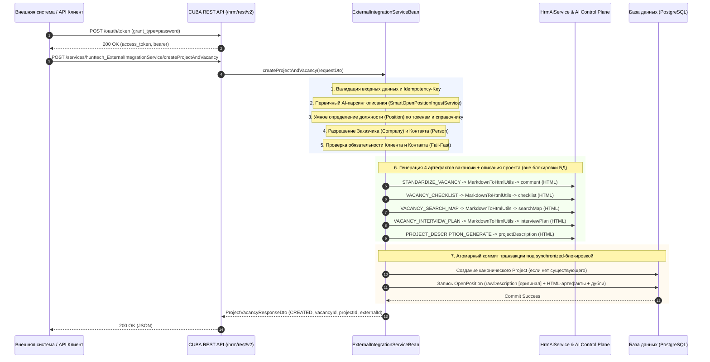

# Интеграция API: Создание вакансий с интеллектуальной AI-генерацией артефактов и автосозданием проектов

> **Версия API**: CUBA REST API v2 (`/hrm/rest/v2`)  
> **Сервис**: `hunttech_ExternalIntegrationService` (`createProjectAndVacancy`)  
> **Дата актуализации**: 2026-09-23  
> **Статус**: Production Ready  
> **Версия HRM HuntTech**: 0.715+

---

## 1. Введение и бизнес-цель

Интеграционный механизм предназначен для автоматизированного создания проектов и вакансий в HRM HuntTech из внешних систем (ATS клиентов, карьерных порталов, мессенджеров, внешних агрегаторов заявок и корпоративных интеграционных шин) с глубоким семантическим AI-анализом, стандартизацией и классификацией.

### Ключевые возможности алгоритма:

1. **Безусловная сохранность оригинала**: Полный исходный текст заявки/вакансии клиента сохраняется в неизменном виде в атрибуте сущности **«Оригинал вакансии»** (`OpenPosition.rawDescription`).
2. **Семантическая трансформация Markdown -> HTML**: Все генерируемые нейросетью артефакты (описание, чеклист, карта поиска, план интервью, описание проекта) проходят трансформацию через `MarkdownToHtmlUtils` в чистый семантический HTML (`<p>`, `<h3>`, `<table border="1">`, `<ul>`, `<li>`, `<b>`, `<code>`) с защитой от XSS. Это обеспечивает идеальное отображение в RichTextArea/HtmlBox интерфейса CUBA Platform.
3. **Умное AI-определение должности (`Position`)**:
   - Автоматическое извлечение наименования должности из описания вакансии или входного DTO;
   - Двухфазный подбор в справочнике `hunttech_Position`: приоритетное точное совпадение (RU/EN) $\rightarrow$ взвешенный токенный скоринг с отсечением дублей и стоп-пометок `(не использовать)`;
   - Если должность не сопоставлена достоверно, поле оставляется пустым для ручной верификации рекрутером без искажения аналитики.
4. **AI-распознавание и автосоздание Проекта (`Project`), Заказчика (`Company`) и Контакта (`Person`)**:
   - Автоматический поиск компании-заказчика (`Company`) по коду/названию/тексту (включая SSP / Сбербанк-Сервис);
   - Интеллектуальный поиск контактного лица со стороны заказчика в справочнике **«Люди»** (`Person`) по Telegram (`@username`) и ФИО среди сотрудников компании-клиента;
   - Если открытый проект существует — привязка вакансии к нему;
   - Если проекта нет — автоматическое создание нового проекта в справочнике `Project` строго по корпоративному правилу:
     `"<ЗАКАЗЧИК> \"<Наименование проекта>. Проект <контакт со стороны заказчика>\" /Штат HuntTech ТК/ГПХ или ИП. Актирование <количество месяцев>/\""`
     *(например: `SSP "КХД Банка. Проект Татьяны Кареевой" /Штат HuntTech ТК/ГПХ или ИП. Актирование 2 месяца/`)*;
   - Автогенерация полного HTML-описания проекта (`projectDescription`) и краткого описания (`shortDescription`) из текста вакансии через AI (`PROJECT_DESCRIPTION_GENERATE`).
5. **Строгая классификация ошибок (Error Taxonomy)**: При отсутствии критических данных (заказчик, контактное лицо) интеграция возвращает детальный JSON-ответ с типизированным кодом ошибки.

---

## 2. Архитектура интеграционного потока



---

## 3. Аутентификация и безопасность

Интеграция работает по стандарту **OAuth2 Resource Owner Password Credentials Grant** (RFC 6749).

### 3.1 Получение токена доступа

```http
POST /hrm/rest/v2/oauth/token
Authorization: Basic <base64(client_id:client_secret)>
Content-Type: application/x-www-form-urlencoded

grant_type=password&username=<логин>&password=<пароль>
```

#### Параметры:
- `client_id`: `hrm-rest`
- `client_secret`: `local-hrm-rest-secret-2026` (для dev/stage; на проде настраивается в защищённом хранилище конфигураций)
- `username`: технический пользователь интеграции (или пользователь с ролью `REST Внешняя интеграция`, например `alan`).

#### Пример успешного ответа:
```json
{
  "access_token": "Ed4Lav7qU4aBanNEJk0C82G5oSo",
  "token_type": "bearer",
  "refresh_token": "SUjUt_82r5VzYRE4r9ZdQRIdo5s",
  "expires_in": 3599,
  "scope": "rest-api"
}
```

---

## 4. Контракт API: Создание проекта и вакансии

### 4.1 Эндпоинт

```http
POST /hrm/rest/v2/services/hunttech_ExternalIntegrationService/createProjectAndVacancy
Authorization: Bearer <access_token>
Content-Type: application/json
```

### 4.2 Поля запроса (`ProjectVacancyCreateRequestDto`)

| Поле | Тип | Обязательное | Описание |
| :--- | :--- | :---: | :--- |
| `vacancyName` | `String` | **Да** | Название вакансии (до 250 символов) |
| `externalId` | `String` | Нет | Внешний идентификатор вакансии в системе-источнике (до 16 символов, например `13994`) |
| `comment` | `String` | Нет | **Оригинал описания вакансии**. Сохраняется без изменений в `rawDescription` и является источником для AI |
| `shortDescription` | `String` | Нет | Краткое резюме вакансии (до 250 символов) |
| `companyName` | `String` | Нет | Наименование или короткий код заказчика (например `SSP`). Если не задано — распознаётся из текста |
| `companyId` | `String (UUID)` | Нет | Прямой UUID компании-заказчика в справочнике `hunttech_Company` |
| `customerContact` | `String` | Нет | ФИО или Telegram контактного лица заказчика (например `@KareevaTatyana`). Если не задано — распознаётся из текста |
| `actPeriod` | `String` | Нет | Период актирования для проекта (по умолчанию `2 месяца`) |
| `projectName` | `String` | Нет | Базовое наименование проекта. Если не задан — определяется из текста вакансии |
| `existingProjectId` | `String (UUID)` | Нет | Идентификатор уже существующего проекта. Если указан — вакансия привязывается к нему |
| `positionName` | `String` | Нет | Базовое наименование должности. Если не задано — определяется через AI из текста |
| `positionTypeId` | `String (UUID)` | Нет | Прямой UUID должности в справочнике `hunttech_Position` |
| `remoteWork` | `Integer` | Нет | Формат работы: `1` — Удалённо, `2` — Офис, `3` — Гибрид |
| `commandCandidate` | `Integer` | Нет | Командность кандидата (по умолчанию `1`) |
| `workExperience` | `Integer` | Нет | Опыт работы (1–4) |
| `gradeId` | `String (UUID)` | Нет | Идентификатор грейда в справочнике `hunttech_Grade` |
| `cityId` | `String (UUID)` | Нет | Идентификатор города в справочнике `hunttech_City` |
| `salaryMin` | `BigDecimal` | Нет | Нижняя граница заработной платы |
| `salaryMax` | `BigDecimal` | Нет | Верхняя граница заработной платы |
| `correlationId` | `String` | Нет | Сквозной трассировочный ID для логов и мониторинга |
| `idempotencyKey` | `String` | Нет | Ключ идемпотентности для предотвращения дублирования запросов |

---

## 5. Классификация кодов ошибок (Error Taxonomy)

При возникновении ошибок валидации или отсутствия необходимых сущностей API возвращает HTTP 200 со структурой `ProjectVacancyResponseDto`:
```json
{
  "success": false,
  "message": "<Описание ошибки на русском языке>",
  "errorDetails": {
    "success": false,
    "errorCode": "<КОД_ОШИБКИ>",
    "message": "<Описание ошибки>",
    "timestamp": "2026-09-23 14:38:00.657",
    "details": []
  }
}
```

### Таблица кодов ошибок:

| Код ошибки | Описание | Причина возникновения | Рекомендация для клиента API |
| :--- | :--- | :--- | :--- |
| `CUSTOMER_NOT_FOUND` | Компания заказчика не найдена | В описании вакансии не найдено упоминание клиента, и поле `companyName`/`companyId` не заполнено | Укажите заказчика в тексте заявки (например `Заказчик: SSP`) или передайте поле `companyName` |
| `CUSTOMER_CONTACT_NOT_FOUND` | Контакт заказчика не найден | В справочнике «Люди» (`Person`) не найден сотрудник заказчика по Telegram или ФИО | Укажите Telegram (`@username`) или ФИО ответственного заказчика в поле `customerContact` или тексте |
| `VALIDATION_ERROR` | Ошибка валидации параметров | Не заполнено обязательное поле `vacancyName` или передан некорректный формат UUID | Проверьте обязательные поля и формат идентификаторов |
| `NOT_FOUND` | Сущность не найдена | Указанный `existingProjectId` отсутствует в базе данных | Передайте валидный UUID открытого проекта |
| `SYSTEM_ERROR` | Непредвиденная системная ошибка | Ошибка базы данных или внутренняя ошибка сервера | Проверьте логи по `correlationId` |

---

## 6. Корпоративное правило наименования проектов

Если проект не существовал в системе, он создаётся автоматически по строгому регламенту HuntTech:

$$\mathbf{<\text{ЗАКАЗЧИК}>\quad "\text{Наименование проекта}.\ \text{Проект}\ <\text{контакт со стороны заказчика}>"\quad /\text{Штат HuntTech ТК/ГПХ или ИП}.\ \text{Актирование}\ <\text{количество месяцев}>/}$$

### Пример формирования:
- **Заказчик**: `SSP` (Сбербанк-Сервис)
- **Базовый проект**: `КХД Банка`
- **Контакт заказчика**: `Татьяна Кареева` $\rightarrow$ в названии проекта склоняется в родительный падеж: `Татьяны Кареевой`
- **Актирование**: `2 месяца`
- **Итоговое наименование Project**:  
  `SSP "КХД Банка. Проект Татьяны Кареевой" /Штат HuntTech ТК/ГПХ или ИП. Актирование 2 месяца/`

---

## 7. Маппинг сущностей и трансформация Markdown -> HTML

| Артефакт / Поле | Исходный формат | Поле в БД | HTML-трансформация | Назначение |
| :--- | :--- | :--- | :--- | :--- |
| **Оригинал вакансии** | Plain Text | `rawDescription` (`RAW_DESCRIPTION`) | **Без изменений (чистый оригинал)** | Аудит исходных требований клиента |
| **Описание вакансии** | Markdown | `comment` (`COMMENT_`) | Заголовки `<h3>`, абзацы `<p>`, списки `<ul><li>` | Публикация и презентация роли |
| **Чеклист** | Markdown / Таблица | `interviewChecklist`, `exercise` | `<table border="1">`, `<thead>`, `<tbody>`, `<tr>`, `<td>` | Must-have матрица отбора кандидатов |
| **Карта поиска** | Markdown / Списки | `searchMap`, `memoForInterview` | `<b>`, `<code>`, `<p>`, `<ol><li>` | Сорсинг-стратегия и компании-доноры |
| **План собеседования** | Markdown | `interviewPlan`, `templateLetter` | `<h2>`, `<p>`, `<ol><li>` | Сценарий продающего интервью |
| **Описание проекта** | Markdown | `Project.projectDescription` | `<p>`, `<h3>`, `<ul><li>` | Презентация проекта заказчика |

Флаги `needExercise`, `needMemoForInterview`, `needLetter` автоматически выставляются в `true`.

---

## 8. Пример контрольного вызова через cURL

```bash
#!/usr/bin/env bash
set -euo pipefail

HRM_HOST="http://localhost:8080/hrm"
TOKEN="Ed4Lav7qU4aBanNEJk0C82G5oSo"

curl -s -X POST \
  -H "Authorization: Bearer ${TOKEN}" \
  -H "Content-Type: application/json" \
  -d '{
    "request": {
      "vacancyName": "Senior Системный архитектор / System Architect",
      "externalId": "13994",
      "projectName": "КХД Банка",
      "comment": "Заказчик: SSP. Ответственный со стороны заказчика: @KareevaTatyana (Татьяна Кареева). Актирование 2 месяца.\n\nID 13994 Архитектор Системный\n\nОграничение по ставке T&M (без НДС)\nSenior/ - руб.\nКлючевые компетенции\nJava Liquibase CI/CD DWH Python Greenplum ETL Airflow Apache Spark\nКХД BI data vault2\nФормат работы Удаленно\nПродолжительность проекта Больше года\nГражданство|Локация РФ\n\nТребования\nОпыт и архитектурная ответственность: - Опыт проектирования, развития или технического лидерства в КХД больших объёмов от 3-х лет (банковский сектор как преимущество). - Глубокое понимание методологий моделирования хранилищ данных (Data Vault 2.0 обязательно). - Опыт практической работы с Greenplum, Airflow, Spark...",
      "remoteWork": 1,
      "commandCandidate": 1,
      "workExperience": 4,
      "correlationId": "corr-vac-13994-ai-eval"
    }
  }' \
  "${HRM_HOST}/rest/v2/services/hunttech_ExternalIntegrationService/createProjectAndVacancy"
```

### Фактический ответ:
```json
{
  "success": true,
  "projectId": "207af1f3-0ffa-7eaf-0f44-5c1426d8389a",
  "vacancyId": "70c6d1ab-5c3b-d4c8-6879-091c695714e3",
  "externalId": "13994",
  "status": "CREATED",
  "correlationId": "corr-vac-13994-ai-eval"
}
```

---

## 9. Верификация в базе данных

```sql
SELECT 
  v.vacansy_id,
  v.vacansy_name,
  pos.position_ru_name,
  p.project_name,
  concat(owner.second_name, ' ', owner.first_name) AS project_owner,
  comp.company_short_name AS customer_company,
  (exercise = interview_checklist) AS checklist_duplicated,
  (memo_for_interview = search_map) AS search_map_duplicated,
  (template_letter = interview_plan) AS interview_plan_duplicated,
  need_exercise,
  need_memo_for_interview,
  need_letter
FROM hunttech_open_position v
LEFT JOIN hunttech_position pos ON pos.id = v.position_type_id
LEFT JOIN hunttech_project p ON p.id = v.project_name_id
LEFT JOIN hunttech_person owner ON owner.id = p.project_owner_id
LEFT JOIN hunttech_company_departament dept ON dept.id = p.project_department_id
LEFT JOIN hunttech_company comp ON comp.id = dept.company_name_id
WHERE v.vacansy_id = '13994';
```

**Результат верификации**:
- `vacansy_id`: `13994`
- `position_ru_name`: `Системный архитектор`
- `project_name`: `SSP "КХД Банка. Проект Татьяны Кареевой" /Штат HuntTech ТК/ГПХ или ИП. Актирование 2 месяца/`
- `project_owner`: `Кареева Татьяна`
- `customer_company`: `SSP`
- Все дублирующие поля синхронизированы (`true`), флаги потребностей установлены в `true`.
