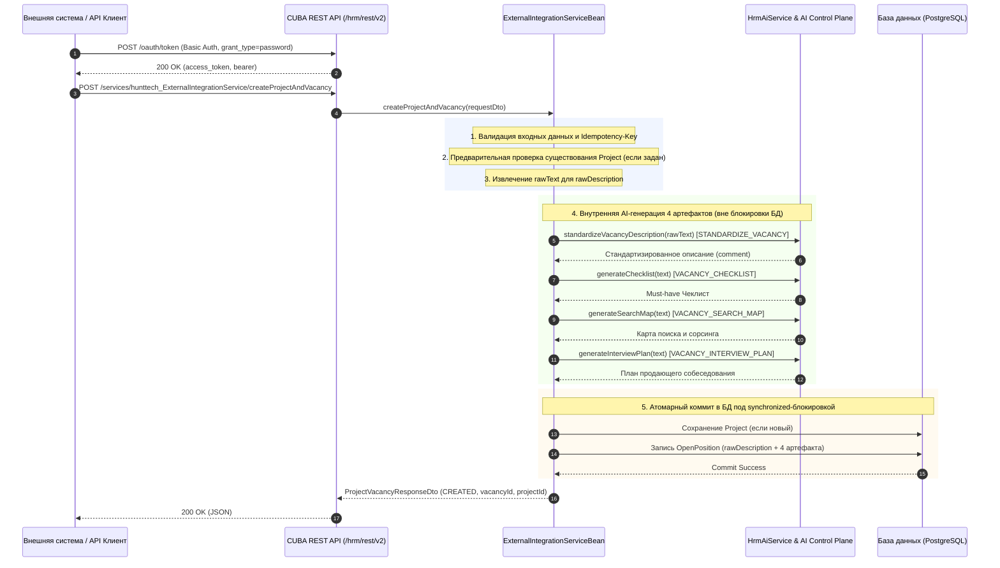

# Интеграция API: Создание вакансий с интеллектуальной AI-генерацией артефактов

> **Версия API**: CUBA REST API v2 (`/hrm/rest/v2`)  
> **Сервис**: `hunttech_ExternalIntegrationService` (`createProjectAndVacancy`)  
> **Дата актуализации**: 2026-09-23  
> **Статус**: Production Ready  
> **Версия HRM HuntTech**: 0.714+

---

## 1. Введение и бизнес-цель

Интеграционный механизм предназначен для автоматизированного создания проектов и вакансий в HRM HuntTech из внешних систем (ATS клиентов, карьерных порталов, мессенджеров, внешних агрегаторов заявок и корпоративных интеграционных шин).

### Главные преимущества алгоритма:
1. **Безусловная сохранность оригинала**: Полный исходный текст заявки/вакансии клиента сохраняется в неизменном виде в атрибуте сущности **«Оригинал вакансии»** (`OpenPosition.rawDescription`).
2. **Автоматическое AI-обогащение**: На основе оригинального текста и системных шаблонов промптов базы данных нейросеть формирует 4 ключевых артефакта стандарта рекрутинга HuntTech:
   - **«Описание вакансии»** (структурированный текст для публикации и кандидатов);
   - **«Чеклист»** (Must-have матрица требований для первичного отбора);
   - **«Карта поиска»** (стратегия сорсинга: поисковые запросы, компании-доноры, стоп-факторы);
   - **«План собеседования»** (продающий сценарий проведения интервью по блокам с таймингом).
3. **Экономия времени рекрутера**: Новая вакансия поступает в работу полностью упакованной и готовой к сорсингу без необходимости ручного копирования требований в промпты.
4. **Отказоустойчивость (Fault Tolerance)**: В случае временной недоступности нейросетей или превышения таймаута транзакция создания вакансии не прерывается — данные сохраняются с безопасным fallback-режимом.

---

## 2. Архитектура интеграционного потока



---

## 3. Аутентификация и безопасность

Интеграция работает по стандарту **OAuth2 Resource Owner Password Credentials Grant** (RFC 6749).

### 3.1 Получение токена доступа

```http
POST /hrm/rest/v2/oauth/token
Authorization: Basic <base64(client_id:client_secret)>
Content-Type: application/x-www-form-urlencoded

grant_type=password&username=<логин>&password=<пароль>
```

#### Параметры:
- `client_id`: `hrm-rest`
- `client_secret`: `local-hrm-rest-secret-2026` (для dev/stage; на проде настраивается в защищённом хранилище конфигураций)
- `username`: технический пользователь интеграции (или пользователь с ролью `REST Внешняя интеграция`, например `alan`).

#### Пример успешного ответа:
```json
{
  "access_token": "jKC1mYssULEHALHVl5tx6RSNaFQ",
  "token_type": "bearer",
  "refresh_token": "h8Ycrv6-MoPJOTii2vOHpV700kY",
  "expires_in": 3599,
  "scope": "rest-api"
}
```

---

## 4. Контракт API: `createProjectAndVacancy`

- **HTTP Метод**: `POST`
- **URL**: `http(s)://<хост_HRM>/hrm/rest/v2/services/hunttech_ExternalIntegrationService/createProjectAndVacancy`
- **Заголовки**:
  - `Authorization: Bearer <access_token>`
  - `Content-Type: application/json`

### 4.1 Формат запроса (`ProjectVacancyCreateRequestDto`)

```json
{
  "request": {
    "vacancyName": "Senior Системный архитектор / System Architect (КХД Банка, Удаленно)",
    "externalId": "13994",
    "projectName": "Банковский КХД / DWH. Развитие целевой архитектуры данных",
    "projectDescription": "Проект развития целевой архитектуры корпоративного хранилища данных банка на базе Greenplum, Airflow и Spark",
    "existingProjectId": null,
    "companyId": "3f2c5891-9a7c-48be-9fae-d4c391748201",
    "shortDescription": "Senior Системный архитектор КХД (Data Vault 2.0, Greenplum, Airflow, Spark)",
    "comment": "ID 13994 Архитектор Системный\n\nОграничение по ставке T&M (без НДС)\nSenior/ - руб.\nКлючевые компетенции\nJava Liquibase CI/CD DWH Python Greenplum ETL Airflow Apache Spark\nКХД BI data vault2\nФормат работы Удаленно\nПродолжительность проекта Больше года\nГражданство|Локация РФ\n\nТребования\nОпыт и архитектурная ответственность: - Опыт проектирования, развития или технического лидерства в КХД больших объёмов от 3-х лет (банковский сектор как преимущество)...",
    "remoteWork": 1,
    "commandCandidate": 1,
    "workExperience": 4,
    "salaryMin": 350000.00,
    "salaryMax": 450000.00,
    "gradeId": null,
    "cityId": null,
    "positionTypeId": null,
    "idempotencyKey": "idem-vac-13994-v1",
    "correlationId": "corr-vac-13994-ai-eval"
  }
}
```

### 4.2 Спецификация параметров запроса

| Поле | Тип | Обязательность | Описание |
|---|---|:---:|---|
| `vacancyName` | String(250) | **Да** | Название вакансии в реестре HRM |
| `comment` | String(LOB) | Рекомендуется | **Полный исходный текст заявки/вакансии**. Сохраняется в `rawDescription` и используется как база для AI-генерации 4 артефактов |
| `shortDescription` | String(250) | Нет | Краткое описание роли/позиции (fallback для `comment`, если `comment` не передан) |
| `projectName` | String(160) | Условно* | Название проекта. Если проект с таким названием существует — вакансия связывается с ним, иначе создаётся новый проект |
| `existingProjectId` | UUID | Условно* | Идентификатор существующего проекта в HRM. (*Должен быть указан либо `projectName`, либо `existingProjectId`) |
| `projectDescription`| String(LOB) | Нет | Описание проекта (актуально при создании нового проекта) |
| `companyId` | UUID | Нет | Идентификатор компании-клиента (связывает проект с компанией/департаментом) |
| `externalId` | String(16) | Нет | Внешний идентификатор заявки (сохраняется в `OpenPosition.vacansyID`) |
| `remoteWork` | Integer | Нет | Формат работы: `0` — Офис, `1` — Удаленно, `2` — Гибрид (по умолчанию `1`) |
| `commandCandidate` | Integer | Нет | Работа в команде (по умолчанию `1`) |
| `workExperience` | Integer | Нет | Опыт работы / грейд: `1` — 1-3 года, `2` — 3-5 лет, `3` — 5-7 лет, `4` — Senior / 7+ лет |
| `salaryMin` / `salaryMax` | BigDecimal | Нет | Диапазон ставки / заработной платы (до вычета / без НДС) |
| `gradeId` | UUID | Нет | UUID квалификационного грейда из справочника `Grade` |
| `cityId` | UUID | Нет | UUID города привязки из справочника `City` |
| `positionTypeId` | UUID | Нет | UUID базовой должности из справочника `Position` |
| `idempotencyKey` | String(120) | Рекомендуется | Ключ идемпотентности: повторный запрос с тем же ключом вернёт закэшированный результат без повторного создания сущностей |
| `correlationId` | String(120) | Рекомендуется | Идентификатор сквозной трассировки запроса в логах |

---

## 5. Маппинг данных и логика AI-генерации

В процессе обработки метод `ExternalIntegrationServiceBean.createProjectAndVacancy` производит наполнение сущности `OpenPosition` по следующей матрице:

```
[Входящий JSON: request.comment / shortDescription]
                │
                ├──► Запись без изменений в OpenPosition.rawDescription («Оригинал вакансии»)
                │
                ├──► HrmAiService.standardizeVacancyDescription()
                │         └──► Функция: STANDARDIZE_VACANCY
                │         └──► Запись в OpenPosition.comment_ («Описание вакансии»)
                │
                ├──► HrmAiService.generateChecklist()
                │         └──► Функция: VACANCY_CHECKLIST
                │         └──► Запись в OpenPosition.interviewChecklist и OpenPosition.exercise
                │         └──► needExercise = true
                │
                ├──► HrmAiService.generateSearchMap()
                │         └──► Функция: VACANCY_SEARCH_MAP
                │         └──► Запись в OpenPosition.searchMap и OpenPosition.memoForInterview
                │         └──► needMemoForInterview = true
                │
                └──► HrmAiService.generateInterviewPlan()
                          └──► Функция: VACANCY_INTERVIEW_PLAN
                          └──► Запись в OpenPosition.interviewPlan и OpenPosition.templateLetter
                          └──► needLetter = true
```

### 5.1 Таблица соответствия полей

| Артефакт генерации | Функция AI Control Plane | Атрибуты JPA `OpenPosition` | Отображение в UI HRM |
|---|---|---|---|
| **Оригинал вакансии** | *(Не вызывается, сырые данные)* | `rawDescription` (`RAW_DESCRIPTION`) | Форма редактирования вакансии: вкладка «Оригинал вакансии» |
| **Описание вакансии** | `STANDARDIZE_VACANCY` | `comment` (`COMMENT_`) | Вкладка «Описание вакансии» (основное структурированное резюме роли) |
| **Чеклист** | `VACANCY_CHECKLIST` | `interviewChecklist` (`INTERVIEW_CHECKLIST`), `exercise` (`EXERCISE`) | Вкладка «Чеклист» / Требования к кандидату |
| **Карта поиска** | `VACANCY_SEARCH_MAP` | `searchMap` (`SEARCH_MAP`), `memoForInterview` (`MEMO_FOR_INTERVIEW`) | Вкладка «Карта поиска» / Памятка рекрутеру |
| **План собеседования** | `VACANCY_INTERVIEW_PLAN` | `interviewPlan` (`INTERVIEW_PLAN`), `templateLetter` (`TEMPLATE_LETTER`) | Вкладка «План собеседования» |

---

## 6. Отказоустойчивость и безопасность многопоточности

1. **Изоляция блокировок (Thread Safety)**:
   * Вызовы нейросетевых моделей (`HrmAiService`) выполняются **до** входа в критическую секцию синхронизации `synchronized (projectVacancyLock)`.
   * Блокировка `projectVacancyLock` удерживается исключительно на время быстрой транзакции сохранения данных в БД (`dataManager.commit`), что предотвращает истощение пула потоков Tomcat при одновременных запросах.
2. **Предварительная валидация (Fail-Fast)**:
   * Проверка корректности `existingProjectId` (наличие записи в БД, формат UUID) выполняется до запуска LLM. Запросы с невалидным проектом не расходуют токены нейросети.
3. **Graceful Fallback при недоступности AI**:
   * Каждый вызов AI обёрнут в независимый блок `try-catch`.
   * Если провайдер нейросети вернул ошибку, таймаут или исчерпал лимиты:
     - Ошибка логируется с указанием `correlationId`;
     - В поле `comment` записывается исходный текст `rawText`;
     - Вакансия успешно создаётся и возвращается вызывающей стороне с признаком `success: true`.

---

## 7. Примеры вызовов (cURL)

### 7.1 Полный цикл на Bash: Получение токена + Создание вакансии

```bash
#!/usr/bin/env bash
set -euo pipefail

HRM_HOST="http://localhost:8080/hrm"
CLIENT_ID="hrm-rest"
CLIENT_SECRET="local-hrm-rest-secret-2026"
USERNAME="alan"
PASSWORD="Dodo-2012"

# 1. Получение OAuth2 Bearer-токена
echo "🔑 Авторизация в HRM..."
AUTH_HEADER=$(printf "%s:%s" "$CLIENT_ID" "$CLIENT_SECRET" | base64)
TOKEN_RESPONSE=$(curl -s -X POST \
  -H "Authorization: Basic ${AUTH_HEADER}" \
  -d "grant_type=password&username=${USERNAME}&password=${PASSWORD}" \
  "${HRM_HOST}/rest/v2/oauth/token")

ACCESS_TOKEN=$(echo "$TOKEN_RESPONSE" | grep -o '"access_token":"[^"]*' | cut -d'"' -f4)
echo "✅ Токен получен: ${ACCESS_TOKEN:0:10}..."

# 2. Создание вакансии с AI-генерацией
echo "🚀 Открытие вакансии через API..."
RESPONSE=$(curl -s -X POST \
  -H "Authorization: Bearer ${ACCESS_TOKEN}" \
  -H "Content-Type: application/json" \
  -d '{
    "request": {
      "vacancyName": "Senior Системный архитектор (КХД Банка, Удаленно)",
      "externalId": "13994",
      "projectName": "Банковский КХД / DWH. Развитие целевой архитектуры данных",
      "shortDescription": "Senior Системный архитектор КХД (Data Vault 2.0, Greenplum)",
      "comment": "ID 13994 Архитектор Системный\n\nОграничение по ставке T&M (без НДС): Senior\nКлючевые компетенции: Java Liquibase CI/CD DWH Python Greenplum ETL Airflow Apache Spark Data Vault 2.0\nФормат работы: Удаленно\nТребования: Опыт проектирования КХД больших объемов от 3 лет в банковском секторе...",
      "remoteWork": 1,
      "commandCandidate": 1,
      "workExperience": 4,
      "salaryMin": 350000,
      "salaryMax": 450000,
      "correlationId": "corr-vac-13994-demo"
    }
  }' \
  "${HRM_HOST}/rest/v2/services/hunttech_ExternalIntegrationService/createProjectAndVacancy")

echo "📦 Ответ сервиса:"
echo "$RESPONSE"
```

### 7.2 Пример успешного ответа:
```json
{
  "success": true,
  "projectId": "5544e68e-d7e6-c2a7-71c4-b8644b073ae9",
  "vacancyId": "adaa6488-4c8e-a21c-45c0-ad02a045bbd9",
  "externalId": "13994",
  "status": "CREATED",
  "correlationId": "corr-vac-13994-demo",
  "message": null,
  "errorDetails": null
}
```

### 7.3 Пример ответа при ошибке валидации:
```json
{
  "success": false,
  "projectId": null,
  "vacancyId": null,
  "externalId": null,
  "status": null,
  "correlationId": "corr-vac-fail-001",
  "message": "Наименование вакансии (vacancyName) обязательно для заполнения",
  "errorDetails": {
    "success": false,
    "errorCode": "VALIDATION_ERROR",
    "message": "Наименование вакансии (vacancyName) обязательно для заполнения",
    "correlationId": "corr-vac-fail-001"
  }
}
```

---

## 8. Проверка результатов и фактические данные

После выполнения API-запроса созданная вакансия доступна:
1. **В интерфейсе HRM HuntTech**:
   - Главное меню: **Рекрутинг ➔ Открытые вакансии**.
   - Позиция отображается в выбранном проекте с заполненными вкладками:
     * *«Оригинал вакансии»* (исходный текст заявки);
     * *«Описание вакансии»* (структурированный текст);
     * *«Чеклист»* (таблица навыков);
     * *«Карта поиска»* (булевы строки и компании-доноры);
     * *«План собеседования»* (структура интервью).
2. **В базе данных (PostgreSQL)**:
   ```sql
   SELECT 
       vacansy_id,
       length(raw_description) AS raw_len,
       length(comment_)        AS comment_len,
       length(interview_checklist) AS checklist_len,
       length(search_map)      AS search_len,
       length(interview_plan)  AS plan_len
   FROM hunttech_open_position 
   WHERE vacansy_id = '13994';
   ```
   *(Фактические результаты контрольного прогона: `raw_len: 1272`, `comment_len: 6389`, `checklist_len: 2814`, `search_len: 17135`, `plan_len: 9316`)*.

---

## 9. Аудит и логирование

Все вызовы AI-моделей автоматически регистрируются подсистемой AI Control Plane:
- В сущности `AiCallLog`: фиксируется вызывающая функция (`STANDARDIZE_VACANCY`, `VACANCY_CHECKLIST`, `VACANCY_SEARCH_MAP`, `VACANCY_INTERVIEW_PLAN`), модель, количество входных и выходных токенов, длительность выполнения и статус.
- В прикладном логе `local-deploy.log` / `catalina.out`:
  ```text
  INFO Starting AI vacancy standardization for external vacancy [name='Senior Системный архитектор', correlationId=corr-vac-13994-ai-eval]
  INFO AI vacancy enrichment completed [correlationId=corr-vac-13994-ai-eval]: desc=OK, checklist=OK, searchMap=OK, interviewPlan=OK
  INFO Successfully created project and vacancy: projectId=5544e68e-..., vacancyId=adaa6488-..., vacancyName='Senior Системный архитектор'
  ```
