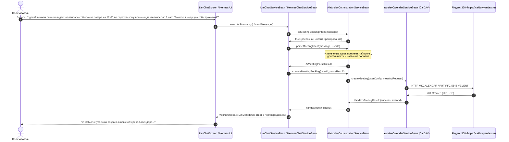

# Интеграция LLM-чата HRM HuntTech с Яндекс 360 (Календарь и CalDAV)

> **Статус документа**: Техническая спецификация реализации  
> **Роль**: Технический писатель (Technical Writer)  
> **Платформа**: CUBA Platform 7.3 / Java 8 / CalDAV RFC 5545 / Яндекс 360  
> **Модули**: `modules/core`, `modules/global`, `modules/web`  
> **Дата**: Сентябрь 2026  

---

## 1. Назначение и контекст

В HRM-системе HuntTech реализована двухсторонняя интеграция с корпоративным сервисом **Яндекс 360**:
- Доступ к Яндекс 360 настраивается индивидуально каждым пользователем в форме `ExtSettingsWindow` (вкладка **«Яндекс-360»**).
- Настройки хранятся в сущности `UserYandexConfiguration` (`HUNTTECH_USER_YANDEX_CONFIG`):
  - `accountEmail` — корпоративный email пользователя;
  - `appPassword` / OAuth токен — зашифрованные учетные данные;
  - `calendarConnected` — признак активности интеграции;
  - `personalCalendarName` — имя персонального календаря (например, *«Мои события»*);
  - `defaultTimeZone` — часовой пояс пользователя (например, *`Europe/Saratov`* или *`Europe/Moscow`*).

Интеллектуальный ассистент (как в режиме локального диалога `LlmChatService`, так и в режиме агента `HermesChatService`) поддерживает прямое выполнение пользовательских команд на естественном языке для планирования встреч и личных событий в Яндекс-Календаре без необходимости ручного перехода во внешний веб-интерфейс.

---

## 2. Архитектура и сквозной поток обработки



---

## 3. Правила классификации интентов и парсинга параметров

Сервис `AiYandexOrchestrationServiceBean` выполняет детерминированный NLU-разбор входящего сообщения пользователя:

### 3.1. Ключевые глаголы и паттерны (`isMeetingBookingIntent`)
Поддерживаются вариации глаголов и существительных:
- Глаголы: `создай`, `сделай`, `запланируй`, `добавь`, `внеси`, `запиши`, `поставь`, `назначь`, `забронируй`, `организуй`.
- Объекты: `встреч`, `собеседован`, `интервью`, `митинг`, `событи`, `инвайт`, `календар`.

### 3.2. Парсинг даты и времени
- Относительные даты: `сегодня`, `завтра`, `послезавтра`, дни недели (`в понедельник`, `во вторник` и т.д.).
- Абсолютные даты: `DD.MM.YYYY`, `DD.MM`.
- Время (`TIME_PATTERN`): поддерживает разделители `:`, `.` и `-` (например `12:00`, `12.00`, `12-00`).
- Длительность (`DURATION_PATTERN`):
  - `длительностью X ч / час / часа / часов`;
  - `длительностью X мин / минут`;
  - По умолчанию: 45 минут для собеседований, 60 минут при явном указании часа.

### 3.3. Извлечение темы события (`extractCustomTopic`)
1. Приоритет отдается тексту в кавычках: `"Заняться медицинской страховкой"` или `«Заняться медицинской страховкой»`.
2. Если кавычки отсутствуют, тема извлекается по ключевым конструкциям `тема: ...`, `на тему ...`, `событие: ...`.
3. Для рабочих встреч без явной темы формируется заголовок `Собеседование: Кандидат`.

### 3.4. Определение часового пояса
- Распознаются географические указания в тексте:
  - `саратов` -> `Europe/Saratov`;
  - `москв` -> `Europe/Moscow`;
  - `самар` -> `Europe/Samara`.
- Если в сообщении часовой пояс не указан, используется `defaultTimeZone` из `UserYandexConfiguration`.
- Если и в профиле не указан — системный `ZoneId.systemDefault()`.

### 3.5. Выбор календаря и видеосвязи
- Поле `calendarName`: подставляется `config.getPersonalCalendarName()` (по умолчанию *«Мои события»*), если событие личное или запрашивается «в личном календаре».
- Поле `telemostRequired`:
  - `true` — если в тексте явно упоминаются `телемост`, `видеосвязь`, `zoom`, либо это собеседование с кандидатом.
  - `false` — для личных задач и напоминаний (исключает создание лишней ссылки на Яндекс.Телемост).

---

## 4. Конфигурация в БД и системные промпты

### 4.1. Системный промпт `LLM_CHAT`
В системный промпт базовой AI-функции `LLM_CHAT` внесена директива:
```text
ИНТЕГРАЦИЯ С ЯНДЕКС 360 И КАЛЕНДАРЯМИ:
- В системе HRM HuntTech реализована полная интеграция с сервисами Яндекс 360 (Яндекс-Календарь, CalDAV, Яндекс.Телемост).
- Пользователи настраивают интеграцию в окне настроек ExtSettingsWindow (вкладка "Яндекс-360").
- При запросах пользователя на создание событий, напоминаний, инвайтов или бронирование встреч система поддерживает автоматическое создание событий в Яндекс-Календаре через интерфейсы CalDAV.
```

### 4.2. Liquibase-миграции
- `modules/core/db/changelog/260913-updateLlmChatPromptWithYandex360.xml`
- `modules/core/db/update/postgres/26/260913-updateLlmChatPromptWithYandex360.sql`
- `modules/core/db/update/hsql/26/260913-updateLlmChatPromptWithYandex360.sql`

---

## 5. Контроль качества и регрессионные тесты

Реализация покрыта автоматизированными тестами в `modules/core/test/com/company/hunttech/core/`:
- `YandexIntegrationContractTest.testAiYandexIntentClassification`:
  - Проверка классификации точного пользовательского запроса:
    `"сделай в моем личном яндекс-календаре событие на завтра на 12-00 по саратовскому времени длительностью 1 час: \"Заняться медицинской страховкой\""`;
  - Проверка извлечения времени `12:00`, длительности `60 минут`, таймзоны `Europe/Saratov`, темы `"Заняться медицинской страховкой"`.
- `LlmChatFoundationContractTest`, `LlmChatSecurityContractTest`, `LlmChatScreenContractTest`:
  - Проверка отсутствия регрессий в потоковом SSE-конвейере и системе безопасности CUBA.
