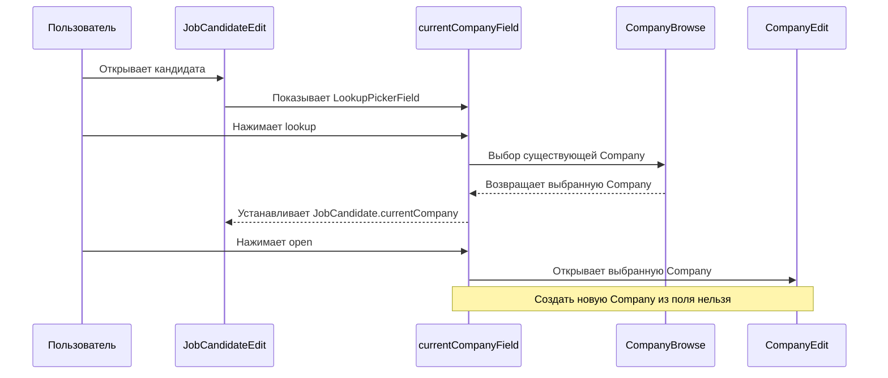

# Текущее поведение до изменения: компания в JobCandidateEdit

Дата аудита: 2026-07-13.

## Последовательность

```text
JobCandidateEdit
    ↓
Поле Company
    ↓
Выбор существующей / создание новой
    ↓
CompanyEdit
    ↓
Commit или Cancel
    ↓
Возврат в JobCandidateEdit
```

## Диаграмма до изменения



## Файлы реализации

- `modules/global/src/com/company/hunttech/entity/JobCandidate.java`
- `modules/global/src/com/company/hunttech/entity/Company.java`
- `modules/global/src/com/company/hunttech/views.xml`
- `modules/web/src/com/company/hunttech/web/screens/jobcandidate/JobCandidateEdit.java`
- `modules/web/src/com/company/hunttech/web/screens/jobcandidate/job-candidate-edit.xml`
- `modules/web/src/com/company/hunttech/web/screens/company/CompanyEdit.java`
- `modules/web/src/com/company/hunttech/web/screens/company/company-edit.xml`

## Фактические детали

| Пункт | Значение |
| --- | --- |
| Атрибут `JobCandidate` | `currentCompany` |
| Колонка | `CURRENT_COMPANY_ID` |
| Связь | `@ManyToOne(fetch = FetchType.LAZY)` -> `Company` |
| UI-компонент | `LookupPickerField<Company>` |
| ID поля | `currentCompanyField` |
| Caption | `msg://msgCorrentCompany` / «Место работы» |
| Data container | `jobCandidateDc` |
| Property | `currentCompany` |
| Options container | `currentCompaniesDc` |
| Loader | `currentCompaniesLc`, `select e from hunttech_Company e order by e.comanyName` |
| Главный TabSheet | `tabSheetSocialNetworks` |
| Вкладка поля | `tabCandidate` |
| Текущие actions | `lookup`, `open` |

## Дефекты до изменения

- В поле можно выбрать существующую компанию и открыть выбранную, но нельзя создать новую компанию.
- Если пользователь создаёт компанию через отдельный справочник, он должен вернуться в кандидата и искать её вручную.
- Нет обработки результата `CompanyEdit` в `JobCandidateEdit`.
- Нет защиты от повторного открытия редактора создания компании из этого поля, потому что такого действия нет.

## Риски изменения

- `currentCompaniesDc` загружается лениво при открытии вкладки `tabCandidate`; созданную компанию надо добавить в options container.
- Компания сохраняется в дочернем редакторе отдельным commit, а кандидат не должен сохраняться автоматически.
- Возвращённый экземпляр `Company` надо слить в `DataContext` кандидата перед установкой в поле.
- Правило уникальности названия компании в текущем коде не закреплено однозначно; новая логика не должна самовольно вводить уникальный индекс.

## Предполагаемые затронутые файлы

- `JobCandidateEdit.java`
- `messages.properties`
- `messages_ru.properties`
- тесты core/web
- документация `docs/analysis`, `docs/screens`, `docs/business-rules`, `docs/reports`
