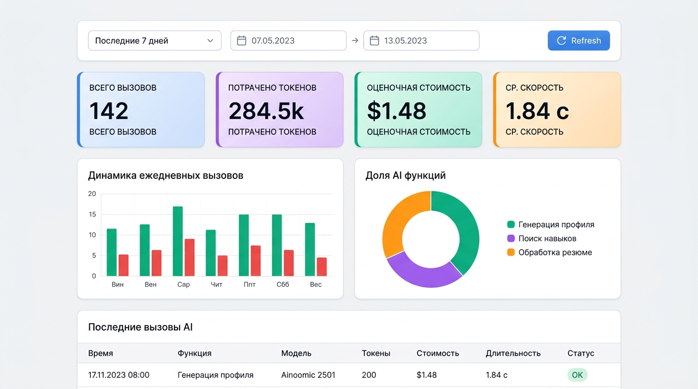
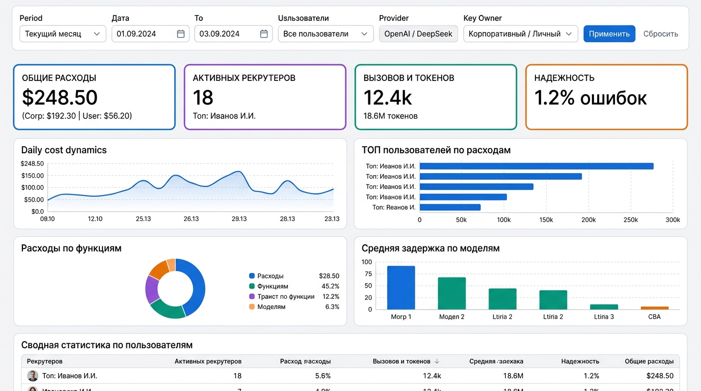

# Спецификация дашбордов аналитики AI (UserAiDashboard & AdminAiDashboard)

## 1. Концепция и цели

На основе данных `AiCallLog` разработана концепция двух специализированных аналитических дашбордов в стиле темы **Halo** с использованием штатных компонентов платформы CUBA (`chart:*`, `cuba:groupBox`, карточки `stylename="card"`, `table`, `filter`):

1. **`UserAiDashboard`** — Персональный дашборд сотрудника (рекрутера/ресерчера). Позволяет отслеживать персональный объем вызовов, баланс токенов, частоту использования функций AI и историю генераций.
2. **`AdminAiDashboard`** — Административный дашборд руководства и системных администраторов. Предоставляет агрегированную аналитику по расходам компании ($ / ₽), динамике затрат по провайдерам, рейтингу пользователей по потреблению токенов и стабильности работы внешних AI API.

---

## 2. Дашборд пользователя (`UserAiDashboard`)

### Размещение и права
- **ID экрана**: `hunttech_UserAiDashboard`
- **Доступ**: Все авторизованные пользователи системы.
- **Ограничение выборки**: Автоматический JPQL-фильтр `where e.user.id = :current_user_id`.

### Структура интерфейса
1. **Панель фильтра периода (`hbox stylename="card-layout"`)**:
   - Выпадающий список быстрых периодов: «Сегодня», «Последние 7 дней», «Текущий месяц», «Произвольный период».
   - Поля выбора дат `dateFrom` и `dateTo` (`dateField`).
   - Кнопка «Обновить» (`icon="REFRESH"`).
2. **Блок ключевых показателей (KPI Cards)** — 4 карточки (`vbox stylename="card well"`):
   - **Всего вызовов**: общее число обращений + динамика к предыдущему периоду.
   - **Токены**: суммарный объем токенов с детализацией (вход / выход).
   - **Оценочная стоимость**: общие расходы в $ / ₽ и процент от личного лимита.
   - **Эффективность**: среднее время генерации (сек) и % успешных ответов (`SUCCESS Rate`).
3. **Аналитические графики (`chart:*`)**:
   - `chart:serialChart` (Столбчатая диаграмма) — динамика вызовов по дням с разделением на успешные и ошибки.
   - `chart:pieChart` (Donut диаграмма) — доли обращений по бизнес-функциям («Анализ резюме», «Стандартизация вакансий», «Форматирование текста», «Генерация логотипов»).
4. **Таблица последних вызовов (`table`)**:
   - Отображает последние 10–20 обращений пользователя с временем, названием функции, моделью, токенами, длительностью и бейджем статуса.

### Эскиз макета



```
+-------------------------------------------------------------------------------------------------------------------------+
|  📊 МОЯ СТАТИСТИКА AI                                            [ Период: Последние 7 дней  ▼ ] [ 01.08.2026 - 08.08.2026 ] [ 🔄 ] |
+-------------------------------------------------------------------------------------------------------------------------+
| +---------------------+ +---------------------+ +---------------------+ +---------------------+                        |
| | 🔢 ВЫЗОВОВ          | | 🪙 ТОКЕНЫ           | | 💵 СТОИМОСТЬ        | | ⚡ СРЕДНЕЕ ВРЕМЯ    |                        |
| | 148                 | | 284 500             | | $ 0.42              | | 1.84 сек          |                        |
| | ▲ +12% к пр. неделе | | 210k in / 74.5k out | | Личный лимит: 8.4%  | | Успешность: 98.6% |                        |
| +---------------------+ +---------------------+ +---------------------+ +---------------------+                        |
+-------------------------------------------------------------------------------------------------------------------------+
| +---------------------------------------------------------+ +---------------------------------------------------------+ |
| | 📈 Динамика вызовов по дням (chart:serialChart)          | | 🎯 Доли функций AI (chart:pieChart)                     | |
| |  Кол-во                                                 | |                                                         | |
| |   40|          █                                        | |                    //////   \\\\\\                      | |
| |   30|    █     █     █                                  | |                 ///  Анализ резюме \\\                  | |
| |   20|    █  █  █  █  █  █                               | |                |      (58%)           |                 |
| |   10| █  █  █  █  █  █  █                               | |                 \\\               ///                   | |
| |    0+------------------------                           | |                    \\\\\\   //////                      | |
| |      Пн Вт Ср Чт Пт Сб Вс                               | |         ■ Анализ резюме (58%)  ■ Вакансии (24%)         | |
| |      ■ Успешно (146)   ■ Ошибки (2)                     | |         ■ Форматирование (12%) ■ Генерация лого (6%)    | |
| +---------------------------------------------------------+ +---------------------------------------------------------+ |
+-------------------------------------------------------------------------------------------------------------------------+
| 📋 ПОСЛЕДНИЕ ВЫЗОВЫ                                                                                                     |
| +------------------+-----------------------+---------------------+---------------+---------+----------+---------------+ |
| | Время            | Функция               | Модель              | Токены        | Время   | Статус   | Источник      | |
| +------------------+-----------------------+---------------------+---------------+---------+----------+---------------+ |
| | 16.08.2026 18:24 | Анализ навыков резюме | deepseek-chat       | 3 240 (2.8k/4)| 1.42 с  | [ OK ]   | CandidateCV   | |
| | 16.08.2026 17:15 | Стандартизация ваканс | gpt-4o-mini         | 1 850 (1.4k/4)| 1.10 с  | [ OK ]   | OpenPosition  | |
| | 16.08.2026 15:02 | Анализ навыков резюме | claude-3-5-sonnet   | 4 100 (3.5k/6)| 2.30 с  | [ OK ]   | CandidateList | |
| +------------------+-----------------------+---------------------+---------------+---------+----------+---------------+ |
+-------------------------------------------------------------------------------------------------------------------------+
```

---

## 3. Дашборд администратора (`AdminAiDashboard`)

### Размещение и права
- **ID экрана**: `hunttech_AdminAiDashboard`
- **Доступ**: Администраторы AI / Руководство (роль `Administrators` / `aiAdministration`).
- **Размещение в меню**: Раздел «Управление AI» → «Дашборд аналитики AI».

### Структура интерфейса
1. **Панель глобальных фильтров (`hbox stylename="card"` / `inline-fields`)**:
   - Диапазон дат (`dateField`).
   - Фильтр по сотруднику (`lookupPickerField` к `sec$User`).
   - Фильтр по провайдеру (`lookupField`: OpenAI, DeepSeek, Anthropic, GigaChat, YandexGPT).
   - Фильтр по типу ключа (`lookupField`: Корпоративный / Личный).
   - Кнопки: «Применить» (`BUTTON_PRIMARY`), «Экспорт в Excel» (`excelAction`).
2. **Сводные KPI-карточки компании** — 4 карточки (`vbox stylename="card well"`):
   - **Совокупные расходы**: Общая сумма в USD и RUB + разбивка корпоративных и личных затрат.
   - **Активные пользователи**: Количество сотрудников, использовавших AI + лидер по затратам.
   - **Суммарный объем**: Общее количество вызовов и сумма токенов (млн токенов).
   - **Надежность и SLA**: Общий процент ошибок (Error Rate) и средняя задержка API.
3. **Аналитические диаграммы (`chart:*`)**:
   - `chart:serialChart` (Multi-line / Area Chart) — Динамика расходов ($) по дням с разбивкой по провайдерам.
   - `chart:serialChart` (Горизонтальный Bar Chart) — **ТОП-10 пользователей по расходам ($) и токенам**.
   - `chart:pieChart` — Распределение расходов по бизнес-функциям AI.
   - `chart:serialChart` — Задержка (Latency в мс) и частота ошибок по конкретным моделям.
4. **Сводная таблица по пользователям (`groupTable`)**:
   - Группировка по отделам / пользователям.
   - Колонки: Сотрудник, Должность, Всего вызовов, Входные токены, Выходные токены, Итоговая сумма ($/₽), Ошибок, Последняя активность.

### Эскиз макета



```
+-------------------------------------------------------------------------------------------------------------------------+
|  ⚙️ ПАНЕЛЬ МОНИТОРИНГА И РАСХОДОВ AI (АДМИНИСТРАТОР)                                                                     |
|  [ Период: Август 2026 ▼ ] [ Пользователь: Все ▼ ] [ Провайдер: Все ▼ ] [ Тип ключа: Все ▼ ] [ Применить ] [ 📥 Excel ] |
+-------------------------------------------------------------------------------------------------------------------------+
| +----------------------+ +----------------------+ +----------------------+ +----------------------+                     |
| | 💰 ОБЩИЙ РАСХОД      | | 👥 АКТИВНЫХ РЕКРУТЕР | | 🔢 ВЫЗОВОВ / ТОКЕНОВ | | ⚠️ НАДЕЖНОСТЬ И СКО  |                     |
| | $ 124.60 (~11 460 ₽) | | 18 сотрудников       | | 8 420 вызовов        | | Ошибок: 0.4%         |                     |
| | Corp: $98 | User: $26| | Топ: А. Иванов ($32) | | 14.8M токенов        | | Ср. задержка: 1.45 с |                     |
| +----------------------+ +----------------------+ +----------------------+ +----------------------+                     |
+-------------------------------------------------------------------------------------------------------------------------+
| +----------------------------------------------------------+ +--------------------------------------------------------+ |
| | 📊 Динамика расходов по провайдерам ($)                  | | 🏆 ТОП-5 пользователей по расходам ($)                 | |
| |    $                                                     | |                                                        | |
| |   25|              ■ OpenAI                              | |  А. Иванов   [████████████████████████] $ 32.40        | |
| |   20|        ▲     ▲ DeepSeek                            | |  Е. Смирнова [████████████████        ] $ 21.10        | |
| |   15|     ▲  ■  ▲  ■ Anthropic                           | |  М. Ковалев  [████████████            ] $ 16.80        | |
| |   10|  ■  ■  ■  ■  ■ GigaChat                            | |  Д. Морозов  [████████                ] $ 11.50        | |
| |    0+------------------------                            | |  О. Павлова  [██████                  ] $  8.90        | |
| |       01.08  05.08  10.08  15.08                         | |                                                        | |
| +----------------------------------------------------------+ +--------------------------------------------------------+ |
+-------------------------------------------------------------------------------------------------------------------------+
| +----------------------------------------------------------+ +--------------------------------------------------------+ |
| | 🥧 Расходы по функциям AI (chart:pieChart)               | | ⚡ Задержка и стабильность моделей (chart:serialChart) | |
| |                                                          | |  Модель            Ср. время   Ошибок                  | |
| |         ■ Парсинг и скоринг навыков (52%)                | |  deepseek-chat       1.24 с     0.1%  [ Стабильно  ]    | |
| |         ■ Описание и генерация вакансий (28%)            | |  gpt-4o-mini         0.92 с     0.0%  [ Стабильно  ]    | |
| |         ■ Smart Format HTML (11%)                        | |  claude-3-5-sonnet   2.10 с     0.8%  [ Стабильно  ]    | |
| |         ■ Генерация логотипов проектов (9%)              | |  gigachat            1.65 с     1.2%  [ Внимание   ]    | |
| +----------------------------------------------------------+ +--------------------------------------------------------+ |
+-------------------------------------------------------------------------------------------------------------------------+
| 👥 СВОДНАЯ ДЕТАЛИЗАЦИЯ ПО ПОЛЬЗОВАТЕЛЯМ (groupTable с группировкой и фильтром)                                           |
| +------------------+-------------+---------------+----------------+----------------+------------+----------+-----------+ |
| | Пользователь     | Должность   | Вызовов всего | Промпт-токены  | Ответ-токены   | Сумма ($)  | Ошибок   | Посл. акти| |
| +------------------+-------------+---------------+----------------+----------------+------------+----------+-----------+ |
| | Иванов А.А.      | Вед. рекрут | 2 140         | 3 850 000      | 920 000        | $ 32.40    | 3        | 5 мин наз | |
| | Смирнова Е.В.    | Рекрутер    | 1 420         | 2 410 000      | 610 000        | $ 21.10    | 1        | 12 мин наз| |
| | Ковалев М.С.     | Ресерчер    | 1 180         | 1 950 000      | 520 000        | $ 16.80    | 0        | 1 час наз | |
| +------------------+-------------+---------------+----------------+----------------+------------+----------+-----------+ |
+-------------------------------------------------------------------------------------------------------------------------+
```

---

## 4. Стилистика и токены темы Halo

Для оформления дашбордов используются стандартные классы темы Halo:
- `card` — контейнер с легкой границей, белым фоном и скруглением углов.
- `well` — панель с легким фоновым затенением для KPI-метрик.
- `huge bold` — крупный акцентный шрифт для основных цифровых показателей.
- `friendly` / `danger` — зеленый и красный акценты для положительных метрик и индикаторов ошибок.
- `inline-fields` — компактное горизонтальное выравнивание полей фильтра.
