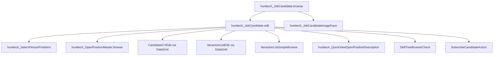

# JobCandidate Edit (`JobCandidateEdit` / `hunttech_JobCandidate.edit`)

> Форма редактирования карточки кандидата HRM HuntTech.
> Сущность: [JobCandidate.md](../../entities/job-candidate/JobCandidate.md)

---

## Business & Context Intro

### Назначение и Бизнес-смысл (What & Why)

Форма полной карточки кандидата HRM HuntTech: персональные данные, контакты, должности, соцсети, история взаимодействий по вакансиям, резюме и чат-комментарии.

### Связи в интерфейсе и Навигация (UI Context & Navigation)

Открывается из `hunttech_JobCandidate.browse` (edit/create), detail-фрагмента, lookup. Дочерние: `CandidateCVEdit`, `IteractionListEdit`, `SelectPersonPositions`, pickers Company/City/Position.

### Краткий обзор бизнес-логики поведения (Behavior Summary)

Шесть вкладок: карточка (контакты, фото, навыки, проекты), кандидат (ФИО с подсказками), контакты (динамическая обязательность полей), взаимодействия, резюме, комментарии-чат. При первом открытии вкладки подгружаются справочники и колонки-генераторы. При сохранении нового кандидата проверяется дубликат по ФИО+город+должность; нормализуются ФИО и Telegram; автоматически создаётся взаимодействие «Новый контакт». Менеджер/администратор может заблокировать кандидата — тогда грид взаимодействий отключается для остальных ролей.

---

## 1. Точка вызова и контекст (Invocation & Context)

| Параметр | Значение |
|----------|----------|
| **@UiController** | `hunttech_JobCandidate.edit` |
| **Java-класс** | `com.company.hunttech.web.screens.jobcandidate.JobCandidateEdit` |
| **XML-дескриптор** | `job-candidate-edit.xml` |
| **Базовый класс** | `StandardEditor<JobCandidate>` |
| **EditedEntityContainer** | `jobCandidateDc` |
| **Режим диалога** | 1200×750 |
| **Загрузка данных** | `@LoadDataBeforeShow` |

### Назначение

Полная карточка кандидата: контакты, должности, соцсети, взаимодействия с вакансиями, резюме (CV), комментарии-чат. Открывается из browse (`edit` action), из details browse, lookup create/edit.

---

## 2. Связь с моделью данных (Data & Entity Binding)

### Главный instance `jobCandidateDc`

View `extends="_local"` с коллекциями `fetch="BATCH"` и `view="_minimal"`:

| property | fetch | view / nested | Назначение в Java |
|----------|-------|---------------|-------------------|
| `candidateCv` | BATCH | `_minimal` (полная загрузка — `ensureCandidateCvLoaded()` на вкладке резюме) | Вкладка резюме; `scanContactsFromCVs`, `checkSkillFromJD`, project logo generators |
| `iteractionList` | BATCH | `_minimal` (полная загрузка — `ensureInteractionsLoaded()` при активации вкладки или генераторе `lastInteractionGeneratorColumn`) | Грид взаимодействий, фильтр, suggest-иконки, lastProject generators |
| `socialNetwork` | BATCH | `_minimal` (полная загрузка — `ensureSocialNetworksLoaded()` на вкладке контактов) | Таблица соцсетей, `enableDisableContacts` |
| `positionList` | BATCH | `_local` → `positionList` `_local` | `addPositionList`, `suggestOpenPositionDl` |
| `cityOfResidence`, `currentCompany` (+ `companyGroup`), `fileImageFace`, `personPosition` | LAZY | `_local` | Карточка, вкладка кандидата |

Вложенные collection containers: `jobCandidateCandidateCvsDc`, `jobCandidateSocialNetworksDc`, `jobCandidateIteractionDc`. (`laborAgreement` убран из view и контейнеров — вкладка Outstaffing закомментирована в UI.)

### Дополнительные loaders

| Контейнер | View | JPQL / назначение | Когда грузится |
|-----------|------|-------------------|----------------|
| `lastProjectDc` | KeyValue: `vacancyId`, `maxDate` | group by vacancy.id, exclude `Default`, `:candidateId` | **Вкладка `tabPositions`** (`BackgroundTask.run()`) |
| `openPositionDc` | `openPosition-picker-view` | открытые вакансии | первое открытие `commentsTab` (`ensureOpenPositionLoaded`) |
| `suggestOpenPositionDc` | `openPosition-picker-view` | открытые + `positionType.id` / `positionType.id IN` | **Вкладка `tabPositions`** (`BackgroundTask.run()`) |
| `personPositionsDc` | `position-view` | без «(не использовать)» | первое открытие `tabCandidate` |
| `currentCompaniesDc` | `company-picker-view` | все Company | первое открытие `tabCandidate` |
| `citiesDc` | `city-picker-view` | все City | первое открытие `tabCandidate` |
| `interactionCommentDc` | `_minimal` + `comment`, `dateIteraction`, `recrutierName`; `recrutier` → `extUser-picker-view`; `vacancy` → `_minimal` (`vacansyName`) | комментарии с непустым `comment`, `:candidate` | `onBeforeShow` → `initInteractionCommentDl()` |

### Отложенная загрузка (`PreLoadListener`)

```java
// onInit: блокировка auto-load до готовности флага
preventAutoLoadUntilReady(openPositionDl, () -> openPositionLoaderInitialized);
preventAutoLoadUntilReady(currentCompaniesLc, () -> referenceLoadersInitialized);
preventAutoLoadUntilReady(citiesDl, () -> referenceLoadersInitialized);
preventAutoLoadUntilReady(personPositionsLc, () -> referenceLoadersInitialized);
```

| Флаг | Триггер `true` | Loaders |
|------|----------------|---------|
| `referenceLoadersInitialized` | первый выбор `tabCandidate` | `currentCompaniesLc`, `citiesDl`, `personPositionsLc` |
| `openPositionLoaderInitialized` | первый выбор `commentsTab` | `openPositionDl` |

### Injected зависимости (контроллер)

| Категория | Bean / компонент |
|-----------|------------------|
| **Сервисы** | `DataManager`, `Metadata`, `UserSession`, `UserSessionSource`, `InteractionService`, `GetRoleService`, `ParseCVService`, `PdfParserService`, `StarsAndOtherService`, `ResumeRecognitionService`, `OpenPositionService` |
| **UI framework** | `ScreenBuilders`, `Screens`, `Fragments`, `Dialogs`, `Notifications`, `UiComponents`, `WebBrowserTools`, `MessageBundle` |
| **Data** | `DataContext`, `jobCandidateDc`/`jobCandidateDl`, collection containers (`jobCandidateCandidateCvsDc`, `jobCandidateIteractionDc`, `jobCandidateSocialNetworksDc`), loaders (`lastProjectDl`, `openPositionDl`, `suggestOpenPositionDl`, `interactionCommentDl`, `currentCompaniesLc`, `citiesDl`, `personPositionsLc`) |

### `dataManager.load` / `loadValue` (активные вызовы)

| Метод / контекст | Запрос | View |
|------------------|--------|------|
| `checkDublicateCandidate` | FK-совпадение firstName+secondName+city+position | `jobCandidate-view` |
| `addIteractionOfNewCandidate` | `Iteraction` «Новый контакт»; `max(numberIteraction)` | `iteraction-view` |
| `initSocialNeiworkTable` | все `SocialNetworkType` | `socialNetworkType-view` |
| `addMissingSocialNetworksListsInvoke` | все `SocialNetworkType` | default |
| `getSocialNetworkType` | match host + fallback `Other` | `socialNetworkType-view` |
| `setupNameSearchExecutors` (вкладка `tabCandidate`) | distinct `firstName` / `secondName` / `middleName` по LIKE при вводе | `String` |
| `numBerIteractionForNewEntity` | count по candidate[+vacancy] | `BigDecimal` |
| `copyCVJobCandidate` | последний CV кандидата | `candidateCV-view` |
| `createComment` | `Iteraction` с `signComment=true`; `max(numberIteraction)` | `Iteraction` |
| `removeEmptySocialNetworkListsButton` | `dataManager.remove` пустых URL | — |

Default-вакансия: `openPositionService.getOpenPositionDefault()` (не прямой load).

### Data View Integrity (`iteractionList`, `vacancy`, BATCH)

Коллекция `iteractionList` в `jobCandidateDc` загружается с `fetch="BATCH"` — nested properties обязательны в inline view.

| Java path (generators / логика) | Декларировано в view | Контейнер |
|--------------------------------|----------------------|-----------|
| `iteractionList.vacancy.vacansyName` | да (`openPosition-iteraction-list-picker-view`) | `jobCandidateDc` |
| `iteractionList.vacancy.openClose` | да | `jobCandidateDc` |
| `iteractionList.vacancy.projectName.projectLogo` | да | `jobCandidateDc` |
| `iteractionList.vacancy.projectName.projectDescription` | **нет** в picker-view | используется в `openPositionDescription()` |
| `iteractionList.vacancy.projectName.projectDepartment.companyName.*` | частично (`companyName` `_minimal`) | `openPositionDescription()` — `workingConditions`, `companyDescription` |
| `iteractionList.iteractionType.pic` | да | `jobCandidateDc` |
| `iteractionList.iteractionType.signSendToClient`, `signEndCase` | **нет** в `iteraction-list-type-view` | `suggestVacancyTable.notSendedIconColumn` |
| `iteractionList.iteractionType.signOurInterview`, `signOurInterviewAssigned` | **нет** в `iteraction-list-type-view` | `whoIsRecruterGeneratorColumn`, `whoIsResearcherGeneratorColumn` |
| `iteractionList.rating`, `comment`, `addDate`, `addString`, `addInteger`, `currentOpenClose` | `_local` на `IteractionList` | грид взаимодействий |
| `interactionCommentDc.vacancy.vacansyName` | да | `commentDialog` generator |
| `interactionCommentDc.recrutier.fileImageFace` | да (`extUser-picker-view`) | аватар в чат-пузыре |

**Риск UNFETCHED:** при открытии вкладок «Карточка» (suggest/lastProject) и «Описание вакансии» — sign-поля `Iteraction` и `projectDescription`/`companyDescription` на `vacancy`. Рекомендация: расширить `iteraction-list-type-view` или inline nested в `job-candidate-edit.xml`.

### Критичные Java paths (generators ⊆ view) — сводка

- `jobCandidateIteractionListTable`: `vacancy` (logo, openClose), `iteractionType` (pic, iterationName), `rating`, `numberIteraction`, `recrutier`, `dateIteraction`, `comment`
- `lastProjectTable`: `vacancy`, обход `jobCandidateIteractionDc` по типам взаимодействия
- `jobCandidateCandidateCvTable`: `toVacancy.projectName`, `resumePosition`, `datePost`, `linkOriginalCv`, `linkHuntTechCV`, `letter`, `textCV`
- `socialNetworkTable`: `socialNetworkURL.logo`, `networkURLS`
- `jobCandidateCommentsDataGrid`: `comment`, `dateIteraction`, `recrutier`, `vacancy.vacansyName`
- `suggestVacancyTable`: `vacansyName`, статус по `iteractionList` + `iteractionType` signs

---

## 3. Иерархия и взаимосвязь форм (Form Hierarchy)



| Связь | Экран / класс | Открытие из Java | Параметры |
|-------|---------------|------------------|-----------|
| Множественные должности | `SelectPersonPositions` | `addPositionList()` → `screens.create()` | `setJobCandidate`, `setPositionsList`; merge `JobCandidatePositionLists` без дубликатов |
| Мастер вакансий | `OpenPositionMasterBrowse` | `openPositionMasterBrowseStart()` | `setJobCandidate(getEditedEntity())` |
| CV | `CandidateCVEdit` (через `screenBuilders.editor`) | DataGrid actions + `copyCVJobCandidate()` | `withParentDataContext`, копирование textCV/letter/links |
| Взаимодействие | `IteractionListEdit` (через DataGrid) | create/edit/copy, `frequentInteractionPopupButton`, `addIteractionJobCandidate` | `JobCandidateScreenOptions`, initializer: candidate, vacancy, numberIteraction |
| Список по проекту | `IteractionListSimpleBrowse` | `addInteractionsViewButton` на `lastProjectTable` | `setSelectedCandidate`, `setOpenPosition` из строки |
| Описание вакансии | `QuickViewOpenPositionDescription` | `openPositionDescription()` | comment, projectDescription, companyDescription, workingConditions из выбранной строки грида |
| Навыки vs JD | `SkillTreeBrowseCheck` | `checkSkillFromJD()` | `setCandidateCVSkills`, `setOpenPositionSkills` из `PdfParserService` |
| Подписка | `SubscribeCandidateAction` | `onButtonSubscribeClick()` | candidate, subscriber=current user, startDate=now; для NEW — диалог commit |
| Навыки на карточке | `Skillsbar` (fragment) | `setupSkillBox()` в `onBeforeShow` | `generateSkillLabels(getLastCVText())` |

**Фрагмент `Skillsbar`:** встраивается в `skillBox` на вкладке «Карточка» при наличии CV у существующего кандидата.

---

## 4. Модель поведения и интерактивность (Behavior Model)

### 4.1 Жизненный цикл формы (Lifecycle)

| Этап | Что происходит | Кнопки / роли |
|------|----------------|---------------|
| Инициализация | `tabSheetSocialNetworks` с `lazy="true"`; блокировка ранней загрузки справочников; подписка на смену вкладок → ленивая инициализация каждой вкладки; `initTabCandidate()` сразу выходит, если выбрана не вкладка `tabCandidate` | — |
| Перед показом | Загрузка ленты комментариев; для нового — status=0; рейтинг, навыки из последнего CV, подсказки вакансий, таблица lastProject; кнопка блокировки видна только Manager/Administrator | `blockCandidateButton` — Manager/Admin |
| После показа | Процент заполнения карточки (14 полей); состояние кнопки блокировки | — |
| Смена записи в dataContext | Пересчёт fullName и процента заполнения | — |
| Первая вкладка «Кандидат» | Загрузка справочников (`cacheable="true"`); `SearchExecutor` на полях ФИО (JPQL LIKE по вводу, без предзагрузки всего списка); сброс должности «(не использовать)» | — |
| Первая вкладка «Контакты» | Слушатели контактов → снятие required если хоть один заполнен; radio приоритета связи; для нового — автостроки соцсетей | — |
| Первая вкладка «Взаимодействия» | Генераторы колонок, кнопки копирования и популярных типов; грид disabled при blockCandidate (кроме Manager/Admin) | — |
| Первая вкладка «Резюме» | Генераторы CV-таблицы, scan/skills | `copyCVButton` disabled до выбора строки |
| Первая вкладка «Комментарии» | Загрузка picker открытых вакансий | `sendCommentButton` disabled при пустом поле |

### 4.2 Скрытые вычисления

| Что видит пользователь | Правило |
|------------------------|---------|
| Процент заполнения (quality%) | 14 полей контактной вкладки × 100/14 |
| Required на контактах | Если заполнен хотя бы один контакт или URL соцсети → required снимается со всех |
| Звёзды рейтинга в шапке | Среднее rating+1 по взаимодействиям |
| Фильтр вакансий на вкладке взаимодействий | Список уникальных vacancy из iteractionList; disconnectedItems при выборе |
| Колонки «кто ресерчер/рекрутер» | Имя по sign-флагам типа взаимодействия на vacancy |
| Иконка в suggest-вакансиях | CHECK/REFRESH/CLOSE/QUESTION по истории отправок и end-case |
| Чат-пузыри комментариев | Свои справа, чужие слева; reply button |
| Нормализация телефонов | parseCVService при изменении phone/mobile |

### 4.3 Валидация и сохранение

| Момент | Условие | Результат |
|--------|---------|-----------|
| XML required | firstName, company, position, city; контакты + priorityContact на вкладке контактов | Блокировка commit framework |
| Перед сохранением (1) | Новый + дубликат ФИО+город+должность | Диалог «Продолжить?» → OK продолжает, Cancel отменяет |
| Перед сохранением | Любой | ё→е в ФИО; fullName; telegram без @ и без http://t.me/ |
| Перед сохранением | Новый | Автовзаимодействие «Новый контакт», rating=4, vacancy Default; ошибка если нет типа или Default |
| После редактирования соцсети в гриде | EditorPostCommit | Пересчёт required контактов |
| Комментарий в чате | createComment | Для существующего кандидата — `dataContext.commit()` + reload; для NEW — только repaint (commit при OK) |
| addPositionList / reloadCV / reloadInteractions | NEW кандидат | Только `dataContext.merge` и repaint; без промежуточного commit (избегает `hunttech_job_candidate_pkey`) |

---

## 5. Логика управляющих элементов (Actions & Buttons Logic)

| Элемент | Цепочка |
|---------|---------|
| Добавить взаимодействие | → новый `IteractionList` с опциями кандидата |
| Копировать взаимодействие | Нет выбора + есть последнее → копия с vacancy; нет взаимодействий → диалог; есть выбор → копия выбранной строки |
| Популярные типы (popup) | До 5 типов → новое взаимодействие с типом и vacancy из строки |
| Заблокировать кандидата | Диалог → инверсия blockCandidate → красный заголовок, disable грида (кроме Manager/Admin) |
| Описание вакансии | Выбор строки → QuickView с comment/description/conditions |
| Мастер вакансий | → `OpenPositionMasterBrowse` с текущим кандидатом |
| Добавить должности | → `SelectPersonPositions` → уникальные позиции в коллекцию |
| Копировать CV | Копия выбранного или диалог создания |
| Scan контактов из CV | Парсинг непроверенных CV → диалог замены email/phone/urls |
| Сверка навыков с JD | Нужны CV + comment вакансии → `SkillTreeBrowseCheck` |
| Отправить комментарий / Enter | createComment → новое взаимодействие-comment, reload, очистка поля |
| Reply в чате | InputDialog → createComment с префиксом Re: |
| Link email/telegram/skype | mailto / t.me / skype:?chat |
| Подписка | Новый кандидат → диалог «Записать?» → SubscribeCandidateAction |
| Соцсети: добавить недостающие | Все типы из справочника, которых нет в коллекции |
| Соцсети: удалить пустые | dataManager.remove пустых URL |
| Upload фото | `OvaFallbackImage` отображает загруженный `fileImageFace`; clear, null или отсутствующий файл → немедленный fallback `icons/no-programmer.jpeg` |
| Commit and Close | Стандартный editor + цепочка BeforeCommit выше |


---

## 6. Визуальная компоновка элементов (Visual Layout Schema)

|```
layout stylename="job-candidate-editor"
├── hbox id="jobCandidateMainLayout" (job-candidate-main-layout)
│   ├── vbox id="jobCandidateSidebar" width="260px" (job-candidate-sidebar)
│   │   ├── vbox id="candidateProfileHeader" — круглое фото 176×176, ФИО, должность
│   │   ├── vbox id="candidateProfileSummary" — рейтинг, город, компания, резюме
│   │   ├── vbox id="candidateProfileContacts" — email, телефон, Telegram (linkButtons + labels)
│   │   ├── vbox id="candidateNavigation" — 8 кнопок вертикальной навигации по вкладкам
│   │   ├── vbox id="candidateProfileFooter" — кнопка HR-Мастер
│   │   └── hidden placeholders: skillBox, suggestVacancyTable, lastProjects, ...
│   └── vbox id="jobCandidateWorkspace" (job-candidate-workspace)
│       ├── hbox id="jobCandidateTopBar" (job-candidate-top-bar)
│       │   ├── hbox id="jobCandidateTopBarPrimary" — createdByLabel
│       │   └── hbox id="jobCandidateTopBarSecondary" — commit&close, Отмена, Еще (popup: блокировка, подписка)
│       ├── tabSheet id="tabSheetSocialNetworks" (framed job-candidate-tabs, lazy)
│       │   ├── tab tabMain (Основное) — аккордеон, 2 карточки: Персональные/Профессиональные данные
│       │   ├── tab tabContactInfo (Контакты) — аккордеон, 2 колонки inline-полей
│       │   ├── tab tabPositions (Позиции и вакансии) — visible="false", двухколоночный layout
│       │   ├── tab tabIteraction (Взаимодействия) — аккордеон, dataGrid
│       │   ├── tab tabResume (Резюме и файлы) — аккордеон, dataGrid
│       │   ├── tab tabSocialNetworks (Социальные сети) — аккордеон, dataGrid
│       │   ├── tab commentsTab (Комментарии) — аккордеон, dataGrid + чат
│       │   └── tab tabHistory (История) — аккордеон, метаданные записи
│       └── hidden: fullNameTextField, blockCandidateCheckBox, ...
├── dialogMode height="750" width="1200"
```

**Профиль кандидата:** `OvaFallbackImage`/`upload` для фотографии и read-only labels
`fullNameField`, `personPositionLabel` под ней. Профиль расположен вне содержимого lazy-вкладок.

**Required поля (XML):** `firstName`, `currentCompany`, `personPosition`, `cityOfResidence`, контакты на вкладке Contact Info, `priorityContact`.

### Профиль под фотографией: технический контракт

| Элемент | ID / тип | Источник | Поведение |
|---|---|---|---|
| Фотография | `candidatePic` / `OvaFallbackImage` | `jobCandidateDc.fileImageFace` | Валидный файл отображается как круг `176 x 176 px`; null или отсутствующий файл заменяется theme fallback |
| Загрузка | `fileImageFaceUpload` / `FileUploadField` | `jobCandidateDc.fileImageFace` | Стандартная data binding CUBA меняет атрибут сущности; `BeforeValueClearEvent` немедленно включает fallback |
| ФИО | `fullNameField` / `Label<String>` | `secondName`, `firstName` | Формат `Фамилия Имя`; значение обновляется при показе, смене item и изменении любого исходного атрибута |
| Должность | `personPositionLabel` / `Label<String>` | `personPosition.positionRuName` | Обновляется при показе и изменении `personPosition`; для null выводится пустая строка |

Оба label намеренно не имеют XML data binding. Их presentation value формируется
контроллером, потому что ФИО составляется из двух атрибутов, а должность выводит локализованное
наименование связанной сущности.

#### Последовательность инициализации

1. `@LoadDataBeforeShow` загружает `jobCandidateDc`.
2. `onJobCandidateDcItemChange()` обрабатывает установку или замену item и очищает старые
   presentation values, если item отсутствует.
3. `onAfterShow()` вызывает `updateCandidateProfileLabels(getEditedEntity())`, когда данные
   экрана уже доступны, независимо от выбранной вкладки.
4. `onJobCandidateDcItemPropertyChange()` слушает `firstName`, `secondName` и
   `personPosition` на уровне `InstanceContainer`.
5. Изменения полей, созданных внутри lazy-вкладки, попадают в `DataContext`, после чего
   sidebar обновляется без закрытия формы.

Подписка на `InstanceContainer.ItemPropertyChangeEvent`, а не только на события полей,
является обязательной: она охватывает как пользовательский ввод, так и программное изменение
сущности и не зависит от момента создания компонентов lazy-вкладки.

#### Формирование ФИО

`formatCandidateProfileName(secondName, firstName)` применяет `trimToEmpty()` к обоим
значениям, соединяет их одним пробелом и обрезает итог. Тот же результат записывается в
денормализованный атрибут `JobCandidate.fullName` и в `fullNameField`.

Это гарантирует:

- единый порядок `Фамилия Имя`;
- отсутствие строки `null`;
- отсутствие лишнего разделителя при пустом имени или фамилии;
- совпадение сохраняемого `fullName` с подписью под фотографией.

#### Стили и состояние блокировки

`updateFullNameStyle(boolean blocked)` всегда восстанавливает структурный класс
`job-candidate-profile-name`, затем добавляет `h2` или `h2-red`. Это необходимо, потому что
`Component.setStyleName()` в CUBA заменяет весь набор классов. Потеря структурного класса
лишала ФИО размеров, цвета, переноса и позиционирования профильного блока.

Правило `.job-candidate-profile-position` должно содержать `display: block`. Запрещено
возвращать `display: none`: должность является самостоятельным значением и больше не
используется как дублирующая подпись ФИО.

Правила ФИО и должности ограничены селектором `.job-candidate-sidebar`, чтобы общий размер
label-компонентов боковой панели не переопределял профильную типографику. Одинаковый контракт
реализован в семи поддерживаемых темах.

ФИО центрируется по ширине профильного блока и использует ту же переменную размера,
семейство шрифта и насыщенность, что `candidateRatingLabel`. Псевдоэлементы со звёздами
остаются только у rating-классов и к ФИО не применяются. Остальные `Label` внутри sidebar
уменьшены на один пункт; `LinkButton` контактов сохраняют прежний размер.

### Процент заполнения карточки

Причиной постоянного `0%` была зависимость старого расчёта от `candidateInitialized` и
`tabContactInfoInitialized`. Пока lazy-вкладка контактов не создавалась, метод возвращал
ноль независимо от данных сущности.

Новый расчёт использует только уже загруженный item `jobCandidateDc` и список
`CARD_COMPLETION_PROPERTIES` из 15 свойств:

```text
firstName, middleName, secondName, birdhDate, cityOfResidence,
personPosition, currentCompany, email, phone, mobilePhone,
telegramName, whatsupName, wiberName, skypeName, priorityContact
```

Алгоритм:

1. Для каждого свойства читается текущее значение edited entity.
2. `null` и blank-строки считаются пустыми.
3. Unfetched-атрибут detached entity перехватывается как пустое значение без дополнительного load.
4. Процент равен `round(filled * 100 / 15)`.
5. `setPercentLabel()` обновляет label при `AfterShowEvent` и штатном `DataContext.ChangeEvent`.

Алгоритм не обращается к компонентам вкладок, не меняет флаги lazy-инициализации, не
запускает loaders и не выполняет SQL. Объём в 15 чтений слишком мал для `BackgroundTask`;
фоновый процесс здесь увеличил бы стоимость и усложнил синхронизацию UI.

### Одинаковая ширина полей ФИО

Старые строки использовали `box.expandRatio` одновременно для подписи и SuggestionField.
Итоговая ширина зависела от intrinsic width дочерних Vaadin-компонентов. Теперь три hbox
имеют одинаковый `job-candidate-name-row`, фиксированную колонку подписи `96px` и
`expand` соответствующего SuggestionField. Поля занимают одинаковое оставшееся пространство,
не изменяя query, ValueSource или lazy-создание вкладки.

#### Фотография и fallback

`candidatePic` заменяет прежнюю пару `candidatePic` + `candidateDefaultPic`. Компонент
одновременно реализует круглую маску, ValueSource и fallback:

- `dataContainer="jobCandidateDc"`, `property="fileImageFace"` сохраняют стандартную привязку;
- `ovalWidth` и `ovalHeight` равны `176px`;
- `fallbackThemePath="icons/no-programmer.jpeg"` задаёт локальный placeholder;
- `setCandidatePicImage()` проверяет наличие бинарного файла через
  `FileDescriptorImageHelper.fileExists()` и вызывает `applyFallback()` только при его отсутствии;
- отдельный success-handler загрузки не нужен: актуальный файл отображает ValueSource;
- старый `candidateDefaultPic` оставлен закомментированным в XML как временная ссылка и не
  создаётся CUBA loader'ом.

Такая схема устраняет ручное переключение `visible` у двух изображений, рекурсивные
`SourceChangeEvent` и расхождение размеров реального изображения и placeholder.

### Производительность (вкладка `tabMain`)

- **`lazy="true"`** на `tabSheetSocialNetworks` — содержимое неактивных вкладок не строится до первого выбора.
- **`initTabCandidate()`** — проверка `selectedTab.getName() == "tabMain"` в начале метода; при смене на другие вкладки справочники и поля ФИО не инициализируются.
- **Подсказки ФИО** — `setupNameSearchExecutors()` вызывается только при первом открытии `tabMain`; `SuggestionField.setSearchExecutor` выполняет узкий JPQL `LIKE` по введённой строке вместо блокирующей предзагрузки всех distinct-имён через `BackgroundTask`.

---

## 7. Редизайн варианта 3

### Назначение

LinkedIn-ориентированный редизайн формы: двухпанельный layout, вертикальная навигация sidebar, аккордеон-секции, единый стиль таблиц и карточек.

### Структура формы

```
jobCandidateSidebar (260 px) | jobCandidateWorkspace (flex)
  ├── candidateProfileHeader   ├── jobCandidateTopBar
  ├── candidateProfileSummary  ├── tabSheetSocialNetworks
  ├── candidateProfileContacts │   ├── tabMain (аккордеон)
  ├── candidateNavigation      │   ├── tabContactInfo (аккордеон)
  └── candidateProfileFooter   │   ├── tabPositions (hidden)
                                │   ├── tabIteraction (аккордеон)
                                │   ├── tabResume (аккордеон)
                                │   ├── tabSocialNetworks (аккордеон)
                                │   ├── commentsTab (аккордеон)
                                │   └── tabHistory (аккордеон)
```

### Изменённые файлы

| Файл | Изменения |
|------|-----------|
| `job-candidate-edit.xml` | Двухпанельный layout; `candidatePic` переведён на `OvaFallbackImage`; legacy `candidateDefaultPic` закомментирован |
| `JobCandidateEdit.java` | Навигация; единый fallback фото; синхронизация ФИО и должности через lifecycle и события `jobCandidateDc`; сохранение структурного CSS-класса |
| `job-candidate-editor.scss` (×7 тем) | Локальные классы `job-candidate-*`; видимые стили ФИО/должности и отдельный blocked-state ФИО |
| `JobCandidateEditComponentRendererTest.java` | Контракт XML аватара, значения профильных labels, сохранение style name и видимость должности во всех темах |
| `build.gradle` | JAR-валидация, deploy force-copy |
| `ScreenViewIntegrityTest.java` | Тесты регистрации экранов |

### Локальные CSS-классы (префикс `job-candidate-`)

| Класс | Назначение |
|-------|-----------|
| `job-candidate-editor` | Корневой layout |
| `job-candidate-main-layout` | Hbox sidebar + workspace |
| `job-candidate-sidebar` | Левая панель 260px |
| `job-candidate-workspace` | Правая рабочая область |
| `job-candidate-profile-header`, `-name`, `-position`, `-avatar` | Профиль (фото, ФИО, должность) |
| `job-candidate-status` | Рейтинг кандидата |
| `job-candidate-profile-summary`, `-contacts`, `-footer` | Блоки sidebar |
| `job-candidate-navigation`, `-nav-item` | Вертикальная навигация |
| `job-candidate-top-bar`, `-top-bar-secondary` | Toolbar |
| `job-candidate-accordion-section`, `-header`, `-title`, `-content` | Аккордеон-секции |
| `job-candidate-card`, `-card-row` | Карточки контента |
| `job-candidate-table`, `-table-card`, `-table-comments`, `-position-column` | Единый стиль таблиц |
| `job-candidate-sidebar-section`, `-quick-actions`, `-quick-action`, `-info-grid` | Legacy-стили |

### Поддерживаемые темы

- Halo
- Havana
- Helium
- Hover
- hunttech-modern, hunttech-modern-light, hunttech-modern-dark

### Порядок сборки

```bash
export JAVA_HOME=$(/usr/libexec/java_home -v 11)
./gradlew :app-web:buildScssThemes  # сборка SCSS всех тем
./gradlew deploy -x test             # деплой
```

### Порядок отката

```bash
git checkout 4a959037 -- modules/web/src/com/company/hunttech/web/screens/jobcandidate/
git checkout e246a7bc -- modules/web/src/com/company/hunttech/web/screens/jobcandidate/job-candidate-edit.xml
git checkout e246a7bc -- modules/web/themes/*/com.company.hunttech/job-candidate-editor.scss
# Восстановить ext-файлы: git checkout e246a7bc -- modules/web/themes/*/com.company.hunttech/*-ext.scss
```

### Известные ограничения

- `tabPositions` остаётся `visible="false"` — требует раскомментирования Java-кода
- Вертикальная навигация на текущий момент не подсвечивает активную вкладку (выполняется только переключение, без обратной связи CSS)
- bodyRowHeight таблиц изменён на 36px (компактный режим)

---

## История изменений

| Дата | Изменение |
|------|-----------|
| 2026-07-21 | Исправлен процент заполнения: 15 активных input properties, расчёт по `jobCandidateDc` без создания lazy-вкладок и запросов; добавлены null/detached тесты. |
| 2026-07-21 | Поля Имя/Отчество/Фамилия выровнены единым hbox-контрактом; ФИО центрировано и синхронизировано с типографикой рейтинга; sidebar labels уменьшены на один пункт. |
| 2026-07-21 | `candidatePic` заменён на data-bound `OvaFallbackImage` размером 176×176 с fallback `icons/no-programmer.jpeg`; ручное переключение двух `Image` удалено. |
| 2026-07-21 | ФИО и должность sidebar синхронизированы с `jobCandidateDc` независимо от lazy-вкладок; восстановлена видимость должности и сохранение структурного класса ФИО во всех семи темах. |
| 2026-07-21 | Добавлены регрессионные тесты профиля кандидата и подробная пользовательская инструкция. |
| 2026-07-13 | **Редизайн вариант 3:** LinkedIn-style двухпанельный layout (sidebar 260px), вертикальная навигация, top-bar, аккордеон-секции, inline-формы, единый стиль таблиц, 29 локальных SCSS-классов `job-candidate-*` |
| 2026-07-14 | Добавлена типобезопасная перегрузка `preventAutoLoadUntilReady(KeyValueCollectionLoader, BooleanSupplier)` для блокировки `lastProjectDl` до установки обязательных параметров. |
| 2026-07-13 | **TODO[tabPositions]:** Вкладка «Позиции и вакансии» отключена (visible=false). Java-методы закомментированы. Для восстановления: убрать visible=false в XML, раскомментировать методы в JobCandidateEdit.java |
| 2026-06-30 | fix: удалены `laborAgreement` из view и `jobCandidateLaborAgreementDc` |
| 2026-06-29 | Оптимизация скорости открытия вкладки tabCandidate, ленивая инициализация SuggestionFields, устранение блокирующих BackgroundTask |
| 2026-06-29 | fix: убран промежуточный `dataContext.commit()` для NEW в `addPositionList`, `reloadCV`, `reloadInteractions`; флаг `initialInteractionAdded` |
| 2026-06-26 | Полный разбор `JobCandidateEdit.java`: @Subscribe lifecycle, inject, validation, deferred loaders, соцсети, block/subscribe, generators, dialogs, Data View Integrity для `iteractionList.vacancy` BATCH |
| 2026-06-26 | Business & Context Intro (Living Documentation standard) |
| 2026-06-26 | Первичная UI Spec из `job-candidate-edit.xml` и `JobCandidateEdit.java` |
