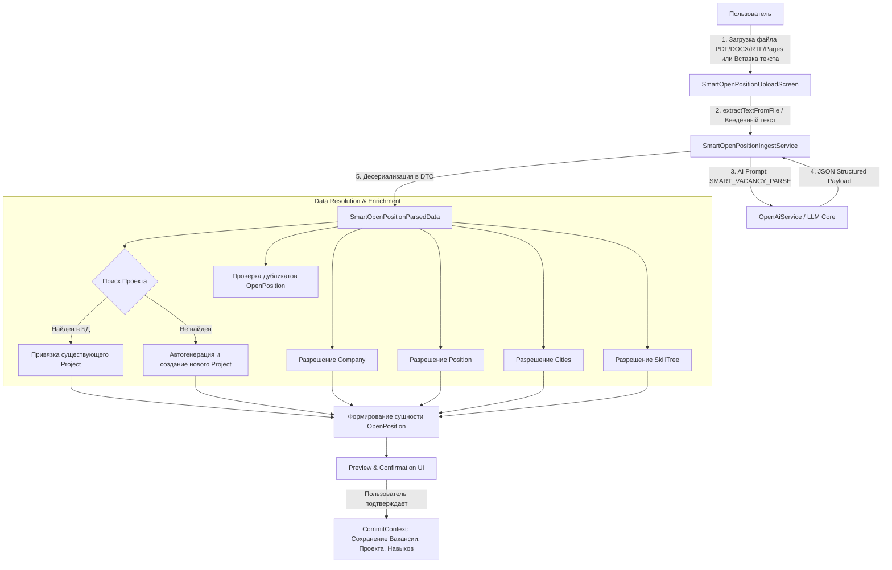

# SmartOpenPositionIngestService — Спецификация сервиса умного создания вакансий

> **Назначение**: Интеллектуальный сервис создания сущности `OpenPosition` и подчиненных справочников (включая автоматический поиск и создание `Project`) на основе произвольного текста или файла описания вакансии с использованием нейросетевых моделей (AI/LLM).  
> **Пакет**: `com.company.hunttech.service`  
> **Интерфейс**: `SmartOpenPositionIngestService.java`  
> **Реализация**: `SmartOpenPositionIngestServiceBean.java`  
> **Экран загрузки**: `SmartOpenPositionUploadScreen.java` (`smart-open-position-upload-screen.xml`)  

## Назначение и бизнес-смысл (What & Why)

Smart Vacancy Creation создаёт вакансию из исходного текста и теперь использует тот же типизированный `HrmAiService`, что и ручная генерация в карточке: чеклист стандартизирует оценку кандидатов, карта поиска даёт рекрутеру стратегию сорсинга, план собеседования стандартизирует подготовку и проведение интервью. Это исключает разные prompt/function mappings в smart и edit-сценариях.

## UI Context & Navigation

`Реестр открытых вакансий → Умная загрузка → Умное создание вакансии`. Preview и подтверждение остаются в текущем web-экране; middleware формирует DTO и сохраняет `OpenPosition` штатным `CommitContext`.

## Behavior Summary

`Исходный текст → VACANCY_SMART_PARSE_JSON формирует основную карточку → для каждого из трёх материалов VacancyMaterialType определяет dedicated AI-функцию → AiExecutionService выполняет запрос → результат записывается в DTO → при недоступности функции сохраняется достаточный parsed-материал либо применяется детерминированный builder → после подтверждения создаётся OpenPosition.`

---

## 1. Архитектурная модель сервиса



---

## 2. Структура извлекаемых данных (`SmartOpenPositionParsedData`)

```java
public class SmartOpenPositionParsedData implements Serializable {
    // Основные атрибуты вакансии
    private String vacancyName;             // Полное название позиции (например: "Senior Java Developer")
    private String positionName;            // Должность/специализация для справочника Position
    private String grade;                   // Грейд: Junior, Middle, Senior, Lead, Architect
    private String remoteWork;              // REMOTE, OFFICE, HYBRID
    private Integer salaryMin;              // Минимальная планка ЗП
    private Integer salaryMax;              // Максимальная планка ЗП
    private String workExperience;          // Требуемый опыт: "От 3 до 6 лет"
    private Integer numberPosition;         // Количество открытых позиций (по умолчанию 1)
    
    // Справочник «Проекты» (Project) и «Компании» (Company)
    private String projectName;             // Название проекта (например: "SSP Лейсан Шестаковой")
    private String projectShortDescription; // Краткое описание проекта (1-2 предложения)
    private String projectFullDescription;  // Подробное описание проекта и технологического стека
    private String companyName;             // Компания-клиент / работодатель
    private String projectOwner;            // Контактное лицо / Лид со стороны заказчика
    
    // Локации и требования
    private List<String> cities;            // Список городов / регионов
    private List<String> skills;            // Список ключевых навыков и технологий (Java, Spring, Kafka...)
    
    // Текстовые блоки вакансии
    private String description;             // Общее описание и задачи
    private String requirements;            // Требования к кандидату
    private String conditions;              // Условия работы и бенефиты
    private String testExercise;            // Тестовое задание (если есть)
    private String memoForCandidate;        // Памятка для кандидата к собеседованию
    private String rawText;                 // Исходный текст вакансии
}
```

---

## 3. Бизнес-логика работы со справочником «Проекты» (`Project`)

Особое внимание уделяется корректной привязке и актуализации проекта:

1. **Алгоритм поиска существующего проекта**:
   - Поиск по точному совпадению `projectName` (без учета регистра).
   - Поиск по подстроке наименования проекта и наименованию связанной компании (`Company`).
   - Поиск по кодовым обозначениям (например, `SSP`, `ПАО Сбербанк`, `Финтех-Платформа`).

2. **Алгоритм создания нового проекта (если не найден)**:
   - Создается новый экземпляр `Project`.
   - Имя проекта: нормализованное значение `projectName` (или генерируется на базе названия компании и направления).
   - Описание проекта: генерируется AI на базе текста вакансии (`projectShortDescription` и `projectFullDescription`).
   - Привязка к компании: разрешается сущность `Company` (если нет — создается).
   - Привязка к департаменту/владельцу: подставляется текущий рекрутер или куратор направления.
   - Добавляется в `CommitContext` транзакции создания вакансии.

3. **Алгоритм актуализации существующего проекта**:
   - Если проект найден, но у него отсутствует описание, AI-описание вакансии дополняет карточку проекта.

---

## 4. AI-промпт извлечения параметров вакансии

Материалы вакансии используют отдельные функции `VACANCY_CHECKLIST`, `VACANCY_SEARCH_MAP`, `VACANCY_INTERVIEW_PLAN`. Их системные prompt устанавливаются миграциями `260921-3`…`260921-5`; приложение не читает prompt-файлы с filesystem. Контекст строится из `SmartOpenPositionParsedData`, поэтому detached getters `OpenPosition` не читаются и риск `Cannot get unfetched attribute` не создаётся.

Prompt migrations защищают административную конфигурацию: update разрешён только для строки нужного code, созданной migration, не изменённой администратором и имеющей `CONFIGURATION_VERSION <= 1`; иначе запись сохраняется без изменений. Отсутствующий code создаётся idempotent insert со стабильным UUID. Smart Vacancy Creation всегда вызывает каждую из трёх dedicated-функций. Если отдельная функция отсутствует, недоступна, вернула пустой результат или завершилась ошибкой, сохраняется достаточный материал из `VACANCY_SMART_PARSE_JSON`; если parsed-материал пуст/слишком короток, используется детерминированный builder. Ошибка одного материала не отменяет остальные вызовы и создание вакансии.

Production-safe порядок (в рамках задачи не выполняется):

1. До применения сделать проверенный backup `HUNTECH_AI_FUNCTION_CONFIGURATION`, сохранить row count и снимок трёх `VACANCY_*` codes, включая ownership/version и hashes prompt.
2. Применить changelog `260921-3` → `260921-4` → `260921-5` штатным Liquibase-процессом.
3. Проверить ровно по одной активной `TEXT_GENERATION` строке на code, `${description}` в template, policy `USER_OVERRIDE_ALLOWED` / `FALLBACK_TO_ADMIN`, неизменность административных и посторонних функций.
4. Выполнить smart preview и подтвердить три dedicated-вызова независимо от наличия parsed-материалов: при доступном AI три поля получают dedicated-результаты; при искусственной недоступности достаточный parsed-материал сохраняется, а отсутствующий/короткий заменяется детерминированным fallback; preview не прерывается.
5. Для rollback деактивировать только новые migration-owned строки либо восстановить три записи из backup; пользовательские override не удалять. Повторно проверить row count, уникальность codes и работу остальных AI-функций.

Системный промпт (`AI Function: SMART_VACANCY_PARSE`):

```
Ты — профессиональный эксперт по найму в IT и рекрутингу в HRM HuntTech.
Твоя задача — внимательно проанализировать текст вакансии от заказчика (загруженный из файла или введенный пользователем) и структурировать все данные в строгий JSON.

ПРАВИЛА ИЗВЛЕЧЕНИЯ:
1. Источник правды — исключительно текст вакансии. Не выдумывай факты.
2. Для проекта (Project):
   - Извлеки название проекта (projectName).
   - Сформулируй краткое емкое описание проекта (projectShortDescription) на 1-2 предложения.
   - Сформулируй развернутое описание сути проекта и стека (projectFullDescription).
   - Извлеки название компании-заказчика (companyName).
3. Для должности и грейда:
   - positionName: стандартизированная IT-должность (Java Developer, QA Automation, DevOps Engineer, Product Manager).
   - grade: Junior, Middle, Senior, Lead, Architect (или "Не указан").
4. Для условий:
   - remoteWork: "REMOTE" (если удаленка/дистанционно), "OFFICE" (только офис), "HYBRID" (гибрид).
   - salaryMin / salaryMax: числовые значения в рублях (или null, если не указано).
   - workExperience: например "От 1 года до 3 лет", "От 3 до 6 лет", "Более 6 лет".
5. Для стека и навыков:
   - skills: массив строк с ключевыми технологиями и инструментами (максимум 20 ключевых скиллов).
6. Для городов:
   - cities: массив названий городов (например: ["Москва", "Санкт-Петербург", "Регионы РФ"]).

ФОРМАТ ОТВЕТА — ТОЛЬКО ВАЛИДНЫЙ JSON БЕЗ МАРКДАУН-ОБЁРТКИ:
{
  "vacancyName": "...",
  "positionName": "...",
  "grade": "...",
  "remoteWork": "REMOTE|OFFICE|HYBRID",
  "salaryMin": 250000,
  "salaryMax": 350000,
  "workExperience": "От 3 до 6 лет",
  "numberPosition": 1,
  "projectName": "...",
  "projectShortDescription": "...",
  "projectFullDescription": "...",
  "companyName": "...",
  "projectOwner": "...",
  "cities": ["Москва"],
  "skills": ["Java", "Spring Boot", "PostgreSQL", "Kafka", "Docker"],
  "description": "...",
  "requirements": "...",
  "conditions": "...",
  "testExercise": "...",
  "memoForCandidate": "..."
}
```

---

## 5. Экран «Умное создание вакансии» (`SmartOpenPositionUploadScreen`)

### 5.1 Режимы ввода данных
1. **Загрузка файла** (`FileUploadField` / Drag and Drop): поддержка форматов `.pdf`, `.docx`, `.doc`, `.rtf`, `.pages`, `.txt`.
2. **Вставка из буфера обмена / Текстовый редактор** (`RichTextArea` / `SourceCodeEditor`): возможность скопировать описание вакансии из мессенджера, письма или Jira/Confluence.

### 5.2 Карточка предварительного просмотра и верификации
- **Шапка**: Определенный проект (с бейджем `[Существующий проект]` или `[Будет создан новый проект: "Название"]`).
- **Сетка реквизитов**: Компания, Должность, Грейд, Формат работы, Зарплатная вилка, Города.
- **Блок дубликатов**: Если найдена активная вакансия с аналогичным названием и проектом — отображается предупреждение с возможностью перейти к ней или создать новую.
- **Стек навыков**: Чипсы распознанных технологий.

### 5.3 Кнопки сохранения
- **«Создать вакансию и проект»** — коммит созданной вакансии и открытие карточки `OpenPositionEdit` в реестре.
- **«Привязать к существующему проекту»** — выбор другого проекта из справочника перед сохранением.

---

## История изменений

| Дата | Изменение |
|---|---|
| 2026-09-21 | Smart Vacancy Creation всегда переиспользует типизированный `HrmAiService.generateVacancyMaterial` для чеклиста, карты поиска и плана собеседования; parsed-материал и deterministic builder образуют fallback, сохранены DTO-only context/Data View Integrity и production-safe prompt migration runbook. |
