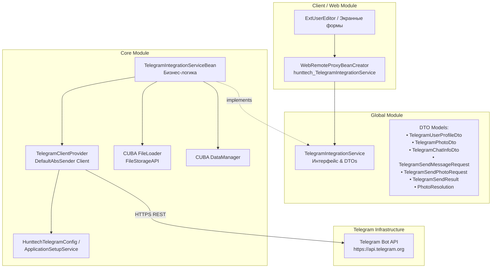
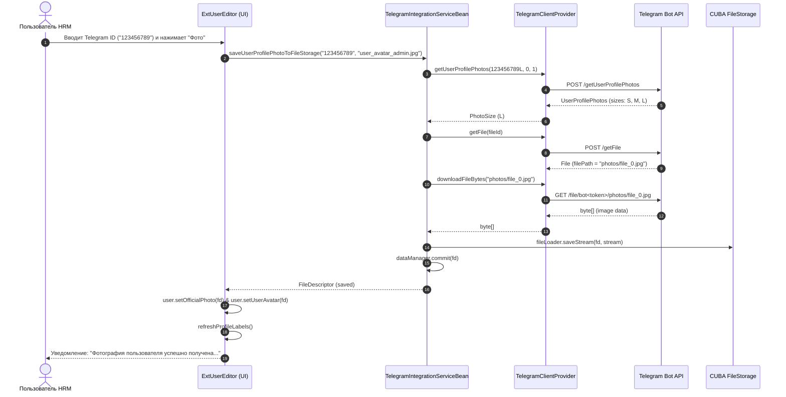

# TelegramIntegrationService — Руководство и Архитектурная документация

## 1. Назначение и обзор

`TelegramIntegrationService` — полнофункциональный сервис платформы HRM HuntTech (CUBA Platform 7.3 / Spring / TelegramBots 6.8), предоставляющий интерфейс для интеграции с Telegram Bot API.

### Основные возможности:
1. **Получение профилей и метаданных пользователей Telegram** (числовой ID, username, имя, фамилия, bio/описание, флаг бота, наличие фото).
2. **Получение и загрузка аватарок/фотографий пользователей по их Telegram-ID или username** в различных разрешениях (`THUMBNAIL`, `MEDIUM`, `HIGH_RESOLUTION`, `LARGEST_AVAILABLE`).
3. **Автоматическое сохранение фото в CUBA FileStorage** с созданием и регистрацией сущности `FileDescriptor` для прямого прикрепления к `ExtUser`, `JobCandidate` или `Person`.
4. **Получение информации о чатах, группах, супергруппах и каналах** (название, описание, количество участников, аватар чата, ссылка-приглашение).
5. **Отправка форматированных текстовых сообщений** пользователям (direct), в группы и каналы с поддержкой режимов `HTML` и `Markdown`, тихих уведомлений (`silent mode`) и матриц `Inline-кнопок` (URL / Callback).
6. **Отправка медиафайлов и фотографий** с подписями через массив байтов, существующий `FileDescriptor` или `telegramFileId`.

---

## 2. Архитектура и модульная структура



### Независимость исходящих API-запросов (`TelegramClientProvider`)
В отличие от фонового процесса чтения входящих обновлений (long polling bot), клиент `TelegramClientProvider` основан на `DefaultAbsSender`. Это позволяет выполнять любые API-запросы (получение аватарок, отправку сообщений и т.д.) мгновенно, не требуя активной long-polling сессии. Достаточно наличия сконфигурированного токена бота.

---

## 3. Спецификация API (Интерфейс `TelegramIntegrationService`)

Интерфейс: `com.company.hunttech.service.TelegramIntegrationService`  
Имя Spring бина: `hunttech_TelegramIntegrationService`

| Метод | Параметры | Возвращаемое значение | Описание |
| :--- | :--- | :--- | :--- |
| `isConfigured` | — | `boolean` | Проверяет, задан ли токен и включен ли Telegram в настройках. |
| `getUserProfile` | `Long telegramUserId` | `TelegramUserProfileDto` | Возвращает DTO профиля пользователя по числовому ID. |
| `getUserProfile` | `String telegramIdOrUsername` | `TelegramUserProfileDto` | Перегрузка по числовому ID или `@username`. |
| `getUserProfilePhoto` | `Long telegramUserId, PhotoResolution resolution` | `TelegramPhotoDto` | Получает метаданные фото (размеры, `file_id`, путь к файлу на сервере Telegram). |
| `getUserProfilePhoto` | `String telegramIdOrUsername, PhotoResolution resolution` | `TelegramPhotoDto` | Перегрузка по числовому ID или `@username`. |
| `downloadUserProfilePhotoBytes` | `Long telegramUserId, PhotoResolution resolution` | `byte[]` | Скачивает бинарные данные (JPEG/PNG) фото в память. |
| `downloadUserProfilePhotoBytes` | `String telegramIdOrUsername, PhotoResolution resolution` | `byte[]` | Скачивает бинарные данные по строковому ID или `@username`. |
| `saveUserProfilePhotoToFileStorage`| `Long telegramUserId, String customFileName` | `FileDescriptor` | **Приоритетное действие:** скачивает фото в максимальном качестве, сохраняет в `FileStorage` и регистрирует `FileDescriptor`. |
| `saveUserProfilePhotoToFileStorage`| `String telegramIdOrUsername, String customFileName` | `FileDescriptor` | Перегрузка для сохранения по строковому ID или `@username`. |
| `getChatInfo` | `String chatIdOrUsername` | `TelegramChatInfoDto` | Получает данные о приватном чате, группе или канале. |
| `sendMessage` | `TelegramSendMessageRequest request` | `TelegramSendResult` | Отправляет текстовое сообщение с форматированием и кнопками. |
| `sendMessage` | `String targetChatId, String text` | `TelegramSendResult` | Упрощенная отправка HTML-текста в чат/канал. |
| `sendPhoto` | `TelegramSendPhotoRequest request` | `TelegramSendResult` | Отправляет фотографию с подписью в чат/канал. |

---

## 4. Описание DTO моделей

Все DTO расположены в пакете `com.company.hunttech.service.dto.telegram`:

### `TelegramUserProfileDto`
* `Long id` — числовой ID пользователя Telegram.
* `String username` — имя пользователя без символа `@`.
* `String firstName`, `String lastName` — имя и фамилия.
* `String bio` — биография/описание.
* `Boolean hasPhoto` — флаг наличия хотя бы одного фото.
* `Integer totalPhotosCount` — общее число фото в профиле.
* `String mainPhotoFileId` — Telegram `file_id` главной фотографии.
* `getDisplayName()` — форматированное имя для отображения (`"First Last"` или `"@username"`).

### `TelegramPhotoDto`
* `String fileId` — ID файла в Telegram.
* `String fileUniqueId` — постоянный уникальный ID файла.
* `Integer width`, `Integer height`, `Integer fileSize` — габариты и размер.
* `String filePath` — относительный путь к файлу на серверах Telegram (`photos/file_...jpg`).
* `PhotoResolution resolution` — запрошенное разрешение.
* `byte[] imageBytes` — массив байтов (если запрошено скачивание).
* `FileDescriptor fileDescriptor` — зарегистрированный дескриптор файла CUBA.

### `PhotoResolution` (Enum)
* `THUMBNAIL` — превью (обычно ~160x160).
* `MEDIUM` — средний размер (~320x320).
* `HIGH_RESOLUTION` — высокое разрешение (~640x640).
* `LARGEST_AVAILABLE` — максимально доступный размер из предоставленных Telegram.

### `TelegramSendMessageRequest`
* `String targetChatId` — ID чата или `@channel_username`.
* `String text` — текст сообщения.
* `String parseMode` — `"HTML"` (по умолчанию), `"Markdown"`, `"MarkdownV2"` или `null`.
* `Boolean disableWebPagePreview` — отключить предпросмотр ссылок.
* `Boolean disableNotification` — беззвучная отправка.
* `Integer replyToMessageId` — ответ на сообщение.
* `List<List<InlineButtonDto>> inlineKeyboard` — матрица inline-кнопок (`text`, `url`, `callbackData`).

### `TelegramSendPhotoRequest`
* `String targetChatId` — ID получателя/канала.
* `byte[] photoBytes` — массив байтов (если фото передается напрямую).
* `FileDescriptor fileDescriptor` — дескриптор файла из CUBA FileStorage.
* `String telegramFileId` — существующий `file_id`.
* `String caption` — подпись к фото.
* `String parseMode` — режим разметки подписи.
* `List<List<InlineButtonDto>> inlineKeyboard` — кнопки под фото.

### `TelegramSendResult`
* `boolean success` — признак успешной доставки.
* `Integer messageId` — ID отправленного сообщения в Telegram.
* `Long chatId` — ID чата, куда доставлено сообщение.
* `String failureReason` — описание ошибки при сбое.
* `Integer errorCode` — HTTP / Telegram API код ошибки.
* `Date timestamp` — метка времени.

---

## 5. Workflow: Загрузка фотографии пользователя в профиль



---

## 6. Пример интеграции в экранных формах (на примере `ExtUserEditor`)

### XML-разметка (`ext-user-edit.xml`):
```xml
<field id="telegram" custom="true" caption="msg://msgTelegram">
    <hbox id="telegramBox" width="100%" spacing="true" expand="telegramField">
        <textField id="telegramField" datasource="userDs" property="telegram" width="100%" stylename="edit-form-control"/>
        <button id="fetchTelegramPhotoBtn" caption="msg://msgFetchPhoto" icon="font-icon:CAMERA" invoke="fetchTelegramPhoto" stylename="ext-user-editor-primary-action"/>
    </hbox>
</field>
```

### Java-контроллер (`ExtUserEditor.java`):
```java
@Inject
private TelegramIntegrationService telegramIntegrationService;
@Inject
private TextField<String> telegramField;

public void fetchTelegramPhoto() {
    User user = getItem();
    if (!(user instanceof ExtUser)) {
        return;
    }
    ExtUser extUser = (ExtUser) user;
    String rawTelegram = telegramField != null ? telegramField.getValue() : extUser.getTelegram();

    if (StringUtils.isBlank(rawTelegram)) {
        showNotification(getMessage("msgTelegramPhotoEmpty"), NotificationType.WARNING);
        return;
    }

    if (!telegramIntegrationService.isConfigured()) {
        showNotification(getMessage("msgTelegramNotConfigured"), NotificationType.ERROR);
        return;
    }

    String fileName = "user_avatar_" + extUser.getLogin() + "_" + System.currentTimeMillis() + ".jpg";
    FileDescriptor photoFd = telegramIntegrationService.saveUserProfilePhotoToFileStorage(rawTelegram.trim(), fileName);

    if (photoFd != null) {
        extUser.setOfficialPhoto(photoFd);
        extUser.setUserAvatar(photoFd);
        userDs.getItem().setValue("officialPhoto", photoFd);
        userDs.getItem().setValue("userAvatar", photoFd);
        showNotification(getMessage("msgTelegramPhotoSuccess"), NotificationType.HUMANIZED);
    } else {
        showNotification(getMessage("msgTelegramPhotoNotFound"), NotificationType.WARNING);
    }
}
```

---

## 7. Логирование и диагностика

Сервис и UI-компоненты ведут подробное сквозное логирование по категориям:
- `com.company.hunttech.service.TelegramIntegrationServiceBean`
- `com.company.hunttech.core.telegram.TelegramClientProvider`
- `com.company.hunttech.web.screens.extuser.ExtUserEditor`

### Примеры диагностических записей в логе:
```text
INFO  [TelegramIntegrationServiceBean] saveUserProfilePhotoToFileStorage invoked for userId=123456789, customFileName='user_avatar_admin_1724238500.jpg'
INFO  [TelegramIntegrationServiceBean] Getting Telegram profile photo metadata for userId=123456789, resolution=LARGEST_AVAILABLE
INFO  [TelegramIntegrationServiceBean] Photo metadata retrieved: fileId=AgACAgIAAxkBA..., width=640, height=640, filePath=photos/file_0.jpg
INFO  [TelegramIntegrationServiceBean] Successfully downloaded 45218 bytes of photo for userId=123456789
INFO  [TelegramIntegrationServiceBean] Telegram avatar successfully stored to FileStorage: id=a1b2c3d4-..., name='user_avatar_admin_1724238500.jpg', size=45218 bytes
INFO  [ExtUserEditor] Telegram profile photo successfully saved: FileDescriptor ID=a1b2c3d4-..., name='user_avatar_admin_1724238500.jpg', size=45218 bytes
```

### Диагностика типичных проблем:
1. **Токен не задан или бот выключен**:
   - Лог: `WARN [ExtUserEditor] fetchTelegramPhoto: TelegramIntegrationService is not configured or bot disabled`
   - UI: `Telegram-интеграция не настроена (проверьте токен бота в настройках приложения)`
2. **У пользователя скрыта или отсутствует аватарка в настройках конфиденциальности Telegram**:
   - Лог: `INFO [TelegramIntegrationServiceBean] No profile photo found for Telegram userId=...`
   - UI: `У пользователя с данным Telegram ID/username не найдена фотография профиля`
3. **Пользователь ввел несуществующий `@username`**:
   - Лог: `DEBUG [TelegramClientProvider] Failed to resolve username '@...' to chat: [400] Bad Request: chat not found`
