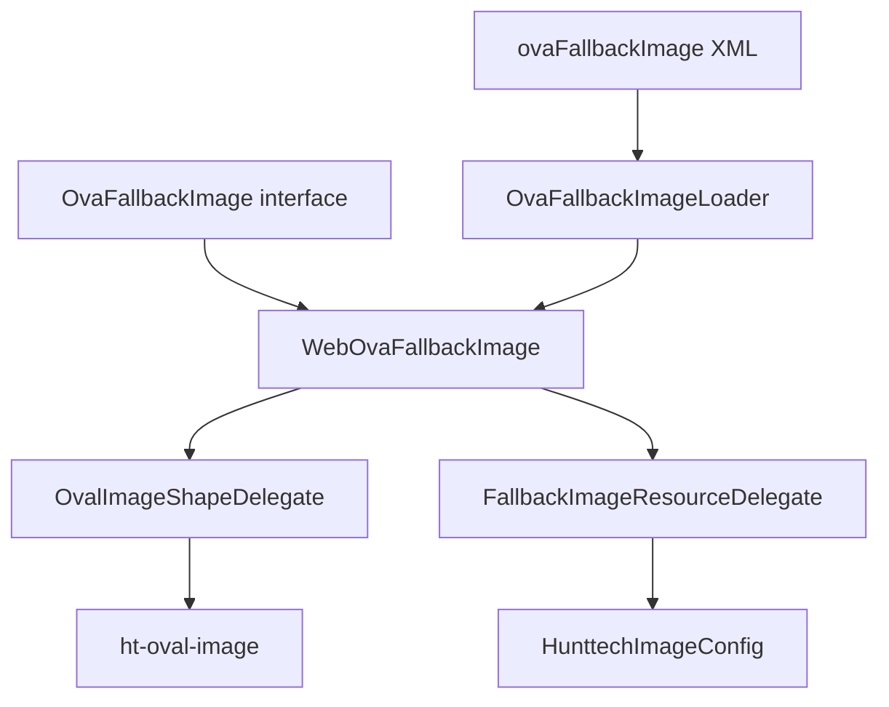

# OvaFallbackImage — кастомный UI-компонент HRM HuntTech

> **Расположение документации:** `docs/ui-components/` (legacy). При миграции на нумерованную структуру проекта — целевой путь: `docs/03_ui_components/OvaFallbackImage.md`.
>
> См. также: [OvalImage](OvalImage.md) — только круглый аватар; [FallbackImage](../components/FallbackImage.md) — только placeholder.
>
> **Миграция:** компонент `roundImageWithFallback` / `RoundImageWithFallback` переименован в `ovaFallbackImage` / `OvaFallbackImage` (2026-06-30).

---

## История изменений

| Дата | Изменение |
|------|-----------|
| 2026-06-30 | Рефакторинг `RoundImageWithFallback` → `OvaFallbackImage` с composition/delegation через `OvalImageShapeDelegate` и `FallbackImageResourceDelegate` |
| 2026-06-30 | Создание предшественника `RoundImageWithFallback` (объединение API `OvalImage` и `FallbackImage`) |

---

## Назначение и бизнес-смысл

**OvaFallbackImage** (`ovaFallbackImage` — имя в screen XML и константа `OvaFallbackImage.NAME`) — единый CUBA-компонент для **круглых аватаров с placeholder**, когда привязанное поле (`FileDescriptor`) пусто, отсутствует в хранилище или не загружается.

Типичные сценарии в HRM HuntTech:

- фото профиля пользователя (`ExtUser.officialPhoto`) — круг + SVG-placeholder;
- миниатюра кандидата на edit/browse без дублирования `<ovalImage>` + Java-логики fallback;
- любые экраны, где раньше требовалась пара `OvalImage` + `FallbackImage` или ручная подстановка theme-ресурса.

---

## Архитектурная структура

| Слой | Путь | Роль |
|------|------|------|
| **gui** (контракт) | [`modules/gui/src/com/hunttech/hrm/gui/components/OvaFallbackImage.java`](../../modules/gui/src/com/hunttech/hrm/gui/components/OvaFallbackImage.java) | Интерфейс `extends OvalImage, FallbackImage` |
| **web** (реализация) | [`modules/web/src/com/hunttech/hrm/web/components/WebOvaFallbackImage.java`](../../modules/web/src/com/hunttech/hrm/web/components/WebOvaFallbackImage.java) | Vaadin/CUBA web-компонент; делегирует oval и fallback поведение |
| **web** (delegates) | [`modules/web/src/com/hunttech/hrm/web/components/delegate/`](../../modules/web/src/com/hunttech/hrm/web/components/delegate/) | `OvalImageShapeDelegate`, `FallbackImageResourceDelegate` |
| **web** (XML-loader) | [`modules/web/src/com/hunttech/hrm/web/loaders/OvaFallbackImageLoader.java`](../../modules/web/src/com/hunttech/hrm/web/loaders/OvaFallbackImageLoader.java) | Читает `ovalWidth`, `ovalHeight`, `fallbackThemePath` |
| **регистрация XML** | [`modules/web/src/com/hunttech/hrm/web/cuba-ui-component.xml`](../../modules/web/src/com/hunttech/hrm/web/cuba-ui-component.xml) | Связка имени, класса и loader'а |
| **регистрация Java** | [`modules/web/src/com/hunttech/hrm/web/config/HunttechUiComponentsRegistrar.java`](../../modules/web/src/com/hunttech/hrm/web/config/HunttechUiComponentsRegistrar.java) | `webUiComponents.register(OvaFallbackImage.NAME, ...)` |
| **конфиг** | [`modules/global/src/com/company/hunttech/config/HunttechImageConfig.java`](../../modules/global/src/com/company/hunttech/config/HunttechImageConfig.java) | Глобальный `hunttech.defaultFallbackImagePath` |
| **стили** | `modules/web/themes/*/com.company.itpearls/*-ext.scss` | Класс `.ht-oval-image` (`border-radius: 50%`) |

### Composition / delegation (Decorator)

Java не поддерживает наследование от двух реализаций. Архитектура:

1. **Интерфейс** `OvaFallbackImage extends OvalImage, FallbackImage` — единый контракт через multiple interface inheritance.
2. **Web-класс** `WebOvaFallbackImage extends WebImage` — одна Vaadin-обёртка; поведение делегируется:
   - `OvalImageShapeDelegate` — размеры 1:1, CSS `ht-oval-image`;
   - `FallbackImageResourceDelegate` — placeholder при null / пустом / отсутствующем файле.
3. **Host-интерфейсы** `OvalImageHost`, `FallbackImageHost` — callbacks для делегатов без дублирования `WebImage` API.
4. **Loader** `OvaFallbackImageLoader` — объединяет атрибуты `OvalImageLoader` и `FallbackImageLoader`.



---

## Поведение

### Круг (oval sizing)

- CSS-класс `ht-oval-image` задаётся делегатом в конструкторе.
- `setOvalWidth` / `setOvalHeight` синхронизируют второй размер, если он пуст (как в `WebOvalImage`).
- `OvaFallbackImageLoader` при XML-загрузке копирует один атрибут в другой, если задан только один.

### Fallback (placeholder)

Приоритет источника fallback:

| Приоритет | Источник | Как задаётся |
|-----------|----------|--------------|
| 1 | Java | `setFallbackThemePath()` / `setFallbackResource()` |
| 2 | Screen XML | `fallbackThemePath="..."` |
| 3 | Глобальная конфигурация | `hunttech.defaultFallbackImagePath` в `HunttechImageConfig` |

В `updateComponent` (`FallbackImageResourceDelegate.tryApplyFallback`): если значение `valueSource` — `null`, пустая строка или `FileDescriptor` без файла в хранилище (`FileDescriptorImageHelper.fileExists`) и задан `fallbackResource` — отображается theme-ресурс; иначе стандартная логика `WebImage`.

---

## Примеры использования

### Screen XML

```xml
<ovaFallbackImage id="userAvatar"
                  ovalWidth="180px"
                  fallbackThemePath="images/hunttech-placeholder.svg"
                  align="MIDDLE_CENTER"
                  scaleMode="SCALE_DOWN"
                  dataContainer="userDs"
                  property="officialPhoto"/>
```

Достаточно одного размера — второй синхронизируется loader'ом:

```xml
<ovaFallbackImage id="candidateThumb"
                  ovalHeight="80px"
                  dataContainer="jobCandidateDc"
                  property="fileImageFace"
                  scaleMode="CONTAIN"/>
```

### Java — программное создание

```java
import com.hunttech.hrm.gui.components.OvaFallbackImage;
import com.haulmont.cuba.gui.UiComponents;

OvaFallbackImage image = uiComponents.create(OvaFallbackImage.NAME);
image.setOvalWidth("28px");
image.setFallbackThemePath("icons/local-placeholder.jpeg");
image.setScaleMode(Image.ScaleMode.CONTAIN);
parentLayout.add(image);
```

---

## Тесты

[`modules/web/src/test/java/com/hunttech/hrm/web/components/WebOvaFallbackImageTest.java`](../../modules/web/src/test/java/com/hunttech/hrm/web/components/WebOvaFallbackImageTest.java):

- fallback из `HunttechImageConfig` и переопределение через `setFallbackThemePath`;
- `updateComponent` с `null` → theme fallback, с `FileDescriptor` в хранилище → без подстановки, с отсутствующим файлом → fallback;
- синхронизация `ovalWidth` / `ovalHeight`;
- наличие стиля `ht-oval-image`.

---

## См. также

- [OvalImage](OvalImage.md) — только круглый аватар без fallback
- [FallbackImage](../components/FallbackImage.md) — только placeholder без круга
- [ImageProcessingService](../services/ImageProcessingService.md) — сжатие загружаемых фото
