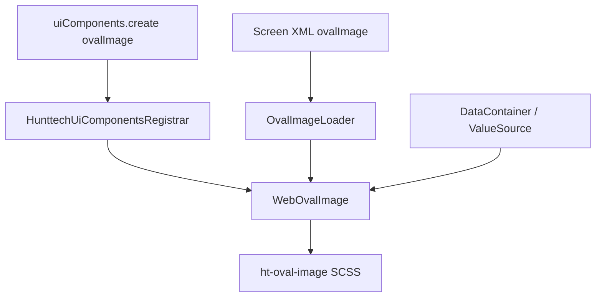

# OvalImage — кастомный UI-компонент HRM HuntTech

> См. также: [FallbackImage](../components/FallbackImage.md) — placeholder для пустого `image`; [OvaFallbackImage](OvaFallbackImage.md) — **объединённый** компонент (круг + fallback в одном теге).

---

## История изменений

| Дата | Изменение |
|------|-----------|
| 2026-06-29 | Первоначальная документация компонента в `docs/ui-components/OvalImage.md` |
| 2026-06-29 | Реализация `OvalImage` / `WebOvalImage` / `OvalImageLoader`; стили `.ht-oval-image` в темах hover и halo |
| 2026-06-30 | Cross-link на объединённый компонент [OvaFallbackImage](OvaFallbackImage.md) |

---

## 1. Описание компонента

**OvalImage** (`ovalImage` — имя в screen XML и константа `OvalImage.NAME`) — кастомный UI-компонент HRM HuntTech, расширяющий стандартный CUBA-компонент [`Image`](https://doc.cuba-platform.com/manual-7.3/gui_Image.html).

Назначение:

- отображение фотографий (аватар пользователя, лицо кандидата, миниатюры в таблицах) в **круглой** (овальной) форме;
- единообразный визуальный стиль без дублирования CSS в каждом экране;
- наследование всего API `Image`: привязка к `dataContainer` / `property`, `scaleMode`, `FileDescriptor`, клики и т.д.

Визуальный эффект достигается CSS-классом `ht-oval-image` (`border-radius: 50%`, `object-fit: cover`, `overflow: hidden`). Компонент задаёт размеры через атрибуты `ovalWidth` / `ovalHeight` (или стандартные `width` / `height` после синхронизации).

Типичные сценарии в HRM HuntTech:

- миниатюра лица кандидата в колонке `JobCandidateBrowse`;
- виджет «Моё фото» на дашборде (`MyPhotoWidget`);
- любые экраны, где нужен круглый аватар вместо прямоугольного `image`.

---

## 2. Архитектурная структура

| Слой | Путь | Роль |
|------|------|------|
| **gui** (контракт) | [`modules/gui/src/com/company/itpearls/gui/components/OvalImage.java`](../../modules/gui/src/com/company/itpearls/gui/components/OvalImage.java) | Интерфейс, расширяет `Image`; `NAME = "ovalImage"`; API `ovalWidth` / `ovalHeight` |
| **gui** (legacy alias) | [`modules/gui/src/com/company/hunttech/gui/components/OvalImage.java`](../../modules/gui/src/com/company/hunttech/gui/components/OvalImage.java) | `@deprecated` — делегирует в `com.company.itpearls.gui.components.OvalImage` |
| **web** (реализация) | [`modules/web/src/com/company/hunttech/web/gui/components/WebOvalImage.java`](../../modules/web/src/com/company/hunttech/web/gui/components/WebOvalImage.java) | Vaadin/CUBA web-компонент; применяет `ht-oval-image`; синхронизация размеров |
| **web** (XML-loader) | [`modules/web/src/com/company/hunttech/web/gui/xml/layout/loaders/OvalImageLoader.java`](../../modules/web/src/com/company/hunttech/web/gui/xml/layout/loaders/OvalImageLoader.java) | Создаёт `ovalImage`, читает `ovalWidth` / `ovalHeight` из screen XML |
| **регистрация XML** | [`modules/web/src/com/hunttech/hrm/web/cuba-ui-component.xml`](../../modules/web/src/com/hunttech/hrm/web/cuba-ui-component.xml) | Связка имени `ovalImage`, класса `WebOvalImage` и `OvalImageLoader` |
| **подключение** | [`modules/web/src/com/company/itpearls/web-app.properties`](../../modules/web/src/com/company/itpearls/web-app.properties) | `cuba.web.componentsConfig = +com/hunttech/hrm/web/cuba-ui-component.xml` |
| **регистрация Java** | [`modules/web/src/com/hunttech/hrm/web/config/HunttechUiComponentsRegistrar.java`](../../modules/web/src/com/hunttech/hrm/web/config/HunttechUiComponentsRegistrar.java) | `@Component`; при старте регистрирует `WebOvalImage` в `WebUiComponents` для `uiComponents.create()` |
| **стили hover** | [`modules/web/themes/hover/com.company.itpearls/hover-ext.scss`](../../modules/web/themes/hover/com.company.itpearls/hover-ext.scss) | Блок `.ht-oval-image` |
| **стили halo** | [`modules/web/themes/halo/com.company.itpearls/halo-ext.scss`](../../modules/web/themes/halo/com.company.itpearls/halo-ext.scss) | Блок `.ht-oval-image` (идентичные правила) |

### Поток данных



`WebOvalImage` **не** помечен `@Component` — экземпляры создаются фабрикой CUBA (`UiComponents` / `WebUiComponents`), а класс регистрируется в `HunttechUiComponentsRegistrar` и в `cuba-ui-component.xml`.

---

## 3. Логика автоматического круга

Чтобы аватар оставался **круглым**, ширина и высота должны совпадать. Синхронизация выполняется на двух уровнях.

### OvalImageLoader (screen XML)

При загрузке XML, если задан только один из атрибутов:

- `ovalWidth` задан, `ovalHeight` пуст → `ovalHeight = ovalWidth`;
- `ovalHeight` задан, `ovalWidth` пуст → `ovalWidth = ovalHeight`.

Затем вызываются `setOvalWidth` / `setOvalHeight` на компоненте.

### WebOvalImage (runtime / Java)

- `setOvalWidth(width)` — сохраняет `ovalWidth`, вызывает `setWidth(width)`; если `ovalHeight` ещё пуст, копирует `width` в высоту через `setOvalHeightInternal`.
- `setOvalHeight(height)` — симметрично: если `ovalWidth` пуст, копирует `height` в ширину.

Внутренние методы `setOvalWidthInternal` / `setOvalHeightInternal` обновляют поле и размер компонента **без** повторной рекурсивной синхронизации.

**Итог:** достаточно указать один размер (`ovalWidth="80px"` или `setOvalWidth("28px")`) — второй подставится автоматически, CSS `border-radius: 50%` даёт круг.

---

## 4. Примеры использования

### Screen XML (browse / edit / view)

Тег `<ovalImage>` доступен в **дескрипторах экранов**, подключённых через `cuba-ui-component.xml`. Наследуются стандартные атрибуты `image` (`dataContainer`, `property`, `scaleMode`, `align` и т.д.).

```xml
<ovalImage id="userAvatar"
           ovalWidth="180px"
           align="MIDDLE_CENTER"
           scaleMode="SCALE_DOWN"
           dataContainer="userDs"
           property="officialPhoto"/>
```

Достаточно одного размера — второй синхронизируется loader'ом:

```xml
<ovalImage id="candidateThumb"
           ovalHeight="80px"
           dataContainer="jobCandidateDc"
           property="fileImageFace"
           scaleMode="CONTAIN"/>
```

> **Ограничение:** в **фрагментах экранов** (`*-fragment.xml`) и **виджетах дашборда** тег `<ovalImage>` в XML **не используется** — компонент создаётся программно через `UiComponents.create(OvalImage.NAME)` (см. `MyPhotoWidget`).

### Java — программное создание

```java
import com.company.itpearls.gui.components.OvalImage;
import com.haulmont.cuba.gui.UiComponents;

@Inject
private UiComponents uiComponents;

OvalImage image = uiComponents.create(OvalImage.NAME);
image.setOvalWidth("28px");   // высота станет 28px автоматически
image.setScaleMode(Image.ScaleMode.CONTAIN);
parentLayout.add(image);
```

**Примеры в проекте:**

- [`JobCandidateBrowse.java`](../../modules/web/src/com/company/itpearls/web/screens/jobcandidate/JobCandidateBrowse.java) — `columnGenerator` для колонки `fileImageFace`;
- [`MyPhotoWidget.java`](../../modules/web/src/com/company/itpearls/web/widgets/others/MyPhotoWidget.java) — виджет дашборда, создание в `@Subscribe onInit`.

### Java — `@Inject` по id (если объявлен в screen XML)

```java
import com.company.itpearls.gui.components.OvalImage;

@Inject
private OvalImage userAvatar;

@Subscribe
public void onBeforeShow(BeforeShowEvent event) {
    userAvatar.setOvalWidth("150px");
}
```

### Регистрация для `uiComponents.create()`

Класс [`HunttechUiComponentsRegistrar`](../../modules/web/src/com/hunttech/hrm/web/config/HunttechUiComponentsRegistrar.java) помечен `@Component` и на событии `AppContextInitializedEvent` выполняет:

```java
webUiComponents.register(OvalImage.NAME, WebOvalImage.class);
```

Без этой регистрации программное создание (`uiComponents.create(OvalImage.NAME)`) в column generator'ах и виджетах не работает; XML-тег опирается на `cuba-ui-component.xml`.

---

## См. также

- [FallbackImage](../components/FallbackImage.md) — placeholder при пустом `FileDescriptor`
- [OvaFallbackImage](OvaFallbackImage.md) — круг + fallback в одном компоненте
- [ImageProcessingService](../services/ImageProcessingService.md) — сжатие и лимиты фото профиля
- [ExtUser](../entities/ExtUser.md) — поле `officialPhoto`, экраны с аватарами
