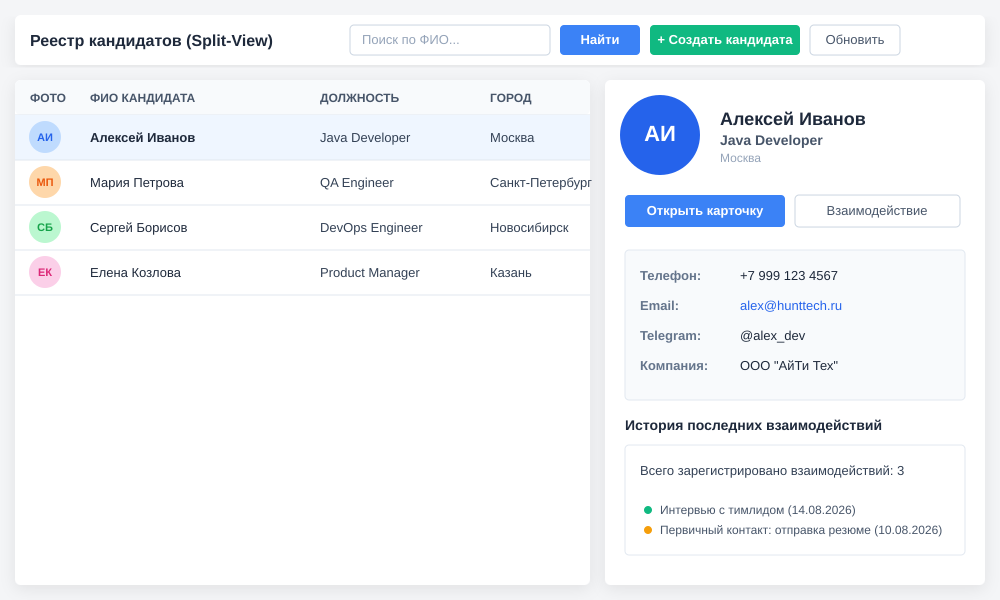
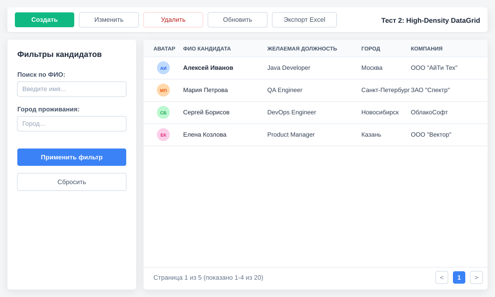
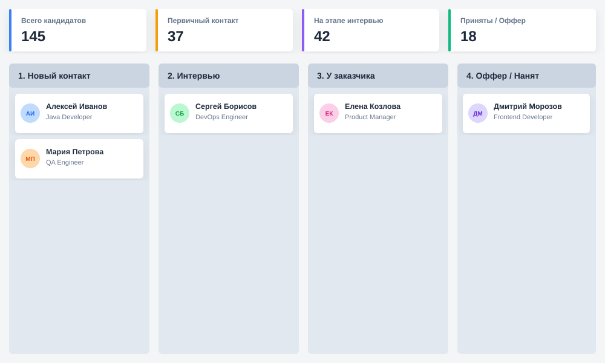
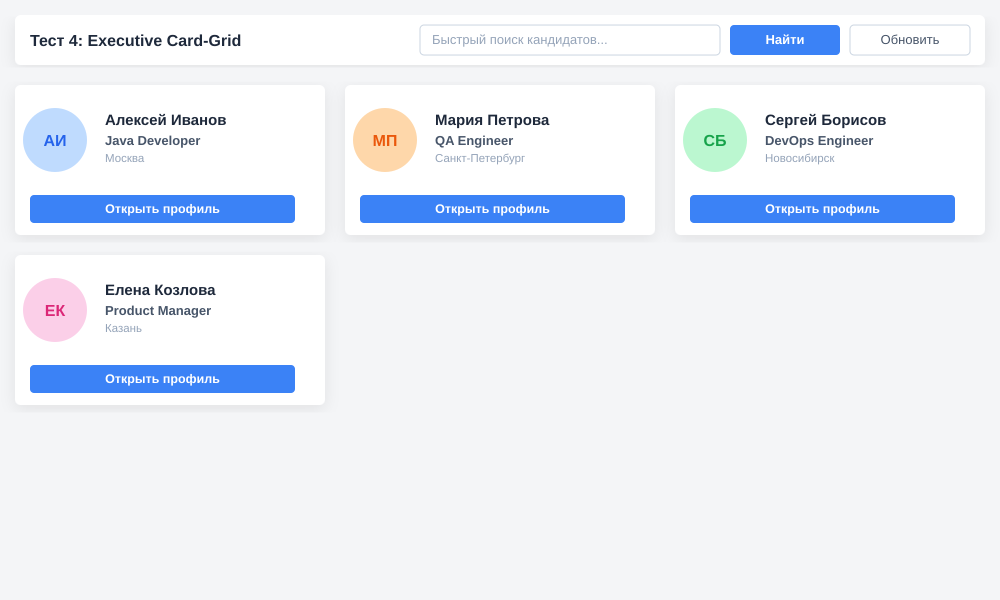
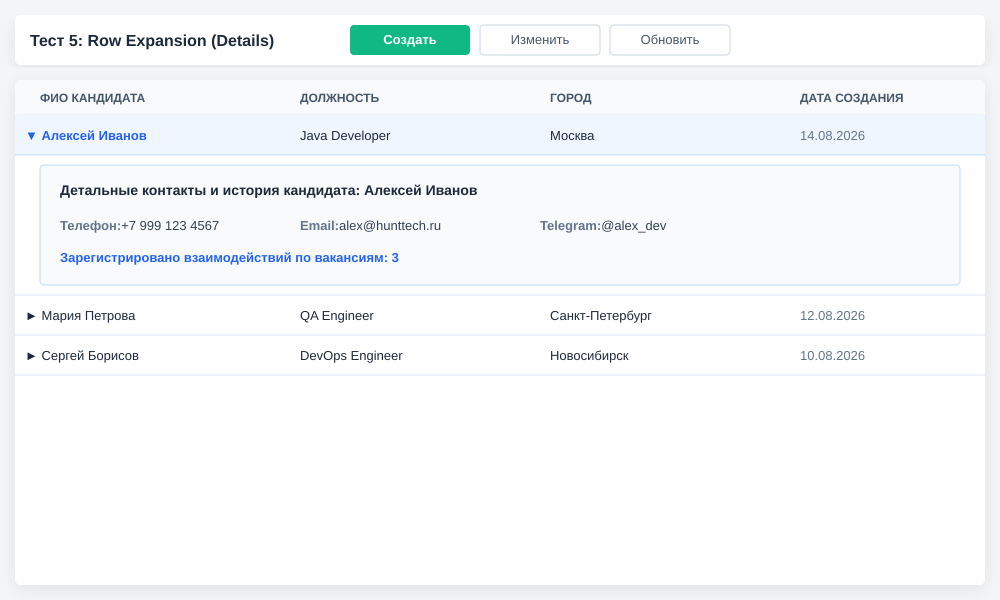

# Спецификация тестовых экранов (эскизов) JobCandidate Browse

## Business & Context Intro

### 1. Назначение и Бизнес-смысл (What & Why)
Данная группа из пяти экспериментальных (тестовых) экранов разработана как набор альтернативных UI/UX-концепций (эскизов) для основного рабочего пространства рекрутера по просмотру базы кандидатов в HRM HuntTech. Экраны созданы для тестирования различных моделей взаимодействия: двухпанельного Split-View (Master-Detail), плотного реестра с левой панелью фильтрации (High-Density DataGrid), Kanban-доски воронки кандидатов, сеточной раскладки карточек (Executive Card-Grid) и раскрытия строк DataGrid по месту (Row Details).

### 2. Связи в интерфейсе и Навигация (UI Context & Navigation)
Все тестовые экраны зарегистрированы в меню приложения `web-menu.xml` в группе «Подбор» (`application-hunting`):
* **Реестр кандидатов (Split-View):** `hunttech_JobCandidateReestr.browse` (как и базовый `hunttech_JobCandidateTest.browse`)
* **Тест 2 (High-Density):** `hunttech_JobCandidateTest2.browse`
* **Тест 3 (Kanban):** `hunttech_JobCandidateTest3.browse`
* **Тест 4 (Card-Grid):** `hunttech_JobCandidateTest4.browse`
* **Тест 5 (Row Expansion):** `hunttech_JobCandidateTest5.browse`

Каждый из этих экранов является изолированным концептом, работающим с реальными данными сущности `JobCandidate`, но не затрагивающим канонический browse-экран `hunttech_JobCandidate.browse`.

### 3. Краткий обзор бизнес-логики поведения (Behavior Summary)
* **Эскизы 1 и базовый (Split-View):** Клик по строке таблицы слева загружает данные выбранного кандидата во вспомогательный ScrollBox детальной панели справа.
* **Эскиз 2 (High-Density):** Поиск по имени и городу в левом аккордеоне фильтров перестраивает JPQL-запрос лоадера и перезагружает таблицу.
* **Эскиз 3 (Kanban):** Распределяет кандидатов из коллекции по 4 колонкам этапов воронки подбора, рассчитывая KPI в верхней панели.
* **Эскиз 4 (Card-Grid):** Группирует кандидатов по 3 в ряд в сеточном виде с крупными аватарами и прямым действием «Открыть профиль».
* **Эскиз 5 (Row Expansion):** Устанавливает генератор деталей строки (`Row Details`) для DataGrid. Клик по строке раскрывает контакты кандидата под выбранной записью.

---

## 1. Технические контракты экранов

| Эскиз | Screen ID | Контроллер | XML-дескриптор | Иконка |
|---|---|---|---|---|
| **Реестр кандидатов (Split-View)** | `hunttech_JobCandidateReestr.browse` | `JobCandidateReestr` | `job-candidate-reestr.xml` | `TH_LIST` |
| **Тест 2: High-Density DataGrid** | `hunttech_JobCandidateTest2.browse` | `JobCandidateTest2Browse` | `job-candidate-test2-browse.xml` | `TABLE` |
| **Тест 3: Kanban Pipeline** | `hunttech_JobCandidateTest3.browse` | `JobCandidateTest3Browse` | `job-candidate-test3-browse.xml` | `COLUMNS` |
| **Тест 4: Executive Card-Grid** | `hunttech_JobCandidateTest4.browse` | `JobCandidateTest4Browse` | `job-candidate-test4-browse.xml` | `TH_LARGE` |
| **Тест 5: Row Expansion (Details)** | `hunttech_JobCandidateTest5.browse` | `JobCandidateTest5Browse` | `job-candidate-test5-browse.xml` | `LIST` |
| **Тест: Кандидаты (Split-View)** | `hunttech_JobCandidateTest.browse` | `JobCandidateTestBrowse` | `job-candidate-test-browse.xml` | `USER` |

---

## 2. Модель данных и загрузка (Data & Entity Binding)

Все экраны работают с сущностью `JobCandidate` ([JobCandidate.md](../entities/JobCandidate.md)), используя:
* **Collection Container:** `jobCandidatesDc`
* **Collection Loader:** `jobCandidatesDl`
* **View:** `jobCandidate-view` (включающий связанные `personPosition`, `cityOfResidence`, `currentCompany`, `fileImageFace`, `candidateCv.fileImageFace` и `iteractionList` для корректного отображения аватаров, должностей и статистики).
* **JPQL Запрос по умолчанию:**
  ```sql
  select e from hunttech_JobCandidate e order by e.createTs desc
  ```

---

## 3. Детальное описание концепций и визуальная компоновка

### Эскиз 1 & Базовый: Split-View (Master-Detail)

Визуальная структура делит рабочее пространство на две панели: реестр слева (60% ширины) и подробные контакты с историей справа (40% ширины) внутри карточки `edit-card`.



#### Иерархия XML-компоновки:
```text
layout (spacing=true)
├── topToolbar (hbox, stylename="edit-toolbar")
│   ├── label (value="Реестр кандидатов", stylename="h2")
│   ├── searchField (textField, inputPrompt="Поиск по ФИО...")
│   └── buttons: searchButton (SEARCH), createCandidateBtn (stylename="primary"), refreshBtn (REFRESH)
└── splitMainLayout (hbox, expand=candidatesTableBox)
    ├── candidatesTableBox (vbox, width="60%")
    │   └── candidatesTable (groupTable, dataContainer=jobCandidatesDc, stylename="borderless grid")
    │       └── columns: avatar (generated, 50px), fullName (+ метки SignIcons справа), personPosition, cityOfResidence
    └── candidateDetailPane (vbox, width="40%", stylename="edit-card")
        └── detailScroll (scrollBox, orientation="vertical")
            └── vbox
                ├── Профиль (hbox): detailPic (ovaFallbackImage, 80x80), ФИО (detailFullName), должность, город
                ├── Действия (hbox): editCandidateBtn (EDIT_ACTION, primary), createInteractionBtn (PLUS)
                ├── Контакты (vbox, stylename="edit-sidebar-summary"): grid detailsGrid (2 columns)
                └── История (vbox): detailInteractionsInfo (Label)
```

#### Поведение:
* При инициализации (`onInit`) колонка `avatar` генерирует компонент `WebOvaFallbackImage` (36×36px). Фото резолвится методом `resolveCandidateFace`: сначала `JobCandidate.fileImageFace`, при отсутствии — фото из последнего резюме (`CandidateCV.fileImageFace`, по `createTs`). Установка через `FileDescriptorImageHelper.setCandidateFace` — если файла нет в хранилище, автоматически ставится плейсхолдер `no-programmer.jpeg` (без битой картинки и модальных окон).
* Выбор строки таблицы (`onCandidatesTableSelection`) заполняет детальную панель справа (`populateDetailPane`) — аватар `detailPic` (140×140px) использует тот же резолв фото. Если строка не выбрана — панель очищается (`clearDetailPane`), а кнопки «Открыть карточку» и «Взаимодействие» блокируются.
* Колонка `fullName` (реестр): ячейка собирается как HBox — HTML-Label с ФИО + контактом (`text-align: left`, ФИО слева ячейки) и справа кластер иконок меток `SignIcons` (связь `JobCandidateSignIcon`). Метки выводятся через `Label.setIcon(iconName)` + стиль `pic-center-large-<iconColor>` (CSS-инъекция с дедупликацией `INJECTED_COLORS`; цвета инъектируются заранее в `onBeforeShow` через `injectAllSignIconColors`), tooltip — `titleDescription`/`titleRu`; до 4 иконок, при превышении — компактный «+N». Порядок меток — `order by createTs`. Загрузка per-row `dataManager` с view `jobCandidateSignIcon-view` (`cacheable(true)`, N+1 как у `mainSkills`). Пустое состояние (меток нет) — только текстовый Label, выровненный по левому краю, без HBox-обёртки.

---

### Эскиз 2: High-Density DataGrid

Максимально плотный табличный реестр (DataGrid/GroupTable) с левой сворачиваемой панелью расширенных фильтров (аккордеон).



#### Иерархия XML-компоновки:
```text
layout (expand=mainContentBox)
├── buttonsPanel (alwaysVisible=true)
│   └── buttons: createBtn (primary), editBtn, removeBtn, refreshBtn, excelBtn
└── mainContentBox (hbox, expand=tableBox)
    ├── filterPanel (vbox, width="260px", stylename="edit-card")
    │   ├── label (value="Фильтры кандидатов", stylename="h3")
    │   └── Поля: filterNameField, filterCityField, applyFilterBtn (primary), resetFilterBtn
    └── tableBox (vbox, width="100%")
        └── candidatesTable (groupTable, dataContainer=jobCandidatesDc, multiselect=true)
            ├── columns: avatar (generated, 45px), fullName, personPosition, cityOfResidence, currentCompany, createTs
            └── simplePagination id="pagination"
```

#### Поведение:
* Нажатие кнопки `applyFilterBtn` формирует параметризованный JPQL:
  ```sql
  select e from hunttech_JobCandidate e where lower(e.fullName) like :nameQuery order by e.createTs desc
  ```
* Нажатие `resetFilterBtn` очищает поля и возвращает запрос по умолчанию.

---

### Эскиз 3: Kanban Pipeline & Дашборд метрик

Концепция визуализации воронки подбора персонала. Верхняя панель содержит KPI-карточки, а нижняя — четырехколоночную доску Kanban.



#### Иерархия XML-компоновки:
```text
layout (expand=kanbanBoard)
├── kpiBar (hbox, width="100%")
│   ├── Card 1: Всего кандидатов -> totalCountLabel (h1)
│   ├── Card 2: Первичный контакт -> newCountLabel (h1)
│   ├── Card 3: На этапе интервью -> interviewCountLabel (h1)
│   └── Card 4: Приняты / Оффер -> hiredCountLabel (h1)
└── kanbanBoard (hbox, width="100%")
    ├── colNew (vbox, stylename="edit-sidebar"): 1. Новый контакт -> containerColNew (vbox inside scrollBox)
    ├── colInterview (vbox, stylename="edit-sidebar"): 2. Интервью -> containerColInterview (vbox inside scrollBox)
    ├── colReview (vbox, stylename="edit-sidebar"): 3. У заказчика -> containerColReview (vbox inside scrollBox)
    └── colOffer (vbox, stylename="edit-sidebar"): 4. Оффер / Нанят -> containerColOffer (vbox inside scrollBox)
```

#### Поведение:
* Доска и KPI строятся асинхронно при обновлении контейнера данных (`CollectionChangeEvent` на `jobCandidatesDc`).
* Карточки кандидатов генерируются динамически (`createCandidateCard`). Для имитации распределения по этапам в прототипе используется деление по остатку индекса (`i % 4`):
  * `0` -> Новый контакт
  * `1` -> Интервью
  * `2` -> У заказчика (Рассмотрение)
  * `3` -> Оффер / Нанят

---

### Эскиз 4: Executive Card-Grid

Презентационный сеточный реестр кандидатов. Вместо стандартной таблицы используется сетка карточек, расположенных по 3 в ряд.



#### Иерархия XML-компоновки:
```text
layout (expand=scrollCards)
├── topToolbar (hbox, stylename="edit-toolbar")
│   ├── label (value="Эскиз 4: Executive Card-Grid", stylename="h2")
│   ├── searchField (textField, inputPrompt="Быстрый поиск кандидатов...")
│   └── buttons: searchBtn (primary), refreshBtn
└── scrollCards (scrollBox, orientation="vertical")
    └── gridContainer (vbox, width="100%")
```

#### Поведение:
* При показе экрана (`BeforeShowEvent`) или поиске (`searchBtn`) метод `renderCardGrid()` очищает `gridContainer`.
* Каждые 3 кандидата оборачиваются в горизонтальный `HBox` (`currentRow`) с полной шириной, заполняя его карточками `createExecutiveCard` (крупный аватар 64px, ФИО, должность, кнопка «Открыть профиль»).

---

### Эскиз 5: DataGrid с раскрывающимися деталями строк (Row Details)

Современная концепция просмотра деталей без выделения боковой панели. Детали раскрываются непосредственно под строкой таблицы.



#### Иерархия XML-компоновки:
```text
layout (expand=candidatesDataGrid)
├── topToolbar (hbox, stylename="edit-toolbar")
│   ├── label (value="Эскиз 5: DataGrid с раскрытием строк", stylename="h2")
│   └── buttons: createBtn (primary), editBtn, refreshBtn
└── candidatesDataGrid (dataGrid, dataContainer=jobCandidatesDc)
    └── columns: fullName, personPosition, cityOfResidence, createTs
```

#### Поведение:
* При инициализации (`onInit`) для DataGrid регистрируется генератор раскрывающихся деталей (`setDetailsGenerator`).
* При клике на строку генерируется `VBoxLayout` (`detailsBox`) со стилем `edit-card`, содержащий прямые контактные данные кандидата (Телефон, Email, Telegram) и суммарное количество зарегистрированных взаимодействий.

---

## История изменений

| Дата | Изменение |
|---|---|
| 2026-08-19 | Колонка «Кандидат» реестра `JobCandidateReestr`: ФИО + контакт перенесены влево ячейки (`text-align: left`), метки `SignIcons` остались справа; цвета меток инъектируются заранее (`injectAllSignIconColors` в `onBeforeShow`). |
| 2026-08-18 | Колонка «Кандидат» реестра `JobCandidateReestr`: ФИО + контакт, справа выводятся метки `SignIcons` (до 4 + «+N», `order by createTs`, `pic-center-large-<color>` с дедупликацией CSS, per-row cacheable N+1). |
| 2026-08-18 | Переименование экрана «Тест 1: Split-View (Halo)» в «Реестр кандидатов»: класс `JobCandidateTest1Browse` → `JobCandidateReestr`, screen id `hunttech_JobCandidateTest1.browse` → `hunttech_JobCandidateReestr.browse`, дескриптор `job-candidate-test1-browse.xml` → `job-candidate-reestr.xml`; обновлены пункт меню, caption окна и SCSS-комментарии. |
| 2026-08-15 | Фикс отображения фото кандидатов (Эскиз 1/базовый): резолв `resolveCandidateFace` — `JobCandidate.fileImageFace`, при отсутствии — фото из последнего `CandidateCV`; установка через `FileDescriptorImageHelper.setCandidateFace` (fallback при отсутствии файла в хранилище). |
| 2026-08-15 | Первичная публикация UI Spec для 5 экспериментальных тестовых эскизов реестра кандидатов с векторными SVG-схемами компоновок. |
