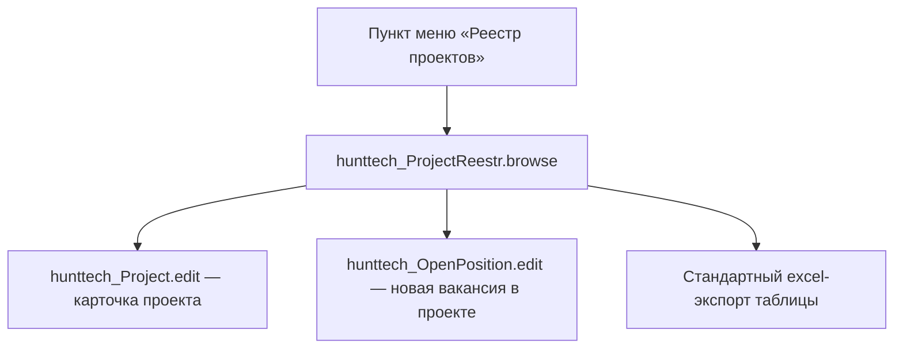

# ProjectReestrBrowse — Реестр проектов (`hunttech_ProjectReestr.browse`)

Cross-links: [Project](../entities/project/Project.md) · [ProjectEdit](ProjectEdit_Spec.md) (эталон sidebar, `shortDescription` и AI-генерации «Кратко»)

---

## Бизнес-контекст (обязательный ввод)

### Назначение и Бизнес-смысл (What & Why)

`ProjectReestrBrowse` — реестр (browse/lookup) проектов HRM HuntTech в двухпанельной компоновке **Split-View**: слева профильный сайдбар выбранного проекта (312px), справа таблица проектов с тулбаром быстрых действий и фильтрами. Экран решает задачу руководителя найма и рекрутера: быстро увидеть весь портфель проектов (открытые и архивные), оценить статус и сроки каждого, число открытых вакансий в работе, куратора с контактами и описание — и сразу перейти к карточке проекта или создать вакансию внутри проекта.

Ключевое бизнес-новшество (2026-08-25, требование владельца): sidebar показывает **краткое описание** проекта (AI-генерация «ИТ-генерация краткого описания») в приоритете над общим описанием, а при отсутствии обоих секция описания скрывается целиком — без placeholder'ов.

### Связи в интерфейсе и Навигация (UI Context & Navigation)

- **Точка входа**: пункт меню приложения «Реестр проектов» (caption `msg://projectReestrCaption` = «Реестр проектов», icon `FOLDER_OPEN_O`); экран также доступен как lookup-реестр (`StandardLookup<Project>`) и может открываться программно через `screenBuilders`.
- **Родительский экран**: нет (корневой browse); открывается из меню.
- **Дочерние экраны**: `hunttech_Project.edit` (карточка проекта, кнопка «Открыть карточку», `OpenMode.DIALOG`), `hunttech_OpenPosition.edit` (новая вакансия в проекте, кнопка «Открыть вакансию в проекте», `OpenMode.DIALOG`).
- **Режим окна**: `dialogMode height="700" width="1100"`.

### Краткий обзор бизнес-логики поведения (Behavior Summary)

- открыть экран → загружается список проектов с фильтром по умолчанию «С открытыми вакансиями» (только незакрытые проекты, у которых есть открытые позиции) → первая строка таблицы автоматически выделяется, сайдбар заполняется её данными;
- выбрать проект в таблице → сайдбар перерисовывается: логотип, название, департамент/компания, куратор, сроки и статус, число вакансий в работе, блок описания по алгоритму владельца (краткое описание → общее описание → секция скрыта);
- нажать «Создать проект» / «Редактировать» / «Удалить» → стандартные CRUD-действия таблицы (create/edit/remove);
- переключить фильтр («С открытыми вакансиями» / «Только открытые проекты» / «Все проекты») → параметры loader меняются, список перезагружается;
- выбрать проект и нажать «Действия → ИТ-генерация краткого описания» → при наличии общего описания AI генерирует `shortDescription`, значение сохраняется (commit) и sidebar немедленно перерисовывается по тому же алгоритму;
- «Действия → Выгрузить в Excel» → стандартный excel-экспорт таблицы; «Действия → Обновить данные» → перезагрузка loader и кэшей.

---

## 1. Точка вызова и контекст (Invocation & Context)

| Параметр | Значение |
|----------|----------|
| **@UiController** | `hunttech_ProjectReestr.browse` |
| **Java-класс** | `com.company.hunttech.web.screens.project.ProjectReestrBrowse` |
| **XML-дескриптор** | `modules/web/src/com/company/hunttech/web/screens/project/project-reestr-browse.xml` |
| **Базовый класс** | `StandardLookup<Project>` (`@LookupComponent("projectsTable")`, `@LoadDataBeforeShow`) |
| **Маршрут / меню** | пункт меню «Реестр проектов» (`projectReestrCaption`, icon `FOLDER_OPEN_O`); явная привязка в `menu.xml` ветки отсутствует — экран доступен как lookup и открывается программно/из меню |
| **Открытие** | menu / программно (`screenBuilders`), lookup-реестр |
| **Режим окна** | `dialogMode` 700×1100 |
| **Права** | стандартное screen permission (`hunttech_ProjectReestr.browse`), настраивается в Security |

### Назначение

Реестр проектов с профильным сайдбаром: обзор портфеля проектов, быстрые CRUD, фильтрация (по открытости и наличию открытых вакансий), экспорт в Excel, AI-генерация краткого описания и мгновенный переход к карточке проекта / созданию вакансии.

---

## 2. Связь с моделью данных (Data & Entity Binding)

| Параметр | Значение |
|----------|----------|
| **Entity** | `com.company.hunttech.entity.Project` (`hunttech_Project`) |
| **Data container** | `projectsDc` — `CollectionContainer<Project>`, секция `<data readOnly="true">` |
| **Loader** | `projectsDl` — `CollectionLoader<Project>`, JPQL + два условия (`<c:jpql>`), параметры `projectClosed` / `withOpenPosition` |
| **View (inline)** | `extends="project-browse-view"` + `projectDepartment` + `projectOwner` + **`shortDescription`** (см. ниже) |
| **Кэши контроллера** | `openPositionCountCache` (`Map<UUID,Integer>`), `projectDescriptionCache` (`Map<UUID,String>`) |
| **Сервис AI** | `ProjectAiService.generateShortDescription(projectName, projectDescription)` через `BackgroundWorker` (timeout 120 с) |

### 2.1 Inline view экрана

Inline view контейнера `projectsDc` расширяет общий `project-browse-view` (см. `modules/global/src/com/company/hunttech/views.xml`) следующими свойствами:

```xml
<view extends="project-browse-view">
    <property name="projectDepartment" view="_minimal">
        <property name="departamentRuName"/>
        <property name="companyName" view="_minimal">
            <property name="comanyName"/>
            <property name="companyShortName"/>
        </property>
    </property>
    <property name="projectOwner" view="_minimal">
        <property name="firstName"/><property name="secondName"/><property name="middleName"/>
        <property name="phone"/><property name="mobPhone"/><property name="email"/>
        <property name="fileImageFace" view="_minimal"/>
        <property name="personPosition" view="_minimal"/>
        <property name="companyDepartment" view="_minimal"/>
    </property>
    <!-- НОВОЕ (2026-08-25): shortDescription включён в inline view ЭКРАНА -->
    <property name="shortDescription"/>
</view>
```

- Базовый `project-browse-view` (views.xml) содержит: `projectName`, `projectIsClosed`, `defaultProject`, `startProjectDate`, `endProjectDate`, `generalChat`, `chatForCV`, `projectLogo` (`_minimal`), `projectTree` (`project-tree-picker-view`), `projectDepartment` (`companyDepartament-picker-view`), `projectOwner` (`person-owner-view`).
- `projectDepartment` переопределяется inline: `_minimal` + `departamentRuName` + `companyName` (`_minimal` с `comanyName`/`companyShortName`) — данные для подписи «📁 департамент • 🏢 компания» в колонке «Проект» и для `detailSubtitle` сайдбара.
- `projectOwner` переопределяется inline: `_minimal` + ФИО (`firstName`/`secondName`/`middleName`), телефоны и email, `fileImageFace`, `personPosition`, `companyDepartment` — данные для колонки «Куратор» и секции «КУРАТОР ПРОЕКТА».
- **`shortDescription`** — единственный CLOB в browse-view экрана: читается через `getShortDescription()` (безопасно, см. §7.3). В общий `project-browse-view` (views.xml) НЕ добавляется.

### 2.2 JPQL loader и фильтры

```sql
select e from hunttech_Project e
order by e.projectIsClosed desc, e.projectName
-- условия (and):
--   e.projectIsClosed = :projectClosed
--   e in (select f.projectName from hunttech_OpenPosition f
--         where not (f.openClose = :withOpenPosition) and f.projectName = e)
```

| Режим фильтра | `projectClosed` | `withOpenPosition` | PopupButton caption |
|---------------|-----------------|--------------------|---------------------|
| По умолчанию / «С открытыми вакансиями» | `false` | `true` | «С открытыми вакансиями» |
| «Только открытые проекты» | `false` | параметр удалён | «Только открытые проекты» |
| «Все проекты» | параметр удалён | параметр удалён | «Все проекты» |

Дефолты задаются в `onInit` → `initDefaultFilters()`: `projectClosed=false`, `withOpenPosition=true`.

### 2.3 Кэши контроллера (loadValues)

| Кэш | JPQL | Назначение |
|-----|------|------------|
| `openPositionCountCache` | `QUERY_OPEN_POSITION_COUNT_BY_PROJECTS`: `select e.projectName, count(e) from hunttech_OpenPosition e where not e.openClose = true and e.projectName in :projects group by e.projectName` | число открытых вакансий по проектам → колонка «Вакансии» и строка «Вакансий в работе» сайдбара |
| `projectDescriptionCache` | `QUERY_PROJECT_DESCRIPTIONS_BY_IDS`: `select e.id, e.projectDescription from hunttech_Project e where e.id in :ids` | LOB `projectDescription` для секции описания сайдбара — **LOB не тащится в список** (см. §7.3) |

Оба кэша пересчитываются в `onProjectsDlPostLoad` (`refreshOpenPositionCountCache` / `refreshProjectDescriptionCache`) после каждой загрузки loader; при пустом списке — `Collections.emptyMap()`.

### 2.4 Привязки property

| Компонент | property / источник | Контейнер |
|-----------|---------------------|-----------|
| `projectsTable` (groupTable) | коллекция `Project` | `projectsDc` |
| `projectLogoColumn` (gen) | `projectLogo` (FileDescriptor) | `projectsDc` |
| `projectName` (gen) | `projectName`, `startProjectDate` (бейдж НОВЫЙ), `projectDepartment.*` | `projectsDc` |
| `projectStatus` (gen) | `projectIsClosed` | `projectsDc` |
| `projectDates` (gen) | `startProjectDate`, `endProjectDate` | `projectsDc` |
| `projectOwner` (gen) | `projectOwner` (`getInstanceName()`) | `projectsDc` |
| `openPositionsCountColumn` (gen) | `openPositionCountCache` | `projectsDc` |
| `logoPic`, `detailTitle`, `detailSubtitle`, `detailLocation`, `detailStatus`, `detailStartDate`, `detailEndDate`, `detailOpenPositionsCount`, `detailCuratorName/Position/Dept/Contacts`, `detailDescription`, `detailShortDescription` | выбранный `Project` из `projectsTable` | `projectsDc` |

---

## 3. Иерархия и взаимосвязь форм (Form Hierarchy)



| Связь | Экран / фрагмент | Способ открытия |
|-------|------------------|-----------------|
| Родитель | — (корневой browse, меню) | menu / программно |
| Дочерний | `hunttech_Project.edit` | `screenBuilders.editor(projectsTable).editEntity(selected)` + `OpenMode.DIALOG` (кнопка «Открыть карточку») |
| Дочерний | `hunttech_OpenPosition.edit` | `dataManager.create(OpenPosition)` + `screenBuilders.editor(OpenPosition.class, this).newEntity(...)` + `OpenMode.DIALOG` (кнопка «Открыть вакансию в проекте») |
| Lookup-действие | excel-экспорт | `projectsTable.getAction("excel").actionPerform(projectsTable)` |
| AI-сервис | `ProjectAiService.generateShortDescription` | `BackgroundWorker` (timeout 120 с) + `AiOperationNotifier` |

---

## 4. Модель поведения и интерактивность (Behavior Model)

### 4.1 Жизненный цикл формы (Lifecycle)

| Этап | Когда срабатывает | Что загружается / настраивается | Кнопки и поля | Роли и ограничения |
|------|-------------------|----------------------------------|---------------|-------------------|
| Инициализация (`onInit`) | открытие формы | дефолтные фильтры loader (`projectClosed=false`, `withOpenPosition=true`), генерируемые колонки таблицы, слушатель выбора, обработчики кнопок сайдбара | фильтр «С открытыми вакансиями» активен | — |
| Загрузка данных (`@LoadDataBeforeShow` + `PostLoad`) | до показа / после каждой перезагрузки | список проектов по JPQL; пересчёт `openPositionCountCache` и `projectDescriptionCache`; авто-выделение первой строки; перерисовка сайдбара | первая строка таблицы выделена | `data readOnly="true"` — изменения только через диалоги |
| Выбор строки (selection listener) | клик по строке / снятие выделения | `updateSidebarDetails(single)` или `clearSidebarDetails()` | кнопки сайдбара enabled/disabled | — |
| После AI-генерации (`done`) | успешный ответ ИИ | commit `shortDescription`, перерисовка sidebar | TRAY-нотификация `AiOperationNotifier` | см. §5, §7.4 |

**Дефолты при открытии:** фильтр «С открытыми вакансиями» (`projectClosed=false`, `withOpenPosition=true`); первая строка таблицы выделяется автоматически (`projectsTable.setSelected(loaded.get(0))`), сайдбар заполняется; Generic Filter свёрнут (`collapsed="true"`).

### 4.2 Скрытые вычисления (без явного клика)

| Что видит пользователь | Откуда берётся значение | Условия и правила |
|------------------------|-------------------------|-------------------|
| Логотип в колонке «Лого» (24×24) | `projectLogo` (FileDescriptorResource) | иначе fallback `icons/no-company.png` (ThemeResource) |
| Бейдж «НОВЫЙ» у названия проекта | `startProjectDate` | проект «новый», если `startProjectDate` позже (сегодня − 14 дней) |
| Подпись под названием «📁 департамент • 🏢 компания» | `projectDepartment.departamentRuName`, `projectDepartment.companyName.comanyName`/`companyShortName` | подпись только при непустых значениях; компания — `comanyName`, иначе `companyShortName` |
| Бейдж «Закрыт» / «Открыт» в колонке «Статус» | `projectIsClosed` | HTML-бейджи: красный «Закрыт» / зелёный «Открыт» |
| «📅 старт – окончание» в колонке «Сроки проекта» | `startProjectDate`, `endProjectDate` | формат `dd.MM.yyyy`; отсутствующая дата — «—» |
| «👤 ФИО» в колонке «Куратор» | `projectOwner.getInstanceName()` | пустой куратор — «-» |
| Счётчик в колонке «Вакансии» | `openPositionCountCache` | >0 — синий бейдж с числом; 0 — серое «0» |
| Sidebar: статус/даты/вакансии/куратор/описание | выбранный `Project` + кэши | формат значений см. §6; блок описания — по алгоритму §7 |

### 4.3 Валидация и сохранение

| Момент | Условие | Что происходит |
|--------|---------|----------------|
| ИТ-генерация краткого описания | проект не выбран | действие безрезультатно (тихий return) |
| ИТ-генерация краткого описания | `projectDescription` пуст/пробелы | WARNING «Нет описания проекта для генерации краткого описания», генерация не запускается |
| ИТ-генерация краткого описания | AI вернул текст | `selected.setShortDescription(result.getText())` → `dataManager.commit(selected)` → перерисовка sidebar → TRAY-нотификация «Краткое описание проекта сгенерировано» |
| ИТ-генерация краткого описания | ошибка провайдера/таймаут (120 с) | ERROR-нотификация «Не удалось сгенерировать краткое описание. AI недоступна; описание проекта не изменено.»; `shortDescription` не меняется |
| Экран read-only | все данные | изменения сущностей только через дочерние edit-диалоги; excel-экспорт — только чтение |

---

## 5. Логика управляющих элементов (Actions & Buttons Logic)

| Элемент (id / action) | Когда доступен | Цепочка действий (простым языком) |
|-----------------------|----------------|-----------------------------------|
| `createBtn` (→ `projectsTable.create`) | всегда | «Создать проект» → стандартное create-действие таблицы → открывается edit-форма нового проекта |
| `editBtn` (→ `projectsTable.edit`) | всегда | «Редактировать» → стандартное edit-действие → редактирование выбранного проекта (нет выделения — действие не активно по конвенции таблицы) |
| `removeBtn` (→ `projectsTable.remove`) | всегда | «Удалить» → стандартное remove-действие с подтверждением удаления выбранного проекта |
| `filterPopupButton.filterWithOpenPositions` | всегда | «С открытыми вакансиями» → `projectClosed=false`, `withOpenPosition=true` → caption кнопки → `projectsDl.load()` |
| `filterPopupButton.filterOnlyOpen` | всегда | «Только открытые проекты» → `projectClosed=false`, параметр `withOpenPosition` удалён → caption → `projectsDl.load()` |
| `filterPopupButton.filterAll` | всегда | «Все проекты» → оба параметра удалены → caption → `projectsDl.load()` |
| `actionsPopupButton.refreshAction` | всегда | «Обновить данные» → `projectsDl.load()` → пересчёт кэшей, авто-выделение, перерисовка сайдбара |
| `actionsPopupButton.excelExportAction` | всегда | «Выгрузить в Excel» → `projectsTable.getAction("excel").actionPerform(projectsTable)` → стандартный excel-экспорт |
| `actionsPopupButton.generateShortDescriptionAction` | всегда | «ИТ-генерация краткого описания» → выбран проект? → есть `projectDescription`? → progress «Генерация краткого описания…» → `BackgroundWorker` (120 с) → `ProjectAiService.generateShortDescription(projectName, projectDescription)` → commit + перерисовка sidebar (§7.4) |
| `openEditCardBtn` (sidebar) | проект выбран | «Открыть карточку» → `screenBuilders.editor(projectsTable).editEntity(selected)` + DIALOG → `hunttech_Project.edit` |
| `createPositionForProjectBtn` (sidebar) | проект выбран | «Открыть вакансию в проекте» → `dataManager.create(OpenPosition)`, `setProjectName(selected)` → `screenBuilders.editor(OpenPosition.class, this).newEntity(newPosition)` + DIALOG → `hunttech_OpenPosition.edit` |
| `filter` (Generic Filter) | всегда | свёрнут по умолчанию; применяется к `projectsTable`/`projectsDl`; из фильтрации исключены LOB/служебные поля (`projectDescription`, `templateLetter`, `openPosition`, `version`, `createTs`, `createdBy`, `updateTs`, `updatedBy`, `deleteTs`, `deletedBy`) |

---

## 6. Визуальная компоновка элементов (Visual Layout Schema)

### Структура layout

```
window (caption «Реестр проектов», icon FOLDER_OPEN_O, focusComponent projectsTable, dialogMode 700×1100)
└── layout (stylename job-candidate-editor edit-screen-layout, expand splitMainLayout)
    └── hbox splitMainLayout (expand workspaceBox, stylename job-candidate-main-layout)
        ├── vbox detailPane — ЛЕВЫЙ САЙДБАР 312px (stylename job-candidate-sidebar edit-sidebar)
        │   └── scrollBox sidebarScrollBox (vertical)
        │       └── vbox
        │           ├── vbox profileHeader — шапка профиля
        │           │   ├── ovaFallbackImage logoPic (120×120, oval, fallback icons/no-company.png)
        │           │   ├── label detailTitle («Выберите проект»)
        │           │   ├── label detailSubtitle («-»)
        │           │   └── label detailLocation («-»)
        │           ├── vbox sidebarActionsCard — кнопки действий
        │           │   ├── button openEditCardBtn «Открыть карточку» (EDIT_ACTION, primary, disabled)
        │           │   └── button createPositionForProjectBtn «Открыть вакансию в проекте» (PLUS, disabled)
        │           ├── vbox termsCard — секция «СРОКИ И СТАТУС»
        │           │   └── grid termsGrid (2 колонки): Статус проекта → detailStatus,
        │           │       Дата старта → detailStartDate, Дата окончания → detailEndDate,
        │           │       Вакансий в работе → detailOpenPositionsCount (bold, #2563eb)
        │           ├── vbox curatorCard — секция «КУРАТОР ПРОЕКТА»
        │           │   └── detailCuratorName (bold) / detailCuratorPosition / detailCuratorDept / detailCuratorContacts
        │           └── vbox descriptionCard — секция описания (по алгоритму §7)
        │               ├── label «ОПИСАНИЕ ПРОЕКТА» + label detailDescription (html)
        │               └── vbox shortDescriptionBox (visible=false) + label detailShortDescription
        └── vbox workspaceBox — ПРАВАЯ РАБОЧАЯ ОБЛАСТЬ (stylename edit-workspace candidate-reestr-workspace)
            ├── hbox tableFilterBar — командный тулбар (expand toolbarSpacer)
            │   ├── hbox leftActionButtons: createBtn «Создать проект» / editBtn «Редактировать» / removeBtn «Удалить»
            │   ├── hbox toolbarSpacer (width 100%)
            │   └── hbox rightActionButtons:
            │       ├── popupButton filterPopupButton «С открытыми вакансиями» (FILTER, secondary)
            │       │   └── filterWithOpenPositions / filterOnlyOpen / filterAll
            │       └── popupButton actionsPopupButton «Действия» (BARS, primary)
            │           └── refreshAction «Обновить данные» / excelExportAction «Выгрузить в Excel» /
            │               generateShortDescriptionAction «ИТ-генерация краткого описания» (font-icon:MAGIC)
            ├── filter (Generic Filter, collapsed=true, applyTo projectsTable, dataLoader projectsDl)
            └── vbox tableCard (expand projectsTable)
                └── groupTable projectsTable (dataContainer projectsDc)
                    ├── actions: create / edit / remove / excel / refresh
                    ├── columns: projectLogoColumn «Лого» 50px | projectName «Проект» expandRatio=2 |
                    │   projectStatus «Статус» 95px | projectDates «Сроки проекта» 150px |
                    │   projectOwner «Куратор» 155px | openPositionsCountColumn «Вакансии» 95px
                    └── rowsCount
```

### Sidebar (312px)

- **Шапка профиля** (`profileHeader`): `ovaFallbackImage` `logoPic` (120×120, oval, `scaleMode=SCALE_DOWN`, fallback `icons/no-company.png`); `detailTitle` (название проекта или «Без названия»); `detailSubtitle` — «Компания (департамент)» либо только департамент; `detailLocation` — «Куратор: ФИО» или «Куратор не назначен».
- **Кнопки** (`sidebarActionsCard`): «Открыть карточку» (`openEditCardBtn`) и «Открыть вакансию в проекте» (`createPositionForProjectBtn`); обе `enabled="false"` до выбора проекта, при выборе включаются.
- **«СРОКИ И СТАТУС»** (`termsCard`): grid 2 колонки — статус (HTML-бейдж «Закрыт»/«Открыт»), дата старта и окончания (`dd.MM.yyyy`, «Не указана» при пустой), вакансий в работе (число из `openPositionCountCache`, синий `#2563eb`, bold).
- **«КУРАТОР ПРОЕКТА»** (`curatorCard`): ФИО (`detailCuratorName`, bold), должность (`personPosition.positionRuName`, «Должность не указана»), отдел (`companyDepartment.departamentRuName`, «Отдел не указан»), контакты «📞 телефон | ✉ email» (`mobPhone` приоритетнее `phone`; «-» если пусто). Пустой куратор: «Куратор не назначен» + «-».
- **Секция описания** (`descriptionCard`): заголовок «ОПИСАНИЕ ПРОЕКТА» + `detailDescription` (html); вложенный контейнер `shortDescriptionBox` (`visible="false"`) с подписью «КРАТКО:» и `detailShortDescription`. Отображение секции — **по алгоритму владельца** (§7): при непустом `shortDescription` показывается блок «Краткое описание», блок «ОПИСАНИЕ ПРОЕКТА» скрыт; при пустом `shortDescription`, но непустом `projectDescription` — «ОПИСАНИЕ ПРОЕКТА» (обрезка 300 символов); при обоих пустых — секция скрыта целиком.

### Таблица и колонки

Все колонки, кроме сортируемых `projectName`/`projectOwner`, генерируются контроллером (`setupTableColumns`): лого (24×24), название с бейджем «НОВЫЙ» и подписью департамента/компании, статус-бейдж, сроки, куратор, счётчик вакансий. Внизу таблицы — `rowsCount`.

### Стили и сообщения

| Элемент | stylename / CSS | message key |
|---------|-----------------|-------------|
| layout | `job-candidate-editor edit-screen-layout` | `projectReestrCaption` («Реестр проектов») |
| sidebar | `job-candidate-sidebar edit-sidebar` / `job-candidate-profile-header edit-sidebar-visual` / `edit-sidebar-title h2 candidate-sidebar-fullname` / `edit-sidebar-subtitle h4 candidate-sidebar-position` / `edit-help candidate-sidebar-city` / `job-candidate-navigation label-navigation` / `label-nav-title job-candidate-section-title` / `edit-sidebar-summary` | — |
| тулбар | `candidate-filter-bar edit-card` / `filter-buttons-panel` / `candidate-btn candidate-create-btn` (primary/secondary) | — |
| таблица | `borderless grid candidate-browse-grid` / `candidate-table-card` / `candidate-generic-filter` | — |
| счётчик вакансий (sidebar) | `css="color: #2563eb;"` + bold | — |
| AI-нотификации | `AiOperationNotifier` (TRAY/ERROR/WARNING) | `msgProjectShortDescriptionDone` («Краткое описание проекта сгенерировано»), `msgProjectShortDescriptionFailed` («Не удалось сгенерировать краткое описание. AI недоступна; описание проекта не изменено.») |

---

## 7. Алгоритм блока описания в sidebar (контракт владельца, 2026-08-25)

> **Статус**: требование владельца от 2026-08-25. Текущая реализация приводится к этому контракту; спецификация описывает **целевое** состояние.

### 7.1 Постановка

В sidebar экрана реестра проектов секция описания выбранного проекта показывается по приоритету: **краткое описание → общее описание → ничего**. Placeholder'ы («Описание проекта не заполнено» / «Проект не выбран») в секции описания **не выводятся** — при отсутствии контента секция скрыта целиком.

### 7.2 Алгоритм (порядок проверки)

```
ПСЕВДОКОД (updateSidebarDescription(project)):

1. short = project.getShortDescription()          // из inline view экрана (безопасно)
2. if short != null и !short.trim().isEmpty():
       показать блок «Краткое описание» (заголовок секции + текст short)
       скрыть блок «ОПИСАНИЕ ПРОЕКТА»
       → СТОП
3. desc = projectDescriptionCache.get(project.id)  // loadValues, LOB вне browse-view
4. if desc != null и !desc.trim().isEmpty():
       plain = Jsoup.parse(desc).text()           // HTML → обычный текст
       text  = plain.length() > 300 ? plain.substring(0, 300) + "..." : plain
       показать блок «ОПИСАНИЕ ПРОЕКТА» (текст text)
       скрыть блок «Краткое описание»
       → СТОП
5. иначе (short пусто И desc пусто):
       секция описания скрыта целиком
       placeholder'ы НЕ выводятся
```

| № | `shortDescription` | `projectDescription` | Что показывается в sidebar |
|----|--------------------|----------------------|----------------------------|
| 1 | непустое | любое | блок **«Краткое описание»** (заголовок секции + текст); блок «ОПИСАНИЕ ПРОЕКТА» скрыт |
| 2 | пустое | непустое | блок **«ОПИСАНИЕ ПРОЕКТА»**: текст `Jsoup.parse(desc).text()`, обрезанный до 300 символов (с «...») — как раньше |
| 3 | пустое | пустое | **секция описания скрыта целиком**, placeholder'ы не выводятся |

Триггеры перерисовки: выбор строки таблицы (selection listener), `PostLoad` loader (`onProjectsDlPostLoad`), `done()` AI-задачи после commit (§7.4), снятие выделения (секция скрыта — контента нет).

### 7.3 Data View Integrity

- **`shortDescription` добавлен в inline view экрана** (`project-reestr-browse.xml`, свойство внутри `<view extends="project-browse-view">`) — вызов `project.getShortDescription()` в контроллере **безопасен** (нет `IllegalStateException` unfetched attribute). Это зеркалит решение `ProjectEdit` (см. [ProjectEdit_Spec.md](ProjectEdit_Spec.md) §2): CLOB в browse-view **экрана**, но **НЕ** в общий `project-browse-view` в `views.xml` — общий view не засоряется LOB для остальных экранов.
- **`projectDescription` остаётся вне browse-view**: LOB не включается ни в `project-browse-view`, ни в inline view экрана. Общее описание читается только точечно через `projectDescriptionCache` (`dataManager.loadValues(QUERY_PROJECT_DESCRIPTIONS_BY_IDS)`, по `id in :ids`) после загрузки списка — LOB **не тащится в таблицу** и не грузится для всех строк без необходимости.
- Детached-геттеры незагруженных полей контроллером не читаются; AI-функции передаются только доступные значения (`projectName` + текст описания из кэша).

### 7.4 Взаимодействие с «ИТ-генерация краткого описания»

После успешной генерации (`BackgroundWorker` → `ProjectAiService.generateShortDescription(projectName, projectDescription)`):

1. `selected.setShortDescription(result.getText())` — значение пишется в сущность;
2. `dataManager.commit(selected)` — сохранение в БД;
3. sidebar **перерисовывается по тому же алгоритму §7.2** (`updateSidebarDetails(selected)` → `updateDescriptionSection(shortDescription, projectDescription)`): теперь `shortDescription` непустой → показывается блок «Краткое описание», блок «ОПИСАНИЕ ПРОЕКТА» скрывается;
4. TRAY-нотификация `AiOperationNotifier` «Краткое описание проекта сгенерировано» (при ошибке/таймауте — ERROR «…AI недоступна; описание проекта не изменено», `shortDescription` не меняется, sidebar не перерисовывается).

Проверка перед генерацией: проект выбран и `projectDescription` непустой, иначе WARNING «Нет описания проекта для генерации краткого описания».

### 7.5 Заголовок блока и конвенция сайдбара

- В спецификации блок называется **«Краткое описание»** (название по владельцу, 2026-08-25).
- Решение UI/UX-дизайнера (2026-08-25): заголовок секции — **«КРАТКОЕ ОПИСАНИЕ»** (капсом, константа `SHORT_DESCRIPTION_SECTION_TITLE` в контроллере), подзаголовок «КРАТКО:» убран (дублировал заголовок), блок **визуально идентичен** «ОПИСАНИЕ ПРОЕКТА» — та же карточка и стиль текста, различие только в заголовке и содержимом.
- Заголовок секции следует конвенции сайдбара — капс, как у соседних секций: «ОПИСАНИЕ ПРОЕКТА», «КУРАТОР ПРОЕКТА», «СРОКИ И СТАТУС» (`label-nav-title job-candidate-section-title`).

---

## История изменений

| Дата | Изменение |
|------|-----------|
| 2026-08-25 | Создана каноническая спецификация реестра проектов `hunttech_ProjectReestr.browse`: Split-View таблица + профильный сайдбар (312px), фильтры реестра, кэши `openPositionCountCache`/`projectDescriptionCache`, ИТ-генерация краткого описания; **контракт владельца — алгоритм блока описания в sidebar** (приоритет `shortDescription` → `projectDescription` → секция скрыта без placeholder'ов; `shortDescription` в inline view экрана, `projectDescription` вне browse-view через loadValues) |
