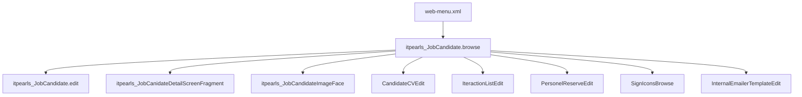

# JobCandidate Browse (`itpearls_JobCandidate.browse`)

> Списочный экран кандидатов HRM HuntTech.
> Сущность: [JobCandidate.md](../entities/JobCandidate.md)

---

## Business & Context Intro

### Назначение и Бизнес-смысл (What & Why)

Списочный экран «Кандидаты» — основной рабочий стол рекрутёра в HRM HuntTech: обзор базы кандидатов с визуальными индикаторами статуса, контактов, рейтинга и последнего взаимодействия без открытия полной карточки. Поддерживает быстрый отбор (фильтры, значки, участие рекрутёра), массовые действия и импорт CV из PDF/буфера обмена.

### Связи в интерфейсе и Навигация (UI Context & Navigation)

Открывается из `web-menu.xml` (`itpearls_JobCandidate.browse`, icon `USER`); используется как lookup (`StandardLookup`, 800×600). Переходы: Edit, detail-фрагмент строки, фото, резюме, взаимодействия, кадровый резерв, подбор вакансий (`FindSuitable`), фильтр значков `SignIconsBrowse`.

### Краткий обзор бизнес-логики поведения (Behavior Summary)

`@LoadDataBeforeShow`, пагинация 50 строк; generators на `status`, `rating`, `lastIteraction`, `resume`; `detailsGenerator` с `JobCanidateDetailScreenFragment`; чекбоксы меняют JPQL-параметры loader; view `jobCandidatesDc` с `fetch="BATCH"` на `iteractionList`/`socialNetwork` и nested `vacancy` для Data View Integrity.

---

## 1. Точка вызова и контекст (Invocation & Context)

| Параметр | Значение |
|----------|----------|
| **@UiController** | `itpearls_JobCandidate.browse` |
| **Java-класс** | `com.company.itpearls.web.screens.jobcandidate.JobCandidateBrowse` |
| **XML-дескриптор** | `job-candidate-browse.xml` |
| **messagesPack** | `com.company.itpearls.web.screens.jobcandidate` |
| **Базовый класс** | `StandardLookup<JobCandidate>` |
| **Lookup-компонент** | `jobCandidatesTable` (`@LookupComponent`) |
| **Меню** | `web-menu.xml` → `screen="itpearls_JobCandidate.browse"`, icon `USER` |
| **Режим диалога** | 800×600 (lookup) |
| **Загрузка данных** | `@LoadDataBeforeShow` |

### Назначение

Основной browse-экран подсистемы кандидатов: просмотр списка, фильтрация, быстрая загрузка CV, подписка на кандидата, массовые действия, раскрытие детальной панели строки (фрагмент `itpearls_JobCanidateDetailScreenFragment`). Поддерживает режим lookup (`lookupActions`).

---

## 2. Связь с моделью данных (Data & Entity Binding)

| Контейнер | Тип | Entity | View / loader |
|-----------|-----|--------|---------------|
| `jobCandidatesDc` | collection | `JobCandidate` | inline view `extends="_local"` + nested; loader `jobCandidatesDl` |
| `signIconsDc` | collection | `SignIcons` | `extends="_local"`, `user` → `_local`; loader `signIconsDl` (cacheable) |

### View `jobCandidatesDc` (критичные nested paths для Java)

| property | fetch | nested |
|----------|-------|--------|
| `personPosition`, `currentCompany`, `cityOfResidence`, `fileImageFace`, `candidateCv` | — | `_minimal` |
| `iteractionList` | `BATCH` | `rating`, `dateIteraction`, `comment`, `recrutier` (`_minimal`), `vacancy` (`_minimal`: `vacansyName`, `openClose`) |
| `socialNetwork` | `BATCH` | `networkURLS`, `socialNetworkURL.logo` |
| `positionList` | — | `positionList.positionRuName` |

### JPQL loader `jobCandidatesDl`

```sql
select e from itpearls_JobCandidate e order by e.secondName, e.firstName
```

Условия (`<condition>`): `createdBy like :userName`, `not e.status = :param1/:param3`, подзапросы по `IteractionList` (rating, recrutier), `CandidateCV`, `JobCandidateSignIcon`.

### Генераторы / providers (атрибуты ⊆ view)

| Колонка / provider | Читаемые поля |
|--------------------|---------------|
| `status` | `status`, `blockCandidate` |
| `fileImageFace` | `fileImageFace` |
| `rating` | `iteractionList.rating` (через `interactionService`) |
| `lastIteraction` | `iteractionList` (date, vacancy, comment, recrutier) |
| `resume` | отдельный запрос `CandidateCV` по candidate |
| `personPosition` | `personPosition`, `positionList` |
| `detailsGenerator` | полная карточка через фрагмент + доп. loaders |

### Фильтр

`filter` → `jobCandidatesDl`, `defaultMode="generic"`, `excludeProperties`: `version`, audit-поля, `fileImageFace`, `priorityContact`.

---

## 3. Иерархия и взаимосвязь форм (Form Hierarchy)



| Связь | Экран | Способ открытия |
|-------|-------|-----------------|
| Edit | `itpearls_JobCandidate.edit` | action `edit` (`screenId` в XML), `screenBuilders.editor()` |
| Детали строки | `itpearls_JobCanidateDetailScreenFragment` | `detailsGenerator` → `fragments.create()` |
| Фото (диалог) | `itpearls_JobCandidateImageFace` | `screens.create(..., OpenMode.DIALOG)` по клику на фото |
| Резюме | `CandidateCVEdit`, `CandidateCVSimpleBrowse` | кнопки в details / popup |
| Взаимодействия | `IteractionListEdit`, `IteractionListSimpleBrowse` | detailsGenerator |
| Кадровый резерв | `PersonelReserveEdit` | popup `addPersonalReserve` |
| Значки | `SignIconsBrowse` | `signFilterButton` |
| Подходящие | `FindSuitable` | кнопка в details |

---

### Краткий обзор бизнес-логики поведения (Behavior Summary)

При открытии списка загружается до 50 кандидатов; для группы «Стажер» автоматически включается фильтр «только мои» и его нельзя снять. Клик по строке раскрывает карточку с контактами и статистикой; из панели можно сразу редактировать кандидата, создать взаимодействие или открыть резюме. Popup «Действия с кандидатом» и отправка email доступны только после выбора строки. Быстрая загрузка CV из PDF или буфера создаёт новую карточку с распознанными полями. Сохранение на этом экране не выполняется — все изменения уходят в дочерние формы (резерв, взаимодействия, редактирование).

---

## 4. Модель поведения и интерактивность (Behavior Model)

### 4.1 Жизненный цикл формы (Lifecycle)

| Этап | Когда | Что происходит | Кнопки и поля | Роли |
|------|-------|----------------|---------------|------|
| Инициализация | При создании экрана | Настраиваются popup-действия «резерв», email, комментарии, персональные значки; клик по строке включает раскрытие details; колонке «последнее взаимодействие» — HTML-рендер и цветовая подсветка | Popup «Действия» и email изначально недоступны до выбора строки | — |
| Перед показом | Перед отображением списка | Лимит 50 строк; загрузка всех сотрудников для иконки статуса; инициализация фильтра по значкам текущего пользователя | «В работе» = выкл.; «только мои» = выкл. (кроме стажёра) | Группа «Стажер» → фильтр «только мои» включён и заблокирован |
| Смена выбора строки | Пользователь кликает строку | Включаются popup-действия; email — только если у кандидата заполнен email | `removeSignAction` — если у кандидата есть значок | — |
| Фильтры | Изменение чекбоксов | Перезагрузка списка с новыми параметрами JPQL | «С CV», «с моим участием», «в работе», рейтинг, значок | — |

**Дефолты:** `checkBoxOnWork` = false; `maxResults` = 50; фильтр generic — стандартный CUBA.

### 4.2 Скрытые вычисления (без явного клика)

| Что видит пользователь | Откуда | Правило |
|------------------------|--------|---------|
| Цвет ячейки «последнее взаимодействие» | Сервис последнего взаимодействия + дата | Заблокированный кандидат → чёрный; иначе по давности (+1 мес.): чужой рекрутер → красный, свой → жёлтый, свежий → зелёный/белый |
| Подсказка при наведении на «последнее взаимодействие» | То же + тип и рекрутер | При блокировке — сообщение о запрете взаимодействий |
| Иконка резюме (зелёная/красная) | Отдельный запрос: есть ли CV | Нет записей CV → красная иконка файла; есть → зелёная |
| Колонка «статус» (набор иконок) | Поля кандидата + справочники | Чёрный список, статус в штате/уволен, персональный значок, «светофор» контактов (3+ контакта и ДР → зелёный), телефон, email, мессенджеры, CV, комментарии, соцсети |
| Звёзды рейтинга | Среднее `rating` по всем взаимодействиям + 1 | CSS-класс по диапазону 1–5 |
| Фото в колонке | `fileImageFace` или placeholder | Миниатюра 30×30 (круг, `object-fit: cover`) через `FileDescriptorImageHelper` + `candidate-face-thumb`; при наведении — Vaadin HTML-tooltip (`descriptionProvider`, `setDescriptionAsHtml`) с `` 300×300 (круг, тень), URL `/app/dispatch/download?f={uuid}` или theme placeholder; клик → `JobCandidateImageFace` |
| Список должностей в подсказке колонки | `positionList` | Имена должностей через запятую |
| Раскрытая строка (details) | Фрагмент `JobCanidateDetailScreenFragment` | Контакты, статистика по взаимодействиям, соцсети, зарплатные ожидания, цветные метки «в работе / свободен» |

### 4.3 Валидация и сохранение

На browse-экране **нет** собственного сохранения карточки кандидата. Commit выполняется только в дочерних диалогах: кадровый резерв, новое взаимодействие, персональный значок, редактирование кандидата.

---

## 5. Логика управляющих элементов (Actions & Buttons Logic)

| Элемент | Когда доступен | Цепочка действий |
|---------|----------------|------------------|
| Создать / Изменить / Удалить | Стандартные права таблицы | Стандартный CUBA CRUD → форма `JobCandidate.edit` |
| Подписка (`buttonSubscribe`) | Всегда на панели | Нажатие → диалог подписки на кандидата с датой начала |
| Быстрая загрузка CV → PDF | Всегда | Нажатие → экран загрузки PDF в новой вкладке |
| Быстрая загрузка CV → буфер | Всегда | Нажатие → вставка текста → парсинг CV → новая карточка кандидата + диалог резюме + подстановка полей |
| Кадровый резерв | Выбран кандидат | Нажатие → форма резерва (рекрутер = текущий пользователь) → при сохранении и наличии вакансии создаётся взаимодействие; иначе прокрутка к строке |
| Резерв без подтверждения | Выбран кандидат | Сразу постановка в резерв на 30 дней или предупреждение, если резерв уже занят другим рекрутером |
| Отправить email | Выбран кандидат с email | Шаблон письма с адресом получателя = email кандидата |
| Просмотр комментариев | Выбран кандидат | Экран комментариев по кандидату |
| Поставить / снять значок | Выбран кандидат | Создание или обновление `JobCandidateSignIcon`; снятие — удаление всех значков кандидата |
| Справочник значков | Всегда | Lookup редактирования своих значков |
| Фильтр по значку | Всегда | Выбор значка → список только кандидатов с этим значком; «сброс» → все |
| «Только мои» | Не стажёр | Вкл. → только созданные текущим пользователем |
| «С моим участием» | Всегда | Вкл. → кандидаты, где текущий пользователь указан рекрутером во взаимодействии |
| «В работе» | Всегда | Вкл. → исключить кандидатов со статусом «не в работе» (param3=10) |
| «С CV» / рейтинг не ниже | Всегда | Меняется JPQL-запрос loader'а |
| Details: Изменить | Строка раскрыта | → `JobCandidate.edit` |
| Details: Новое взаимодействие | Строка раскрыта | → `IteractionListEdit` |
| Details: Копировать последнее | Строка раскрыта | Копия последнего взаимодействия с той же вакансией |
| Details: Список взаимодействий | Строка раскрыта | → `IteractionListSimpleBrowse` |
| Details: Резюме | Строка раскрыта | Просмотр / добавление CV |
| Details: Подобрать | Есть CV | → `FindSuitable` |
| Details: Популярные типы взаимодействий | Строка раскрыта | Popup топ-5 типов → новое взаимодействие с выбранным типом |

---

## 6. Визуальная компоновка элементов (Visual Layout Schema)

```
layout (expand=jobCandidatesTable)
├── filter (generic, applyTo=jobCandidatesTable)
├── dataGrid jobCandidatesTable
│   ├── columns: status, fileImageFace(50px), fullName, rating(85px),
│   │   personPosition, currentCompany, cityOfResidence, resume(collapsed),
│   │   lastIteraction(90px), actionsWithCandidate(80px)
│   └── buttonsPanel: create, edit, remove, subscribe, excel(hidden),
│       quickLoadCV(popup), actionsWithCandidate(popup), sendEmail(hidden), signFilter
├── hbox.card (bottom filters)
│   ├── checkBoxShowOnlyMy, showOnlyWithMyParticipation, checkBoxOnWork, withCV
│   └── ratingFieldNotLower (hidden)
└── lookupActions (hidden)
```

**Стили:** `captionAsHtml`, `descriptionAsHtml` на таблице; `stylename="card"` у нижней панели; кастомные CSS-классы в generators (`button_table_*`, `pic-center-large-*`).

**Иконки:** `USER` (окно), `BELL` (подписка), `CLOUD_UPLOAD` (CV), `BARS` (действия), `FILTER` (значки).

---

## История изменений

| Дата | Изменение |
|------|-----------|
| 2026-06-27 | Hover-preview фото: `descriptionProvider` + `FileDescriptorImageHelper.buildCandidateFacePreviewHtml`, CSS `candidate-face-thumb` / `candidate-face-preview-tooltip` (30px thumb, 300px circular tooltip) |
| 2026-06-27 | Откат hover-preview фото: простая колонка 20px `circle-20px`, клик → `JobCandidateImageFace`; удалены `candidate-photo-wrapper` и CSS-hover |
| 2026-06-26 | §4–5 переписаны: поведение из Java простым языком (lifecycle, actions, generators) |
| 2026-06-26 | Business & Context Intro (Living Documentation standard) |
| 2026-06-26 | Первичная UI Spec из `job-candidate-browse.xml` и `JobCandidateBrowse.java` |
