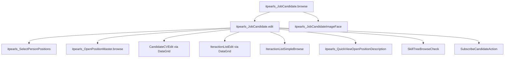

# JobCandidate Edit (`itpearls_JobCandidate.edit`)

> Форма редактирования карточки кандидата HRM HuntTech.
> Сущность: [JobCandidate.md](../entities/JobCandidate.md)

---

## Business & Context Intro

### Назначение и Бизнес-смысл (What & Why)

Форма полной карточки кандидата HRM HuntTech: персональные данные, контакты, должности, соцсети, история взаимодействий по вакансиям, резюме и чат-комментарии.

### Связи в интерфейсе и Навигация (UI Context & Navigation)

Открывается из `itpearls_JobCandidate.browse` (edit/create), detail-фрагмента, lookup. Дочерние: `CandidateCVEdit`, `IteractionListEdit`, `SelectPersonPositions`, pickers Company/City/Position.

### Краткий обзор бизнес-логики поведения (Behavior Summary)

Шесть вкладок: карточка (контакты, фото, навыки, проекты), кандидат (ФИО с подсказками), контакты (динамическая обязательность полей), взаимодействия, резюме, комментарии-чат. При первом открытии вкладки подгружаются справочники и колонки-генераторы. При сохранении нового кандидата проверяется дубликат по ФИО+город+должность; нормализуются ФИО и Telegram; автоматически создаётся взаимодействие «Новый контакт». Менеджер/администратор может заблокировать кандидата — тогда грид взаимодействий отключается для остальных ролей.

---

## 1. Точка вызова и контекст (Invocation & Context)

| Параметр | Значение |
|----------|----------|
| **@UiController** | `itpearls_JobCandidate.edit` |
| **Java-класс** | `com.company.itpearls.web.screens.jobcandidate.JobCandidateEdit` |
| **XML-дескриптор** | `job-candidate-edit.xml` |
| **Базовый класс** | `StandardEditor<JobCandidate>` |
| **EditedEntityContainer** | `jobCandidateDc` |
| **Режим диалога** | 1200×750 |
| **Загрузка данных** | `@LoadDataBeforeShow` |

### Назначение

Полная карточка кандидата: контакты, должности, соцсети, взаимодействия с вакансиями, резюме (CV), комментарии-чат. Открывается из browse (`edit` action), из details browse, lookup create/edit.

---

## 2. Связь с моделью данных (Data & Entity Binding)

### Главный instance `jobCandidateDc`

View `extends="_local"` с коллекциями `fetch="BATCH"`:

| property | fetch | view / nested | Назначение в Java |
|----------|-------|---------------|-------------------|
| `candidateCv` | BATCH | `_local` + `candidate`, `resumePosition`, `toVacancy` (grade, positionType, `projectName`→logo/description), `someFiles`, `fileImageFace` | Вкладка резюме; `scanContactsFromCVs`, `checkSkillFromJD`, project logo generators |
| `iteractionList` | BATCH | `_local`; `vacancy` → `openPosition-iteraction-list-picker-view`; `iteractionType` → `iteraction-list-type-view`; `recrutier` → `extUser-picker-view` | Грид взаимодействий, фильтр, suggest-иконки, lastProject generators |
| `socialNetwork` | BATCH | `_local` + `socialNetworkURL.logo`, `comment` | Таблица соцсетей, `enableDisableContacts` |
| `positionList` | BATCH | `_local` → `positionList` `_local` | `addPositionList`, `suggestOpenPositionDl` |
| `cityOfResidence`, `currentCompany` (+ `companyGroup`), `fileImageFace`, `personPosition` | LAZY | `_local` | Карточка, вкладка кандидата |

Вложенные collection containers: `jobCandidateCandidateCvsDc`, `jobCandidateSocialNetworksDc`, `jobCandidateIteractionDc`. (`laborAgreement` убран из view и контейнеров — вкладка Outstaffing закомментирована в UI.)

### Дополнительные loaders

| Контейнер | View | JPQL / назначение | Когда грузится |
|-----------|------|-------------------|----------------|
| `lastProjectDc` | KeyValue: `vacancy`, `max(dateIteraction)` | group by vacancy, exclude `Default`, `:candidate` | `onBeforeShow` → `setLastProjectTable()` |
| `openPositionDc` | `openPosition-picker-view` | открытые вакансии | первое открытие `commentsTab` (`ensureOpenPositionLoaded`) |
| `suggestOpenPositionDc` | `_local` | открытые + `:positionType` / `:positionTypes` | `onBeforeShow` → `setSuggestOpenPositionTable()` |
| `personPositionsDc` | `position-view` | без «(не использовать)» | первое открытие `tabCandidate` |
| `currentCompaniesDc` | `company-picker-view` | все Company | первое открытие `tabCandidate` |
| `citiesDc` | `city-picker-view` | все City | первое открытие `tabCandidate` |
| `interactionCommentDc` | `_minimal` + `comment`, `dateIteraction`, `recrutierName`; `recrutier` → `extUser-picker-view`; `vacancy` → `_minimal` (`vacansyName`) | комментарии с непустым `comment`, `:candidate` | `onBeforeShow` → `initInteractionCommentDl()` |

### Отложенная загрузка (`PreLoadListener`)

```java
// onInit: блокировка auto-load до готовности флага
preventAutoLoadUntilReady(openPositionDl, () -> openPositionLoaderInitialized);
preventAutoLoadUntilReady(currentCompaniesLc, () -> referenceLoadersInitialized);
preventAutoLoadUntilReady(citiesDl, () -> referenceLoadersInitialized);
preventAutoLoadUntilReady(personPositionsLc, () -> referenceLoadersInitialized);
```

| Флаг | Триггер `true` | Loaders |
|------|----------------|---------|
| `referenceLoadersInitialized` | первый выбор `tabCandidate` | `currentCompaniesLc`, `citiesDl`, `personPositionsLc` |
| `openPositionLoaderInitialized` | первый выбор `commentsTab` | `openPositionDl` |

### Injected зависимости (контроллер)

| Категория | Bean / компонент |
|-----------|------------------|
| **Сервисы** | `DataManager`, `Metadata`, `UserSession`, `UserSessionSource`, `InteractionService`, `GetRoleService`, `ParseCVService`, `PdfParserService`, `StarsAndOtherService`, `ResumeRecognitionService`, `OpenPositionService` |
| **UI framework** | `ScreenBuilders`, `Screens`, `Fragments`, `Dialogs`, `Notifications`, `UiComponents`, `WebBrowserTools`, `MessageBundle` |
| **Data** | `DataContext`, `jobCandidateDc`/`jobCandidateDl`, collection containers (`jobCandidateCandidateCvsDc`, `jobCandidateIteractionDc`, `jobCandidateSocialNetworksDc`), loaders (`lastProjectDl`, `openPositionDl`, `suggestOpenPositionDl`, `interactionCommentDl`, `currentCompaniesLc`, `citiesDl`, `personPositionsLc`) |

### `dataManager.load` / `loadValue` (активные вызовы)

| Метод / контекст | Запрос | View |
|------------------|--------|------|
| `checkDublicateCandidate` | FK-совпадение firstName+secondName+city+position | `jobCandidate-view` |
| `addIteractionOfNewCandidate` | `Iteraction` «Новый контакт»; `max(numberIteraction)` | `iteraction-view` |
| `initSocialNeiworkTable` | все `SocialNetworkType` | `socialNetworkType-view` |
| `addMissingSocialNetworksListsInvoke` | все `SocialNetworkType` | default |
| `getSocialNetworkType` | match host + fallback `Other` | `socialNetworkType-view` |
| `setupNameSearchExecutors` (вкладка `tabCandidate`) | distinct `firstName` / `secondName` / `middleName` по LIKE при вводе | `String` |
| `numBerIteractionForNewEntity` | count по candidate[+vacancy] | `BigDecimal` |
| `copyCVJobCandidate` | последний CV кандидата | `candidateCV-view` |
| `createComment` | `Iteraction` с `signComment=true`; `max(numberIteraction)` | `Iteraction` |
| `removeEmptySocialNetworkListsButton` | `dataManager.remove` пустых URL | — |

Default-вакансия: `openPositionService.getOpenPositionDefault()` (не прямой load).

### Data View Integrity (`iteractionList`, `vacancy`, BATCH)

Коллекция `iteractionList` в `jobCandidateDc` загружается с `fetch="BATCH"` — nested properties обязательны в inline view.

| Java path (generators / логика) | Декларировано в view | Контейнер |
|--------------------------------|----------------------|-----------|
| `iteractionList.vacancy.vacansyName` | да (`openPosition-iteraction-list-picker-view`) | `jobCandidateDc` |
| `iteractionList.vacancy.openClose` | да | `jobCandidateDc` |
| `iteractionList.vacancy.projectName.projectLogo` | да | `jobCandidateDc` |
| `iteractionList.vacancy.projectName.projectDescription` | **нет** в picker-view | используется в `openPositionDescription()` |
| `iteractionList.vacancy.projectName.projectDepartment.companyName.*` | частично (`companyName` `_minimal`) | `openPositionDescription()` — `workingConditions`, `companyDescription` |
| `iteractionList.iteractionType.pic` | да | `jobCandidateDc` |
| `iteractionList.iteractionType.signSendToClient`, `signEndCase` | **нет** в `iteraction-list-type-view` | `suggestVacancyTable.notSendedIconColumn` |
| `iteractionList.iteractionType.signOurInterview`, `signOurInterviewAssigned` | **нет** в `iteraction-list-type-view` | `whoIsRecruterGeneratorColumn`, `whoIsResearcherGeneratorColumn` |
| `iteractionList.rating`, `comment`, `addDate`, `addString`, `addInteger`, `currentOpenClose` | `_local` на `IteractionList` | грид взаимодействий |
| `interactionCommentDc.vacancy.vacansyName` | да | `commentDialog` generator |
| `interactionCommentDc.recrutier.fileImageFace` | да (`extUser-picker-view`) | аватар в чат-пузыре |

**Риск UNFETCHED:** при открытии вкладок «Карточка» (suggest/lastProject) и «Описание вакансии» — sign-поля `Iteraction` и `projectDescription`/`companyDescription` на `vacancy`. Рекомендация: расширить `iteraction-list-type-view` или inline nested в `job-candidate-edit.xml`.

### Критичные Java paths (generators ⊆ view) — сводка

- `jobCandidateIteractionListTable`: `vacancy` (logo, openClose), `iteractionType` (pic, iterationName), `rating`, `numberIteraction`, `recrutier`, `dateIteraction`, `comment`
- `lastProjectTable`: `vacancy`, обход `jobCandidateIteractionDc` по типам взаимодействия
- `jobCandidateCandidateCvTable`: `toVacancy.projectName`, `resumePosition`, `datePost`, `linkOriginalCv`, `linkItPearlsCV`, `letter`, `textCV`
- `socialNetworkTable`: `socialNetworkURL.logo`, `networkURLS`
- `jobCandidateCommentsDataGrid`: `comment`, `dateIteraction`, `recrutier`, `vacancy.vacansyName`
- `suggestVacancyTable`: `vacansyName`, статус по `iteractionList` + `iteractionType` signs

---

## 3. Иерархия и взаимосвязь форм (Form Hierarchy)



| Связь | Экран / класс | Открытие из Java | Параметры |
|-------|---------------|------------------|-----------|
| Множественные должности | `SelectPersonPositions` | `addPositionList()` → `screens.create()` | `setJobCandidate`, `setPositionsList`; merge `JobCandidatePositionLists` без дубликатов |
| Мастер вакансий | `OpenPositionMasterBrowse` | `openPositionMasterBrowseStart()` | `setJobCandidate(getEditedEntity())` |
| CV | `CandidateCVEdit` (через `screenBuilders.editor`) | DataGrid actions + `copyCVJobCandidate()` | `withParentDataContext`, копирование textCV/letter/links |
| Взаимодействие | `IteractionListEdit` (через DataGrid) | create/edit/copy, `frequentInteractionPopupButton`, `addIteractionJobCandidate` | `JobCandidateScreenOptions`, initializer: candidate, vacancy, numberIteraction |
| Список по проекту | `IteractionListSimpleBrowse` | `addInteractionsViewButton` на `lastProjectTable` | `setSelectedCandidate`, `setOpenPosition` из строки |
| Описание вакансии | `QuickViewOpenPositionDescription` | `openPositionDescription()` | comment, projectDescription, companyDescription, workingConditions из выбранной строки грида |
| Навыки vs JD | `SkillTreeBrowseCheck` | `checkSkillFromJD()` | `setCandidateCVSkills`, `setOpenPositionSkills` из `PdfParserService` |
| Подписка | `SubscribeCandidateAction` | `onButtonSubscribeClick()` | candidate, subscriber=current user, startDate=now; для NEW — диалог commit |
| Навыки на карточке | `Skillsbar` (fragment) | `setupSkillBox()` в `onBeforeShow` | `generateSkillLabels(getLastCVText())` |

**Фрагмент `Skillsbar`:** встраивается в `skillBox` на вкладке «Карточка» при наличии CV у существующего кандидата.

---

## 4. Модель поведения и интерактивность (Behavior Model)

### 4.1 Жизненный цикл формы (Lifecycle)

| Этап | Что происходит | Кнопки / роли |
|------|----------------|---------------|
| Инициализация | `tabSheetSocialNetworks` с `lazy="true"`; блокировка ранней загрузки справочников; подписка на смену вкладок → ленивая инициализация каждой вкладки; `initTabCandidate()` сразу выходит, если выбрана не вкладка `tabCandidate` | — |
| Перед показом | Загрузка ленты комментариев; для нового — status=0; рейтинг, навыки из последнего CV, подсказки вакансий, таблица lastProject; кнопка блокировки видна только Manager/Administrator | `blockCandidateButton` — Manager/Admin |
| После показа | Процент заполнения карточки (14 полей); состояние кнопки блокировки | — |
| Смена записи в dataContext | Пересчёт fullName и процента заполнения | — |
| Первая вкладка «Кандидат» | Загрузка справочников (`cacheable="true"`); `SearchExecutor` на полях ФИО (JPQL LIKE по вводу, без предзагрузки всего списка); сброс должности «(не использовать)» | — |
| Первая вкладка «Контакты» | Слушатели контактов → снятие required если хоть один заполнен; radio приоритета связи; для нового — автостроки соцсетей | — |
| Первая вкладка «Взаимодействия» | Генераторы колонок, кнопки копирования и популярных типов; грид disabled при blockCandidate (кроме Manager/Admin) | — |
| Первая вкладка «Резюме» | Генераторы CV-таблицы, scan/skills | `copyCVButton` disabled до выбора строки |
| Первая вкладка «Комментарии» | Загрузка picker открытых вакансий | `sendCommentButton` disabled при пустом поле |

### 4.2 Скрытые вычисления

| Что видит пользователь | Правило |
|------------------------|---------|
| Процент заполнения (quality%) | 14 полей контактной вкладки × 100/14 |
| Required на контактах | Если заполнен хотя бы один контакт или URL соцсети → required снимается со всех |
| Звёзды рейтинга в шапке | Среднее rating+1 по взаимодействиям |
| Фильтр вакансий на вкладке взаимодействий | Список уникальных vacancy из iteractionList; disconnectedItems при выборе |
| Колонки «кто ресерчер/рекрутер» | Имя по sign-флагам типа взаимодействия на vacancy |
| Иконка в suggest-вакансиях | CHECK/REFRESH/CLOSE/QUESTION по истории отправок и end-case |
| Чат-пузыри комментариев | Свои справа, чужие слева; reply button |
| Нормализация телефонов | parseCVService при изменении phone/mobile |

### 4.3 Валидация и сохранение

| Момент | Условие | Результат |
|--------|---------|-----------|
| XML required | firstName, company, position, city; контакты + priorityContact на вкладке контактов | Блокировка commit framework |
| Перед сохранением (1) | Новый + дубликат ФИО+город+должность | Диалог «Продолжить?» → OK продолжает, Cancel отменяет |
| Перед сохранением | Любой | ё→е в ФИО; fullName; telegram без @ и без http://t.me/ |
| Перед сохранением | Новый | Автовзаимодействие «Новый контакт», rating=4, vacancy Default; ошибка если нет типа или Default |
| После редактирования соцсети в гриде | EditorPostCommit | Пересчёт required контактов |
| Комментарий в чате | createComment | Для существующего кандидата — `dataContext.commit()` + reload; для NEW — только repaint (commit при OK) |
| addPositionList / reloadCV / reloadInteractions | NEW кандидат | Только `dataContext.merge` и repaint; без промежуточного commit (избегает `itpearls_job_candidate_pkey`) |

---

## 5. Логика управляющих элементов (Actions & Buttons Logic)

| Элемент | Цепочка |
|---------|---------|
| Добавить взаимодействие | → новый `IteractionList` с опциями кандидата |
| Копировать взаимодействие | Нет выбора + есть последнее → копия с vacancy; нет взаимодействий → диалог; есть выбор → копия выбранной строки |
| Популярные типы (popup) | До 5 типов → новое взаимодействие с типом и vacancy из строки |
| Заблокировать кандидата | Диалог → инверсия blockCandidate → красный заголовок, disable грида (кроме Manager/Admin) |
| Описание вакансии | Выбор строки → QuickView с comment/description/conditions |
| Мастер вакансий | → `OpenPositionMasterBrowse` с текущим кандидатом |
| Добавить должности | → `SelectPersonPositions` → уникальные позиции в коллекцию |
| Копировать CV | Копия выбранного или диалог создания |
| Scan контактов из CV | Парсинг непроверенных CV → диалог замены email/phone/urls |
| Сверка навыков с JD | Нужны CV + comment вакансии → `SkillTreeBrowseCheck` |
| Отправить комментарий / Enter | createComment → новое взаимодействие-comment, reload, очистка поля |
| Reply в чате | InputDialog → createComment с префиксом Re: |
| Link email/telegram/skype | mailto / t.me / skype:?chat |
| Подписка | Новый кандидат → диалог «Записать?» → SubscribeCandidateAction |
| Соцсети: добавить недостающие | Все типы из справочника, которых нет в коллекции |
| Соцсети: удалить пустые | dataManager.remove пустых URL |
| Upload фото | Успех → скрыть placeholder, показать фото; clear → обратно |
| Commit and Close | Стандартный editor + цепочка BeforeCommit выше |


---

## 6. Визуальная компоновка элементов (Visual Layout Schema)

```
layout (expand=tabSheetSocialNetworks)
├── groupBox msgOptions (collapsable, light)
│   ├── grid: рейтинг | должность | город | CV | quality%
│   └── grid: email, phone, mobile, skype, telegram (labels)
├── tabSheet tabSheetSocialNetworks (framed, lazy="true")
│   ├── tab jobCandidateCard (ID_CARD): cardBox + dropZone(photo upload) + skillBox + lastProjects
│   ├── tab tabCandidate (BOMB): ФИО, компания, должность, город, дата рождения
│   ├── tab tabContactInfo (USER): контакты + priorityContact radio + socialNetworkTable
│   ├── tab tabIteraction (LIST): vacancy filter + iteraction dataGrid
│   ├── tab tabResume (FILE_TEXT): CV dataGrid + check skills
│   └── tab commentsTab (COMMENT): comment grid + chat input + vacancy picker
└── editActions: createdBy label, block, subscribe(hidden), commit, close
```

**Вкладка «Карточка»:** `groupBox` контактов (read-only labels + link buttons), `image`/`upload` фото (`dropzone-container`), таблицы `lastProjectTable` и `suggestVacancyTable`.

**Required поля (XML):** `firstName`, `currentCompany`, `personPosition`, `cityOfResidence`, контакты на вкладке Contact Info, `priorityContact`.

### Производительность (вкладка `tabCandidate`)

- **`lazy="true"`** на `tabSheetSocialNetworks` — содержимое неактивных вкладок не строится до первого выбора.
- **`initTabCandidate()`** — проверка `selectedTab.getName() == "tabCandidate"` в начале метода; при смене на другие вкладки справочники и поля ФИО не инициализируются.
- **Подсказки ФИО** — `setupNameSearchExecutors()` вызывается только при первом открытии `tabCandidate`; `SuggestionField.setSearchExecutor` выполняет узкий JPQL `LIKE` по введённой строке вместо блокирующей предзагрузки всех distinct-имён через `BackgroundTask`.

---

## История изменений

| Дата | Изменение |
|------|-----------|
| 2026-06-30 | fix: удалены `laborAgreement` из view и `jobCandidateLaborAgreementDc` — устранён QueryException (loader `laborAgreement` без параметра ID при `@LoadDataBeforeShow`) |
| 2026-06-29 | Оптимизация скорости открытия вкладки tabCandidate, ленивая инициализация SuggestionFields, устранение блокирующих BackgroundTask |
| 2026-06-29 | fix: убран промежуточный `dataContext.commit()` для NEW в `addPositionList`, `reloadCV`, `reloadInteractions`; флаг `initialInteractionAdded` |
| 2026-06-26 | Полный разбор `JobCandidateEdit.java`: @Subscribe lifecycle, inject, validation, deferred loaders, соцсети, block/subscribe, generators, dialogs, Data View Integrity для `iteractionList.vacancy` BATCH |
| 2026-06-26 | Business & Context Intro (Living Documentation standard) |
| 2026-06-26 | Первичная UI Spec из `job-candidate-edit.xml` и `JobCandidateEdit.java` |
