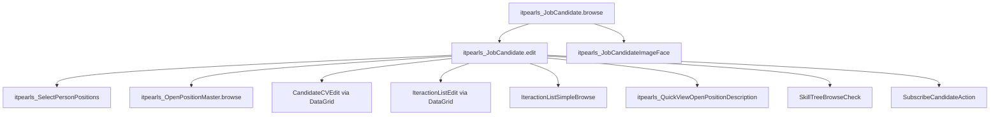

# JobCandidate Edit (`itpearls_JobCandidate.edit`)

> Форма редактирования карточки кандидата HRM HuntTech.
> Сущность: [JobCandidate.md](../entities/JobCandidate.md)

---

## Business & Context Intro

### Назначение и Бизнес-смысл (What & Why)

Форма полной карточки кандидата HRM HuntTech: персональные данные, контакты, должности, соцсети, история взаимодействий по вакансиям, резюме и чат-комментарии.

### Связи в интерфейсе и Навигация (UI Context & Navigation)

Открывается из `itpearls_JobCandidate.browse` (edit/create), detail-фрагмента, lookup. Дочерние: `CandidateCVEdit`, `IteractionListEdit`, `SelectPersonPositions`, pickers Company/City/Position.

### Краткий обзор бизнес-логики поведения (Behavior Summary)

Шесть вкладок TabSheet: карточка (контакты read-only, фото, навыки из последнего CV, проекты и suggest-вакансии), кандидат (ФИО с suggestion, FK), контакты (динамическая required-логика + соцсети), взаимодействия (DataGrid с фильтром по вакансии), резюме (CRUD CV, парсинг контактов, сверка навыков), комментарии (лента + чат). При открытии — рейтинг, процент заполнения (14 полей), подсказки вакансий по `positionType`, агрегат `lastProjectDc`. При первом выборе вкладки — ленивая инициализация колонок-генераторов и справочников (`preventAutoLoadUntilReady` + `PreLoadListener`). Commit: проверка дубликата, нормализация ФИО/telegram, автосоздание `IteractionList` «Новый контакт» для нового кандидата. Блокировка кандидата (`blockCandidate`) отключает грид взаимодействий, кроме ролей Manager/Administrator.

---

## 1. Точка вызова и контекст (Invocation & Context)

| Параметр | Значение |
|----------|----------|
| **@UiController** | `itpearls_JobCandidate.edit` |
| **Java-класс** | `com.company.itpearls.web.screens.jobcandidate.JobCandidateEdit` |
| **XML-дескриптор** | `job-candidate-edit.xml` |
| **Базовый класс** | `StandardEditor<JobCandidate>` |
| **EditedEntityContainer** | `jobCandidateDc` |
| **Режим диалога** | 1200×750 |
| **Загрузка данных** | `@LoadDataBeforeShow` |

### Назначение

Полная карточка кандидата: контакты, должности, соцсети, взаимодействия с вакансиями, резюме (CV), комментарии-чат. Открывается из browse (`edit` action), из details browse, lookup create/edit.

---

## 2. Связь с моделью данных (Data & Entity Binding)

### Главный instance `jobCandidateDc`

View `extends="_local"` с коллекциями `fetch="BATCH"`:

| property | fetch | view / nested | Назначение в Java |
|----------|-------|---------------|-------------------|
| `candidateCv` | BATCH | `_local` + `candidate`, `resumePosition`, `toVacancy` (grade, positionType, `projectName`→logo/description), `someFiles`, `fileImageFace` | Вкладка резюме; `scanContactsFromCVs`, `checkSkillFromJD`, project logo generators |
| `iteractionList` | BATCH | `_local`; `vacancy` → `openPosition-iteraction-list-picker-view`; `iteractionType` → `iteraction-list-type-view`; `recrutier` → `extUser-picker-view` | Грид взаимодействий, фильтр, suggest-иконки, lastProject generators |
| `socialNetwork` | BATCH | `_local` + `socialNetworkURL.logo`, `comment` | Таблица соцсетей, `enableDisableContacts` |
| `positionList` | BATCH | `_local` → `positionList` `_local` | `addPositionList`, `suggestOpenPositionDl` |
| `laborAgreement`, `cityOfResidence`, `currentCompany` (+ `companyGroup`), `fileImageFace`, `personPosition` | LAZY | `_local` | Карточка, вкладка кандидата |

Вложенные collection containers: `jobCandidateCandidateCvsDc`, `jobCandidateSocialNetworksDc`, `jobCandidateIteractionDc`, `jobCandidateLaborAgreementDc`.

### Дополнительные loaders

| Контейнер | View | JPQL / назначение | Когда грузится |
|-----------|------|-------------------|----------------|
| `lastProjectDc` | KeyValue: `vacancy`, `max(dateIteraction)` | group by vacancy, exclude `Default`, `:candidate` | `onBeforeShow` → `setLastProjectTable()` |
| `openPositionDc` | `openPosition-picker-view` | открытые вакансии | первое открытие `commentsTab` (`ensureOpenPositionLoaded`) |
| `suggestOpenPositionDc` | `_local` | открытые + `:positionType` / `:positionTypes` | `onBeforeShow` → `setSuggestOpenPositionTable()` |
| `personPositionsDc` | `position-view` | без «(не использовать)» | первое открытие `tabCandidate` |
| `currentCompaniesDc` | `company-picker-view` | все Company | первое открытие `tabCandidate` |
| `citiesDc` | `city-picker-view` | все City | первое открытие `tabCandidate` |
| `interactionCommentDc` | `_minimal` + `comment`, `dateIteraction`, `recrutierName`; `recrutier` → `extUser-picker-view`; `vacancy` → `_minimal` (`vacansyName`) | комментарии с непустым `comment`, `:candidate` | `onBeforeShow` → `initInteractionCommentDl()` |

### Отложенная загрузка (`PreLoadListener`)

```java
// onInit: блокировка auto-load до готовности флага
preventAutoLoadUntilReady(openPositionDl, () -> openPositionLoaderInitialized);
preventAutoLoadUntilReady(currentCompaniesLc, () -> referenceLoadersInitialized);
preventAutoLoadUntilReady(citiesDl, () -> referenceLoadersInitialized);
preventAutoLoadUntilReady(personPositionsLc, () -> referenceLoadersInitialized);
```

| Флаг | Триггер `true` | Loaders |
|------|----------------|---------|
| `referenceLoadersInitialized` | первый выбор `tabCandidate` | `currentCompaniesLc`, `citiesDl`, `personPositionsLc` |
| `openPositionLoaderInitialized` | первый выбор `commentsTab` | `openPositionDl` |

### Injected зависимости (контроллер)

| Категория | Bean / компонент |
|-----------|------------------|
| **Сервисы** | `DataManager`, `Metadata`, `UserSession`, `UserSessionSource`, `InteractionService`, `GetRoleService`, `ParseCVService`, `PdfParserService`, `StarsAndOtherService`, `ResumeRecognitionService`, `OpenPositionService` |
| **UI framework** | `ScreenBuilders`, `Screens`, `Fragments`, `Dialogs`, `Notifications`, `UiComponents`, `WebBrowserTools`, `BackgroundWorker`, `MessageBundle` |
| **Data** | `DataContext`, `jobCandidateDc`/`jobCandidateDl`, collection containers (`jobCandidateCandidateCvsDc`, `jobCandidateIteractionDc`, `jobCandidateSocialNetworksDc`), loaders (`lastProjectDl`, `openPositionDl`, `suggestOpenPositionDl`, `interactionCommentDl`, `currentCompaniesLc`, `citiesDl`, `personPositionsLc`) |

### `dataManager.load` / `loadValue` (активные вызовы)

| Метод / контекст | Запрос | View |
|------------------|--------|------|
| `checkDublicateCandidate` | FK-совпадение firstName+secondName+city+position | `jobCandidate-view` |
| `addIteractionOfNewCandidate` | `Iteraction` «Новый контакт»; `max(numberIteraction)` | `iteraction-view` |
| `initSocialNeiworkTable` | все `SocialNetworkType` | `socialNetworkType-view` |
| `addMissingSocialNetworksListsInvoke` | все `SocialNetworkType` | default |
| `getSocialNetworkType` | match host + fallback `Other` | `socialNetworkType-view` |
| `addFirst/Second/MiddleNameSuggestField` | distinct ФИО | `String` |
| `numBerIteractionForNewEntity` | count по candidate[+vacancy] | `BigDecimal` |
| `copyCVJobCandidate` | последний CV кандидата | `candidateCV-view` |
| `createComment` | `Iteraction` с `signComment=true`; `max(numberIteraction)` | `Iteraction` |
| `removeEmptySocialNetworkListsButton` | `dataManager.remove` пустых URL | — |

Default-вакансия: `openPositionService.getOpenPositionDefault()` (не прямой load).

### Data View Integrity (`iteractionList`, `vacancy`, BATCH)

Коллекция `iteractionList` в `jobCandidateDc` загружается с `fetch="BATCH"` — nested properties обязательны в inline view.

| Java path (generators / логика) | Декларировано в view | Контейнер |
|--------------------------------|----------------------|-----------|
| `iteractionList.vacancy.vacansyName` | да (`openPosition-iteraction-list-picker-view`) | `jobCandidateDc` |
| `iteractionList.vacancy.openClose` | да | `jobCandidateDc` |
| `iteractionList.vacancy.projectName.projectLogo` | да | `jobCandidateDc` |
| `iteractionList.vacancy.projectName.projectDescription` | **нет** в picker-view | используется в `openPositionDescription()` |
| `iteractionList.vacancy.projectName.projectDepartment.companyName.*` | частично (`companyName` `_minimal`) | `openPositionDescription()` — `workingConditions`, `companyDescription` |
| `iteractionList.iteractionType.pic` | да | `jobCandidateDc` |
| `iteractionList.iteractionType.signSendToClient`, `signEndCase` | **нет** в `iteraction-list-type-view` | `suggestVacancyTable.notSendedIconColumn` |
| `iteractionList.iteractionType.signOurInterview`, `signOurInterviewAssigned` | **нет** в `iteraction-list-type-view` | `whoIsRecruterGeneratorColumn`, `whoIsResearcherGeneratorColumn` |
| `iteractionList.rating`, `comment`, `addDate`, `addString`, `addInteger`, `currentOpenClose` | `_local` на `IteractionList` | грид взаимодействий |
| `interactionCommentDc.vacancy.vacansyName` | да | `commentDialog` generator |
| `interactionCommentDc.recrutier.fileImageFace` | да (`extUser-picker-view`) | аватар в чат-пузыре |

**Риск UNFETCHED:** при открытии вкладок «Карточка» (suggest/lastProject) и «Описание вакансии» — sign-поля `Iteraction` и `projectDescription`/`companyDescription` на `vacancy`. Рекомендация: расширить `iteraction-list-type-view` или inline nested в `job-candidate-edit.xml`.

### Критичные Java paths (generators ⊆ view) — сводка

- `jobCandidateIteractionListTable`: `vacancy` (logo, openClose), `iteractionType` (pic, iterationName), `rating`, `numberIteraction`, `recrutier`, `dateIteraction`, `comment`
- `lastProjectTable`: `vacancy`, обход `jobCandidateIteractionDc` по типам взаимодействия
- `jobCandidateCandidateCvTable`: `toVacancy.projectName`, `resumePosition`, `datePost`, `linkOriginalCv`, `linkItPearlsCV`, `letter`, `textCV`
- `socialNetworkTable`: `socialNetworkURL.logo`, `networkURLS`
- `jobCandidateCommentsDataGrid`: `comment`, `dateIteraction`, `recrutier`, `vacancy.vacansyName`
- `suggestVacancyTable`: `vacansyName`, статус по `iteractionList` + `iteractionType` signs

---

## 3. Иерархия и взаимосвязь форм (Form Hierarchy)



| Связь | Экран / класс | Открытие из Java | Параметры |
|-------|---------------|------------------|-----------|
| Множественные должности | `SelectPersonPositions` | `addPositionList()` → `screens.create()` | `setJobCandidate`, `setPositionsList`; merge `JobCandidatePositionLists` без дубликатов |
| Мастер вакансий | `OpenPositionMasterBrowse` | `openPositionMasterBrowseStart()` | `setJobCandidate(getEditedEntity())` |
| CV | `CandidateCVEdit` (через `screenBuilders.editor`) | DataGrid actions + `copyCVJobCandidate()` | `withParentDataContext`, копирование textCV/letter/links |
| Взаимодействие | `IteractionListEdit` (через DataGrid) | create/edit/copy, `frequentInteractionPopupButton`, `addIteractionJobCandidate` | `JobCandidateScreenOptions`, initializer: candidate, vacancy, numberIteraction |
| Список по проекту | `IteractionListSimpleBrowse` | `addInteractionsViewButton` на `lastProjectTable` | `setSelectedCandidate`, `setOpenPosition` из строки |
| Описание вакансии | `QuickViewOpenPositionDescription` | `openPositionDescription()` | comment, projectDescription, companyDescription, workingConditions из выбранной строки грида |
| Навыки vs JD | `SkillTreeBrowseCheck` | `checkSkillFromJD()` | `setCandidateCVSkills`, `setOpenPositionSkills` из `PdfParserService` |
| Подписка | `SubscribeCandidateAction` | `onButtonSubscribeClick()` | candidate, subscriber=current user, startDate=now; для NEW — диалог commit |
| Навыки на карточке | `Skillsbar` (fragment) | `setupSkillBox()` в `onBeforeShow` | `generateSkillLabels(getLastCVText())` |

**Фрагмент `Skillsbar`:** встраивается в `skillBox` на вкладке «Карточка» при наличии CV у существующего кандидата.

---

## 4. Модель поведения и интерактивность (Behavior Model)

### Lifecycle и `@Subscribe`

| Событие | Метод | Логика |
|---------|-------|--------|
| `InitEvent` | `onInit` | `preventAutoLoadUntilReady` на 4 loader'а; `SelectedTabChangeListener` → `initTabResume/Interactions/Candidate/ContactInfo/Comments` |
| `BeforeShowEvent` | `onBeforeShow` | `interactionCommentDl.load`; метка CV; `status=0` для NEW; рейтинг, skillBox, link buttons, suggest/lastProject loaders, vacancy filter, `blockCandidateButton` visible для Manager/Admin |
| `AfterShowEvent` | `onAfterShow` | `setPercentLabel`, `setBlockUnblockButton` |
| `AfterShowEvent` | `onAfterShow1` | кэш `iteractionListFromCandidate` для рейтинга |
| `BeforeCloseEvent` | `onBeforeClose1` | подмена listener CV collection (repaint без scan) |
| `AfterCloseEvent` | `onAfterClose` | listener CV collection → repaint таблицы |
| `BeforeCommitChangesEvent` | `onBeforeCommitChanges1` | `checkDublicateCandidate` → confirmation dialog, `preventCommit` |
| `BeforeCommitChangesEvent` | `onBeforeCommitChanges` | `replaceE_yo`, `setFullNameCandidate`, `checkTelegramName`, `trimTelegramName`, `addIteractionOfNewCandidate` |
| `DataContext.ChangeEvent` | `onChange` | пересчёт `labelQualityPercent` |
| `jobCandidateDc` ItemChange | `onJobCandidateDcItemChange` | `setFullNameCandidate` |
| `jobCandidateCandidateCvsDc` ItemChange | `onJobCandidateCandidateCvsDcItemChange` | `scanContactsFromCVs()` |
| `fileImageFaceUpload` BeforeValueClear | | default image вместо фото |
| `fileImageFaceUpload` FileUploadSucceed | | показ `candidatePic` + `FileDescriptorResource` |
| `candidatePic` SourceChange | | `setCandidatePicImage()` |
| Link buttons click | email / telegram / skype | `mailto:`, `http://t.me/`, `skype:…?chat` через `WebBrowserTools` |
| `phoneField` / `mobilePhoneField` ValueChange | | нормализация через `parseCVService.normalizePhoneStr` |
| `firstNameField` / `secondNameField` ValueChange | | обновление `iteractionListLabelCandidate`, `fullNameField` |
| `emailField` / `mobilePhoneField` / `skypeNameField` / `telegramNameField` ValueChange | | синхронизация labels в `msgOptions` |
| `chatMessageTextField` ValueChange | | enable/disable `sendCommentButton` |
| `chatMessageTextField` EnterPress | | confirmation → `sendCommentButtonInvoke()` |

### Ленивая инициализация вкладок

| Вкладка | Флаг | Что инициализируется при первом выборе |
|---------|------|----------------------------------------|
| `tabCandidate` | `candidateInitialized` | reference loaders; suggestion Enter handlers; `addSuggestField` (BackgroundTask); `setPositionsLabel`; `checkNotUsePosition` |
| `tabContactInfo` | `tabContactInfoInitialized` | text listeners → `enableDisableContacts`; `priorityCommenicationMethodRadioButtonInit`; `initSocialNeiworkTable` для NEW |
| `tabIteraction` | `interationTabInitialized` | icon column, rating generator, comment column, copy/description buttons, `frequentInteractionPopupButton`, enable по `blockCandidate` |
| `tabResume` | `cvTabInitialized` | CV column generators, copy/scan/skills listeners |
| `commentsTab` | `commentsTabInitialized` | `ensureOpenPositionLoaded()` |

### Валидация и commit

| Этап | Логика |
|------|--------|
| XML `required` | `firstName`, `currentCompany`, `personPosition`, `cityOfResidence`; на вкладке контактов — все contact fields + `priorityContact` |
| Динамическая required | `enableDisableContacts()`: если заполнен хотя бы один контакт **или** URL соцсети — снять required со всех contact fields |
| `onBeforeCommitChanges1` | дубликат по firstName+secondName+city+position (исключая текущий id) |
| `onBeforeCommitChanges` | ё→е; `fullName`; telegram без `@` и без `http://t.me/`; NEW → `IteractionList` тип «Новый контакт», rating=4, vacancy Default |
| `checkNotUsePosition` | сброс должности с «не использовать» в названии |

**Карта `priorityContact` (radio, из Java):**

| Label | Integer |
|-------|---------|
| Email | 1 |
| Phone | 2 |
| Telegramm | 3 |
| Skype | 4 |
| Viber | 5 |
| WhatsApp | 6 |
| Social Network | 7 |
| Other | 9 |

### Блокировка кандидата (`blockCandidateButton`)

- Visible: `GetRoleService.isUserRoles` → `StandartRoles.MANAGER` или `ADMINISTRATOR`
- Click: confirmation «Запретить/Разрешить взаимодействия…» → toggle `blockCandidateCheckBox`
- Эффект: caption/icon кнопки; `iteractionListLabelCandidate` style `h2-red`; `jobCandidateIteractionListTable.setEnabled(false)` при блокировке
- **Исключение:** Manager/Admin — грид взаимодействий остаётся enabled (`initTabInteractions`)

### Социальные сети

| Действие | Метод | Поведение |
|----------|-------|-----------|
| Автозаполнение типов (NEW) | `initSocialNeiworkTable` | все `SocialNetworkType` → пустые `SocialNetworkURLs` в DC |
| Добавить недостающие | `addMissingSocialNetworksListsInvoke` | типы из справочника, отсутствующие в коллекции |
| Удалить пустые | `removeEmptySocialNetworkListsButton` | `dataManager.remove` где `networkURLS` null/empty |
| Парсинг из CV | `scanContactsFromCVs` | `ParseCVService` email/phone/urls → InputDialog с чекбоксами замены |
| Определение типа URL | `getSocialNetworkType` | match host → `SocialNetworkType`; иначе `Other` |

### Фильтр вакансий на вкладке взаимодействий

`vacancyFilterLookupPickerField`: options = distinct `vacancy` из `iteractionList`; при выборе — `jobCandidateIteractionDc.setDisconnectedItems(filtered stream)`.

### Комментарии (чат)

- `createComment`: load `Iteraction` с `signComment=true`; новый `IteractionList` с comment, vacancy из picker или Default; `reloadInteractions()`
- `commentDialog` generator: пузырь с аватаром рекрутёра, reply → InputDialog «Re:…»
- Стили: `tailMyMessage` / `tailOtherMessage` по `createdBy` vs current login

### Процент заполнения карточки

`setQualityPercent()`: 14 полей (birthDate, company, email, ФИО, city, position, phone, mobile, skype, telegram, whatsapp, viber) — только после `tabContactInfoInitialized`. Формула: `count * 100 / 14`.

Link buttons на вкладке «Карточка» дублируют контакты из entity (read-only labels + кликабельные ссылки).

---

## 5. Логика управляющих элементов (Actions & Buttons Logic)

### Нижняя панель `editActions`

| Элемент | invoke / action | Условия | Эффект |
|---------|-----------------|---------|--------|
| `blockCandidateButton` | `blockCandidateButton` | visible: Manager/Admin | toggle `blockCandidate`, стиль заголовка, enable грида |
| `buttonSubscribe` | `onButtonSubscribeClick` | `visible="false"` в XML (legacy) | `SubscribeCandidateAction` editor |
| `windowCommitAndCloseButton` | `windowCommitAndClose` | — | стандартный commit + close |
| window close | `windowClose` | — | закрытие с discard prompt |

### Вкладка «Кандидат»

| Элемент | Эффект |
|---------|--------|
| `addPositions` | `SelectPersonPositions` → merge positions, `setPositionsLabel()` |
| `firstNameField` / `middleNameField` / `secondNameField` | suggestion + Enter handler |
| lookup pickers Company/Position/City | options из deferred loaders |

### Вкладка «Контакты»

| Элемент | Эффект |
|---------|--------|
| `addMissingSocialNetworkListsButton` | добавить строки для всех типов из справочника |
| `removeEmptySocialNetworkListsButton` | удалить пустые URL из БД |
| `addSocialNetworkListsButton` | hidden/disabled (legacy) |
| DataGrid create/edit/remove | стандартные composition actions на `socialNetwork` |

### Вкладка «Взаимодействия»

| Элемент | Эффект |
|---------|--------|
| create / edit / remove | стандартный CRUD `IteractionList` в composition |
| `copyIteractionButton` | копия с той же vacancy; `numberIteraction` = count+1; если нет выбора — copy last или диалог «Назначить новое» |
| `frequentInteractionPopupButton` | до 5 популярных типов (`interactionService.getMostPolularIteraction`); new entity с vacancy из selected row |
| `openPositionProjectDescriptionButton` | enabled при selection; `QuickViewOpenPositionDescription` |
| `vacancyFilterLookupPickerField` | фильтр disconnected items |

### Вкладка «Резюме»

| Элемент | Эффект |
|---------|--------|
| create / edit / remove | CRUD `CandidateCV` |
| `copyCVButton` | копия selected CV (textCV, letter, links, resumePosition) |
| `scanContactsFromCVButton` | `scanContactsFromCVs()` — парсинг всех непроверенных CV |
| `checkSkillFromJD` | `SkillTreeBrowseCheck` — сравнение навыков CV vs comment вакансии (`PdfParserService`) |

### Вкладка «Карточка»

| Элемент | Эффект |
|---------|--------|
| `openPositionMasterBrowseButton` | `OpenPositionMasterBrowse` |
| `fileImageFaceUpload` | IMMEDIATE upload, dropZone |
| `lastProjectTable` | generators: №, last interaction type, researcher, recruiter, «Просмотр» → `IteractionListSimpleBrowse` |
| `suggestVacancyTable` | иконка статуса (CHECK/REFRESH/CLOSE/QUESTION) по истории `iteractionList` |

### Вкладка «Комментарии»

| Элемент | Эффект |
|---------|--------|
| `sendCommentButton` | `createComment(null)` — новый `IteractionList`-комментарий |
| `vacancyPopupPickerField` | options `openPositionDc`; icon +/- по `openClose` |
| reply в пузыре | InputDialog → `createComment("( ) Re:…")` |

### `@Install` column generators / providers

| Компонент | subject | Назначение |
|-----------|---------|------------|
| `vacancyFilterLookupPickerField` | optionImageProvider | logo проекта 20px |
| `vacancyPopupPickerField` | optionIconProvider | PLUS/MINUS по openClose |
| `socialNetworkTable.linkToWeb` | columnGenerator | LinkButton → URL |
| `socialNetworkTable.socialNetworkLogoColumn` | columnGenerator | logo 30px + HTML description |
| `jobCandidateIteractionListTable.projectLogoColumn` | columnGenerator | logo 50px + project description |
| `jobCandidateIteractionListTable.currentOpenCloseColumn` | columnGenerator, styleProvider, descriptionProvider | иконка open/close |
| `jobCandidateIteractionListTable.vacancy` | styleProvider | `table-wordwrap` |
| `jobCandidateIteractionListTable.iteractionType` | styleProvider | `table-wordwrap` |
| `jobCandidateCandidateCvTable.projectLogoColumn` | columnGenerator | logo CV vacancy |
| `jobCandidateCandidateCvTable.toVacancy` / `resumePosition` | descriptionProvider, styleProvider | tooltip даты/должности |
| `jobCandidateCommentsDataGrid.commentDialog` | columnGenerator | чат-пузырь |
| `suggestVacancyTable.notSendedIconColumn` | columnGenerator | статус отправки CV |
| `suggestVacancyTable` | itemDescriptionProvider | HTML карточка вакансии |

**Программные generators в `initTabInteractions` / `initTabResume`:** `icon` (ImageRenderer), `rating` (HTML stars), `commentColumn` (PLUS/MINUS icon); CV columns `iconOriginalCVFile`, `iconITPearlsCVFile`, `letter`, link columns.

---

## 6. Визуальная компоновка элементов (Visual Layout Schema)

```
layout (expand=tabSheetSocialNetworks)
├── groupBox msgOptions (collapsable, light)
│   ├── grid: рейтинг | должность | город | CV | quality%
│   └── grid: email, phone, mobile, skype, telegram (labels)
├── tabSheet tabSheetSocialNetworks (framed)
│   ├── tab jobCandidateCard (ID_CARD): cardBox + dropZone(photo upload) + skillBox + lastProjects
│   ├── tab tabCandidate (BOMB): ФИО, компания, должность, город, дата рождения
│   ├── tab tabContactInfo (USER): контакты + priorityContact radio + socialNetworkTable
│   ├── tab tabIteraction (LIST): vacancy filter + iteraction dataGrid
│   ├── tab tabResume (FILE_TEXT): CV dataGrid + check skills
│   └── tab commentsTab (COMMENT): comment grid + chat input + vacancy picker
└── editActions: createdBy label, block, subscribe(hidden), commit, close
```

**Вкладка «Карточка»:** `groupBox` контактов (read-only labels + link buttons), `image`/`upload` фото (`dropzone-container`), таблицы `lastProjectTable` и `suggestVacancyTable`.

**Required поля (XML):** `firstName`, `currentCompany`, `personPosition`, `cityOfResidence`, контакты на вкладке Contact Info, `priorityContact`.

---

## История изменений

| Дата | Изменение |
|------|-----------|
| 2026-06-26 | Полный разбор `JobCandidateEdit.java`: @Subscribe lifecycle, inject, validation, deferred loaders, соцсети, block/subscribe, generators, dialogs, Data View Integrity для `iteractionList.vacancy` BATCH |
| 2026-06-26 | Business & Context Intro (Living Documentation standard) |
| 2026-06-26 | Первичная UI Spec из `job-candidate-edit.xml` и `JobCandidateEdit.java` |
