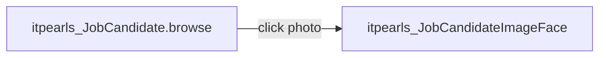

# JobCandidate Image Face (`itpearls_JobCandidateImageFace`)

> Диалог просмотра фото кандидата.
> Сущность: [JobCandidate.md](../entities/JobCandidate.md)

---

## Business & Context Intro

### Назначение и Бизнес-смысл (What & Why)

Полноэкранный просмотр `fileImageFace` выбранного кандидата. Открывается из `JobCandidateBrowse` при клике на миниатюру в колонке `fileImageFace` (`screens.create(JobCandidateImageFace.class, OpenMode.DIALOG)`).

### Связи в интерфейсе и Навигация (UI Context & Navigation)

Контроллер `itpearls_JobCandidateImageFace`; навигация и дочерние формы — §3 «Иерархия и взаимосвязь форм».

### Краткий обзор бизнес-логики поведения (Behavior Summary)

Подписки, actions и view контейнеры — §2–§5; Data View Integrity: атрибуты generators ⊆ view loader (см. [data-view-integrity.mdc](../../.cursor/rules/data-view-integrity.mdc)).

---

## 1. Точка вызова и контекст (Invocation & Context)

| Параметр | Значение |
|----------|----------|
| **@UiController** | `itpearls_JobCandidateImageFace` |
| **Java-класс** | `com.company.itpearls.web.screens.jobcandidate.JobCandidateImageFace` |
| **XML-дескриптор** | `job-candidate-image-face.xml` |
| **Базовый класс** | `Screen` (пустой контроллер) |
| **Режим** | `OpenMode.DIALOG`, 800×600 |

### Назначение

Полноэкранный просмотр `fileImageFace` выбранного кандидата. Открывается из `JobCandidateBrowse` при клике на миниатюру в колонке `fileImageFace` (`screens.create(JobCandidateImageFace.class, OpenMode.DIALOG)`).

---

## 2. Связь с моделью данных (Data & Entity Binding)

| Контейнер | Entity | View |
|-----------|--------|------|
| `jobCandidateDc` | `JobCandidate` | `_minimal` |

| Компонент | property |
|-----------|----------|
| `candidateImage` | `fileImageFace` |

Родитель передаёт entity в instance container при открытии диалога (стандартный CUBA pattern для screen с instance без loader в XML).

---

## 3. Иерархия и взаимосвязь форм (Form Hierarchy)



Нет дочерних экранов и фрагментов.

---

## 4. Модель поведения и интерактивность (Behavior Model)

Контроллер не содержит `@Subscribe` / `@Install` — чистое отображение `Image` с `scaleMode` по умолчанию framework.

Поведение полностью декларативно в XML: `image` привязан к `jobCandidateDc.fileImageFace`, layout `expand="candidateImage"`.

---

## 5. Логика управляющих элементов (Actions & Buttons Logic)

Нет кнопок и actions в XML. Закрытие — стандартный крестик диалога CUBA.

---

## 6. Визуальная компоновка элементов (Visual Layout Schema)

```
layout (expand=candidateImage)
└── image candidateImage
    ├── dataContainer: jobCandidateDc
    └── property: fileImageFace
```

Caption: `msg://jobCandidateImageFace.caption` (`messages.properties` пакета jobcandidate).

---

## История изменений

| Дата | Изменение |
|------|-----------|
| 2026-06-26 | Business & Context Intro (Living Documentation standard) |
| 2026-06-26 | Первичная UI Spec из `job-candidate-image-face.xml` и `JobCandidateImageFace.java` |
