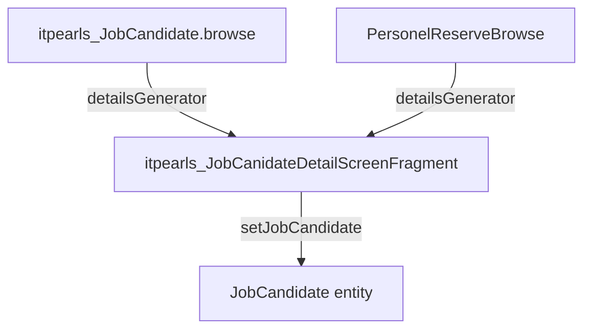

# JobCandidate Detail Fragment (`itpearls_JobCanidateDetailScreenFragment`)

> Фрагмент детальной панели кандидата (раскрытие строки browse / кадровый резерв).
> Сущность: [JobCandidate.md](../entities/JobCandidate.md)

---

## Business & Context Intro

### Назначение и Бизнес-смысл (What & Why)

Read-only сводка по кандидату: фото, ФИО, должность, компания, город, контакты (с условной видимостью), соцсети (иконки-клики), данные последнего взаимодействия и статистика процессинга (динамические label в `statisticsHLabelBox`).

### Точки встраивания

- `JobCandidateBrowse` → `jobCandidatesTable.detailsGenerator`
- `PersonelReserveBrowse` → аналогичный details pattern

### Связи в интерфейсе и Навигация (UI Context & Navigation)

Контроллер `itpearls_JobCanidateDetailScreenFragment`; навигация и дочерние формы — §3 «Иерархия и взаимосвязь форм».

### Краткий обзор бизнес-логики поведения (Behavior Summary)

Раскрытая строка кандидата в списке: контакты, статистика взаимодействий, цветные метки «в работе/свободен», ссылки на email и мессенджеры. Кнопки действий создаёт родительский browse.


---

## 1. Точка вызова и контекст (Invocation & Context)

| Параметр | Значение |
|----------|----------|
| **@UiController** | `itpearls_JobCanidateDetailScreenFragment` |
| **Java-класс** | `com.company.itpearls.web.screens.jobcandidate.JobCanidateDetailScreenFragment` |
| **XML-дескриптор** | `job-canidate-detail-screen-fragment.xml` |
| **Базовый класс** | `ScreenFragment` |
| **Тип** | Fragment (не самостоятельный экран меню) |

### Назначение

Read-only сводка по кандидату: фото, ФИО, должность, компания, город, контакты (с условной видимостью), соцсети (иконки-клики), данные последнего взаимодействия и статистика процессинга (динамические label в `statisticsHLabelBox`).

### Точки встраивания

- `JobCandidateBrowse` → `jobCandidatesTable.detailsGenerator`
- `PersonelReserveBrowse` → аналогичный details pattern

---

## 2. Связь с моделью данных (Data & Entity Binding)

| Контейнер | Тип | provided | View |
|-----------|-----|----------|------|
| `jobCandidatesDc` | instance `JobCandidate` | `true` (от родителя) | `extends="_local"`, `iteractionList` → `recrutier.group` |

### Дополнительные загрузки в Java (не в fragment view)

| Query | View | Назначение |
|-------|------|------------|
| `QUERY_ALL_ITERACIONS` | `iteractionList-view` | все взаимодействия кандидата |
| `QUERY_ALL_CV` | `candidateCV-view` | счётчик резюме |
| `QUERY_LAST_SALARY` | `iteractionList-view` | ожидания по зарплате (`addString`) |

### Property bindings в XML

`fullName`, `personPosition`, `currentCompany`, `cityOfResidence`, `phone`, `mobilePhone`, `wiberName`, `whatsupName`, `fileImageFace`.

Динамические labels (без property): `companyLabel`, `vacancyNameLabel`, `departamentLabel`, `projectNameLabel`, `lastIteractionLabel`, `lastRecruterLabel`, `lastResearcherLabel`, `iteractionCountLabel`, `resumeCountLabel`, `salaryExpectationLabel`.

---

## 3. Иерархия и взаимосвязь форм (Form Hierarchy)



Родитель передаёт entity через `setJobCandidate(JobCandidate)` и вызывает методы инициализации: `setVisibleContactsLabels()`, `setLinkButtonEmail()`, `setStatistics()`, `setStatisticsLabel()`, `setVisibleLogo()`, `setLastSalaryLabel()`.

---

## 4. Модель поведения и интерактивность (Behavior Model)

### 4.1 Жизненный цикл

Родитель вызывает `setJobCandidate` → скрытие пустых контактов → построение иконок соцсетей → `setStatistics` и цветные badge в statisticsHLabelBox.

### 4.2 Скрытые вычисления

| Что видит пользователь | Правило |
|------------------------|---------|
| Последний рекрутер / ресерчер | JPQL всех взаимодействий; группа «Хантинг» / «Ресерчинг» |
| «В работе» / «СВОБОДЕН» / дни свободен | Календарные пороги + сравнение с текущим пользователем; цвета green/yellow/red/gray |
| Зарплатные ожидания | Последнее взаимодействие с типом «зарплата» → addString в label |
| Соцсети | Image 25px, клик → браузер по URL |

### 4.3 Валидация и сохранение

Нет — только отображение.

---

## 5. Логика управляющих элементов (Actions & Buttons Logic)

| emailLinkButton | mailto:{email} |
| telegrammLinkButton | http://t.me/{имя} |
| skypeLinkButton | skype:{имя}?chat |
| Иконки соцсетей | Переход по URL |


---

## 6. Визуальная компоновка элементов (Visual Layout Schema)

```
layout (expand=mainHbox)
├── statisticsGroupBox (collapsable, light)
│   └── statisticsHLabelBox (динамические Label)
└── mainHbox (expand=infoHBox)
    ├── candidateFaceImage | candidateFaceDefaultImage (150px, renderer-photo-150px)
    └── infoHBox
        ├── jobCandidateVBox (25%): ФИО, должность, компания, город
        ├── jobCandidateContactsVBox (25%): email/phone/… + socialNetworkFlowBox
        ├── jobCandidateIteractionInfoVBox (25%): компания, вакансия, департамент, проект, взаимодействие, зарплата
        └── jobCandidateStatisticsVBox (25%): рекрутер, researcher, счётчики
```

**CSS:** `job-candidate-fragment-label`, `h3`/`bold` для заголовков секций.

---

## История изменений

| Дата | Изменение |
|------|-----------|
| 2026-06-26 | §4–5: поведение из Java простым языком (batch modernization) |
| 2026-06-26 | Business & Context Intro (Living Documentation standard) |
| 2026-06-26 | Первичная UI Spec из `job-canidate-detail-screen-fragment.xml` и `JobCanidateDetailScreenFragment.java` |
