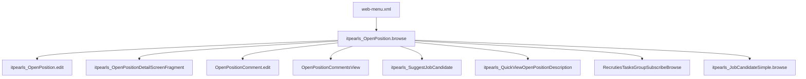

# OpenPosition Browse (`itpearls_OpenPosition.browse`)

> Списочный экран вакансий HRM HuntTech.
> Сущность: [OpenPosition.md](../entities/OpenPosition.md) · [OpenPosition_Spec.md](../architecture/OpenPosition_Spec.md)

---

## Business & Context Intro

### Назначение и Бизнес-смысл (What & Why)

Список вакансий — центральный экран планирования и контроля рекрутинга в HRM HuntTech: дерево позиций (`parentOpenPosition`), визуализация приоритета и срочности, статистика по CV и рекрутёрам, быстрый доступ к описанию и подбору кандидатов без перехода в edit.

### Связи в интерфейсе и Навигация (UI Context & Navigation)

Меню → `itpearls_OpenPosition.browse` (icon `COMPASS`, lookup 1000×800). Дочерние: Edit, detail-фрагмент, комментарии, `Suggestjobcandidate`, `JobCandidateSimpleBrowse`, групповая подписка `RecrutiesTasksGroupSubscribeBrowse`, quick view описания.

### Краткий обзор бизнес-логики поведения (Behavior Summary)

При открытии списка включаются фильтры «только открытые» и «только моя подписка»; для не-менеджеров приоритет по умолчанию Normal. После загрузки строк пакетно подготавливаются данные для колонок (наличие описаний, число рекрутёров, отправленных CV). Клик по строке раскрывает карточку вакансии с кнопками редактирования, открытия/закрытия и подбора кандидатов. Закрытие вакансии может потребовать массового завершения взаимодействий с кандидатами «на рассмотрении».

---

## 1. Точка вызова и контекст (Invocation & Context)

| Параметр | Значение |
|----------|----------|
| **@UiController** | `itpearls_OpenPosition.browse` |
| **Java-класс** | `com.company.itpearls.web.screens.openposition.OpenPositionBrowse` |
| **XML-дескриптор** | `open-position-browse.xml` |
| **Базовый класс** | `StandardLookup<OpenPosition>` |
| **Lookup-компонент** | `openPositionsTable` (`treeDataGrid`) |
| **Меню** | `web-menu.xml` → `screen="itpearls_OpenPosition.browse"`, icon `COMPASS` |
| **Режим диалога** | 1000×800 |
| **Загрузка данных** | `@LoadDataBeforeShow` |

### Назначение

Основной browse вакансий: иерархия (`parentOpenPosition`), срочные вакансии, фильтры подписки/приоритета/удалёнки, rich-колонки (логотипы, рейтинг, статистика CV), details с фрагментом `itpearls_OpenPositionDetailScreenFragment` и Skillsbar.

---

## 2. Связь с моделью данных (Data & Entity Binding)

| Контейнер | Entity | View | Loader |
|-----------|--------|------|--------|
| `openPositionsDc` | `OpenPosition` | `extends="openPosition-browse-view"` + `fetch="BATCH"` на `projectName`, `positionType`, `owner`, `openPositionComments`, `someFiles`, `cities` | `openPositionsDl`, `readOnly=true`, `maxResults=40` |

### JPQL

```sql
select e from itpearls_OpenPosition e order by e.vacansyName
```

Условия: `priority`, `lastOpenDate` (новые), подписки `RecrutiesTasks` (`freesubscriber`, `subscriber`, `notsubscriber`, `recrutier`), `openClose`, `signDraft`, `paused`, `internalProject`, `rating`, `remoteWork`, `positionType`.

### Критичные nested paths (browse-view + generators)

Используются в column generators без LOB: `vacansyName`, `vacansyID`, `priority`, `openClose`, `signDraft`, `remoteWork`, `salaryMin`/`salaryMax`, `numberPosition`, `workExperience`, `positionType` (`positionRuName`/`positionEnName`), `projectName` (logo, projectName, `projectDepartment.companyName`, descriptions — lazy exists cache), `owner`, `parentOpenPosition`.

Batch-кэши в Java (PostLoad): exists LOB, active recruiters count, sent CV count, avg rating, **subscribers** (`subscribersByPosition`), **child-folder** (`positionsWithChildren`), **interaction stats** (`interactionStatsColumnCache` / `interactionStatsDescriptionCache` — два JPQL-запроса: прямые вакансии и дочерние, свёрнутые к `parentOpenPosition.id`; без `CASE` в `GROUP BY`, совместимо с парсером CUBA 7).

### Фильтр

Custom: `projectFilter`, `positionFilter`, `projectOwnerFilter`, `newOpenPositionFilter` (`lastOpenDate` за 3 дня). Широкий `exclude` LOB и служебных полей.

---

## 3. Иерархия и взаимосвязь форм (Form Hierarchy)



| Связь | Экран | Открытие |
|-------|-------|----------|
| Edit | `itpearls_OpenPosition.edit` | create/edit actions |
| Details | `itpearls_OpenPositionDetailScreenFragment` | `detailsGenerator` |
| Комментарии | `itpearls_OpenPositionComment.edit`, `itpearls_OpenPositionCommentsView` | `setRatingButton` popup |
| Подписка | inline + `RecrutiesTasksGroupSubscribeBrowse` | `buttonSubscribe`, `groupSubscribe` |
| Кандидаты | `JobCandidateSimpleBrowse`, `Suggestjobcandidate` | action column, suggest button |

---

## 4. Модель поведения и интерактивность (Behavior Model)

### 4.1 Жизненный цикл формы (Lifecycle)

| Этап | Что происходит | Роли |
|------|----------------|------|
| Инициализация | Настройка колонок, фильтров подписки/приоритета/удалёнки, кнопки групповой подписки; загрузка пользователей для колонки владельца | Групповая подписка — Management/Hunting |
| Перед показом | Фильтр «только открытые»; Excel только для Manager; дефолт приоритета Normal для не-Manager; блок «срочных» вакансий (3 шт.) | Manager → доступен Excel |
| После показа | «Только моя подписка» = true; режим подписки по группе (Management/Accounting → «все», иначе «в подписке»); включение/выключение popup-действий | — |
| После загрузки списка | Очистка lazy-кэшей LOB; batch-проверки comment/exercise/memo/template; агрегаты рекрутеров, CV, рейтинга | — |

### 4.2 Скрытые вычисления

| Что видит пользователь | Правило |
|------------------------|---------|
| Цвет строки | Черновик / internal project / command / наличие активных рекрутеров |
| Зарплата в колонке | Деление на 1000, режим «по запросу кандидата», outstaffing, emoji комментария |
| Текст описания в tooltip | Lazy-load LOB только при наведении или открытии «Описание» |
| Срочные вакансии (верхний блок) | Shuffle + группировка по должности; клик → фильтр по rating и positionType |
| Обратный отсчёт в колонке folder | До `closingDate` |
| Статистика idStatistics | Два batch-JPQL за 3 месяца: прямые вакансии + дочерние (rollup к родителю); кэш колонки и tooltip |

### 4.3 Валидация и сохранение

Browse не является editor. Сохранение через отдельные `dataManager.commit`: открытие/закрытие вакансии, смена приоритета, установка `closingDate` при Low, массовое закрытие кандидатов при закрытии вакансии.

---

## 5. Логика управляющих элементов (Actions & Buttons Logic)

| Элемент | Цепочка |
|---------|---------|
| Подписаться | Нажатие → диалог подписки (`RecrutiesTasks.edit`) → после закрытия перезагрузка списка |
| Групповая подписка | → `RecrutiesTasksGroupSubscribeBrowse` |
| Подобрать кандидата | → `Suggestjobcandidate` с выбранной вакансией |
| Открыть/закрыть | Если закрытие → сначала `removeCandidatesWithConsideration` (диалог + batch IteractionList end-case) → переключение openClose → commit → reload |
| Закрыть с комментарием | Диалог рейтинга/комментария → затем open/close |
| Смена приоритета | Low → диалог недели закрытия + `closingDate` + commit; иначе сразу commit + уведомления (UI, Telegram, OpenPositionNews) |
| Комментарий/рейтинг | → `OpenPositionCommentEdit` → reload + scroll к строке |
| Memo для кандидатов | Печать отчёта `memoForCandidates` |
| Фильтр подписки (7 режимов) | Радиогруппа → перезагрузка: в подписке / не в / все / свободные / 3-7-30 дней / на паузе |
| Чекбоксы opened/draft/paused/mySubscribe | → параметры loader |
| Details: Изменить | → `OpenPosition.edit` |
| Details: Описание | Lazy LOB → `QuickViewOpenPositionDescription` |
| Details: Отправленные кандидаты | → `JobCandidateSimpleBrowse` по вакансии |
| Details: Подобрать резюме | Только если пользователь подписан и есть CV по positionType |


---

## 6. Визуальная компоновка элементов (Visual Layout Schema)

```
layout (expand=openPositionsTable)
├── groupBox urgentlyPositons (collapsable): clear + scroll urgentlyHBox
├── filter (collapsed by default)
├── radioButtonGroup subscribeRadioButtonGroup
├── treeDataGrid openPositionsTable (hierarchyProperty=parentOpenPosition, bodyRowHeight=60px)
│   ├── 20+ columns (folder, priority, rating, logos, dates, vacancy, cities, salary, …)
│   └── buttonsPanel
├── hbox: checkboxes (opened, draft, not paused, my subscribe) + rating/remote lookups
└── lookupActions (hidden)
```

**Стили:** `table-wordwrap`, `icon-no-border-50px`, `circle-30px`, traffic-light icons, HTML captions/descriptions.

---

## История изменений

| Дата | Изменение |
|------|-----------|
| 2026-06-26 | fix: interaction stats — два JPQL вместо `CASE` в `GROUP BY` (JpqlSyntaxException CUBA 7) |
| 2026-06-26 | perf: `maxResults=40`, `fetch="BATCH"` на FK/коллекции; PostLoad batch subscribers, interaction stats, parent-has-children; устранён N+1 в `setSubscribersRecruters`, `idStatistics`, `folder`, `vacansyName` description |
| 2026-06-26 | §4–5: поведение из Java простым языком (deep modernization) |
| 2026-06-26 | Business & Context Intro (Living Documentation standard) |
| 2026-06-26 | Первичная UI Spec из `open-position-browse.xml` и `OpenPositionBrowse.java` |
