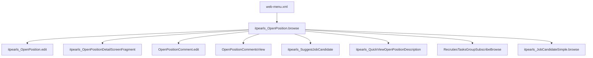

# OpenPosition Browse (`itpearls_OpenPosition.browse`)

> Списочный экран вакансий HRM HuntTech.
> Сущность: [OpenPosition.md](../entities/OpenPosition.md) · [OpenPosition_Spec.md](../architecture/OpenPosition_Spec.md)

---

## Business & Context Intro

### Назначение и Бизнес-смысл (What & Why)

Список вакансий — центральный экран планирования и контроля рекрутинга в HRM HuntTech: дерево позиций (`parentOpenPosition`), визуализация приоритета и срочности, статистика по CV и рекрутёрам, быстрый доступ к описанию и подбору кандидатов без перехода в edit.

### Связи в интерфейсе и Навигация (UI Context & Navigation)

Меню → `itpearls_OpenPosition.browse` (icon `COMPASS`, lookup 1000×800). Дочерние: Edit, detail-фрагмент, комментарии, `Suggestjobcandidate`, `JobCandidateSimpleBrowse`, групповая подписка `RecrutiesTasksGroupSubscribeBrowse`, quick view описания.

### Краткий обзор бизнес-логики поведения (Behavior Summary)

`openPosition-browse-view` без LOB; batch PostLoad-кэши (exists LOB, recruiters count, sent CV, avg rating); custom-фильтры проекта/должности/владельца/новых вакансий; `rowStyleProvider` по приоритету и подписке; закрытие вакансии с batch `IteractionList`; lazy load полного текста LOB в tooltip/description.

---

## 1. Точка вызова и контекст (Invocation & Context)

| Параметр | Значение |
|----------|----------|
| **@UiController** | `itpearls_OpenPosition.browse` |
| **Java-класс** | `com.company.itpearls.web.screens.openposition.OpenPositionBrowse` |
| **XML-дескриптор** | `open-position-browse.xml` |
| **Базовый класс** | `StandardLookup<OpenPosition>` |
| **Lookup-компонент** | `openPositionsTable` (`treeDataGrid`) |
| **Меню** | `web-menu.xml` → `screen="itpearls_OpenPosition.browse"`, icon `COMPASS` |
| **Режим диалога** | 1000×800 |
| **Загрузка данных** | `@LoadDataBeforeShow` |

### Назначение

Основной browse вакансий: иерархия (`parentOpenPosition`), срочные вакансии, фильтры подписки/приоритета/удалёнки, rich-колонки (логотипы, рейтинг, статистика CV), details с фрагментом `itpearls_OpenPositionDetailScreenFragment` и Skillsbar.

---

## 2. Связь с моделью данных (Data & Entity Binding)

| Контейнер | Entity | View | Loader |
|-----------|--------|------|--------|
| `openPositionsDc` | `OpenPosition` | `extends="openPosition-browse-view"` | `openPositionsDl`, `readOnly=true` |

### JPQL

```sql
select e from itpearls_OpenPosition e order by e.vacansyName
```

Условия: `priority`, `lastOpenDate` (новые), подписки `RecrutiesTasks` (`freesubscriber`, `subscriber`, `notsubscriber`, `recrutier`), `openClose`, `signDraft`, `paused`, `internalProject`, `rating`, `remoteWork`, `positionType`.

### Критичные nested paths (browse-view + generators)

Используются в column generators без LOB: `vacansyName`, `vacansyID`, `priority`, `openClose`, `signDraft`, `remoteWork`, `salaryMin`/`salaryMax`, `numberPosition`, `workExperience`, `positionType` (`positionRuName`/`positionEnName`), `projectName` (logo, projectName, `projectDepartment.companyName`, descriptions — lazy exists cache), `owner`, `parentOpenPosition`.

Batch-кэши в Java (PostLoad): exists LOB, active recruiters count, sent CV count, avg rating.

### Фильтр

Custom: `projectFilter`, `positionFilter`, `projectOwnerFilter`, `newOpenPositionFilter` (`lastOpenDate` за 3 дня). Широкий `exclude` LOB и служебных полей.

---

## 3. Иерархия и взаимосвязь форм (Form Hierarchy)



| Связь | Экран | Открытие |
|-------|-------|----------|
| Edit | `itpearls_OpenPosition.edit` | create/edit actions |
| Details | `itpearls_OpenPositionDetailScreenFragment` | `detailsGenerator` |
| Комментарии | `itpearls_OpenPositionComment.edit`, `itpearls_OpenPositionCommentsView` | `setRatingButton` popup |
| Подписка | inline + `RecrutiesTasksGroupSubscribeBrowse` | `buttonSubscribe`, `groupSubscribe` |
| Кандидаты | `JobCandidateSimpleBrowse`, `Suggestjobcandidate` | action column, suggest button |

---

## 4. Модель поведения и интерактивность (Behavior Model)

| Область | Поведение |
|---------|-----------|
| `openPositionsDl` PostLoad | `refreshBrowseLobExistsCaches`, `refreshBrowseAggregateCaches` |
| `detailsGenerator` | GroupBox: title, кнопки (edit, close, priority, comment, open/close, description, GigaChat, sent candidates), fragment, Skillsbar |
| `rowStyleProvider` | цвет строки по приоритету, подписке, паузе |
| `subscribeRadioButtonGroup` | фильтр подписчик/не подписчик/свободные |
| Чекбоксы | `checkBoxOnlyOpenedPosition`, `signDraftCheckBox`, `checkBoxOnlyNotPaused`, `checkBoxOnlyMySubscribe` |
| Lookup fields | `notLowerRatingLookupField`, `remoteWorkLookupField` → параметры loader |
| `urgentlyPositons` | динамические кнопки срочных вакансий (`priority >= …`) |
| Column generators | 20+ кастомных колонок: folder tree, traffic-light priority, logos, salary range, stats, last CV send |

Закрытие вакансии: `openCloseButton` / details — `removeCandidatesWithConsideration` (batch `CommitContext` для `IteractionList`).

---

## 5. Логика управляющих элементов (Actions & Buttons Logic)

| Элемент | Эффект |
|---------|--------|
| CRUD | `createBtn`, `editBtn`, `removeBtn` |
| `openCloseButton` | popup open/close (частично закомментирован в XML) |
| `buttonSubscribe` | `subscribePosition` (enable при выборе) |
| `groupSubscribe` | `groupSubscribe` (скрыт) |
| `suggestCandidateButton` | `suggestCandidateButton` (скрыт) |
| `setRatingButton` | `setRatingComment`, `openPositionCommentViewInvoke` |
| `reportsPopupButton` | `getMemoForCandidate` (list print form, скрыт) |
| `clearUrgentPos` | `clearUrgentFilter` |
| Excel | скрыт/disabled |

---

## 6. Визуальная компоновка элементов (Visual Layout Schema)

```
layout (expand=openPositionsTable)
├── groupBox urgentlyPositons (collapsable): clear + scroll urgentlyHBox
├── filter (collapsed by default)
├── radioButtonGroup subscribeRadioButtonGroup
├── treeDataGrid openPositionsTable (hierarchyProperty=parentOpenPosition, bodyRowHeight=60px)
│   ├── 20+ columns (folder, priority, rating, logos, dates, vacancy, cities, salary, …)
│   └── buttonsPanel
├── hbox: checkboxes (opened, draft, not paused, my subscribe) + rating/remote lookups
└── lookupActions (hidden)
```

**Стили:** `table-wordwrap`, `icon-no-border-50px`, `circle-30px`, traffic-light icons, HTML captions/descriptions.

---

## История изменений

| Дата | Изменение |
|------|-----------|
| 2026-06-26 | Business & Context Intro (Living Documentation standard) |
| 2026-06-26 | Первичная UI Spec из `open-position-browse.xml` и `OpenPositionBrowse.java` |
