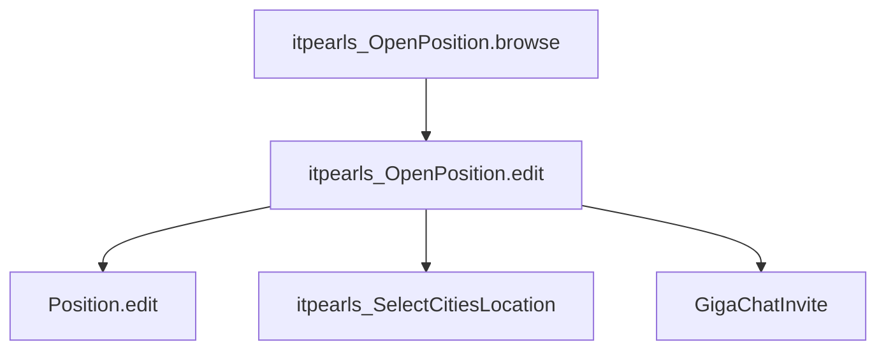

# OpenPosition Edit (`itpearls_OpenPosition.edit`)

> Форма редактирования вакансии HRM HuntTech.
> Сущность: [OpenPosition.md](../entities/OpenPosition.md) · [OpenPosition_Spec.md](../architecture/OpenPosition_Spec.md)

---

## Business & Context Intro

### Назначение и Бизнес-смысл (What & Why)

Полная карточка вакансии HRM HuntTech: реквизиты, зарплата, комиссии, LOB-описания, навыки, трудовые договоры, файлы, BPM, комментарии и новости.

### Связи в интерфейсе и Навигация (UI Context & Navigation)

Из `itpearls_OpenPosition.browse` и master/recruiting browse; pickers Project, Position, Grade, City, parent OpenPosition.

### Краткий обзор бизнес-логики поведения (Behavior Summary)

Много вкладок: основные реквизиты, оплаты, описания, навыки, файлы, BPM, комментарии. Тяжёлые поля и коллекции загружаются при первом открытии вкладки. При сохранении синхронизируются навыки и трудовые договоры; проверяются дубликаты имени и vacansyID; короткое описание не длиннее 250 символов; при открытии/закрытии — уведомления и Telegram.

---

## 1. Точка вызова и контекст (Invocation & Context)

| Параметр | Значение |
|----------|----------|
| **@UiController** | `itpearls_OpenPosition.edit` |
| **Java-класс** | `com.company.itpearls.web.screens.openposition.OpenPositionEdit` |
| **XML-дескриптор** | `open-position-edit.xml` |
| **Базовый класс** | `StandardEditor<OpenPosition>` |
| **EditedEntityContainer** | `openPositionDc` |
| **Режим диалога** | 1100×800px |
| **Загрузка данных** | `@LoadDataBeforeShow` |

### Назначение

Полная карточка вакансии: реквизиты, зарплата и комиссии, описания (RU/EN), навыки, трудовые договоры, файлы, новости, BPM-согласование, комментарии. Lazy load LOB и вкладочных коллекций.

---

## 2. Связь с моделью данных (Data & Entity Binding)

### Instance `openPositionDc`

| Параметр | Значение |
|----------|----------|
| View | `extends="openPosition-edit-view"` (без LOB и тяжёлых коллекций в основном SELECT) |
| Loader | `openPositionDl` |

### Standalone collection loaders (lazy tabs, `:openPosition` в condition)

| Контейнер | Entity | View |
|-----------|--------|------|
| `laborAgreementDc` | `LaborAgreement` | `laborAgreement-openPosition-tab-view` |
| `commentsOpenPositionDc` | `OpenPositionComment` | `openPositionComment-edit-view` |
| `someFilesesDc` | `SomeFilesOpenPosition` | `someFilesOpenPosition-edit-view` |
| `openPositionSkillsListsDc` | `SkillTree` | `skillTree-openPosition-tab-view` |
| `procAttachmentsDc` | `ProcAttachment` (BPM) | `procAttachment-browse` |
| `openPositionNewsDc` | `OpenPositionNews` | `openPositionNews-edit-view` |

### Справочные options loaders

`openPositionParentDc` (`openPosition-picker-view`), `positionTypesDc`, `projectNamesDc` (фильтр department/closed/withOpenPosition), `companyNamesDc`, `companyDepartamentsDc`, `citiesDc`, `gradeDc`.

### Facet

`closedVacancyTimer` — delay 60000 ms, `autostart=false`, repeating; обновляет `closedVacancyInfoLabel` при заданной `closingDate`.

---

## 3. Иерархия и взаимосвязь форм (Form Hierarchy)



| Связь | Экран | Контекст |
|-------|-------|----------|
| Родительская вакансия | picker `parentOpenPositionField` | `openPositionParentDc` |
| Города | `itpearls_SelectCitiesLocation` | множественный выбор локации |
| Должность | `PositionEdit` | picker open на `positionTypeField` |
| BPM | `ProcActionsFragment` (вкладка Approval) | proc attachments |

---

## 4. Модель поведения и интерактивность (Behavior Model)

### 4.1 Жизненный цикл формы (Lifecycle)

| Этап | Что происходит |
|------|----------------|
| Инициализация | Блокировка auto-load у loaders без параметра (laborAgreement, comments, files, skills, BPM-вложения); настройка radio, генераторов, skills renderer |
| Перед показом | Для существующей — lazy LOB главной вкладки; снимок `beforeEdit`; флаги open/close; шаблон HTML для новой; disable стандартного описания; BPM `openpositionApproval` |
| После показа | Новая вакансия → openClose=false; фиксация стартовых значений; `screenFullyLoaded=true`; таймер обратного отсчёта до closingDate |
| Смена вкладки | Lazy-load: exercise, memo, templateLetter, skills, files, comments, laborAgreement |
| Таймер (60 с) | Обновление label обратного отсчёта |
| Изменение dataContext | `entityIsChanged=true` |

**Роли:** Manager/Administrator видят все блоки оплат; Researcher/Recruiter — только свой блок (`setHiddeField`).

### 4.2 Скрытые вычисления

| Область | Правило |
|---------|---------|
| Комиссия компании | Тип 0 — фикс; 1 — % от годового ×12 × NDFL(1.13); 2 — % от месячной × NDFL |
| Зарплата ресерчера/рекрутера | Фикс / 20% / 10% / произвольный % от комиссии |
| Подсветка навыков в описании | Имена skillTree → brown/serif в HTML |
| Автоимя вакансии | positionType + project + city + grade |
| OpenPositionNews | Автосообщения при смене salary/description/template/priority/exercise (сравнение со стартовыми значениями) |

### 4.3 Валидация и сохранение

| Момент | Условие | Результат |
|--------|---------|-----------|
| Валидатор зарплаты | min > max | Ошибка «минимум больше максимума», сохранение блокируется |
| Перед commit (1) | Новая запись | lastOpenDate = сейчас; null-safe чекбоксы |
| Перед commit | Новая запись | Проверка дубликата (positionType+vacansyName+project+parent+remoteWork+city) → диалог → отложенный commit |
| Перед commit | Любая | Проверка уникальности vacansyID → диалог при совпадении |
| Перед commit | — | sync laborAgreement и skillsList в entity |
| Перед commit (2) | shortDescription > 250 | ERROR notification, preventCommit |
| Перед commit (3) | Смена open/close | UiNotification подписчикам |
| Перед commit (4) | Новая или изменение открытой | Telegram (ошибка API — warning, commit не блокируется) |
| После commit | Смена open/close или создание | OpenPositionNews; при переименовании — отдельная новость |
| После commit (1) | Есть дочерние command-вакансии | Диалог массового open/close дочерних (только в памяти) |

---

## 5. Логика управляющих элементов (Actions & Buttons Logic)

| Элемент | Цепочка |
|---------|---------|
| Подписаться | → `RecrutiesTasks.edit` с текущей вакансией |
| Открыть/закрыть (чекбокс) | Диалог подтверждения → при открытии `closeWithCommit()` |
| Добавить города | → `SelectCitiesLocation` → merge в entity |
| Новость | → editor `OpenPositionNews` |
| Сгенерировать имя | `generateVacancyName()` или диалог перезаписи |
| Краткое описание из JD | Парсинг навыков из описания → shortDescription |
| Rescan навыков | `pdfParserService.parseSkillTree` → skillTrees |
| positionType / project / company | Каскадное обновление vacansyName, департамента, логотипа, loaders |
| signDraft | Label «(DRAFT)», priority = -1 или null |
| priority Low | → `setClosingWeek()` (диалог + closingDate) |
| Вкладка комментариев: Ответить | → `createComment` → merge в dataContext |
| Commit / Close | Стандартный editor |


---

## 6. Визуальная компоновка элементов (Visual Layout Schema)

```
layout (expand=tabSheetGroupBox)
├── lastOpenVacancyDateField (hidden)
├── groupBox msgTitle: draft label, labelOpenPosition, commission labels, projectLogoImage
└── tabSheet tabSheetOpenPosition
    ├── tabOpenPosition — основная форма (grid полей, checkboxes, city picker)
    ├── laborAgreementTab
    ├── tabPayments — salary + commission grids
    ├── accordion tabs: RU / EN / standard description / who is this guy
    ├── tabFiles
    ├── tabExercise
    ├── tabMemoForInterview
    ├── tabTemplateLetter
    ├── tabSkills — openPositionSkillsListTable
    ├── tabOpenPositionNews
    ├── tabApproval — ProcActionsFragment
    └── commentsTab
```

Header labels: `signDraftLabel`, `labelTopComissionRecrutier`, `labelTopComissionResearcher`. Timer-driven `closedVacancyInfoLabel` на основной вкладке.

---

## История изменений

| Дата | Изменение |
|------|-----------|
| 2026-06-26 | §4–5: поведение из Java простым языком (deep modernization) |
| 2026-06-26 | Business & Context Intro (Living Documentation standard) |
| 2026-06-26 | Первичная UI Spec из `open-position-edit.xml` и `OpenPositionEdit.java` |
