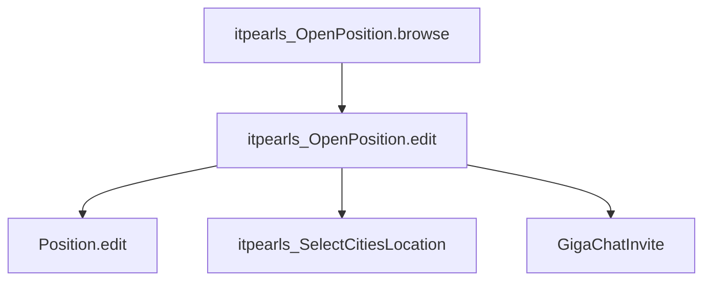

# OpenPosition Edit (`itpearls_OpenPosition.edit`)

> Форма редактирования вакансии HRM HuntTech.
> Сущность: [OpenPosition.md](../entities/OpenPosition.md) · [OpenPosition_Spec.md](../architecture/OpenPosition_Spec.md)

---

## Business & Context Intro

### Назначение и Бизнес-смысл (What & Why)

Полная карточка вакансии HRM HuntTech: реквизиты, зарплата, комиссии, LOB-описания, навыки, трудовые договоры, файлы, BPM, комментарии и новости.

### Связи в интерфейсе и Навигация (UI Context & Navigation)

Из `itpearls_OpenPosition.browse` и master/recruiting browse; pickers Project, Position, Grade, City, parent OpenPosition.

### Краткий обзор бизнес-логики поведения (Behavior Summary)

`tabSheetOpenPosition` с lazy loaders (`PreLoadEvent.preventLoad`); `syncSkillsListToEntity` / `syncLaborAgreementToEntity` перед commit; `closedVacancyTimer`; Telegram notify; уникальность `vacansyID`.

---

## 1. Точка вызова и контекст (Invocation & Context)

| Параметр | Значение |
|----------|----------|
| **@UiController** | `itpearls_OpenPosition.edit` |
| **Java-класс** | `com.company.itpearls.web.screens.openposition.OpenPositionEdit` |
| **XML-дескриптор** | `open-position-edit.xml` |
| **Базовый класс** | `StandardEditor<OpenPosition>` |
| **EditedEntityContainer** | `openPositionDc` |
| **Режим диалога** | 1100×800px |
| **Загрузка данных** | `@LoadDataBeforeShow` |

### Назначение

Полная карточка вакансии: реквизиты, зарплата и комиссии, описания (RU/EN), навыки, трудовые договоры, файлы, новости, BPM-согласование, комментарии. Lazy load LOB и вкладочных коллекций.

---

## 2. Связь с моделью данных (Data & Entity Binding)

### Instance `openPositionDc`

| Параметр | Значение |
|----------|----------|
| View | `extends="openPosition-edit-view"` (без LOB и тяжёлых коллекций в основном SELECT) |
| Loader | `openPositionDl` |

### Standalone collection loaders (lazy tabs, `:openPosition` в condition)

| Контейнер | Entity | View |
|-----------|--------|------|
| `laborAgreementDc` | `LaborAgreement` | `laborAgreement-openPosition-tab-view` |
| `commentsOpenPositionDc` | `OpenPositionComment` | `openPositionComment-edit-view` |
| `someFilesesDc` | `SomeFilesOpenPosition` | `someFilesOpenPosition-edit-view` |
| `openPositionSkillsListsDc` | `SkillTree` | `skillTree-openPosition-tab-view` |
| `procAttachmentsDc` | `ProcAttachment` (BPM) | `procAttachment-browse` |
| `openPositionNewsDc` | `OpenPositionNews` | `openPositionNews-edit-view` |

### Справочные options loaders

`openPositionParentDc` (`openPosition-picker-view`), `positionTypesDc`, `projectNamesDc` (фильтр department/closed/withOpenPosition), `companyNamesDc`, `companyDepartamentsDc`, `citiesDc`, `gradeDc`.

### Facet

`closedVacancyTimer` — delay 60000 ms, `autostart=false`, repeating; обновляет `closedVacancyInfoLabel` при заданной `closingDate`.

---

## 3. Иерархия и взаимосвязь форм (Form Hierarchy)



| Связь | Экран | Контекст |
|-------|-------|----------|
| Родительская вакансия | picker `parentOpenPositionField` | `openPositionParentDc` |
| Города | `itpearls_SelectCitiesLocation` | множественный выбор локации |
| Должность | `PositionEdit` | picker open на `positionTypeField` |
| BPM | `ProcActionsFragment` (вкладка Approval) | proc attachments |

---

## 4. Модель поведения и интерактивность (Behavior Model)

| Область | Поведение |
|---------|-----------|
| `tabSheetOpenPosition` SelectedTabChange | lazy load LOB (`comment`, `templateLetter`, `exercise`, `memoForInterview`) и коллекций вкладок |
| `closedVacancyTimer` | countdown до `closingDate`; start/stop в `initClosedVacancyTimerFacet` |
| Salary validators | min ≤ max на `openPositionFieldSalaryMin/Max` |
| `openClosePositionCheckBox` | смена статуса, даты open/close |
| `signDraftCheckBox` | черновик |
| `priorityField` | иконки приоритета (optionIconProvider) |
| `remoteWorkField`, `registrationForWorkField` | иконки/стили опций |
| Payments tab | `radioButtonGroupPaymentsType`, NDFL, проценты recruiter/researcher |
| `openPositionRichTextArea` и др. | Jsoup/sanitize, Telegram notify on commit (не блокирует save) |
| `onBeforeCommitChanges` | duplicate `vacansyID` check, sync skills/labor agreement с entity |
| Skills tab | rescan `SkillTree`, row descriptions, comment column |
| News tab | `detailsGenerator` на `openPostionNewsDataGrid`, filter `priorityNews` |

---

## 5. Логика управляющих элементов (Actions & Buttons Logic)

| Вкладка / элемент | Действия |
|-------------------|----------|
| `tabOpenPosition` | основные поля: company, department, project, position, grade, cities, salary, flags (`needLetter`, `needExercise`, `remoteWork`, …) |
| `laborAgreementTab` | CRUD labor agreements |
| `tabPayments` | тип оплаты, комиссии, проценты |
| Описания (accordion RU/EN/standard/who) | rich text areas |
| `tabFiles` | `someFilesTable` create/edit/remove |
| `tabExercise`, `tabMemoForInterview`, `tabTemplateLetter` | LOB editors |
| `tabSkills` | skills grid, rescan |
| `tabOpenPositionNews` | news CRUD |
| `tabApproval` | BPM proc actions + attachments |
| `commentsTab` | комментарии к вакансии |
| Footer | commit/close, draft/open-close controls |

`someFilesTable.create` — `@Install newEntitySupplier` для привязки к `openPosition`.

---

## 6. Визуальная компоновка элементов (Visual Layout Schema)

```
layout (expand=tabSheetGroupBox)
├── lastOpenVacancyDateField (hidden)
├── groupBox msgTitle: draft label, labelOpenPosition, commission labels, projectLogoImage
└── tabSheet tabSheetOpenPosition
    ├── tabOpenPosition — основная форма (grid полей, checkboxes, city picker)
    ├── laborAgreementTab
    ├── tabPayments — salary + commission grids
    ├── accordion tabs: RU / EN / standard description / who is this guy
    ├── tabFiles
    ├── tabExercise
    ├── tabMemoForInterview
    ├── tabTemplateLetter
    ├── tabSkills — openPositionSkillsListTable
    ├── tabOpenPositionNews
    ├── tabApproval — ProcActionsFragment
    └── commentsTab
```

Header labels: `signDraftLabel`, `labelTopComissionRecrutier`, `labelTopComissionResearcher`. Timer-driven `closedVacancyInfoLabel` на основной вкладке.

---

## История изменений

| Дата | Изменение |
|------|-----------|
| 2026-06-26 | Business & Context Intro (Living Documentation standard) |
| 2026-06-26 | Первичная UI Spec из `open-position-edit.xml` и `OpenPositionEdit.java` |
