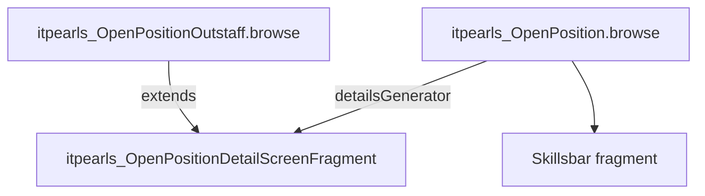

# OpenPosition Detail Fragment (`itpearls_OpenPositionDetailScreenFragment`)

> Фрагмент детальной панели вакансии в browse.
> Сущность: [OpenPosition.md](../entities/OpenPosition.md) · [OpenPosition_Spec.md](../architecture/OpenPosition_Spec.md)

---

## Business & Context Intro

### Назначение и Бизнес-смысл (What & Why)

Read-only блок деталей вакансии в `detailsGenerator` browse: логотип компании, зарплата, краткое описание, remote work, владелец проекта, подписчики-рекрутеры (аватары).

### Точка встраивания

`OpenPositionBrowse.openPositionsTableDetailsGenerator` → `fragments.create(OpenPositionDetailScreenFragment.class)`.

### Связи в интерфейсе и Навигация (UI Context & Navigation)

Контроллер `itpearls_OpenPositionDetailScreenFragment`; навигация и дочерние формы — §3 «Иерархия и взаимосвязь форм».

### Краткий обзор бизнес-логики поведения (Behavior Summary)

Подписки, actions и view контейнеры — §2–§5; Data View Integrity: атрибуты generators ⊆ view loader (см. [data-view-integrity.mdc](../../.cursor/rules/data-view-integrity.mdc)).

---

## 1. Точка вызова и контекст (Invocation & Context)

| Параметр | Значение |
|----------|----------|
| **@UiController** | `itpearls_OpenPositionDetailScreenFragment` |
| **Java-класс** | `com.company.itpearls.web.screens.openposition.openpositionfragments.OpenPositionDetailScreenFragment` |
| **XML-дескриптор** | `open-position-detail-screen-fragment.xml` |
| **Базовый класс** | `ScreenFragment` |
| **Наследник** | `OpenPositionOutstaffDetailScreenFragment` (outstaff browse) |

### Назначение

Read-only блок деталей вакансии в `detailsGenerator` browse: логотип компании, зарплата, краткое описание, remote work, владелец проекта, подписчики-рекрутеры (аватары).

### Точка встраивания

`OpenPositionBrowse.openPositionsTableDetailsGenerator` → `fragments.create(OpenPositionDetailScreenFragment.class)`.

---

## 2. Связь с моделью данных (Data & Entity Binding)

| Контейнер | Тип | provided |
|-----------|-----|----------|
| `openPositionsDc` | collection `OpenPosition` | `true` |

### Property paths в XML (nested)

| Компонент | property path |
|-----------|---------------|
| `companyLogoImage` | `projectName.projectDepartment.companyName.fileCompanyLogo` |
| `conpanyTextField` | `projectName.projectDepartment.companyName` |
| `departamentTextField` | `projectName.projectDepartment` |
| `projectTextField` | `projectName` |
| `salaryMinTextField` / `salaryMaxTextField` | `salaryMin`, `salaryMax` |
| `shortDescriptionTextArea` | `shortDescription` |
| `startProjectDateTextField` | `projectName.startProjectDate` |
| `cityPositionTextField` | `cityPosition` |
| `numberPositionTextField` | `numberPosition` |
| Owner labels | `projectName.projectOwner.firstName/secondName/middleName` |

View наследуется от родительского `openPosition-browse-view` (provided container).

### Java load

`QUERY_SUBSCRIBERS` → `RecrutiesTasks` (`recrutiesTasks-view`) для `setSubscribersRecruters()`.

---

## 3. Иерархия и взаимосвязь форм (Form Hierarchy)



Родитель вызывает: `setOpenPosition(entity)`, `setLabels()`, `setDefaultCompanyLogo()`, `setSubscribersRecruters()`.

---

## 4. Модель поведения и интерактивность (Behavior Model)

| Метод / событие | Логика |
|-----------------|--------|
| `onAttach` | `setDefaultCompanyLogo()` — fallback `icons/no-company.png` |
| `setLabels` | `needExeciseLabel`, `needLetterLabel` visibility; salary comment emoji + description; `setRemoteLabel()` (0=Нет, 1=Удаленная, 2=Частично 50/50) |
| `setSubscribersRecruters` | Image 30px circle per active `RecrutiesTasks.reacrutier`, avatar or `no-programmer.jpeg`; hide `recrutersGroupBox` if empty |

`remoteWork` map захардкожена в Java (не messages).

---

## 5. Логика управляющих элементов (Actions & Buttons Logic)

Фрагмент не содержит action-кнопок. Индикаторы:

| Label | Условие visible |
|-------|-----------------|
| `needExeciseLabel` | `needExercise == true` |
| `needLetterLabel` | `needLetter == true` |
| `salaryComment1/2` | при `salaryComment != null` (emoji + tooltip) |

Кнопки edit/close/subscribe создаются в `OpenPositionBrowse.detailsGenerator`, не во фрагменте.

---

## 6. Визуальная компоновка элементов (Visual Layout Schema)

```
layout (expand=mainHBox)
└── mainHBox (expand=mainDetailFragmentVBox)
    ├── companyLogoImage (150×200, renderer-photo-150px)
    ├── labelIndicatorsHBox: needExeciseLabel, needLetterLabel (label_button_red)
    └── mainDetailFragmentVBox
        ├── groupBox projectCompanyHBox (msgDetails, light, collapsable)
        │   └── grid 5 columns: company, department, project, salary, shortDescription
        └── groupBox recrutersGroupBox (msgSubscrubers)
            └── recrutersHBox (dynamic avatars)
```

`shortDescriptionTextArea`: `editable=false`, `stylename=borderless`.

---

## История изменений

| Дата | Изменение |
|------|-----------|
| 2026-06-26 | Business & Context Intro (Living Documentation standard) |
| 2026-06-26 | Первичная UI Spec из `open-position-detail-screen-fragment.xml` и `OpenPositionDetailScreenFragment.java` |
