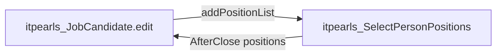

# Select Person Positions (`itpearls_SelectPersonPositions`)

> Диалог выбора дополнительных должностей кандидата (twin column).
> Сущность: [JobCandidate.md](../entities/JobCandidate.md) · справочник [Position.md](../entities/Position.md)

---

## Business & Context Intro

### Назначение и Бизнес-смысл (What & Why)

Множественный выбор должностей (`JobCandidatePositionLists`) для кандидата. Вызывается из `JobCandidateEdit.addPositionList()` по кнопке `addPositions` («Указать должности»).

### Связи в интерфейсе и Навигация (UI Context & Navigation)

Контроллер `itpearls_SelectPersonPositions`; навигация и дочерние формы — §3 «Иерархия и взаимосвязь форм».

### Краткий обзор бизнес-логики поведения (Behavior Summary)

Подписки, actions и view контейнеры — §2–§5; Data View Integrity: атрибуты generators ⊆ view loader (см. [data-view-integrity.mdc](../../.cursor/rules/data-view-integrity.mdc)).

---

## 1. Точка вызова и контекст (Invocation & Context)

| Параметр | Значение |
|----------|----------|
| **@UiController** | `itpearls_SelectPersonPositions` |
| **Java-класс** | `com.company.itpearls.web.screens.jobcandidate.SelectPersonPositions` |
| **XML-дескриптор** | `select-person-positions.xml` |
| **Базовый класс** | `Screen` |
| **dialogMode** | 600×400, `forceDialog=true`, `closeOnClickOutside=false` |

### Назначение

Множественный выбор должностей (`JobCandidatePositionLists`) для кандидата. Вызывается из `JobCandidateEdit.addPositionList()` по кнопке `addPositions` («Указать должности»).

---

## 2. Связь с моделью данных (Data & Entity Binding)

| Контейнер | Entity | View / loader |
|-----------|--------|---------------|
| `positionsDc` | `JobCandidate` | `extends="_local"`, `positionList` → `_local`; loader: `select f from itpearls_JobCandidate f` |
| `positionDc` | collection property | `positionList` |
| `positionsOptionDc` | `Position` | `position-view` + `positionRuName`; loader: все `itpearls_Position` |

### TwinColumn binding

```xml
<twinColumn dataContainer="positionsDc" property="positionList" addAllBtnEnabled="true"/>
```

В Java `onBeforeShow` options перезаписываются отфильтрованным списком (без «(не использовать)%»).

---

## 3. Иерархия и взаимосвязь форм (Form Hierarchy)



| API | Назначение |
|-----|------------|
| `setJobCandidate(JobCandidate)` | контекст для создания `JobCandidatePositionLists` |
| `setPositionsList(List<Position>)` | предзаполнение twin column |
| `getPositionsList()` | результат после закрытия |

Родитель после `AfterClose` создаёт `JobCandidatePositionLists` без дубликатов по `positionRuName` и вызывает `dataContext.commit()`.

---

## 4. Модель поведения и интерактивность (Behavior Model)

| Событие | Логика |
|---------|--------|
| `BeforeShow` | load Position JPQL с фильтром `not like '%(не использовать)%'`, `positionTwinColumn.setOptionsList(positions)` |
| `closeBtn` click | `closeWithDefaultAction()` |

Нет валидации и commit на уровне диалога — персистенция в `JobCandidateEdit`.

---

## 5. Логика управляющих элементов (Actions & Buttons Logic)

| Элемент | id | Эффект |
|---------|-----|--------|
| Twin column | `positionTwinColumn` | перенос должностей left↔right, `addAllBtnEnabled` |
| Закрыть | `closeBtn` | закрытие диалога (`msg://msgClose`) |

Стандартные кнопки OK/Cancel отсутствуют — только Close; данные читаются родителем в `AfterCloseListener`.

---

## 6. Визуальная компоновка элементов (Visual Layout Schema)

```
layout (expand=positionTwinColumn, spacing=true)
├── twinColumn positionTwinColumn (height=100%, width=100%)
└── hbox editActions (BOTTOM_RIGHT)
    └── button closeBtn
```

---

## История изменений

| Дата | Изменение |
|------|-----------|
| 2026-06-26 | Business & Context Intro (Living Documentation standard) |
| 2026-06-26 | Первичная UI Spec из `select-person-positions.xml` и `SelectPersonPositions.java` |
