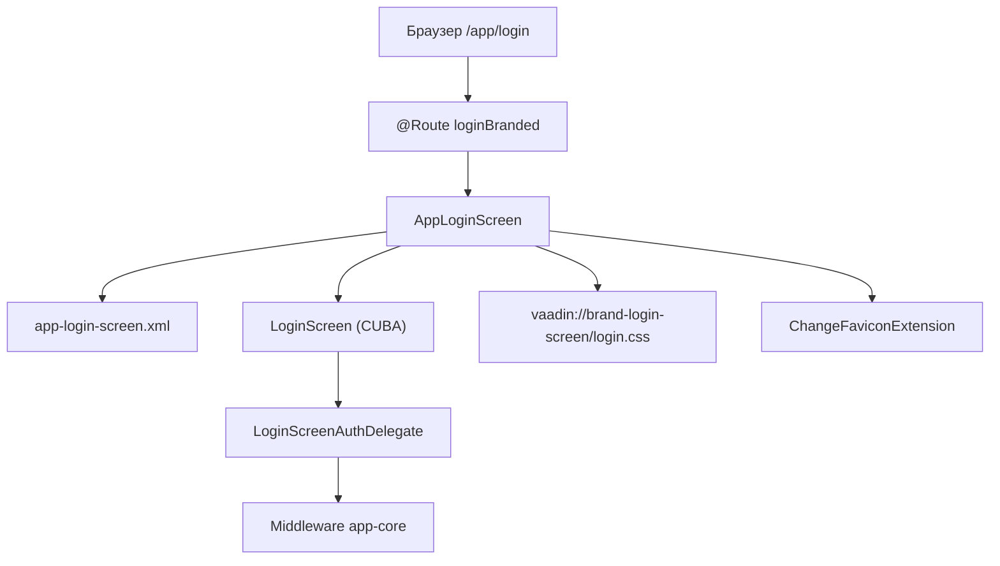
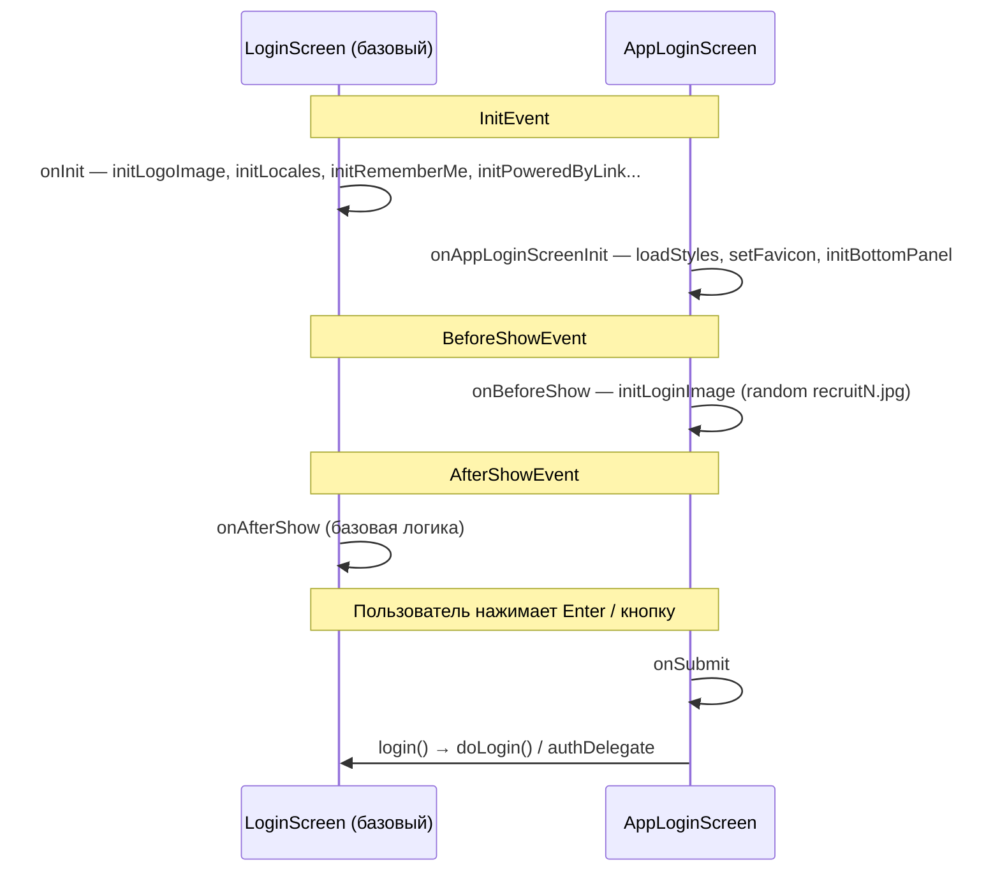

# Login screen HRM HuntTech

Техническое и пользовательское описание экрана входа в систему на CUBA Platform

---

## Business & Context Intro

### Назначение и Бизнес-смысл (What & Why)

Экран входа (`AppLoginScreen`, `@UiController("loginBranded")`) — корневая точка аутентификации веб-клиента HRM HuntTech. Пользователь подтверждает личность по логину и паролю перед доступом к основному окну приложения (`extMainScreen`). Экран обеспечивает брендированный первый контакт с системой: логотип, приветствие, выбор языка, «Запомнить меня», индикатор Caps Lock.

### Связи в интерфейсе и Навигация (UI Context & Navigation)

Регистрация: `cuba.web.loginScreenId=loginBranded` в `web-app.properties`; маршрут `@Route(path = "login", root = true)`. После успешного `login()` — переход на `extMainScreen`. Не привязан к entity; наследует `com.haulmont.cuba.web.app.login.LoginScreen`. Дескриптор: `app-login-screen.xml`.

### Краткий обзор бизнес-логики поведения (Behavior Summary)

Lifecycle: `onAppLoginScreenInit`, `onBeforeShow`, `onSubmit` → `login()` базового класса; инициализация логотипа, локалей, remember-me, powered-by. Валидация пустых полей и ошибки аутентификации — стандарт CUBA LoginScreen. Тема `hover`, контекст `/app`.

---

## 4.1 Назначение экрана

Экран входа (`AppLoginScreen`, идентификатор контроллера `loginBranded`) — корневой экран веб-клиента HRM HuntTech. Предназначен для аутентификации пользователя по логину и паролю перед доступом к основному интерфейсу приложения (`extMainScreen`).

Пользователь видит:

- логотип приложения;
- приветственный заголовок;
- поля «Логин» и «Пароль»;
- индикатор Caps Lock;
- чекбокс «Запомнить меня»;
- выбор языка интерфейса (при включённой настройке);
- кнопку входа;
- фоновое изображение справа от формы;
- нижнюю панель «Разработано ООО Ханттек» с логотипом HuntTech.

Экран зарегистрирован как экран входа в `web-app.properties` (`cuba.web.loginScreenId=loginBranded`) и доступен по маршруту `/login` как корневой экран (`@Route(path = "login", root = true)`).

---

## 4.2 Платформа и архитектурный контекст

| Аспект | Значение в проекте |
|--------|-------------------|
| Платформа | CUBA Platform **7.3-SNAPSHOT** (`build.gradle`) |
| UI-стек | Vaadin 8 (Web Client) |
| Базовый класс | `com.haulmont.cuba.web.app.login.LoginScreen` |
| Контроллер проекта | `com.company.itpearls.web.login.AppLoginScreen` |
| Дескриптор | `app-login-screen.xml` |
| Идентификатор экрана | `loginBranded` (`@UiController("loginBranded")`) |
| Активная тема | `hover` (`cuba.web.theme = hover` в `web-app.properties`) |
| Web-контекст | `app` (`cuba.webContextName = app`) |

### Наследование от LoginScreen

`AppLoginScreen` расширяет стандартный `LoginScreen` CUBA и наследует:

- инъекции полей формы (`loginField`, `passwordField`, `rememberMeCheckBox`, `localesSelect`, `logoImage` и др.);
- метод `login()` — основная точка входа в процесс аутентификации;
- lifecycle-обработчики базового класса: `onInit`, `onAfterShow`, `initLogoImage()`, `initLocales()`, `initRememberMe()`, `initPoweredByLink()` и др.

Проект переопределяет XML-дескриптор (брендированный макет с фоновым изображением) и добавляет собственную инициализацию в `onAppLoginScreenInit`, `onBeforeShow`, `onSubmit`.

### Аннотации

```java
@Route(path = "login", root = true)
@UiController("loginBranded")
@UiDescriptor("app-login-screen.xml")
public class AppLoginScreen extends LoginScreen
```

| Аннотация | Назначение |
|-----------|------------|
| `@Route(path = "login", root = true)` | Регистрация корневого URL-маршрута `/login` в механизме CUBA URL Routing |
| `@UiController("loginBranded")` | Идентификатор экрана; используется в `cuba.web.loginScreenId` |
| `@UiDescriptor("app-login-screen.xml")` | Привязка XML-дескриптора экрана |

### Архитектурная схема



---

## 4.3 Используемые файлы

| Файл | Путь | Роль |
|------|------|------|
| XML-дескриптор | `modules/web/src/com/company/itpearls/web/login/app-login-screen.xml` | Разметка экрана входа |
| Java-контроллер | `modules/web/src/com/company/itpearls/web/login/AppLoginScreen.java` | Логика инициализации, favicon, фон, вход |
| Стили экрана | `modules/web/web/VAADIN/brand-login-screen/login.css` | CSS брендированного login-layout |
| Основной message pack | `modules/web/src/com/company/itpearls/web/messages.properties` | `mainMsg://` — caption, welcome, logo, poweredBy |
| RU message pack | `modules/web/src/com/company/itpearls/web/messages_ru.properties` | Локализация основного пакета |
| Message pack экранов | `modules/web/src/com/company/itpearls/web/screens/messages.properties` | `msg://` — caption кнопки submit |
| RU message pack экранов | `modules/web/src/com/company/itpearls/web/screens/messages_ru.properties` | RU-версия caption кнопки |
| Web-конфигурация | `modules/web/src/com/company/itpearls/web-app.properties` | loginScreenId, theme, locales |
| Core-конфигурация | `modules/core/src/com/company/itpearls/app.properties` | anonymousSessionId, таймауты сессии |
| Favicon extension (Java) | `modules/web/src/com/company/itpearls/web/extension/ChangeFaviconExtension.java` | Смена favicon через JS |
| Favicon extension (JS) | `modules/web/src/com/company/itpearls/web/extension/change-favicon.js` | Клиентская смена `<link rel="icon">` |
| Ресурсы VAADIN | `modules/web/web/VAADIN/brand-login-screen/` | Изображения, CSS |
| Логотип темы (login) | `modules/web/themes/hover/branding/app-icon-login.png` | Источник логотипа (`loginWindow.logoImage`) |
| Favicon темы | `modules/web/themes/hover/favicon.ico` | Favicon по умолчанию на экране входа |
| Расширение темы hover | `modules/web/themes/hover/com.company.itpearls/hover-ext.scss` | Доп. стили (в т.ч. `.c-login-layout-it-pearls`) |
| `main-message-pack.properties` | — | **не найдено в проекте** (используется `cuba.mainMessagePack`) |
| `hunttech-modern.scss` | — | **не найдено в проекте** |
| `hunttech-modern-defaults.scss` | — | **не найдено в проекте** |
| Тема `modules/web/themes/hunttech-modern/` | — | **не найдено в проекте** |

---

## 4.4 XML-структура

Дескриптор: `modules/web/src/com/company/itpearls/web/login/app-login-screen.xml`

Корневой элемент: `<window messagesPack="com.company.itpearls.web.screens" caption="mainMsg://loginWindow.caption">`

### Таблица компонентов

| id | Тип | Ключевые атрибуты | Назначение |
|----|-----|-------------------|------------|
| — | `action` | id=`submit`, shortcut=`ENTER`, caption=`msg://loginWindow.okButton` | Действие отправки формы |
| `mainLayout` | `cssLayout` | stylename=`c-login-layout`, height/width=`100%` | Flex-контейнер: форма слева, фон справа |
| `loginWrapper` | `vbox` | stylename=`c-login-wrapper`, expand=`loginPanel`, height=`100%` | Левая колонка с формой входа (боковые отступы в CSS) |
| `loginPanel` | `vbox` | align=`MIDDLE_CENTER`, height/width=`100%` | Вертикальное и горизонтальное центрирование карточки входа |
| `loginCard` | `vbox` | stylename=`c-login-card`, width=`310px`, spacing=`true`, margin=`true`, align=`MIDDLE_CENTER` | Карточка формы (~300–320px) |
| `loginMainBox` | `vbox` | align=`MIDDLE_CENTER`, spacing=`true`, width=`100%` | Логотип, приветствие, форма |
| `logoWrap` | `vbox` | stylename=`c-login-logo-wrap`, align=`MIDDLE_CENTER`, width=`100%` | Обёртка логотипа (прозрачный фон, blend для PNG) |
| `logoImage` | `image` | stylename=`c-login-logo`, align=`MIDDLE_CENTER`, scaleMode=`CONTAIN`, width=`100%` | Логотип HuntTech (источник: `branding/app-icon-login.png` через `LoginScreen.initLogoImage()`) |
| `welcomeLabel` | `label` | stylename=`c-login-welcome-label h1`, width=`100%`, align=`MIDDLE_CENTER`, value=`mainMsg://loginWindow.welcomeLabel` | Приветственный заголовок с переносом строк |
| `capsLockIndicator` | `capsLockIndicator` | align=`MIDDLE_CENTER` | Индикатор включённого Caps Lock |
| `loginForm` | `vbox` | spacing=`true`, width=`100%` | Контейнер полей формы |
| `loginField` | `textField` | htmlName=`loginField`, icon=`USER`, stylename=`c-login-field inline-icon large`, width=`100%` | Поле логина |
| `passwordField` | `passwordField` | htmlName=`passwordField`, icon=`LOCK`, capsLockIndicator=`capsLockIndicator`, autocomplete=`true`, stylename=`c-login-field inline-icon large`, width=`100%` | Поле пароля |
| `paramsBox` | `hbox` | width=`100%`, align=`MIDDLE_LEFT` | Строка «Запомнить меня» |
| `rememberMeCheckBox` | `checkBox` | stylename=`c-login-remember-me-checkbox`, caption=`mainMsg://loginWindow.rememberMe` | Чекбокс «Запомнить меня» |
| `loginButton` | `button` | action=`submit`, stylename=`c-login-button primary huge`, width=`100%` | Кнопка входа на всю ширину карточки |
| `bottomPanel` | `hbox` | stylename=`c-login-bottom-panel`, width=`100%`, margin, align=`MIDDLE_CENTER` | Нижняя панель: подпись + язык |
| `poweredByLink` | `label` | align=`MIDDLE_LEFT`, htmlEnabled=`true`, stylename=`c-login-powered-by-link`, value=`mainMsg://itpearls.poweredBy` | HTML-блок «Разработано ООО Ханттек» |
| `localesSelect` | `lookupField` | align=`MIDDLE_RIGHT`, stylename=`c-login-locales-select borderless`, nullOptionVisible=`false`, textInputAllowed=`false` | Выбор локали в нижней панели |
| `backgroundImage` | `image` | stylename=`c-login-background`, scaleMode=`FILL` | Фоновое изображение; default path=`VAADIN/brand-login-screen/background-2023.jpg` |

---

## 4.5 Java-контроллер AppLoginScreen

Путь: `modules/web/src/com/company/itpearls/web/login/AppLoginScreen.java`

### Инъекции

| Поле | Тип | id в XML |
|------|-----|----------|
| `loginWrapper` | `VBoxLayout` | `loginWrapper` |
| `bottomPanel` | `HBoxLayout` | `bottomPanel` |
| `poweredByLink` | `Label<String>` | `poweredByLink` |
| `backgroundImage` | `Image` | `backgroundImage` |

Остальные компоненты формы (`loginField`, `passwordField`, `logoImage`, `localesSelect` и др.) инъектируются в базовом `LoginScreen`.

### Методы проекта

| Метод | Описание |
|-------|----------|
| `onAppLoginScreenInit(InitEvent)` | Вызывает `loadStyles()`, `setFavicon()`, `initBottomPanel()` |
| `loadStyles()` | Подключает `vaadin://brand-login-screen/login.css` через `ScreenDependencyUtils` |
| `setFavicon()` | Устанавливает favicon `./VAADIN/themes/hover/favicon.ico` через `ChangeFaviconExtension` |
| `initBottomPanel()` | Условная настройка нижней панели (см. §4.7) |
| `initLoginImage()` | Случайный фон `recruit1.jpg` … `recruit20.jpg` |
| `onSubmit(ActionPerformedEvent)` | Вызывает унаследованный `login()` |
| `onBeforeShow(BeforeShowEvent)` | Вызывает `initLoginImage()` |

### Lifecycle (порядок выполнения)



### Закомментированный код

В контроллере закомментированы:

- переопределение `initLogoImage()` с загрузкой логотипа из `ApplicationSetupService`;
- альтернативная установка favicon из иконки компании.

Эти варианты **не активны** в текущей сборке.

---

## 4.6 Бизнес-логика входа

Аутентификация выполняется унаследованным методом `login()` базового `LoginScreen` (CUBA 7.2+ API). Проект не переопределяет `doLogin()`.

### Поток входа

1. Пользователь вводит логин и пароль, опционально отмечает «Запомнить меня», выбирает язык.
2. Нажатие кнопки `loginButton` или клавиши Enter (action `submit`) вызывает `onSubmit` → `login()`.
3. Базовый `LoginScreen` формирует учётные данные и передаёт их `LoginScreenAuthDelegate`.
4. Делегат обращается к middleware (`cuba.connectionUrlList = http://localhost:8080/app-core`).
5. При успехе открывается главный экран (`cuba.web.mainScreenId=extMainScreen`).
6. При ошибке отображается уведомление через `showLoginException()` / `showUnhandledExceptionOnLogin()` базового класса.

### Конфигурация, влияющая на вход

| Свойство | Файл | Значение | Эффект |
|----------|------|----------|--------|
| `cuba.web.loginScreenId` | `web-app.properties` | `loginBranded` | Используется `AppLoginScreen` |
| `cuba.web.mainScreenId` | `web-app.properties` | `extMainScreen` | Экран после входа |
| `cuba.anonymousSessionId` | `web-app.properties`, `app.properties` | `beb1d62c-3549-cc4a-3e04-e4f29e5f0f43` | Анонимная сессия до входа |
| `cuba.availableLocales` | `web-app.properties` | `Russian\|ru;English\|en` | Языки в `localesSelect` |
| `cuba.defaultLocale` | `web-app.properties` | `ru` | Локаль по умолчанию |
| `cuba.localeSelectVisible` | `web-app.properties` | `true` | Видимость выбора языка |
| `cuba.httpSessionExpirationTimeoutSec` | `app.properties` | `900` | Таймаут HTTP-сессии (15 мин) |
| `cuba.userSessionExpirationTimeoutSec` | `app.properties` | `900` | Таймаут пользовательской сессии |

Свойства `cuba.web.rememberMeEnabled`, `cuba.bruteForceProtection.enabled`, `cuba.web.loginDialogPoweredByLinkVisible` в файлах проекта **не переопределены** — действуют значения по умолчанию CUBA Platform.

### Фоновое изображение

- В XML задано статическое изображение `background-2023.jpg`.
- В `onBeforeShow` метод `initLoginImage()` **перезаписывает** источник на случайный файл `VAADIN/brand-login-screen/recruit{N}.jpg`, где `N` = `1…20` (`Math.random() * 20 + 1`).

---

## 4.7 Нижняя панель «Разработано ООО Ханттек»

### Источник контента — message bundle

Текст и разметка задаются ключом `itpearls.poweredBy` в основном message pack (`messages.properties` / `messages_ru.properties`), а не формируются в Java.

Компонент `poweredByLink` в XML:

```xml
<label id="poweredByLink"
       htmlEnabled="true"
       stylename="c-login-powered-by-link"
       value="mainMsg://itpearls.poweredBy"/>
```

### Актуальное значение `itpearls.poweredBy`

```html
<span class="ht-powered-by">
  <a href="https://hunttech.ru" target="_blank" rel="noopener noreferrer">
    
  </a>
  <span>Разработано </span>
  <a href="https://hunttech.ru/hrm" target="_blank" rel="noopener noreferrer">ООО Ханттек</a>
</span>
```

| Элемент | Ссылка | Назначение |
|---------|--------|------------|
| Логотип (img) | `https://hunttech.ru` | Сайт HuntTech |
| Текст «ООО Ханттек» | `https://hunttech.ru/hrm` | Страница HRM-продукта |

Размер логотипа в CSS: **22×22 px** (класс `.ht-powered-by-logo` в `login.css`).

### Метод `initBottomPanel()` — дополнительная логика

```java
protected void initBottomPanel() {
    bottomPanel.setAlignment(Component.Alignment.MIDDLE_CENTER);
    poweredByLink.setAlignment(Component.Alignment.MIDDLE_LEFT);
    if (!globalConfig.getLocaleSelectVisible()) {
        poweredByLink.setAlignment(Component.Alignment.MIDDLE_CENTER);
        if (!webConfig.getLoginDialogPoweredByLinkVisible()) {
            bottomPanel.setVisible(false);
        }
    }
}
```

При `cuba.localeSelectVisible = true` (текущая конфигурация) подпись HuntTech выравнивается слева (`MIDDLE_LEFT`), селектор языка — справа в `bottomPanel` (XML + flex в `login.css`).

Логика скрытия/центрирования панели сработает только если в конфигурации установить `cuba.localeSelectVisible = false`.

---

## 4.8 Визуальный стиль

### Тема hunttech-modern

Тема `hunttech-modern`, файлы `hunttech-modern.scss`, `hunttech-modern-defaults.scss` — **не найдены в проекте**.

Активная тема веб-клиента: **`hover`** (`cuba.web.theme = hover`).

### Стили `login.css`

Файл: `modules/web/web/VAADIN/brand-login-screen/login.css`  
Подключается программно в `AppLoginScreen.loadStyles()`.

| CSS-класс | Назначение |
|-----------|------------|
| `.c-login-layout` | `display: flex` — горизонтальный макет |
| `.c-login-wrapper` | Левая колонка, `flex: 0 0 500px`, `padding: 0 24px` |
| `.c-login-card` | Карточка формы: `max-width: 310px`, `width: 100%` |
| `.c-login-wrapper .c-login-field` | Поля ввода: `border-radius: 5px` (вертикальные отступы — `spacing` в XML) |
| `.c-login-wrapper .c-login-button` | Кнопка: `margin-top: 8px`, `border-radius: 5px`, ширина 100% в XML |
| `.c-login-background` | Фоновое изображение: `flex-basis: auto`, `width: 100%` |
| `.c-login-logo-wrap` | Обёртка логотипа: flex, `align-items: center`, ширина 100% |
| `.v-slot-c-login-logo` | Слот Vaadin: flex center, `width: 100%`, `margin: 0 auto` |
| `.c-login-logo` | Логотип: `width: 100%`, `scaleMode=CONTAIN`, `object-fit: contain`, центрирование через `margin: 0 auto` |
| `.c-login-welcome-label` | Заголовок: `font-size: 22px`, `width: 100%`, перенос строк, центрирование |
| `.c-login-locales-select` | Селектор языка в нижней панели (relative, справа) |
| `.c-login-bottom-panel` | Flex-панель: подпись слева, язык справа, `padding: 12px 0 16px` |
| `.ht-powered-by` | Flex-контейнер подписи, цвет `#64748b`, `font-size: 12px` |
| `.ht-powered-by-logo` | Логотип HuntTech: **22×22 px**, `object-fit: contain` |
| `.ht-powered-by a` / `.c-login-powered-by-link a` | Ссылки: `#2563eb`, hover `#1d4ed8` |

### Адаптивность

`@media (max-width: 992px)`:

- `.c-login-wrapper` — `min-width: 100%` (форма на всю ширину);
- селектор языка переключается с absolute на relative;
- нижняя панель центрируется.

### Стили темы hover (SCSS)

В `modules/web/themes/hover/com.company.itpearls/hover-ext.scss` определён селектор:

```scss
.c-login-layout-it-pearls .c-login-layout {
    background: #ffab00;
}
```

Класс `c-login-layout-it-pearls` **не используется** в `app-login-screen.xml` (только `c-login-layout`), поэтому оранжевый фон из расширения темы на текущем экране **не применяется**.

### Stylenames в XML (итого)

`c-login-layout`, `c-login-wrapper`, `c-login-card`, `c-login-logo`, `c-login-welcome-label`, `h1`, `c-login-field`, `inline-icon`, `large`, `c-login-remember-me-checkbox`, `c-login-locales-select`, `borderless`, `c-login-button`, `primary`, `huge`, `c-login-bottom-panel`, `c-login-powered-by-link`, `c-login-background`.

---

## 4.9 Ресурсы VAADIN

Каталог: `modules/web/web/VAADIN/brand-login-screen/`

### Файлы в каталоге

| Файл | Использование |
|------|---------------|
| `login.css` | Подключается из `AppLoginScreen.loadStyles()` |
| `hunttech-logo-small.png` | Логотип в нижней панели (22×22 в CSS) |
| `background-2023.jpg` | Начальный фон в XML (перезаписывается в runtime) |
| `background.svg` | Присутствует, в коде экрана **не используется** |
| `cuba-icon-login.svg` | Присутствует, в коде экрана **не используется** |
| `cuba-icon-login.jpg` | Присутствует, в коде экрана **не используется** |
| `IT-Pearls-Logo.jpg` | Присутствует, в коде экрана **не используется** |
| `backgroud.jpg` | Присутствует (опечатка в имени), в коде **не используется** |
| `recruit1.jpg` … `recruit20.jpg` | Случайный фон в `initLoginImage()` |

### Связанные ресурсы темы hover

| Файл | Использование |
|------|---------------|
| `modules/web/themes/hover/branding/app-icon-login.png` | Логотип на экране (`loginWindow.logoImage`) |
| `modules/web/themes/hover/favicon.ico` | Favicon (`DEFAULT_FAVICON` в `AppLoginScreen`) |
| `modules/web/themes/hover/branding/hunttech.ico` | Иконки брендинга темы |
| `modules/web/themes/hover/branding/HuntTech.png` | Логотип брендинга темы |

---

## 4.10 Локализация

### Message packs

| Префикс в XML | Пакет | Файл конфигурации |
|---------------|-------|-------------------|
| `mainMsg://` | `com.company.itpearls.web` | `cuba.mainMessagePack = +com.company.itpearls.web` |
| `msg://` | `com.company.itpearls.web.screens` | `messagesPack` в XML-дескрипторе |

Файл `main-message-pack.properties` — **не найден в проекте**. Роль основного пакета выполняет `cuba.mainMessagePack` в `web-app.properties`.

### Ключи, переопределённые в проекте

| Ключ | Пакет | EN/default (`messages.properties`) | RU (`messages_ru.properties`) |
|------|-------|-----------------------------------|--------------------------------|
| `loginWindow.caption` | main | `Вход IT Pearls` | *(не переопределён — наследуется)* |
| `loginWindow.welcomeLabel` | main | `Добро пожаловать в HuntTECH!` | *(не переопределён)* |
| `loginWindow.logoImage` | main | `branding/app-icon-login.png` | `branding/app-icon-login.png` |
| `itpearls.poweredBy` | main | HTML с HuntTech / ООО Ханттек | идентично EN |
| `loginWindow.okButton` | screens | `Регистрация` | `Регистрация` |

### Ключи из CUBA (не переопределены в проекте)

Через `mainMsg://` в XML ссылаются, но в `messages.properties` проекта **отсутствуют** — используются стандартные сообщения CUBA Platform:

- `loginWindow.loginPlaceholder`
- `loginWindow.passwordPlaceholder`
- `loginWindow.rememberMe`

### Локали

```
cuba.availableLocales = Russian|ru;English|en
cuba.defaultLocale = ru
cuba.localeSelectVisible = true
```

---

## 4.11 Безопасность

| Аспект | Реализация |
|--------|------------|
| Аутентификация | Стандартный механизм CUBA через `LoginScreenAuthDelegate` и middleware |
| Анонимная сессия | `cuba.anonymousSessionId` — фиксированный UUID для неаутентифицированного доступа |
| Пароль | Поле `passwordField` типа `passwordField`; передаётся в middleware при `doLogin()` |
| Remember Me | Чекбокс `rememberMeCheckBox`; логика cookies в базовом `LoginScreen.setRememberMeCookies()` |
| HTML в нижней панели | `htmlEnabled="true"` на `poweredByLink`; контент из доверенного message bundle |
| Внешние ссылки | `target="_blank" rel="noopener noreferrer"` в `itpearls.poweredBy` |
| Таймауты сессии | 900 сек (15 мин) для HTTP и user session в `app.properties` |
| Brute force | `cuba.bruteForceProtection.enabled` не задан в проекте — действует default CUBA |
| Favicon | Подмена через клиентский JS (`change-favicon.js`) без влияния на аутентификацию |

Экран входа — единственная точка аутентификации веб-клиента; после успешного `login()` создаётся аутентифицированная сессия с ролями пользователя CUBA Security.

---

## 4.12 Проверка (чеклист)

### Отображение и вёрстка

- [ ] Экран открывается по URL `/app` (редирект на login) и `/app/login`
- [ ] Левая колонка формы ~500px, справа — фоновое изображение
- [ ] Логотип загружается из `branding/app-icon-login.png` темы hover
- [ ] Приветственный текст: «Добро пожаловать в HuntTECH!»
- [ ] Caption кнопки: «Регистрация» (переопределение в screens message pack)
- [ ] Favicon — `hover/favicon.ico`
- [ ] При каждом открытии фон — один из `recruit1.jpg`…`recruit20.jpg`
- [ ] Нижняя панель: логотип 22×22, ссылка логотипа → `hunttech.ru`, текст «ООО Ханттек» → `hunttech.ru/hrm`
- [ ] На ширине &lt; 992px форма занимает 100% ширины

### Функциональность входа

- [ ] Вход с корректными учётными данными → главный экран `extMainScreen`
- [ ] Вход с неверным паролем → сообщение об ошибке
- [ ] Enter в поле пароля отправляет форму (shortcut action `submit`)
- [ ] Caps Lock indicator срабатывает при включённом Caps Lock
- [ ] «Запомнить меня» сохраняет сессию (при включённом `cuba.web.rememberMeEnabled` в CUBA)

### Локализация

- [ ] Селектор языка виден (`cuba.localeSelectVisible=true`)
- [ ] Переключение Russian / English меняет язык интерфейса
- [ ] Локаль по умолчанию — `ru`

### Конфигурация

- [ ] `cuba.web.loginScreenId=loginBranded` — используется кастомный экран
- [ ] Middleware доступен по `cuba.connectionUrlList`

### Регрессия при изменении `cuba.localeSelectVisible=false`

- [ ] `poweredByLink` центрируется
- [ ] При `cuba.web.loginDialogPoweredByLinkVisible=false` панель скрывается

---

## 4.13 Рекомендации по дальнейшему развитию

1. **Тема hunttech-modern** — при необходимости выделенного брендинга создать тему `hunttech-modern` или переименовать/расширить `hover`; сейчас стили login разбросаны между `login.css` и `hover-ext.scss`.
2. **Caption кнопки** — значение `loginWindow.okButton=Регистрация` выглядит как ошибка для экрана входа; рассмотреть замену на «Войти» / «OK».
3. **`initBottomPanel()`** — при `localeSelectVisible=true` метод неактивен; при необходимости центрирования панели с видимым селектором языка — вынести логику из условия.
4. **Неиспользуемый SCSS** — класс `c-login-layout-it-pearls` не привязан к XML; либо добавить в `mainLayout`, либо удалить мёртвый код из тем.
5. **Логотип из ApplicationSetup** — закомментированный код `initLogoImage()` с `applicationSetupService` позволяет динамический логотип компании; активировать при внедрении мультитенантного брендинга.
6. **Дублирование `login.css`** — следить, чтобы единственный источник правды оставался в `VAADIN/brand-login-screen/login.css`.
7. **Локализация `loginWindow.caption` и `welcomeLabel`** — добавить ключи в `messages_ru.properties` для полной RU/EN поддержки.
8. **Очистка VAADIN** — удалить неиспользуемые ресурсы (`backgroud.jpg`, `IT-Pearls-Logo.jpg`, `cuba-icon-login.*`) или задокументировать их назначение.

---

## История изменений

| Дата | Изменение |
|------|-----------|
| 2026-06-27 | Логотип HuntTech: прозрачный PNG (HUNT/TECH stacked), CSS flex-center на `logoWrap`/`v-slot-c-login-logo`, ширина 100% как у полей, убран `max-width: 280px` (причина левого смещения) |
| 2026-06-27 | Логотип HuntTech: прозрачный PNG в `branding/app-icon-login.png`, `scaleMode=CONTAIN`, `width=100%`, центрирование, `max-width: 280px`; убран `mix-blend-mode` |
| 2026-06-27 | Логотип: обёртка `logoWrap`, `mix-blend-mode: multiply`; welcome label: `width=100%`, перенос длинного текста |
| 2026-06-27 | Редизайн левой панели: карточка `loginCard` 310px, центрирование, поля `large`, кнопка `huge` 100%, язык в `bottomPanel` |
| 2026-06-26 | Business & Context Intro (Living Documentation standard) |
| 2026-06-25 | Создание документации экрана входа |
